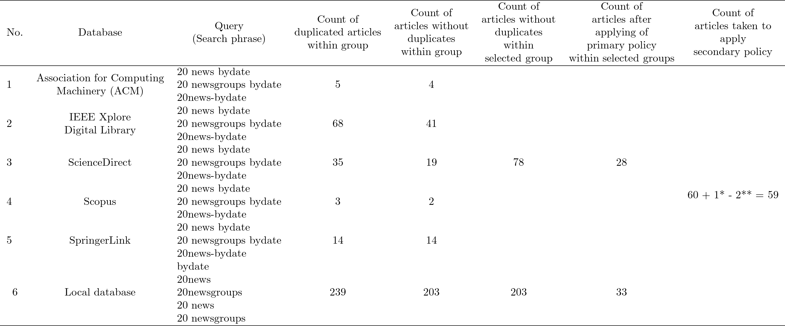

```{r setup, include=FALSE}
knitr::opts_chunk$set(echo = TRUE)
```

# Introduction

It is a technical report that (1) contains all data required to reproduce all results presented in the article and (2) shows all assumptions of the analyses. The presented analysis based on the data, the code allows answering the following two main questions:

-   What are the typical indicator values of F-score and accuracy for the multi-class document classification methods tested on the *20 Newsgroups bydate* test set?
-   What is the publication standard of research descriptions in the document classification?

Researchers can use all the materials presented and shared during the analysis to create any other investigation.

In our systematic review, we used seven abstract and citation databases, such as :

-   Association for Computing Machinery (ACM) (<https://dl.acm.org/>)
-   IEEE Xplore Digital Library (<https://ieeexplore.ieee.org/search/advanced>)
-   ScienceDirect (<https://www.sciencedirect.com/>)
-   Scopus (<https://www.scopus.com>)
-   SpringerLink (<https://link.springer.com/advanced-search>)
-   Local database.
-   Papers With Code (<https://paperswithcode.com/>)	 
 
The first five positions present well-known and well-established computer science databases that usually contain reviewed materials. The sixth database, i.e. Local database, is a collection of articles from other authors' research. This database includes nearly 4,000 documents from scientist-reviewed journals and conferences related to text mining issues mostly. We indexed all works from this database using DockFetcher software (<http://docfetcher.sourceforge.net/en/index.html>) to its searchings. We used these databases to receive articles for the review process. Furthermore, we explored the Papers With Code database, which contains the newest article that reports results from interested document classification fields. In the end, we also use other review articles available until 2023. 	 

We technically conducted two general search processes in time. The first process collected papers from the remote databases, i.e. all five above databases plus the *Papers With Code database*. The second process acquired the articles from the Local database. Consequently, we conducted a separate Screening of articles process (see the article) for both groups of the collected materials. First, we screened the collected articles from remote databases. Second, we analysed papers from the Local database. Also, we create appropriate inclusion criteria in the policy of Screening articles (see the article) to omit duplicated works between these two groups. Using Local resources arose after the first analysis of the second set of papers. Hence, such flow of the analysis process.

Also, we used two search time ranges and a different set of queries for both. First, we use a broth time range and narrow queries, i.e. publication time until 2020 and queries limited to the *bydate* version of the 20 newsgroup dataset. We used queries like the *20 news bydate*, *20 newsgroups bydate*, *20news-bydate*, etc. Thanks to that, we cover many methods used to document classification. Second, we use a limited time range and broad queries, i.e. publication time from 2020 and queries not only limited to the *bydate* version of the 20 newsgroup dataset. We uses queries like the above with and without the *bydate* suffix. Thanks to that, we cover many newest methods used to document classification that can be omitted during searching. We found that many papers do not explicitly contain information about the *bydate* dataset. So, the newest and most valuable articles could be omitted without using broader queries. Of course, such queries return many articles that finally do not use the *bydate*" version. However, we removed the collected papers focused on something other than the appropriate dataset version during a thorough screening.

When we found that an article does not mention an explicit *bydate* version, we checked a description of the used 20 Newsgroups dataset. Finally, we removed an article from further consideration if its description did not indicate using an appropriate version of the dataset. For example, the authors did not provide information about the number of samples in the test and training dataset, or the number differed from the standard split of this dataset. Also, we removed works that used any other validation procedure, such as k-fold cross-validation, without reporting results on the standard test set.

The summary of the collected articles until the 2020 year is shown in Figure \@ref(fig:sumUntil2020).

```{r sumUntil2020, echo = FALSE, message=FALSE, out.width="100%", dpi = 300, fig.align="center", fig.cap = "The count of articles collected until 2020."}

```

Table \@ref(fig:sumUntil2020) presents the count of articles collected until 2022. Shortly, we gained 78 works from the remote databases and 203 from the Local database. Then, we obtained 28 and 36 papers from the remote databases and Local databases, respectively, after executing the primary policy of the Screening of the article stage. Finally, we got 59 unique articles that use the *bydate* version of the 20Newsgroups dataset that reported values of required indicators, such as F-score and accuracy. First, we evaluated this set of papers regarding the qualitative question (see the article). Second, we assessed the collection of the documents in terms of a quantitative way (see the article). We want to mention two things. First, we create two exceptions. The first one relates to the question - Does the article report values of F-score or accuracy/Error (1 - accuracy) indicators obtained on the test set mentioned above? We registered two publications that do not answer the question positively because they are exciting and extend our review in qualitative analysis. The second thing concerns using an article from outside our article reference databases and including them in the analysis. While reading selected articles, we found an interesting manuscript not covered by our searching process (In Figure \@ref(fig:sumUntil2020) 1\* means the one article was included in qualitative and quantitative analysis exceptionally) but was mentioned in other publications. 

The summary of the collected articles from the 2020 year is shown in Figure \@ref(fig:sumFrom2020).

```{r sumFrom2020, echo = FALSE, message=FALSE, out.width="100%", dpi = 300, fig.align="center", fig.cap = "The count of articles collected from 2020."}
knitr::include_graphics("../../tables/latex/table-data-to-review-2-2.png")
```


Furthermore, thanks to the created bibliography, we have the opportunity to obtain the answers for the following example of research 
questions:

-   What does the distribution of articles over the years look like?
-   What is the distribution of articles across different sources, such as journals, conference proceedings, technical reports, and other collections?
-   What is the distribution of articles in specific sources?

The schema of the questionnaire with the questions (see the article) for each article and the filled questionnaires for all revised papers are available online (<https://github.com/mmarcinmichal/systematic-review-doc-classification>). Each questionnaire is in the form *xmls* file and contains two tabs called *Quality-1* and *Quantity-1*, respectively. The first tab contains the questions with the assessment and commentary. The second one has information about extracted values of indicators and information about preprocessing, and an optional comment.

# Processing data

Data processing acquire three main steps:

1.  Loading main settings
2.  Checking a bibliography and making statistics based on the bibliography
3.  Checking a schema of questionnaires, preparing data for qualitative and quantitative analysis of text classification studies and making statistics based on the questionnaires.

Each step is described in the following reports below.

## Loading main setting

The code below prepares an analysis environment and set-up all required libraries and functions for further analysis.

```{r settings, echo = T,  message = FALSE}
options(warn = -1) 

options(encoding = "UTF-8")

# Clear workspace
rm(list = ls())

# Set language to En
Sys.setlocale(category = "LC_ALL", locale = "english")

# Installing and loading libraries
libraries <- c("readxl", "stringr", "openxlsx", "boot", "nortest", "json64", "fitdistrplus", "MASS", "ggplot2", "tm", "gridExtra", "dplyr", "bib2df", "psych", "pastecs", "forcats", "bookdown", "effectsize")

if (length(setdiff(libraries, rownames(installed.packages()))) > 0) {
  install.packages(setdiff(libraries, rownames(installed.packages())), dependencies = T)  
}

sapply(libraries, function(libName) { 
  library(libName, character.only = TRUE)
})

# Functions
renameFile <- function(fileName) {
  tNewFileNameList <- stringr::str_split(fileName, "\\.")
  fileId <- stringr::str_trim(stringr::str_split(tNewFileNameList[[1]][1], "-")[[1]][1])
  tNewFileName <- paste0(fileId, "-", stringr::str_sub(json64::j_encode(tNewFileNameList[[1]][1], F), 1, 20), ".", tNewFileNameList[[1]][2])
  return(tNewFileName)
}
environment(renameFile) <- new.env(parent = baseenv())

copyFile <- function(xmlsPath, fileName, pasteTo) {
  if (base::Sys.info()['sysname'] == "Windows") {
    xmlsPath <-  base::gsub("/", "\\", xmlsPath, fixed = TRUE)
    pasteTo <-  base::gsub("/", "\\", pasteTo, fixed = TRUE)
    
    base::shell(base::paste0("copy ", base::paste0('"', xmlsPath, fileName, '" ', pasteTo)))
  } else {
    base::file.copy(paste0(xmlsPath, fileName), pasteTo)
  }
}
environment(copyFile) <- new.env(parent = baseenv())

createAggDf <- function(dataFrame) {
  aggDf <- data.frame("question" = "", "answer" = "", "count" = 0)
  
  for (i in 1:base::ncol(dataFrame)) {
    res <- base::table(dataFrame[,i])
    for (j in 1:base::length(res)) {
      aggDf <- base::rbind(aggDf, data.frame("question" = base::colnames(dataFrame)[i], 
                                             "answer" = base::names(res[j]), "count" = res[j]))
    }
  }
  
  aggDf <- aggDf[-c(1), ]
  row.names(aggDf) <- c(1:base::nrow(aggDf))
  
  return(aggDf)
}
environment(createAggDf) <- new.env(parent = baseenv())

ggplotQc <- function(dataDf, title, xlab, ylab, userPalette = RColorBrewer::brewer.pal(9,"Set1")) {
  ggplot2::ggplot(data = dataDf, ggplot2::aes_string(x = "question", y = "count", fill = "answer")) + 
    ggplot2::geom_bar(stat = "identity", position = ggplot2::position_dodge(), colour = "grey69") +
    ggplot2::geom_text(ggplot2::aes_string(label = "count"), vjust = -0.3, color = "black", 
                       position = ggplot2::position_dodge(0.9), size = 5.5) +
    ggplot2::scale_fill_manual(values = userPalette) +
    ggplot2::theme_minimal() +
    ggplot2::labs(title = title, x = xlab, y = ylab) +
    ggplot2::theme(plot.title = ggplot2::element_text(hjust = 0.5))
}
environment(ggplotQc) <- new.env(parent = baseenv())

ggplotQcFlip <- function(dataDf, title, xlab, ylab, userPalette = RColorBrewer::brewer.pal(9,"Set1")) {
  ggplot2::ggplot(data = dataDf, ggplot2::aes_string(x = "question", y = "count", fill = "answer")) + 
    ggplot2::geom_bar(stat = "identity", position = ggplot2::position_dodge(), colour = "grey69") +
    ggplot2::geom_text(ggplot2::aes_string(label = "count"), hjust = -0.3, color = "black", 
                       position = ggplot2::position_dodge(0.9), size = 3.5) +
    ggplot2::scale_fill_manual(values = userPalette) +
    ggplot2::theme_minimal() +
    ggplot2::labs(title = title, x = xlab, y = ylab) +
    ggplot2::theme(plot.title = ggplot2::element_text(hjust = 0.5)) +
    ggplot2::coord_flip() +
    ggplot2::guides(fill = ggplot2::guide_legend(reverse = TRUE)) 
}
environment(ggplotQcFlip) <- new.env(parent = baseenv())

ggplotCf <- function(dataDf, title, xlab, ylab, label = "frequ") {
  ggplot2::ggplot(data = dataDf, ggplot2::aes_string(x = "count", y = "frequ")) + 
    ggplot2::geom_bar(stat = "identity", position = ggplot2::position_dodge(), fill = "grey69") +
    ggplot2::geom_text(ggplot2::aes_string(label = label), vjust = -0.3, color = "black", position = ggplot2::position_dodge(0.9), size = 3) +
    ggplot2::scale_fill_brewer(palette = "Set1") +
    ggplot2::theme_minimal() +
    ggplot2::labs(title = title, x = xlab, y = ylab) +
    ggplot2::theme(plot.title = ggplot2::element_text(hjust = 0.5)) +
    ggplot2::scale_y_continuous(limits = c(0,round(max(dataDf[,2])*1.2,0)))
    
}
environment(ggplotCf) <- new.env(parent = baseenv())

ggplotCfFlip <- function(dataDf, title, xlab, ylab) {
  ggplot2::ggplot(data = dataDf, ggplot2::aes_string(x = "count", y = "frequ")) + 
    ggplot2::geom_bar(stat = "identity", position = ggplot2::position_dodge(), fill = "grey69") +
    ggplot2::geom_text(ggplot2::aes_string(label = "frequ"), hjust = -0.5, color = "black", size = 5.5) +
    ggplot2::scale_fill_brewer(palette = "Set1") +
    ggplot2::theme_minimal() +
    ggplot2::labs(title = title, x = xlab, y = ylab) +
    ggplot2::theme(plot.title = ggplot2::element_text(hjust = 0.5)) +
    ggplot2::scale_y_continuous(limits = c(0,round(max(dataDf[,2])*1.3,0))) +
    ggplot2::coord_flip()
}
environment(ggplotCfFlip) <- new.env(parent = baseenv())

ggplotHist <- function(dataDf, title, xlab, ylab, indicator) {
  ggplot2::ggplot(data = dataDf, ggplot2::aes_string(x = indicator)) + 
  ggplot2::geom_histogram(bins = 8, position = ggplot2::position_dodge(), fill = "grey69", col = "white") +
  ggplot2::stat_bin(bins = 8, geom = 'text', color = 'black', ggplot2::aes(label = ..count..),
          vjust = -1, size = 5.5, position = ggplot2::position_dodge()) +
  ggplot2::scale_fill_brewer(palette = "Set1") +
  ggplot2::theme_minimal() +
  ggplot2::labs(title = title, x = xlab, y = ylab) +
  ggplot2::theme(plot.title = ggplot2::element_text(hjust = 0.5)) 
}
environment(ggplotHist) <- new.env(parent = baseenv())

ggplotBox <- function(dataDf, title, xlab, ylab, indicator) {
  ggplot2::ggplot(data = dataDf, ggplot2::aes_string(y = indicator)) + 
    ggplot2::geom_boxplot() +
    ggplot2::geom_point(ggplot2::aes_string(x = 0), alpha = 0.3) +
    ggplot2::scale_fill_brewer(palette = "Set1") +
    ggplot2::theme_minimal() +
    ggplot2::labs(title = title, x = ylab, y = xlab) +
    ggplot2::theme(plot.title = ggplot2::element_text(hjust = 0.5),
                   axis.text.x = ggplot2::element_blank())
}
environment(ggplotBox) <- new.env(parent = baseenv())

ggplotBoot <- function(bootTDf, boott0) {
  p1 <- ggplot2::ggplot(bootTDf, ggplot2::aes(x = .data$V1)) +
  ggplot2::geom_histogram(ggplot2::aes(y = ..density..), bins = 60, alpha = 0.5) +
  ggplot2::scale_fill_manual(values = RColorBrewer::brewer.pal(9,"Set1")) +
  ggplot2::theme_minimal() +
  ggplot2::labs(title = "Histogram of t", x = "t*", y = "Density") +
  ggplot2::theme(plot.title = ggplot2::element_text(hjust = 0.5)) +
  ggplot2::geom_density(alpha = .2) + 
  ggplot2::geom_vline(xintercept = boott0, linetype = "dashed")

p2 <- ggplot2::ggplot(bootTDf, ggplot2::aes(sample = .data$V1)) + 
  ggplot2::stat_qq() + 
  ggplot2::stat_qq_line() +
  ggplot2::theme_minimal() +
  ggplot2::theme(plot.title = ggplot2::element_text(hjust = 0.5))

gridExtra::grid.arrange(p1, p2, nrow = 2)
} 
environment(ggplotBoot) <- new.env(parent = baseenv())

createIndicatorValDf <- function(modelResultsDf, indicatorName, workIds) {
  indiDf <- modelResultsDf[modelResultsDf$workId %in% workIds, c("workId", "modelName", indicatorName)]
  naIndx <- base::which(base::is.na(indiDf[,indicatorName]))
  if (length(naIndx) != 0) {
      indiDf <- indiDf[-naIndx,]
  }
  tsplit <- base::split(indiDf, indiDf$workId)
  res <- base::lapply(X = tsplit,
                      FUN = function(record) record[which.max(record[,indicatorName]),])
  
  maxValDf <- base::as.data.frame(res[[1]][c("workId", "modelName", indicatorName)])
  for (i in 2:base::length(res)) {
    maxValDf <- base::rbind(maxValDf, base::as.data.frame(res[[i]][c("workId", "modelName", indicatorName)])) 
  }
  
  return(maxValDf)
}
environment(createIndicatorValDf) <- new.env(parent = baseenv())

simpleStats <- function(modelResultsDf, indicatorName, workIds) {
  aggDf <- base::get("createIndicatorValDf", envir = .GlobalEnv)(modelResultsDf, indicatorName, workIds)

  base::print(base::summary(aggDf[,indicatorName]))
  base::print(psych::describe(aggDf[,indicatorName]))
  base::print(stats::shapiro.test(aggDf[,indicatorName]))
  base::print(base::dim(aggDf))
}
environment(simpleStats) <- new.env(parent = baseenv())

rsq <- function(data, indices) {
  d <- data[indices]
  return(base::mean(d, na.rm = T))
}
environment(rsq) <- new.env(parent = baseenv())

rsqWeibull <- function(data, indices) {
  d <- data[indices]
  fittedWeibull <- fitdistrplus::fitdist(d, "weibull")
  summaryWeibull <- base::summary(fittedWeibull)
  
  shape <- summaryWeibull$estimate['shape']
  scale <- summaryWeibull$estimate['scale']
  
  medianWeibull <- scale*base::log(2)^(1/shape)
  meanWeibull <- scale*base::gamma(1 + 1/shape)
  return(meanWeibull)
}
environment(rsqWeibull) <- new.env(parent = baseenv())

# Information about session
sessionInfo()
```

## Checking a bibliography and generating basic statistics

We have two files containing bibliography information. A first base file named *biblio-reviewed-compiled-all-year-range.bib* contains raw bibliography acquired thanks to JabRef. A second file named *biblio-reviewed-compiled-all-year-range-prop-form.bib* is a pre-processed *biblio-reviewed-compiled-all-year-range.bib* file used by Mendeley Desktop software. The software updated and corrected information of the base file (the value of the year field is kept from the *biblio-reviewed-compiled-all-year-range.bib*). In the code's chunk below, we check the structure and completeness of files, i.e. if they contain the same information. Moreover, we build basic statistics about publication resources.

Loading bibliographies.

```{r bibliochecking1}
bib1 <- "../../biblio/biblio-reviewed-compiled-all-year-range.bib"
bib2 <- "../../biblio/biblio-reviewed-compiled-all-year-range-prop-form.bib"

linesBib1 <- readLines(bib1, encoding = "UTF-8")
linesBib2 <- readLines(bib2, encoding = "UTF-8")
```

Comparing the bibliographies keys.

```{r bibliochecking2}
regId <- "^@[:alpha:]{1,}\\{[:alpha:]{1,}[:digit:]{1,4}[:alpha:]{0,1},$"

idsBib1 <- linesBib1[stringr::str_detect(linesBib1, regId)]
idsBib2 <- linesBib2[stringr::str_detect(linesBib2, regId)]

table(stringr::str_to_lower(stringr::str_sort(idsBib1)) == stringr::str_to_lower(stringr::str_sort(idsBib2)))
```

Comparing the bibliographies titles.

```{r bibliochecking3}
regTitle = "^ {0,}title {0,}="

titlesBib1 <- linesBib1[stringr::str_detect(linesBib1, regTitle)]
titlesBib2 <- linesBib2[stringr::str_detect(linesBib2, regTitle)]

titlesBib1 <- stringr::str_sub(stringr::str_sort(stringr::str_to_lower(stringr::str_trim(stringr::str_replace_all(titlesBib1, "title|=|\\{|\\}| {2,}", "")))), 1, 50)
titlesBib2 <- stringr::str_sub(stringr::str_sort(stringr::str_to_lower(stringr::str_trim(stringr::str_replace_all(titlesBib2, "title|=|\\{|\\}| {2,}", "")))), 1, 50)

table(titlesBib1 == titlesBib2)
```

Comparing the bibliographies years.

```{r bibliochecking4}
regYear <- "^ {0,}year {0,}="
yearBib1 <- linesBib1[stringr::str_detect(linesBib1, regYear)]
yearBib2 <- linesBib2[stringr::str_detect(linesBib2, regYear)]

regYearDigit <- "[:digit:]{4,4}"
yearsBib1 <- as.numeric(stringr::str_extract(yearBib1, regYearDigit))
yearsBib2 <- as.numeric(stringr::str_extract(yearBib2, regYearDigit))

table(table(yearsBib1) == table(yearsBib2))
```

Computing, plotting and saving information about the distribution of publications between years.

```{r bibliochecking5, fig.align="center", fig.cap = "Distribution of the number of publications in years."}
dataSetsCountDf <- as.data.frame(table(yearsBib1))
colnames(dataSetsCountDf) <- c("count", "frequ")

title <- "Distribution of the number of publications in years"
xlab <- "Year"
ylab <- "Count of publications"

ggplotCf(dataSetsCountDf %>% dplyr::mutate(label = paste0(.data$frequ, "\n(", scales::percent(.data$frequ/sum(.data$frequ) ),")")), title, xlab, ylab, label = "label") 
ggplot2::ggsave("../../img/fig-art-distby-years.pdf")
```

Comparing the types of publications in bibliographies.

```{r bibliochecking6}
typesPubBib1 <- stringr::str_sort(stringr::str_to_lower(stringr::str_extract(idsBib1, "[:alpha:]{1,}")))
typesPubBib2 <- stringr::str_sort(stringr::str_to_lower(stringr::str_extract(idsBib2, "[:alpha:]{1,}")))

table(table(typesPubBib1) == table(typesPubBib2))
```

Computing, plotting and saving information about the distribution of the number of publications grouped by publication type.

```{r bibliochecking7, fig.align="center", fig.cap = "Distribution of the number of publications grouped by publication type."}
dataSetsCountDf <- as.data.frame(table(typesPubBib1))

colnames(dataSetsCountDf) <- c("count", "frequ")

dataSetsCountDf$count <- dataSetsCountDf$count %>% stringr::str_to_title(.)

title <- "Distribution of the number of publications grouped by publication type"
xlab <- "Publication type"
ylab <- "Count of publications"
ggplotCf(dataSetsCountDf %>% dplyr::mutate(label = paste0(.data$frequ,"\n(", scales::percent(.data$frequ/sum(.data$frequ) ),")"),
                                    count = forcats::fct_reorder(count, -.data$frequ)), 
         title, xlab, ylab, label = "label") 
ggplot2::ggsave("../../img/fig-art-distby-pubtype.pdf")
```

Computing, plotting and saving information about the distribution of the number of publications by publication type.

```{r bibliochecking8, fig.align="center", fig.cap = "Distribution of the number of publications by publication type"}
regJournal = "^ {0,}journal|^ {0,}booktitle"
journalBib2 <- linesBib2[stringr::str_detect(linesBib2, regJournal)]
journalBib2 <- stringr::str_remove(stringr::str_remove(journalBib2, "^ {0,}journal {0,}= \\{|^ {0,}booktitle {0,}= \\{"), "\\}\\,")

dataSetsCountDf <- as.data.frame(table(journalBib2))
colnames(dataSetsCountDf) <- c("count", "frequ")
dataSetsCountDf <- dataSetsCountDf[order(dataSetsCountDf$frequ, decreasing = T), ]

title <- stringr::str_wrap("Distribution of the number of publications by publication type",40)
xlab <- "Publication type"
ylab <- "Count of publications"
ggplotCfFlip(dataSetsCountDf[1:8, ] %>% 
               dplyr::mutate(count = 
                               forcats::fct_reorder(stringr::str_wrap(count, 50), .data$frequ)), title, xlab, ylab) + 
  ggplot2::scale_y_continuous(breaks = c(0,2,4,6,8,10, 12), 
                              labels = c(0,2,4,6,8,10, 12),
                              limits = c(0,11))
ggplot2::ggsave("../../img/fig-art-grby-jour.pdf")
```

Showing the ranking of publications' journals or resource names.

```{r bibliochecking9}
colnames(dataSetsCountDf) <- c("Journals/Resource names", "Frequency")
knitr::kable(dataSetsCountDf %>% 
               dplyr::mutate(Percent = scales::percent(.data$Frequency/sum(.data$Frequency))), 
             caption = "Ranking of publication resources.")
```

Note: the code above can be improved and simplified by using *bib2df* library.

```{r bibliochecking10,  message = FALSE}
options(encoding = "UTF-8")
tdf1 <- bib2df::bib2df(bib1)
options(encoding = "UTF-8")
tdf2 <- bib2df::bib2df(bib2)

tdf1$YEAR <- as.numeric(tdf1$YEAR)
tdf2$YEAR <- as.numeric(tdf2$YEAR)

tdf1 <- tdf1[order(tdf1$BIBTEXKEY), ]
tdf2 <- tdf2[order(tdf2$BIBTEXKEY), ]

table(tdf1$YEAR == tdf2$YEAR)
```

## Checking a schema of questionnaires

In this step, a schema of questionnaires is checked. Furthermore, we remove four unnecessary files from further analysis. Those files are called:

-   3 - Learning algorithms for the classification restricted Boltzmann machine.xlsx
-   34 - HARAM A Hierarchical ARAM Neural Network for Large-Scale Text Classification.xlsx
-   v0 - article-assesment-schema.xlsx
-   v1 - article-assesment-schema.xlsx

The first two are extended or simplified versions of the other same publications. The last two files contain a schema of the questionnaire.

We use *v1 - article-assesment-schema* as a baseline/reference questionnaire schema and check that all files/questionnaires are compatible with this schema.

```{r schemachecking,  message = FALSE}
xmlsPath <- "../../search-results/4-qq-assesments/"

schemaFileName <- "v1 - article-assesment-schema.xlsx"

schemaFileNames <- list.files(xmlsPath)

# Remove from analysis 
noAnalysedArticles <- c("v0 \\- article\\-assesment\\-schema\\.xlsx",
                        "v1 \\- article\\-assesment\\-schema\\.xlsx")
schemaFileNames <- schemaFileNames[-c(stringr::str_which(schemaFileNames, paste(noAnalysedArticles, collapse = "|")))]

defaultSchema <- readxl::read_excel(paste0(xmlsPath, schemaFileName))

defaultSchemaQuestions <- defaultSchema$Question

tmpFilePath <- "./tmp/" # temporary dir
do.call(file.remove, list(list.files(tmpFilePath, full.names = TRUE))) # Clear tmp dir

for (i in 1:length(schemaFileNames)) {
  tFileName <- schemaFileNames[i]
  message(paste0("Checking schema of question for file: ", tFileName))
  
  # Sometimes a file name is too long so we must transform it to shorter form and after that open
  tNewFileName <- renameFile(tFileName)
  pasteTo <- paste0(tmpFilePath, tNewFileName)

  if (!dir.exists(tmpFilePath)) {
    dir.create(file.path(".", tmpFilePath), showWarnings = TRUE)
  }
  
  copyFile(xmlsPath, tFileName, pasteTo)
 
  currentSchema <- readxl::read_excel(pasteTo)
  currentSchema$Question_id = sub(" .*", "", currentSchema$Question)
  currentSchemaQuestions <- currentSchema$Question
 
  if (all((defaultSchemaQuestions == currentSchemaQuestions) == TRUE)) {
    message(paste0("Schema is fine"))
  } else {
    stop("Wrong schema")
  }
}

do.call(file.remove, list(list.files(tmpFilePath, full.names = TRUE))) # Clear tmp dir
```

## Preparing data for Qualitative and Quantitative analyses of text classification studies

The analysis of the comments conducts a qualitative analysis of the work - answers for the questions Q1 - Q4, i.e.:

-   Q1 Does the work present a clear statement of the aim of the research? If yes, what is it?
-   Q2 Does the work present a clear technical and algorithm aspect of the work? If yes, what is a technical and algorithm aspect of the work?
-   Q3 Does the work contain a statement about finding(s)/recommendation(s) of the research? If yes, what are they?
-   Q4 Does the work highlight new challenge(s) or open problem(s)? If yes, what are they?

We created a simple works' taxonomy based on the answers for question Q1. We discussed each publication in the paper in the context of the questions mentioned above.

Quantitative analysis is composed of two parts. The first one considers the outcomes of the questionnaires' *Assesment* and *Comment* columns. It allows us to establish and summarise the publication pattern quantitatively. The second one focus on the analysis of the extracted values of the indicators, such as accuracy, micro F1 score, and macro F1 score.

### Generating raw data to questionnaires analysis

Creating the structures called:

-   *modelResultsDf*, which contains information about outcomes from the *Assessment* column of each question for each article,
-   *commentsDf*, which contains information about outcomes from the *Comment* column of each question for each article.

```{r gen1, message = FALSE}
colNames <- sapply(stringr::str_split(defaultSchemaQuestions, " "), function(x) x[1])
propColNames <- make.names(c("workId", colNames))

tMat <- matrix(ncol = length(propColNames), nrow = 1)
modelResultsDf <- as.data.frame(tMat, stringsAsFactors = F)
commentsDf <- as.data.frame(tMat, stringsAsFactors = F) 

tmpFilePath <- "./tmp/" # temporary dir
do.call(file.remove, list(list.files(tmpFilePath, full.names = TRUE))) # Clear tmp dir

for (i in 1:length(schemaFileNames)) {
  tFileName <- schemaFileNames[i]
  message(paste0("Checking schema of question for file: ", tFileName))
  
  # Sometimes a file name is too long so we must transform it to shorter form and after that open
  tNewFileName <- renameFile(tFileName)
  pasteTo <- paste0(tmpFilePath, tNewFileName)

  if (!dir.exists(tmpFilePath)) {
    dir.create(file.path(".", tmpFilePath), showWarnings = TRUE)
  }
  
  copyFile(xmlsPath, tFileName, pasteTo)
  
  resScheet <- readxl::read_excel(pasteTo, sheet = "Quality-1")

  modelResultsDf <- rbind(modelResultsDf, c(tFileName, resScheet$Assesment))
  commentsDf <- rbind(commentsDf, c(tFileName, resScheet$Comment))
}

modelResultsDf <- modelResultsDf[-c(1), ]
colnames(modelResultsDf) <- propColNames

commentsDf <- commentsDf[-c(1), ]
colnames(commentsDf) <- propColNames

# Remove unnecessary columns
indxs <- stringr::str_which(modelResultsDf[1,], "^-$")
modelResultsDf <- modelResultsDf[,-c(indxs)]

do.call(file.remove, list(list.files(tmpFilePath, full.names = TRUE))) # Clear tmp dir
```

Showing the structures of prepared data sets.

```{r dataanalysis1}
modelResultsDf %>%  dplyr::glimpse(.)
commentsDf %>%  dplyr::glimpse(.)
```

Showing the first few lines of data of prepared data sets.

```{r dataanalysis2}
head(modelResultsDf[1,])
head(commentsDf[1,])
```

#### Questionnaires analysis - works' taxonomy

We grouped the articles manually. Initially, we checked and analysed each comment on question *Q1* of each article. Based on this, each article was classified into a created taxonomy.

Creating and checking the created taxonomy of works.

```{r qaWt}
worksIndxs <- list()

worksIndxs$grLearninMethWorkIds <- c("129 - Multi-co-training for document classification using various document representations TF-IDF LDA and Doc2Vec.xlsx", 
                                     "29 - Manifold Adaptive Experimental Design for Text Categorization.xlsx",
                                     "53 - Text classification method based on self-training and LDA topic models.xlsx",
                                     "2020-Online semi-supervised learning with learning vector quantization.xlsx")

all((schemaFileNames[schemaFileNames %in% worksIndxs$grLearninMethWorkIds] ==
modelResultsDf[which(modelResultsDf$workId %in% worksIndxs$grLearninMethWorkIds),]$workId) == TRUE)


worksIndxs$grPreproc <- c("2021-Linked Data Triples Enhance Document.xlsx")

all((schemaFileNames[schemaFileNames %in% worksIndxs$grPreproc] ==
modelResultsDf[which(modelResultsDf$workId %in% worksIndxs$grPreproc),]$workId) == TRUE)


worksIndxs$grWeightingWorkIds <- c("109 - A semantic term weighting scheme for text categorization.xlsx", 
                                   "236 - An improved term weighting scheme for text classification.xlsx",
                                   "63 - Turning from TF-IDF to TF-IGM for term weighting in text.xlsx", 
                                   "2021-On entropy-based term weighting schemes for text.xlsx",
                                   "2022-An improved supervised term weighting scheme for text representation and classification.xlsx",
                                   "2022-A new document representation based on global policy for supervis.xlsx",
                                   "2022-Binned Term Count An Alternative to Term Frequency for.xlsx",
                                   "2023-Supervised term-category feature weighting.xlsx"
                                   )
  
all((schemaFileNames[schemaFileNames %in% worksIndxs$grWeightingWorkIds] ==
modelResultsDf[which(modelResultsDf$workId %in% worksIndxs$grWeightingWorkIds),]$workId) == TRUE)

worksIndxs$grFsWorkIds <- c("6 - Weighted Document Frequency for feature selection in text classification.xlsx",
                            "10 - Self-Tuned Descriptive Document Clustering Using a Predictive Network.xlsx",
                            "14 - A Bayesian Classification Approach Using Class-Specific  Features for Text Categorization.xlsx", 
                            "18 - Toward Optimal Feature Selection in Naive bayes for text categorization.xlsx", 
                            "19 - Text Categorization Using Weighted Hyper Rectangular Keyword Extraction.xlsx", 
                            "218 - Relative discrimination criterion - A novel feature ranking method.xlsx", 
                            "238 - Extending the Single Words-Based Document Model.xlsx", 
                            "28 - TOFA Trace Oriented Feature Analysis in Text Categorization.xlsx", 
                            "33 - Importance weighted feature selection strategy for text classification.xlsx", 
                            "48 - A discriminative and semantic feature selection method.xlsx", 
                            "61 - Feature subset selection using naive Bayes for text classification.xlsx", 
                            "63 - RFBoost An improve d multi-lab el boosting algorithm and its application to text categorisation.xlsx", 
                            "66 - Improved Document Feature Selection with Categorical Parameter for Text Classification.xlsx", 
                            "88 - Feature ranking for enhancing boosting-based multi-label text categorization.xlsx", 
                            "93 - Feature selection based on a normalized difference measure for text classification.xlsx")

all((schemaFileNames[schemaFileNames %in% worksIndxs$grFsWorkIds] ==
modelResultsDf[which(modelResultsDf$workId %in% worksIndxs$grFsWorkIds),]$workId) == TRUE)


worksIndxs$grFetProjWorkIds <- c("202 - KATE K-Competitive Autoencoder for Text.xlsx", 
                                 "204 - Learning document representations using subspace multinomial model.xlsx", 
                                 "219 - Replicated Softmax an Undirected Topic Model.xlsx", 
                                 "22 - Learning distributed word representation with multi-contextual mixed embedding.xlsx", 
                                 "23 - Extending Embedding Representation by Incorporating Latent Relations.xlsx", 
                                 "28 - TOFA Trace Oriented Feature Analysis in Text Categorization.xlsx", 
                                 "29 - Manifold Adaptive Experimental Design for Text Categorization.xlsx", 
                                 "44 - Probabilistic Clustering and Classification for Textual Data An Online and Incremental Approach.xlsx", 
                                 "49 - Fast text categorization using concise semantic analysis.xlsx", 
                                 "5 - A Bidirectional Hierarchical Skip-Gram model for text topic embedding.xlsx", 
                                 "62 - Bag-of-Concepts representation for document classification based on automatic knowledge acquisition from probabilistic knowledge base.xlsx", 
                                 "73 - A new regularized restricted Boltzmann machine based on class preserving.xlsx",
                                 "2019-Document Vector Extension for Documents.xlsx",
                                 "2019-Improving Document Classification wit.xlsx",
                                 "2020-Learning Document Embeddings Along With Their Uncertaintie.xlsx",
                                 "2018-Generative and Discriminative Fuzzy Restricted.xlsx",
                                 "2020-Biologically Plausible Learning of Text.xlsx",
                                 "2020-Graph Attention Topic Modeling Network.xlsx",
                                 "2019-A document representation framework with interpretable features.xlsx",
                                 "2020-Understanding a bag of words by conceptual labeling.xlsx"
                                 )                                                             

all((schemaFileNames[schemaFileNames %in% worksIndxs$grFetProjWorkIds] ==
modelResultsDf[which(modelResultsDf$workId %in% worksIndxs$grFetProjWorkIds),]$workId) == TRUE)


worksIndxs$grClassMet <- c("1 - Classification using discriminative restricted Boltzmann machines.xlsx", 
                           "100 - Enhanced sparse representation classifier for text classification.xlsx", 
                           "121 - Improving Multiclass Text Classification with Error-Correcting Output Coding and Sub-class Partitions.xlsx", 
                           "13 - Using the Tsetlin Machine to Learn Human-Interpretables.xlsx", 
                           "138 - From Word Embeddings To Document Distances.xlsx", 
                           "140 - Overfitting Reduction of Text Classification Based on AdaBELM.xlsx", 
                           "17 - Probabilistic reasoning on background net An application to text categorization.xlsx", 
                           "199 - Investigating Unsupervised Learning.xlsx", 
                           "200 - Joint Verification-Identification in end-to-end Multi-Scale CNN Framework for Topic Identification.xlsx", 
                           "2005 - Text Classification with Kernels on the Multinom.xlsx", 
                           "212 - On The Value of Leave-One-Out.xlsx", 
                           "224 - Sparse Representations for Text Categorization.xlsx", 
                           "228 - Text Classification Using Combined Sparse Representation Classifiers and Support.xlsx", 
                           "229 - Text Classification using Hierarchical Sparse.xlsx", 
                           "235 - An Adaptive k-Nearest Neighbor Text Categorization Strategy.xlsx", 
                           "239 - Large-Scale Bayesian Logistic Regression for Text Categorization.xlsx", 
                           "32 - A Text Categorization Method Based on Local Document Frequency.xlsx", 
                           "54 - On the strength of hyperclique patterns for text categorization.xlsx", 
                           "55 - Improving scalability of ART neural networks.xlsx", 
                           "56 - Minimizer of the Reconstruction Error for multi-class document.xlsx", 
                           "58 - Regularized margin-based conditional log-likelihood loss for prototype learning.xlsx", 
                           "59 - Towards a Quantum-Inspired Binary Classifier.xlsx", 
                           "61 - Feature subset selection using naive Bayes for text classification.xlsx", 
                           "63 - RFBoost An improve d multi-lab el boosting algorithm and its application to text categorisation.xlsx", 
                           "64 - Bag-of-Embeddings for Text Classification.xlsx", 
                           "80 - CenKNN a scalable and effective text classifier.xlsx", 
                           "88 - Feature ranking for enhancing boosting-based multi-label text categorization.xlsx",
                           "2020-Be More with Less Hypergraph Attentio.xlsx",
                           "2020-Learning Dynamic Hierarchical Topic G.xlsx",
                           "2020-Attending to Inter-sentential Features in Neural Text.xlsx",
                           "2019-Graph Convolutional Networks for Text Classification.xlsx",
                           "2019-Generating word and document matrix representations for document.xlsx",
                           "2016-Supervised and Semi-Supervised Text Ca.xlsx",
                           "2020-A Discriminative Convolutional Neural Network with.xlsx",
                           "2021-Inductive Topic Variational Graph Aut.xlsx",
                           "2020-Recurrent Graph Neural Networks for Text.xlsx",
                           "2021-Graph Topic Neural Network for Document Representation.xlsx",
                           "2020-Revisiting hierarchy Deep learning with.xlsx",
                           "2020-Tensor Graph Convolutional Networks f.xlsx",
                           "2020-Study of Hellinger Distance as a splitting metric.xlsx",
                           "2021-Graph Fusion Network for Text Classification.xlsx",
                           "2021-HeteGCN Heterogeneous Graph Convolutional Networks for.xlsx",
                           "2021-Extracting salient features from convolutional.xlsx",
                           "2021-Improving Text Classification Using Knowledge in.xlsx",
                           "2021-Robust and label efficient bi-filtering graph convolutional networks for.xlsx",
                           "2022-A Framework for Text Classification.xlsx",
                           "2021-Quantum probability-inspired graph neural.xlsx",
                           "2023-Text FCG Fusing Contextual Information via.xlsx",
                           "2022-BertGCN Transductive Text Classification.xlsx",
                           "2021-SIMPLE SPECTRAL GRAPH CONVOLUTION.xlsx",
                           "2022-Graph representation learning via simple jumping knowledge networ.xlsx",
                           "2022-Hierarchical Neural Network Approaches for.xlsx",
                           "2022-Text Classification with Born's Rule.xlsx"
                           )

all((schemaFileNames[schemaFileNames %in% worksIndxs$grClassMet] ==
modelResultsDf[which(modelResultsDf$workId %in% worksIndxs$grClassMet),]$workId) == TRUE)

worksIndxs$grEvalWorkIds <- c("152 - What is relevant in a text document.xlsx")

all((schemaFileNames[schemaFileNames %in% worksIndxs$grEvalWorkIds] ==
modelResultsDf[which(modelResultsDf$workId %in% worksIndxs$grEvalWorkIds),]$workId) == TRUE)

worksIndxs$grBenchmarkWorkIds <- c("50 - On strategies for imbalanced text classification using SVM A comparative study.xlsx",  
                                   "65 - Empirical Study to Evaluate the Performance of Classification Algorithms on Public Datasets.xlsx", 
                                   "77 -  A Comparative Study on Term Weighting Schemes for Text Classification.xlsx",
                                   "2020-Performance Analysis of Machine Learning and.xlsx",
                                   "2021-Comparative Study of Long Document.xlsx"
                                   )

all((schemaFileNames[schemaFileNames %in% worksIndxs$grBenchmarkWorkIds] ==
modelResultsDf[which(modelResultsDf$workId %in% worksIndxs$grBenchmarkWorkIds),]$workId) == TRUE)

worksIndxsVec <- unique(unlist(worksIndxs))
if (length(worksIndxsVec) != 102) {
  stop("Wrong length")  
} else {
  message("A length is proper.")
}
```

Creating table which groups the articles into the categories and saving data to file.

```{r qaWtsf}
idsBib1 <- linesBib1[stringr::str_detect(linesBib1, regId)]
bibKeys <- stringr::str_remove_all(stringr::str_extract(idsBib1, "\\{.*,"), "\\{|,")

regCId <- "^ {0,}id {0,}="
cidBib1 <- stringr::str_replace_all(stringr::str_replace(linesBib1[stringr::str_detect(linesBib1, regCId)], regCId, ""), "^ \\{|\\},$", "")
cidBib1 <- paste(cidBib1, ".xlsx", sep = "")

refDf <- data.frame("bibKey" = bibKeys, "workId" = cidBib1, "year" = yearsBib1, stringsAsFactors = T)
refDf <- refDf[order(refDf$year, decreasing = T), ]

# Grouped works index
tId <- sort(unlist(worksIndxs))
tUniId <- unique(tId)

tnoAnalysedArticles <- stringr::str_remove_all(noAnalysedArticles, "\\\\")
cidBib1 <- sort(setdiff(cidBib1, tnoAnalysedArticles))

# We removed two articles from analysis
if (length(cidBib1) != length(tUniId)) {
  stop("Different length")
}

if (length(table(cidBib1 %in% tUniId)) != 1) {
  stop("Different length")
} else {
  message("Data is ok.")
}

refDf <- refDf[refDf$workId %in% cidBib1, ]

if (nrow(refDf) != length(tUniId)) {
  stop("Different length")
}

artCats <- c("Learning methods in the manipulation of input training data", 
             "Pre-processing methods", "Feature weighting methods", 
             "Feature selection methods", "Feature projection methods", 
             "Classification methods", "Evaluation methods", "Benchmark works")
fullRefDf <- data.frame("CategoryOfArticles" = artCats, "Reference" = rep("", length(worksIndxs)), "NoOfArticles" = rep("", length(worksIndxs)), stringsAsFactors = F)

for (i in 1:length(worksIndxs)) {
  trec <- subset(refDf, workId %in% worksIndxs[[i]])
  tbibkeys <- trec$bibKey
  tref <- stringr::str_replace_all(paste0(tbibkeys, collapse = " "), " ", ", ")
  tref <- paste("~\\citep{", tref, "}", sep = "", collapse = "")
  tcount <- length(tbibkeys)
  
  fullRefDf[i, 2] <- tref
  fullRefDf[i, 3] <- tcount
}

con <- base::file("../../tables/table-articles-groups.csv", encoding = "UTF-8")
write.csv(fullRefDf, con, row.names = F, quote = F)

for (i in 1:length(worksIndxs)) {
  trec <- subset(refDf, workId %in% worksIndxs[[i]])
  tbibkeys <- trec$bibKey
  tref <- stringr::str_replace_all(paste0(tbibkeys, collapse = " "), " ", ", @")
  tref <- paste("@", tref, "", sep = "", collapse = "")
  tcount <- length(tbibkeys)
  
  fullRefDf[i, 2] <- tref
  fullRefDf[i, 3] <- tcount
}

knitr::kable(fullRefDf %>% dplyr::rename(`Category of articles` = 1,	
                                         `No of articles` = 3 ))

# Remove temporary year column.
refDf <- refDf[, -c(3)]
```

#### Questionnaires analysis - general overview/impression

Computing, plotting and saving information about the distribution of answers to questions on the overall impression of articles.

```{r qaGenOve, fig.align="center", fig.cap = "Distribution of answers to questions about general impresion of articles."}
generalDf <- modelResultsDf[,c("Q1", "Q2", "Q3", "Q4", "Q5")]
generalAggDf <- createAggDf(generalDf)
generalAggDf <- generalAggDf %>% 
  tidyr::complete(.data$question, .data$answer) %>%
  dplyr::filter(.data$question != "") %>%
  dplyr::filter(.data$answer != "") %>%
  dplyr::mutate(count = dplyr::case_when(is.na(count) ~ 0, TRUE ~ count)) %>%
  dplyr::mutate(answer = factor(.data$answer, levels = c("Yes","Partly", "No", "Na")))

generalAggDf <- generalAggDf %>% 
  dplyr::rename(Question_id = 1) %>% 
  dplyr::left_join(currentSchema %>% 
                     dplyr::select(.data$Question, .data$Question_id), by = "Question_id") %>% 
  dplyr::select(.data$Question, .data$answer, .data$count) %>%
  dplyr::rename(question = 1) %>%
  dplyr::mutate(question = forcats::fct_rev(stringr::str_wrap(.data$question, 50)),
         answer = forcats::fct_rev(.data$answer))

title <- stringr::str_wrap("Distribution of answers to questions about general impresion of articles",40)
xlab <- "Question number"
ylab <- "Count of articles"
ggplotQcFlip(generalAggDf, title, xlab, ylab, userPalette = c("#E41A1C", "#4DAF4A") ) +  
  ggplot2::scale_y_continuous(limits = c(0,110)) 
ggplot2::ggsave("../../img/fig-answer-distby-genimpre.pdf")

knitr::kable(generalAggDf %>% tidyr::spread(., .data$answer, .data$count) %>%
               dplyr::select(Question = .data$question, .data$Yes, .data$No) %>%
               dplyr::mutate(Question = gsub("\n"," ", .data$Question ) ) %>% 
               dplyr::mutate(`Percent of Yes` = scales::percent(.data$Yes/(.data$Yes + .data$No))) %>%
               dplyr::arrange(.data$Question)   
)
```

Computing, plotting and saving information about the baseline methods used for comparisons.

```{r qaGenOve2}
methodsList <- sapply(commentsDf$Q5, function(rec) {
  tsplit <- stringr::str_split(rec, "\r\n|\r|\n")
  
  if (length(tsplit) > 1) {
    stop("Wrong list length")
  }
  
  stringr::str_trim(stringr::str_replace_all(tsplit[[1]], "^-\\s{1,1}", ""))
})

tmethods <- sort(unlist(unlist(methodsList) %>% stringr::str_split(.,"\\\r\\\n")))
tmethods <- tmethods[-which(tmethods == "")]
tmethods <- stringr::str_to_lower(tmethods)

modelNames <- data.frame("from" = "", "to" = "", stringsAsFactors = F)

modelNames <- rbind(modelNames, c(".*gnn.*", "neural network"))
modelNames <- rbind(modelNames, c(".*cnn.*", "neural network"))
modelNames <- rbind(modelNames, c(".*dnn.*", "neural network"))
modelNames <- rbind(modelNames, c(".*lstm.*", "neural network"))
modelNames <- rbind(modelNames, c(".*nnet.*", "neural network"))
modelNames <- rbind(modelNames, c(".*rbm.*", "neural network"))
modelNames <- rbind(modelNames, c(".*gcn.*", "neural network"))
modelNames <- rbind(modelNames, c(".*sgc.*", "neural network"))
modelNames <- rbind(modelNames, c("s2gc", "neural network"))
modelNames <- rbind(modelNames, c("cga2tc", "neural network"))
modelNames <- rbind(modelNames, c("gaton", "neural network"))
modelNames <- rbind(modelNames, c("^swem$", "neural network"))
modelNames <- rbind(modelNames, c("^textssl$", "neural network"))
modelNames <- rbind(modelNames, c("^fasttext$", "neural network"))
modelNames <- rbind(modelNames, c("^leam$", "neural network"))
modelNames <- rbind(modelNames, c(".*bert.*", "neural network"))
modelNames <- rbind(modelNames, c("bigbird", "neural network"))
modelNames <- rbind(modelNames, c(".*elmo.*", "neural network"))
modelNames <- rbind(modelNames, c(".*doc2vec.*", "neural network"))
modelNames <- rbind(modelNames, c("^capsule$", "neural network"))
modelNames <- rbind(modelNames, c(".*glove.*", "neural network"))
modelNames <- rbind(modelNames, c(".*word2vec.*", "neural network"))
modelNames <- rbind(modelNames, c(".*transformer.*", "neural network"))
modelNames <- rbind(modelNames, c("longformer", "neural network"))
modelNames <- rbind(modelNames, c(".*fasttext.*", "neural network"))
modelNames <- rbind(modelNames, c("fasttest", "neural network"))
modelNames <- rbind(modelNames, c("text\\-level gnn$,	", "neural network"))
modelNames <- rbind(modelNames, c("^graph\\-star$", "neural network"))
modelNames <- rbind(modelNames, c(".*kate.*", "neural network"))
modelNames <- rbind(modelNames, c("^pv-dm$", "neural network"))
modelNames <- rbind(modelNames, c("^pte$", "neural network"))
modelNames <- rbind(modelNames, c("^dhtg$", "neural network"))
modelNames <- rbind(modelNames, c("^dhtg$", "neural network"))
modelNames <- rbind(modelNames, c("^han$", "neural network"))
modelNames <- rbind(modelNames, c("^han$", "neural network"))
modelNames <- rbind(modelNames, c("^use$", "neural network"))
modelNames <- rbind(modelNames, c("^qpdn$", "neural network"))
modelNames <- rbind(modelNames, c("^hypergat$", "neural network"))
modelNames <- rbind(modelNames, c("^t\\-vgae$", "neural network"))
modelNames <- rbind(modelNames, c("^ulmfit$", "neural network"))
modelNames <- rbind(modelNames, c("skip\\-thought", "neural network"))
modelNames <- rbind(modelNames, c("sif\\-embeddings", "neural network"))
modelNames <- rbind(modelNames, c("self\\-attentive", "neural network"))
modelNames <- rbind(modelNames, c("variational autoencoder", "neural network"))
modelNames <- rbind(modelNames, c("extreme learning machine", "neural network"))
modelNames <- rbind(modelNames, c(".*neural network.*", "neural network"))
modelNames <- rbind(modelNames, c("neural network\\+average", "neural network"))
modelNames <- rbind(modelNames, c(".*long short\\-term memory.*", "neural network"))
modelNames <- rbind(modelNames, c(".*multi\\-layer perceptron.*", "neural network"))
modelNames <- rbind(modelNames, c(".*multilayer perceptron.*", "neural network"))
modelNames <- rbind(modelNames, c(".*neural\\-network\\-based.*", "neural network"))
modelNames <- rbind(modelNames, c("^neural network\\)$", "neural network"))

# modelNames <- rbind(modelNames, c("ltsg", "lda"))
# modelNames <- rbind(modelNames, c("texting.*", "lda"))

modelNames <- rbind(modelNames, c(".*vector averaging.*", "vector averaging"))
modelNames <- rbind(modelNames, c(".*min–max concatenation.*", "min–max concatenation"))
modelNames <- rbind(modelNames, c(".*sif-embeddings.*", "sif-embeddings"))
# modelNames <- rbind(modelNames, c(".*lda.*", "lda"))
modelNames <- rbind(modelNames, c(".*bag of concepts*", "bag of concepts"))
modelNames <- rbind(modelNames, c(".*bow.*", "bag of words"))

modelNames <- rbind(modelNames, c(".*support vector machines.*", "support vector machines"))
modelNames <- rbind(modelNames, c("svm \\(libsvm library\\)", "support vector machines"))
modelNames <- rbind(modelNames, c(".*support vector machine.*", "support vector machines"))
modelNames <- rbind(modelNames, c(".*adaboost.*", "adaboost"))
modelNames <- rbind(modelNames, c("svm", "support vector machines"))
modelNames <- rbind(modelNames, c("cosinesupport vector machines", "support vector machines"))

modelNames <- rbind(modelNames, c(".*knn.*", "k\\-nearest neighbours"))
modelNames <- rbind(modelNames, c("k-nearest neighbors.*", "k\\-nearest neighbours"))
modelNames <- rbind(modelNames, c(".*k\\-nn.*", "k\\-nearest neighbours"))
modelNames <- rbind(modelNames, c(".*k\\-nearest neighbours.*", "k\\-nearest neighbours"))
modelNames <- rbind(modelNames, c(".*k nearest neighbour.*", "k\\-nearest neighbours"))
modelNames <- rbind(modelNames, c("k\\-nearest neighbor", "k\\-nearest neighbours"))

modelNames <- rbind(modelNames, c(".*naive bayes.*", "naive bayes"))
modelNames <- rbind(modelNames, c(".*naïve bayes", "naive bayes"))
modelNames <- rbind(modelNames, c("naïve bayes", "naive bayes"))
modelNames <- rbind(modelNames, c(".*bayesian classifier.*", "naive bayes"))
modelNames <- rbind(modelNames, c(".*bayes classifie.*", "naive bayes"))

modelNames <- rbind(modelNames, c(".*logistics regression.*", "logistic regression"))
modelNames <- rbind(modelNames, c("logistic regression \\(lr\\)", "logistic regression"))
modelNames <- rbind(modelNames, c(".*ridge logistic regression.*", "logistic regression"))
modelNames <- rbind(modelNames, c(".*logistic regression.*", "logistic regression"))

modelNames <- rbind(modelNames, c(".*softmax.*", "softmax"))

modelNames <- rbind(modelNames, c(".*centoroid.*", "centroid"))
modelNames <- rbind(modelNames, c(".*centroid.*", "centroid"))
modelNames <- rbind(modelNames, c(".*rocchio.*", "centroid"))

modelNames <- rbind(modelNames, c(".*linear classifier.*", "linear classifier"))
modelNames <- rbind(modelNames, c("results were reported only for the linear \\(liblinear library\\) as a the best solution\\.", "linear classifier"))
modelNames <- rbind(modelNames, c("linear \\(liblinear library\\)", "linear classifier"))

modelNames <- rbind(modelNames, c(".*dedecision tree.*", "decision tree"))
modelNames <- rbind(modelNames, c(".*c4\\.5.*", "decision tree"))
modelNames <- rbind(modelNames, c(".*rfoost.*", "decision tree"))
modelNames <- rbind(modelNames, c("rfoost.*", "decision tree"))
modelNames <- rbind(modelNames, c("rfboost.*", "decision tree"))
modelNames <- rbind(modelNames, c("decision tree.*", "decision tree"))
modelNames <- rbind(modelNames, c(".*random forest.*", "decision tree"))
modelNames <- rbind(modelNames, c(".*adaboost.*", "decision tree"))
modelNames <- rbind(modelNames, c("bonzaiboost", "decision tree"))

modelNames <- rbind(modelNames, c(".*elastic net.*", "elastic net"))

modelNames <- rbind(modelNames, c(".*extreme learning machine.*", "extreme learning machine"))

modelNames <- rbind(modelNames, c(".*fisher classifier.*", "fisher classifier"))

modelNames <- rbind(modelNames, c(".*minimum classification error.*", "minimum classification error"))

modelNames <- rbind(modelNames, c("classifiers such as:", NA))
modelNames <- rbind(modelNames, c("mentioned above.*", NA))
modelNames <- rbind(modelNames, c("term frequency \\(tf\\)", NA))
modelNames <- rbind(modelNames, c("classifiers such as:", NA))
modelNames <- rbind(modelNames, c("chi\\-square feature selection method", NA))
modelNames <- rbind(modelNames, c("classifiers are combined.*", NA))
modelNames <- rbind(modelNames, c("tf and chi\\-square (tf\\-χ2)", NA))
modelNames <- rbind(modelNames, c("tf and gain ratio (tf\\-gr)", NA))
modelNames <- rbind(modelNames, c("tf and information gain (tf\\-ig)", NA))
modelNames <- rbind(modelNames, c("tf and inverse category frequency (tf\\-icf)", NA))
modelNames <- rbind(modelNames, c("tf and odds ratio (tf\\-or)", NA))
modelNames <- rbind(modelNames, c("tf and relevance frequency (tf\\-rf)", NA))
modelNames <- rbind(modelNames, c("the authors noted state.*", NA))
modelNames <- rbind(modelNames, c("the stanford classifier, which is a maximum entropy classifier", NA))
modelNames <- rbind(modelNames, c("this work is about model interpretability rather that pure classification method.*", NA))
modelNames <- rbind(modelNames, c("to assess the importance of a feature in a.*", NA))
modelNames <- rbind(modelNames, c("topic distribution based on latent.*", NA))
modelNames <- rbind(modelNames, c("topical word.*", NA))
modelNames <- rbind(modelNames, c("variant of maximum class probability.*", NA))
modelNames <- rbind(modelNames, c("weighted schemas such as:", NA))
modelNames <- rbind(modelNames, c("wllr+", NA))
modelNames <- rbind(modelNames, c(".*other results reported from other.*", NA))
modelNames <- rbind(modelNames, c("tf\\-.*", NA))
modelNames <- rbind(modelNames, c("document frequency.*", NA))
modelNames <- rbind(modelNames, c("em-nb with components.*", NA))
modelNames <- rbind(modelNames, c("expected cross entropy for text.*", NA))
modelNames <- rbind(modelNames, c("feature selection such as.*", NA))
modelNames <- rbind(modelNames, c("generalized learning vector quantization.*", NA))
modelNames <- rbind(modelNames, c("gini tree", NA))
modelNames <- rbind(modelNames, c("gss coefficient", NA))
modelNames <- rbind(modelNames, c("information gain.*", NA))
modelNames <- rbind(modelNames, c("inntc", NA))
modelNames <- rbind(modelNames, c("jmi.*", NA))
modelNames <- rbind(modelNames, c("l\\-l\\{_1\\} r\\-l\\{_2\\}", NA))
modelNames <- rbind(modelNames, c("l\\-logit r\\-l\\{_2\\}", NA))
modelNames <- rbind(modelNames, c("lasso.*", NA))
modelNames <- rbind(modelNames, c("latent dirichlet allocation", NA))
modelNames <- rbind(modelNames, c("latent semantic indexing.*", NA))
modelNames <- rbind(modelNames, c("mi.*", NA))
modelNames <- rbind(modelNames, c("model based on restricted boltzmann machines.*", NA))
modelNames <- rbind(modelNames, c("more details description of the.*", NA))
modelNames <- rbind(modelNames, c("mpboost", NA))
modelNames <- rbind(modelNames, c("mrmr.*", NA))
modelNames <- rbind(modelNames, c("ntsg\\-1.*", NA))
modelNames <- rbind(modelNames, c("odds ratio.*", NA))
modelNames <- rbind(modelNames, c("other results axtracted from other seven works", NA))
modelNames <- rbind(modelNames, c("other sparse based approa.*", NA))
modelNames <- rbind(modelNames, c("passive-aggressive.*", NA))
modelNames <- rbind(modelNames, c("restricted boltzmann machin.*", NA))
modelNames <- rbind(modelNames, c("robust soft learning vector quantization.*", NA))
modelNames <- rbind(modelNames, c("rslvq1.*", NA))
modelNames <- rbind(modelNames, c("scdv.*", NA))
modelNames <- rbind(modelNames, c("self-training", NA))
modelNames <- rbind(modelNames, c("soft nearest prototype classifier.*", NA))
modelNames <- rbind(modelNames, c("src with pca", NA))
modelNames <- rbind(modelNames, c("stochastic gradient descent.*", NA))
modelNames <- rbind(modelNames, c(".supervised learning", NA))
modelNames <- rbind(modelNames, c("term frequency\\–inverse document frequency \\(tf\\–idf\\)",NA))
modelNames <- rbind(modelNames, c("and classifiers.*",NA))
modelNames <- rbind(modelNames, c("benchmark work.*",NA))
modelNames <- rbind(modelNames, c("^chi.*",NA))
modelNames <- rbind(modelNames, c("co\\-training",NA))
modelNames <- rbind(modelNames, c("combined with.*",NA))
modelNames <- rbind(modelNames, c("distinguishing feature selector.*",NA)) 
modelNames <- rbind(modelNames, c("document feature selection method",NA))
modelNames <- rbind(modelNames, c("supervised learning",NA))
modelNames <- rbind(modelNames, c("tf",NA))

modelNames <- rbind(modelNames, c("and many others",NA))
modelNames <- rbind(modelNames, c("bag of words",NA))
modelNames <- rbind(modelNames, c("bag of concepts",NA))
modelNames <- rbind(modelNames, c("^nmf$",NA))
modelNames <- rbind(modelNames, c("^lda$",NA))
modelNames <- rbind(modelNames, c("^lf\\-lda$",NA))
modelNames <- rbind(modelNames, c("^plsi$",NA))
modelNames <- rbind(modelNames, c("^clm$",NA))
modelNames <- rbind(modelNames, c("^twe$",NA))
modelNames <- rbind(modelNames, c("^pv\\-dbow$",NA))
modelNames <- rbind(modelNames, c("^wtm$",NA))
modelNames <- rbind(modelNames, c("^weight\\-boc$",NA))
modelNames <- rbind(modelNames, c("^weight\\-avgvec$",NA))
modelNames <- rbind(modelNames, c("^w2v-lda$",NA))
modelNames <- rbind(modelNames, c("^vector averaging$",NA))
modelNames <- rbind(modelNames, c("^twe\\-1$",NA))
modelNames <- rbind(modelNames, c("^tv\\+mean$",NA))
modelNames <- rbind(modelNames, c("^tv\\+meanwv$",NA))
modelNames <- rbind(modelNames, c("^topicvec$",NA))
modelNames <- rbind(modelNames, c("^texting-m$",NA))
modelNames <- rbind(modelNames, c("^textent$",NA))
modelNames <- rbind(modelNames, c("^text \\(ses\\)$",NA))
modelNames <- rbind(modelNames, c("^texting$",NA))
modelNames <- rbind(modelNames, c("^term weigting method$",NA))
modelNames <- rbind(modelNames, c("^randbin$",NA))
modelNames <- rbind(modelNames, c("^randbin$",NA))
modelNames <- rbind(modelNames, c("^ntsg\\-2$",NA))
modelNames <- rbind(modelNames, c("^naboe$",NA))
modelNames <- rbind(modelNames, c("^naive model averaging \\(nma\\)$",NA))
modelNames <- rbind(modelNames, c("^lda2vec$",NA))
modelNames <- rbind(modelNames, c("^lahan$",NA))
modelNames <- rbind(modelNames, c("^boe$",NA))
modelNames <- rbind(modelNames, c("^conn$",NA))
modelNames <- rbind(modelNames, c("^btc\\-igm$",NA))
modelNames <- rbind(modelNames, c("^corrmnl$",NA))
modelNames <- rbind(modelNames, c("^dens$",NA))
modelNames <- rbind(modelNames, c("^gauss\\-lda$",NA))
modelNames <- rbind(modelNames, c("^ltsg$",NA))
modelNames <- rbind(modelNames, c("^pmeans$",NA))
modelNames <- rbind(modelNames, c("^mvtm$",NA))
modelNames <- rbind(modelNames, c("^meanwv$",NA))
modelNames <- rbind(modelNames, c("^n-\\gram with avg$",NA))

modelNames <- modelNames[-c(1), ]
```

Computing, plotting and saving information about other classification methods taken into account in publications in evaluation process.

```{r qaGenOve3, fig.align="center", fig.cap = "Distribution of other classification methods taken into account in publications during evaluation."}
for (i in 1:length(methodsList)) {
  for (j in 1:nrow(modelNames)) {
    methodsList[[i]] <- stringr::str_to_lower(methodsList[[i]])
    methodsList[[i]] <- stringr::str_replace_all(methodsList[[i]], modelNames[j, "from"], modelNames[j, "to"])
    methodsList[[i]]  <- unique(methodsList[[i]])
    methodsList[[i]] <- methodsList[[i]][!is.na(methodsList[[i]])]
  }  
}

methodCountVec <- sapply(methodsList, function(rec) {
  count <- 0
  
  if (length(rec) != 0) {
    if (is.na(rec[[1]])) {
      count <- 0
    } else {
      count <- length(rec)
    }
  }
  
  count
})

methodsCountDf <- as.data.frame(table(methodCountVec))
colnames(methodsCountDf) <- c("count", "frequ")

title <- stringr::str_wrap("Distribution of other classification methods taken into account in publications during evaluation", 60)
xlab <- "Number of classification methods"
ylab <- "Count of publications"
ggplotCf(methodsCountDf %>% 
           dplyr::mutate(label = paste0(.data$frequ,"\n(", scales::percent(.data$frequ/sum(.data$frequ) ),")")), 
         title, xlab, ylab, label = "label") 
ggplot2::ggsave("../../img/fig-method-distribut.pdf")

methodsCountVec <- unlist(methodsList)
methodsCountVec <- stringr::str_replace(methodsCountVec, ".*bayes$", "naive bayes")
names(methodsCountVec) <- NULL
methodsCountVec <- methodsCountVec[!is.na(methodsCountVec)]
methodsCountVec <- methodsCountVec[!methodsCountVec == ""]
methodsRankDf <- as.data.frame(sort(table(methodsCountVec), decreasing = T))

con <- base::file("../../tables/table-methods-ranking.csv", encoding = "UTF-8")
write.csv(methodsRankDf, con, row.names = F, quote = F)
```

Creating ranking of classification methods taken into account during evaluation process.

```{r qaGenOve4}
colnames(methodsRankDf) <- c("Classification method name", "Frequency")

methodsRankDf <- methodsRankDf %>% 
  dplyr::mutate(Percent = 
                  scales::percent(.data$Frequency/(methodsList %>% length())))

methodsRankDf$`Classification method name` <- methodsRankDf$`Classification method name` %>% stringr::str_to_title(.)

knitr::kable(methodsRankDf, caption = "Ranking of classification methods.")
```

#### Questionnaires analysis - method reproducibility

Computing, plotting and saving information about the distribution of answers to questions about reproducibility of methods/algorithms.

```{r qaMethRep, fig.align="center", fig.cap = "Distribution of answers to questions about reproducibility of methods/algorithms."}
methRepDf <- modelResultsDf[,c("Q6.1", "Q6.2", "Q6.3", "Q6.4", "Q6.5", "Q6.6", "Q6.7")]
methRepAggDf <- createAggDf(methRepDf)
methRepAggDf <- methRepAggDf %>% 
  tidyr::complete(., .data$question, .data$answer) %>%
  dplyr::filter(.data$question != "") %>%
  dplyr::filter(.data$answer != "") %>%
  dplyr::mutate(count = dplyr::case_when(is.na(count) ~ 0, TRUE ~ count)) %>%
  dplyr::mutate(answer = factor(.data$answer, levels = c("Yes","Partly", "No", "Na")))

methRepAggDf <- methRepAggDf %>% 
  dplyr::rename(., Question_id = 1) %>% 
  dplyr::left_join(currentSchema %>% 
                     dplyr::select(.data$Question, .data$Question_id), by = "Question_id") %>% 
  dplyr::select(.data$Question, .data$answer, .data$count) %>%
  dplyr::rename(question = 1) %>%
  dplyr::mutate(question = forcats::fct_rev(stringr::str_wrap(.data$question,50)),
         answer = forcats::fct_rev(.data$answer))

title <- stringr::str_wrap("Distribution of answers to questions about reproducibility of methods/algorithms", 40)
xlab <- "Question number"
ylab <- "Count of articles"
ggplotQcFlip(methRepAggDf, title, xlab, ylab) + 
  ggplot2::scale_y_continuous(limits = c(0,110))
ggplot2::ggsave("../../img/fig-answer-distby-methrep.pdf")

knitr::kable(methRepAggDf %>% tidyr::spread(., .data$answer, .data$count) %>% 
               dplyr::select(Question = .data$question, .data$Yes, .data$No) %>%
               dplyr::mutate(Question = gsub("\n"," ", .data$Question ) ) %>% 
               dplyr::mutate(`Percent of Yes` = scales::percent(.data$Yes/(.data$Yes + .data$No)) ) %>%
               dplyr::arrange(.data$Question)   
)
```

#### Questionnaires analysis - datasets reproducibility

Computing, plotting and saving information about the distribution of answers to questions about the reproducibility of data sets.

```{r qaDataRep, fig.align="center", fig.cap = "Distribution of answers to questions about reproducibility of datasets."}
datasetRepDf <- modelResultsDf[,c("Q7.1.1", "Q7.1.2", "Q7.1.3", "Q7.1.4", "Q7.1.5", "Q7.1.6", "Q7.1.7", "Q7.1.8")]
datasetRepAggDf <- createAggDf(datasetRepDf)
datasetRepAggDf <- datasetRepAggDf %>% 
  tidyr::complete(.data$question, .data$answer) %>%
  dplyr::filter(.data$question != "") %>%
  dplyr::filter(.data$answer != "") %>%
  dplyr::mutate(count = dplyr::case_when(is.na(count) ~ 0, TRUE ~ count)) %>%
  dplyr::mutate(answer = factor(.data$answer, levels = c("Yes","Partly", "No", "Na")))

datasetRepAggDf <- datasetRepAggDf %>% 
  dplyr::rename(Question_id = 1) %>% 
  dplyr::left_join(currentSchema %>% 
              dplyr::select(.data$Question, .data$Question_id), by = "Question_id") 

datasetRepAggDf$Question <- 
gsub(" – for instance, by citing other articles, providing a link to the source data, or publishing the dataset in a publicly accessible repository?","",datasetRepAggDf$Question, fixed = T)
 
datasetRepAggDf$Question <- 
gsub(" \\textit{bydate}","",datasetRepAggDf$Question, fixed = T)

##datasetRepAggDf$Question <- 
##gsub("pre-processing","preprocessing",datasetRepAggDf$Question, fixed = T)

datasetRepAggDf$Question <- 
gsub("Q7.1.7 Is the code for data pre-processing, or a pre-processed copy of the dataset in the form of, for example, raw pre-processed text, a document-term matrix, or another reproducible and required data format for the proposed method, published in a publicly accessible repository?","Q7.1.7 Is the code for data pre-processing, or a pre-processed copy of the dataset is published in a publicly accessible repository?",datasetRepAggDf$Question, fixed = T)
    
datasetRepAggDf$Question <- 
gsub(", such as Mendeley Data~\\footnote{\\url{https://data.mendeley.com/}}, Zenodo~\\footnote{\\url{https://zenodo.org}}, github~\\footnote{\\url{https://github.com/}}","",datasetRepAggDf$Question, fixed = T)


datasetRepAggDf <- datasetRepAggDf %>% 
  dplyr::select(.data$Question, .data$answer, .data$count) %>%
  dplyr::rename(question = 1) %>%
  dplyr::mutate(question = forcats::fct_rev(stringr::str_wrap(.data$question,50)),
         answer = forcats::fct_rev(.data$answer))


title <- stringr::str_wrap("Distribution of answers to questions about reproducibility of datasets", 40)
xlab <- "Question number"
ylab <- "Count of articles"
ggplotQcFlip(datasetRepAggDf, title, xlab, ylab) + 
  ggplot2::scale_y_continuous(limits = c(0,110))
ggplot2::ggsave("../../img/fig-answer-distby-dsrep.pdf")

knitr::kable(datasetRepAggDf %>% 
               tidyr::spread(., .data$answer, .data$count) %>%
               dplyr::select(Question = .data$question, .data$Yes, .data$Partly, .data$No) %>%
               dplyr::mutate(Question = gsub("\n"," ", .data$Question ) ) %>% 
               dplyr::mutate(`Percent of Yes` = scales::percent(.data$Yes/(.data$Yes + .data$Partly + .data$No)) ) %>%
               dplyr::arrange(.data$Question))

```

Preparing data for two purposes:

-   Computing, plotting and saving information about the distribution of the number of datasets in publications.
-   Computing, plotting and saving information about the other datasets than *20 Newsgroups bydate* taken into account during comparison (Ranking of datasets).

```{r qaDataDis}
dataSetsList <- sapply(commentsDf$Q7.1.8, function(rec) {
  tsplit <- stringr::str_split(rec, "\r\n|\r|\n")
  
  if (length(tsplit) > 1) {
    stop("Wrong list length")
  }
  
  stringr::str_trim(stringr::str_replace_all(tsplit[[1]], "^-\\s{1,1}", ""))
})

unifiedDsNames <- data.frame("from" = "", "to" = "", stringsAsFactors = F)

unifiedDsNames <- rbind(unifiedDsNames, c("^20 Newsgroup$", NA))

unifiedDsNames <- rbind(unifiedDsNames, c("^Other 29 different datasets.$", NA))

unifiedDsNames <- rbind(unifiedDsNames, c("^MNIST \\(no text/document data set\\)$", NA))
unifiedDsNames <- rbind(unifiedDsNames, c("^MNIST$", NA))

unifiedDsNames <- rbind(unifiedDsNames, c("^Reuters\\-21578$", "Reuters-21578"))
unifiedDsNames <- rbind(unifiedDsNames, c("^Reuters\\-21578 \\- the authors used the seven most frequent classes in the ModApte split version of Reuters\\-21578 which provide a train and test split of data\\)$", "Reuters-21578"))
unifiedDsNames <- rbind(unifiedDsNames, c("^Reuters\\-21578$", "Reuters-21578"))
unifiedDsNames <- rbind(unifiedDsNames, c("^Reuters\\-21578$", "Reuters-21578"))
unifiedDsNames <- rbind(unifiedDsNames, c("^Reuters\\-21578$", "Reuters-21578"))
unifiedDsNames <- rbind(unifiedDsNames, c("^Reuters\\-50\\-50$", "Reuters-21578"))
unifiedDsNames <- rbind(unifiedDsNames, c("^reuters$", "Reuters-21578"))
unifiedDsNames <- rbind(unifiedDsNames, c("^Reuters$", "Reuters-21578"))
unifiedDsNames <- rbind(unifiedDsNames, c("^Reuters\\-21578$", "Reuters-21578"))
unifiedDsNames <- rbind(unifiedDsNames, c("^Reuters\\-21578$", "Reuters-21578"))
unifiedDsNames <- rbind(unifiedDsNames, c("^Reuters$", "Reuters-21578"))
unifiedDsNames <- rbind(unifiedDsNames, c("^Reuters R8$", "Reuters-21578"))
unifiedDsNames <- rbind(unifiedDsNames, c("^Reuters\\-21578$", "Reuters-21578"))
unifiedDsNames <- rbind(unifiedDsNames, c("^Reuters$", "Reuters-21578"))
unifiedDsNames <- rbind(unifiedDsNames, c("^Reuters\\-21578$", "Reuters-21578"))
unifiedDsNames <- rbind(unifiedDsNames, c("^ModApte subset of the Reuters\\-21578$", "Reuters-21578"))
unifiedDsNames <- rbind(unifiedDsNames, c("^Reuters\\-21578$", "Reuters-21578"))
unifiedDsNames <- rbind(unifiedDsNames, c("^Reuters\\-21578$", "Reuters-21578"))
unifiedDsNames <- rbind(unifiedDsNames, c("^Reuters\\-21578$", "Reuters-21578"))
unifiedDsNames <- rbind(unifiedDsNames, c("^Reuters\\-21578$", "Reuters-21578"))
unifiedDsNames <- rbind(unifiedDsNames, c("^Reuters\\-21578$", "Reuters-21578"))
unifiedDsNames <- rbind(unifiedDsNames, c("^Reuters\\-21578$", "Reuters-21578"))
unifiedDsNames <- rbind(unifiedDsNames, c("^Reuters\\-21578$", "Reuters-21578"))
unifiedDsNames <- rbind(unifiedDsNames, c("^Reuters\\-Small$", "Reuters-21578"))
unifiedDsNames <- rbind(unifiedDsNames, c("^Reuters\\-Large$", "Reuters-21578"))
unifiedDsNames <- rbind(unifiedDsNames, c("^Reuters R8$", "Reuters-21578"))
unifiedDsNames <- rbind(unifiedDsNames, c("^Reuters R52$", "Reuters-21578"))
unifiedDsNames <- rbind(unifiedDsNames, c("^Reuters\\-21578$", "Reuters-21578"))
unifiedDsNames <- rbind(unifiedDsNames, c("^Reuters\\-21578$", "Reuters-21578"))
unifiedDsNames <- rbind(unifiedDsNames, c("^Reuters\\-21578$", "Reuters-21578"))
unifiedDsNames <- rbind(unifiedDsNames, c("^Reuters\\-21578$", "Reuters-21578"))
unifiedDsNames <- rbind(unifiedDsNames, c("^Reuters\\-21578$", "Reuters-21578"))
unifiedDsNames <- rbind(unifiedDsNames, c("^Reuters\\-21578$", "Reuters-21578"))
unifiedDsNames <- rbind(unifiedDsNames, c("^Reuters 21578 Apte 90 Cat$", "Reuters-21578"))
unifiedDsNames <- rbind(unifiedDsNames, c("^Reuters\\-21578$", "Reuters-21578"))
unifiedDsNames <- rbind(unifiedDsNames, c("^Reuters\\-21578$", "Reuters-21578"))
unifiedDsNames <- rbind(unifiedDsNames, c("^Reuter\\-21,578$", "Reuters-21578"))

unifiedDsNames <- rbind(unifiedDsNames, c("^Reuters Corpus Volume I \\(RCV1\\-v2\\)$", "Reuters-21578"))
unifiedDsNames <- rbind(unifiedDsNames, c("^Reuters \\(Reuters RCV1\\-v2\\)$", "Reuters-21578"))
unifiedDsNames <- rbind(unifiedDsNames, c("^RCV1\\-v2, a test categorization test collection of 804,414 newswire stories based on data released by Reuters$", "Reuters-21578"))
unifiedDsNames <- rbind(unifiedDsNames, c("^Reuters Corpus Volume 1 \\(RCV1\\)$", "Reuters-21578"))
unifiedDsNames <- rbind(unifiedDsNames, c("^RCV1-v2$", "Reuters"))
unifiedDsNames <- rbind(unifiedDsNames, c("^RCV1-v2$", "Reuters"))

unifiedDsNames <- rbind(unifiedDsNames, c("^Ingredient lists from Yummly’s recipe dataset$", "Recipe"))
unifiedDsNames <- rbind(unifiedDsNames, c("^recipe$", "Recipe"))

unifiedDsNames <- rbind(unifiedDsNames, c("^Sector$", "Sector"))
unifiedDsNames <- rbind(unifiedDsNames, c("^Sector$", "Sector"))
unifiedDsNames <- rbind(unifiedDsNames, c("^7 Sectors$", "Sector"))

unifiedDsNames <- rbind(unifiedDsNames, c("^WIPO-alpha$", "WIPO"))
unifiedDsNames <- rbind(unifiedDsNames, c("^WIPO-de$", "WIPO"))

unifiedDsNames <- rbind(unifiedDsNames, c("^Tancorp$", "Tancorp"))
unifiedDsNames <- rbind(unifiedDsNames, c("^TanCorp$", "Tancorp"))
unifiedDsNames <- rbind(unifiedDsNames, c("^TanCorp$", "Tancorp"))

unifiedDsNames <- rbind(unifiedDsNames, c("^webKB$", "WebKB"))
unifiedDsNames <- rbind(unifiedDsNames, c("^WebKB$", "WebKB"))
unifiedDsNames <- rbind(unifiedDsNames, c("^WebKB Universities$", "WebKB"))
unifiedDsNames <- rbind(unifiedDsNames, c("^Webkb$", "WebKB"))

unifiedDsNames <- rbind(unifiedDsNames, c("^Ohsumed$", "Ohsumed"))
unifiedDsNames <- rbind(unifiedDsNames, c("^ohsumed$", "Ohsumed"))
unifiedDsNames <- rbind(unifiedDsNames, c("^Ohsumed \\(two types oh10 and oh23\\)$", "Ohsumed"))
unifiedDsNames <- rbind(unifiedDsNames, c("^OHSUMED$", "Ohsumed"))
unifiedDsNames <- rbind(unifiedDsNames, c("^Ohsumed first 20000 docs$", "Ohsumed"))
unifiedDsNames <- rbind(unifiedDsNames, c("^OHSUMED$", "Ohsumed"))
unifiedDsNames <- rbind(unifiedDsNames, c("^OHSUMED$", "Ohsumed"))
unifiedDsNames <- rbind(unifiedDsNames, c("^Oshumed$", "Ohsumed"))
unifiedDsNames <- rbind(unifiedDsNames, c("^Ohsume$", "Ohsumed"))

unifiedDsNames <- rbind(unifiedDsNames, c("^bbcsport$", "BBC"))
unifiedDsNames <- rbind(unifiedDsNames, c("^BBC$", "BBC"))
unifiedDsNames <- rbind(unifiedDsNames, c("^BBCSport$", "BBC"))
unifiedDsNames <- rbind(unifiedDsNames, c("^BBC Sport$", "BBC"))
unifiedDsNames <- rbind(unifiedDsNames, c("^BBC News$", "BBC"))
unifiedDsNames <- rbind(unifiedDsNames, c("^BBC news$", "BBC"))
	
unifiedDsNames <- rbind(unifiedDsNames, c("^classic$", "Classic"))
unifiedDsNames <- rbind(unifiedDsNames, c("^Classic$", "Classic"))

unifiedDsNames <- rbind(unifiedDsNames, c("^NSF research award abstracts 1990\\-2003 data set$", "NSF research award abstracts 1990-2003 data set"))
unifiedDsNames <- rbind(unifiedDsNames, c("^News articles provided by Antonio Gulli$", "News articles provided by Antonio Gulli"))
unifiedDsNames <- rbind(unifiedDsNames, c("^SemEval$", "SemEval"))
unifiedDsNames <- rbind(unifiedDsNames, c("^IMDb$", "IMDb"))
unifiedDsNames <- rbind(unifiedDsNames, c("^IMDB$", "IMDb"))
unifiedDsNames <- rbind(unifiedDsNames, c("^twitter$", "Twitter"))
unifiedDsNames <- rbind(unifiedDsNames, c("^amazon$", "Amazon"))
unifiedDsNames <- rbind(unifiedDsNames, c("^Biomed$", "Biomed"))
unifiedDsNames <- rbind(unifiedDsNames, c("^Topic detection$", "Topic detection"))
unifiedDsNames <- rbind(unifiedDsNames, c("^Tracking \\(TDT2\\)$", "Tracking (TDT2)"))
unifiedDsNames <- rbind(unifiedDsNames, c("^Fisher$", "Fisher"))
unifiedDsNames <- rbind(unifiedDsNames, c("^Wiki10\\+$", "Wiki10+"))
unifiedDsNames <- rbind(unifiedDsNames, c("^Movie review data \\(MRD\\) for regression task$", "Movie review data (MRD) for regression task"))
unifiedDsNames <- rbind(unifiedDsNames, c("^Movie Review dataset$", "Movie review data (MRD) for regression task"))
unifiedDsNames <- rbind(unifiedDsNames, c("^Movie Review$", "Movie review data (MRD) for regression task"))
unifiedDsNames <- rbind(unifiedDsNames, c("^NIPS proceedings papers$", "NIPS proceedings papers"))
unifiedDsNames <- rbind(unifiedDsNames, c("^A clinical dataset with authentic EHRs from a hospital$", "A clinical dataset with authentic EHRs from a hospital"))
unifiedDsNames <- rbind(unifiedDsNames, c("^The Sogou Lab Data$", "The Sogou Lab Data"))
unifiedDsNames <- rbind(unifiedDsNames, c("^PKU WEB Page Dataset$", "PKU WEB Page Dataset"))
unifiedDsNames <- rbind(unifiedDsNames, c("^Open Directory Project$", "Open Directory Project"))
unifiedDsNames <- rbind(unifiedDsNames, c("^Nlpcc2014$", "Nlpcc2014"))
unifiedDsNames <- rbind(unifiedDsNames, c("^Cade$", "Cade"))
unifiedDsNames <- rbind(unifiedDsNames, c("^Cade12 filtered \\(cade\\)$", "Cade"))
unifiedDsNames <- rbind(unifiedDsNames, c("^Google snippets$", "Google snippets"))
unifiedDsNames <- rbind(unifiedDsNames, c("^Ohscal$", "Ohscal"))
unifiedDsNames <- rbind(unifiedDsNames, c("^EUR\\-Lex\\-EUROVOC \\(Eur-Lex\\)$", "EUR-Lex-EUROVOC (Eur-Lex)"))
unifiedDsNames <- rbind(unifiedDsNames, c("^Nova$", "Nova"))
unifiedDsNames <- rbind(unifiedDsNames, c("^Cnae\\-9$", "Cnae-9"))
unifiedDsNames <- rbind(unifiedDsNames, c("^Farm Ads$", "Farm Ads"))
unifiedDsNames <- rbind(unifiedDsNames, c("^Dexter$", "Dexter"))
unifiedDsNames <- rbind(unifiedDsNames, c("^Mayor’s public hotline \\(MPH\\)$", "Mayor’s public hotline (MPH)"))
unifiedDsNames <- rbind(unifiedDsNames, c("^Yahoo! Answers Topic \\(Yahoo\\)$", "Yahoo! Answers Topic (Yahoo)"))
unifiedDsNames <- rbind(unifiedDsNames, c("^The Fudan University text classification corpus$", "The Fudan University text classification corpus"))
unifiedDsNames <- rbind(unifiedDsNames, c("^The DMOZ dataset based on the ODP \\(Open Directory Project\\) web directory data$", "The DMOZ dataset based on the ODP (Open Directory Project) web directory data"))
unifiedDsNames <- rbind(unifiedDsNames, c("^Medical$", "Medical"))
unifiedDsNames <- rbind(unifiedDsNames, c("^TMC2007$", "TMC2007"))
unifiedDsNames <- rbind(unifiedDsNames, c("^WAP \\(downloaded from Karypis Lab, University of Minnesota, http://glaros.dtc.umn.edu/gkhome/cluto/cluto/download\\)$", "WAP"))
unifiedDsNames <- rbind(unifiedDsNames, c("^K1a \\(downloaded from Karypis Lab, University of Minnesota, http://glaros.dtc.umn.edu/gkhome/cluto/cluto/download\\)$", "K1a"))
unifiedDsNames <- rbind(unifiedDsNames, c("^K1b \\(downloaded from Karypis Lab, University of Minnesota, http://glaros.dtc.umn.edu/gkhome/cluto/cluto/download\\)$", "K1b"))
unifiedDsNames <- rbind(unifiedDsNames, c("^re0 \\(downloaded from Karypis Lab, University of Minnesota, http://glaros.dtc.umn.edu/gkhome/cluto/cluto/download\\)$", "re0"))
unifiedDsNames <- rbind(unifiedDsNames, c("^re1 \\(downloaded from Karypis Lab, University of Minnesota, http://glaros.dtc.umn.edu/gkhome/cluto/cluto/download\\)$", "re1"))

unifiedDsNames <- unifiedDsNames[-c(1), ]
```

Computing, plotting and saving information about the distribution of the number of datasets in publications.

```{r qaDataDis2, fig.align="center", fig.cap = "Distribution of the number of datasets in publications."}
for (i in 1:length(dataSetsList)) {
  for (j in 1:nrow(unifiedDsNames)) {
    dataSetsList[[i]] <- stringr::str_replace_all(dataSetsList[[i]], unifiedDsNames[j, "from"], unifiedDsNames[j, "to"])
    dataSetsList[[i]]  <- unique(dataSetsList[[i]])
  }  
}

dataSetsCountVec <- sapply(dataSetsList, function(rec) {
  count <- 0
  
  if (is.na(rec[[1]])) {
    count <- 1
  } else {
    count <- length(rec) + 1
  }
  
  count
})

dataSetsCountDf <- as.data.frame(table(dataSetsCountVec))
colnames(dataSetsCountDf) <- c("count", "frequ")

title <- "Distribution of the number of datasets in publications"
xlab <- "Number of datasets"
ylab <- "Count of publications"
ggplotCf(dataSetsCountDf %>% 
           dplyr::mutate(label = paste0(.data$frequ,"\n(", scales::percent(.data$frequ/sum(.data$frequ) ),")")), 
         title, xlab, ylab, label = "label") 
ggplot2::ggsave("../../img/fig-nodatasets-distribut.pdf")

dataSetsVec <- unlist(dataSetsList)
names(dataSetsVec) <- NULL
dataSetsVec <- dataSetsVec[!is.na(dataSetsVec)]
dataSetsVec <- dataSetsVec[!dataSetsVec == ""]
datSetRankDf <- as.data.frame(sort(table(dataSetsVec), decreasing = T))

con <- base::file("../../tables/table-datasets-ranking.csv", encoding = "UTF-8")
write.csv(datSetRankDf, con, row.names = F, quote = F)
```

Creating the ranking of other datasets than *20 Newsgroups bydate* taken into account during comparison.

```{r qaDataDis3}
colnames(datSetRankDf) <- c("Dataset name", "Frequency")
datSetRankDf <- datSetRankDf %>% 
  dplyr::mutate(Percent = scales::percent(.data$Frequency/sum(.data$Frequency)))

knitr::kable(datSetRankDf, caption = "Ranking of datasets.")
```

#### Questionnaires analysis - evaluation procedure reproducibility

Computing, plotting and saving information about the distribution of answers to questions about reproducibility of evaluation procedure/study design and results.

```{r aqEvalProdRep, fig.align="center", fig.cap = "Distribution of answers to questions about reproducibility of evaluation procedure/study design and results."}
datasetRepDf <- modelResultsDf[,c("Q7.2.1", "Q7.2.2", "Q7.2.3", "Q7.2.4", "Q7.2.5", "Q7.2.6", "Q7.2.7")]
evalRepAggDf <- createAggDf(datasetRepDf)
evalRepAggDf <- evalRepAggDf %>% 
  tidyr::complete(.data$question, .data$answer) %>%
  dplyr::filter(.data$question != "") %>%
  dplyr::filter(.data$answer != "") %>%
  dplyr::mutate(count = dplyr::case_when(is.na(count) ~ 0, TRUE ~ count) ) %>%
  dplyr::mutate(answer = factor(.data$answer, levels = c("Yes","Partly", "No", "Na")))

evalRepAggDf <- evalRepAggDf %>% 
  dplyr::rename(Question_id = 1) %>% 
  dplyr::left_join(currentSchema %>% 
              dplyr::select(.data$Question, .data$Question_id), by = "Question_id") %>%
  dplyr::select(.data$Question, .data$answer, .data$count) %>%
  dplyr::rename(question = 1) %>%
  dplyr::mutate(question = forcats::fct_rev(stringr::str_wrap(.data$question, 50)), 
                answer = forcats::fct_rev(.data$answer))

title <- stringr::str_wrap("Distribution of answers to questions about reproducibility of evaluation procedure/study design and results",40)
xlab <- "Question number"
ylab <- "Count of articles"
ggplotQcFlip(evalRepAggDf, title, xlab, ylab) + 
  ggplot2::scale_y_continuous(limits = c(0,110))
ggplot2::ggsave("../../img/fig-answer-distby-evalrep.pdf")

knitr::kable(evalRepAggDf %>% 
               tidyr::spread(., .data$answer, .data$count) %>% 
               dplyr::select(Question = .data$question, .data$Yes, .data$Partly, .data$No) %>%
               dplyr::mutate(Question = gsub("\n"," ", .data$Question)) %>% 
               dplyr::mutate(`Percent of Yes` = scales::percent(.data$Yes/(.data$Yes + .data$Partly + .data$No))) %>%
               dplyr::arrange(.data$Question)  
)
```

Preparing data for two purposes:

-   Computing, plotting and saving information about the distribution of different indicators in publications.
-   Creating the ranking of indicators' types taken into account during evaluation (Indicators ranking).

```{r aqEvalInd, fig.align="center", fig.cap = "Distribution of the number of different indicators in publications."}
indicatorsList <- sapply(commentsDf$Q7.2.1, function(rec) {
  tsplit <- stringr::str_split(rec, "\r\n|\r|\n")
  
  if (length(tsplit) > 1) {
    stop("Wrong list length")
  }
  
  stringr::str_trim(stringr::str_replace_all(tsplit[[1]], "^-\\s{1,1}", ""))
})

unifiedIndiNames <- data.frame("from" = "", "to" = "", stringsAsFactors = F)

unifiedIndiNames <- rbind(unifiedIndiNames, c("^There is no citations or explanation of indicators\\.$", NA))
unifiedIndiNames <- rbind(unifiedIndiNames, c("^There is no full of explanation of indicators\\.$", NA))
unifiedIndiNames <- rbind(unifiedIndiNames, c("^Accuracy for comparison with other works\\~\\\\citep\\{Sainath2010,Sharma2016\\}$", "Accuracy"))
unifiedIndiNames <- rbind(unifiedIndiNames, c("^There is no equations, but we have citation\\.$", NA))
unifiedIndiNames <- rbind(unifiedIndiNames, c("^There is no citations or explanation of Accuracy\\.$", NA))
unifiedIndiNames <- rbind(unifiedIndiNames, c("^Accuracy for comparison with other works$", NA))
unifiedIndiNames <- rbind(unifiedIndiNames, c("^There is no citations or explanation of Error\\.$", NA))
unifiedIndiNames <- rbind(unifiedIndiNames, c("^Results reported for each one-vs-all strategy for each category\\.$", NA))
unifiedIndiNames <- rbind(unifiedIndiNames, c("^There is no full of explanation of the indicator\\.$", NA))
unifiedIndiNames <- rbind(unifiedIndiNames, c("^There is no citations\\.$", NA))
unifiedIndiNames <- rbind(unifiedIndiNames, c("^There is no citations or fully explanation of indicators\\.$", NA))

unifiedIndiNames <- rbind(unifiedIndiNames, c("^Micro-F1 score$", "Micro F1 score"))
unifiedIndiNames <- rbind(unifiedIndiNames, c("^Macro-F1 score$", "Macro F1 score"))

unifiedIndiNames <- rbind(unifiedIndiNames, c("^Classification time$", "Time"))
unifiedIndiNames <- rbind(unifiedIndiNames, c("^Computation time$", "Time"))
unifiedIndiNames <- rbind(unifiedIndiNames, c("^Computational cost$", "Time"))
unifiedIndiNames <- rbind(unifiedIndiNames, c("^CPU runtime$", "Time"))
unifiedIndiNames <- rbind(unifiedIndiNames, c("^Documents conversion time$", "Time"))
unifiedIndiNames <- rbind(unifiedIndiNames, c("^Execution time \\(trin and test time\\)$", "Time"))
unifiedIndiNames <- rbind(unifiedIndiNames, c("^Feature selection time$", "Time"))
unifiedIndiNames <- rbind(unifiedIndiNames, c("^Test time\\(s\\)$", "Time"))
unifiedIndiNames <- rbind(unifiedIndiNames, c("^The computational learning time$", "Time"))
unifiedIndiNames <- rbind(unifiedIndiNames, c("^Time per Sample \\(TTpS\\)$", "Time"))
unifiedIndiNames <- rbind(unifiedIndiNames, c("^Training time$", "Time"))
unifiedIndiNames <- rbind(unifiedIndiNames, c("^Training Time$", "Time"))
unifiedIndiNames <- rbind(unifiedIndiNames, c("^Training time \\(CPU seconds\\)$", "Time"))

unifiedIndiNames <- rbind(unifiedIndiNames, c("^F1 score", "Unknow F score type"))
unifiedIndiNames <- rbind(unifiedIndiNames, c("^F1 score \\(the authors do not justify if it macro or micro type\\)", "Unknow F score type"))
unifiedIndiNames <- rbind(unifiedIndiNames, c("^The authors do not note which F1 score was used, i\\.e\\. Macro F1 score or Micro F1 score\\.$", "Unknow F score type"))
unifiedIndiNames <- rbind(unifiedIndiNames, c("^F\\-score but we do not know what type, i\\.e\\. micro\\-averaging or macro\\-averaging\\.$", "Unknow F score type"))
unifiedIndiNames <- rbind(unifiedIndiNames, c("^F\\-score$", "Unknow F score type"))
unifiedIndiNames <- rbind(unifiedIndiNames, c("^Unknow F score type \\(the authors do not justify if it macro or micro type\\)$", "Unknow F score type"))
unifiedIndiNames <- rbind(unifiedIndiNames, c("^Binary classifiers are built for each individual class and a global F1 measure is obtained by averaging the F1 measure of each class weighted by the class prior\\.$", "Unknow F score type"))	

unifiedIndiNames <- rbind(unifiedIndiNames, c("^Precision$", "Unknow Precision type"))
unifiedIndiNames <- rbind(unifiedIndiNames, c("^Recall$", "Unknow Recall type"))

unifiedIndiNames <- rbind(unifiedIndiNames, c("^Break even point \\(BEP\\)$", "Break even point (BEP)"))
unifiedIndiNames <- rbind(unifiedIndiNames, c("^Break\\-even point of recall and precision$", "Break even point (BEP)"))

unifiedIndiNames <- rbind(unifiedIndiNames, c("^Area under the Receiver Operating Characteristic \\(ROC\\) curve \\(AUC\\)$", "Receiver Operating Characteristic (ROC)"))
unifiedIndiNames <- rbind(unifiedIndiNames, c("^Receiver Operating Characteristic \\(ROC\\)\\-curve$", "Receiver Operating Characteristic (ROC)"))

unifiedIndiNames <- unifiedIndiNames[-c(1), ]

for (i in 1:length(indicatorsList)) {
  for (j in 1:nrow(unifiedIndiNames)) {
    indicatorsList[[i]] <- stringr::str_replace(indicatorsList[[i]], 
                                                unifiedIndiNames[j, "from"], 
                                                unifiedIndiNames[j, "to"])
    indicatorsList[[i]]  <- unique(indicatorsList[[i]])
    indicatorsList[[i]] <- indicatorsList[[i]][!is.na(indicatorsList[[i]])]
  }  
}

indicatorsCountVec <- sapply(indicatorsList, function(rec) {
  count <- 0
  
  if (is.na(rec[[1]])) {
    count <- 0
  } else {
    count <- length(rec)
  }
  
  count
})

indicatorsCountDf <- as.data.frame(table(indicatorsCountVec))

levels(indicatorsCountDf$indicatorsCountVec) <- c(levels(indicatorsCountDf$indicatorsCountVec), 7)
indicatorsCountDf <- indicatorsCountDf %>% rbind(c("7",0))

colnames(indicatorsCountDf) <- c("count", "frequ")
indicatorsCountDf$frequ <- as.numeric(as.character(indicatorsCountDf$frequ))
  
indicatorsCountDf$count <- forcats::fct_relevel(indicatorsCountDf$count, sort)

title <- "Distribution of the number of different indicators in publications"
xlab <- "Number of indicators"
ylab <- "Count of publications"
ggplotCf(indicatorsCountDf %>% 
           dplyr::mutate(label = paste0(.data$frequ,"\n(", scales::percent(.data$frequ/sum(.data$frequ) ),")")), 
         title, xlab, ylab, label = "label") 
ggplot2::ggsave("../../img/fig-indicators-distribut.pdf")

indicatorsCountVec <- unlist(indicatorsList)
names(indicatorsCountVec) <- NULL
indicatorsCountVec <- indicatorsCountVec[!is.na(indicatorsCountVec)]
indicatorsCountVec <- indicatorsCountVec[!indicatorsCountVec == ""]
indicatorsRankDf <- as.data.frame(sort(table(indicatorsCountVec), decreasing = T))

con <- base::file("../../tables/table-indicators-ranking.csv", encoding = "UTF-8")
write.csv(indicatorsRankDf, con, row.names = F, quote = F)
```

Creating the ranking of indicators taken into account during evaluation process.

```{r aqEvalInd2}
colnames(indicatorsRankDf) <- c("Indicator name", "Frequency")

indicatorsRankDf <- indicatorsRankDf %>% 
  dplyr::mutate(Percent = scales::percent(.data$Frequency/(indicatorsList %>% length())))

knitr::kable(indicatorsRankDf, caption = "Ranking of indicators.")
```

### Extracted data analysis

We create the structure called:

-   *modelResultsDf* - contains information about outcomes of accuracy, micro and macro F-scores from each article.
-   *df_grupy* - contains information about how articles are distributed in the categories.

Besides, we assume a $\alpha = 0.05$ level of significance for all analyses mentioned below.

```{r extrData1, message=F}
colNames <- c("workId", "modelName", "Macro-averaged Precision", 
              "Macro-averaged Recall", "Macro F1 score", "Micro-averaged Precision", 
              "Micro-averaged Recall", "Micro F1 score", "Accuracy", "Error")
propColNames <- make.names(colNames)

modelResultsDf <- data.frame("V1" = "", "V2" = NA, "V3" = NA, "V4" = NA,
                             "V5" = "", "V6" = NA, "V7" = NA, "V8" = NA, "V9" = NA, "V10" = NA)
modelResultsDf <- colnames(propColNames)

tmpFilePath <- "./tmp/" # temporary dir
do.call(file.remove, list(list.files(tmpFilePath, full.names = TRUE))) # Clear tmp dir

for (i in 1:length(schemaFileNames)) {
  tFileName <- schemaFileNames[i]
  message(paste0("Checking schema of question for file: ", tFileName))
  
  # Sometimes a file name is too long so we must transform it to shorter form and after that open
  tNewFileName <- renameFile(tFileName)
  pasteTo <- paste0(tmpFilePath, tNewFileName)
  copyFile(xmlsPath, tFileName, pasteTo)
  
  resScheet <- readxl::read_excel(pasteTo, sheet = "Quantity-1")
  
  ttDf <- t(resScheet[1:9,])
  ttDf <- cbind(data.frame("workId" = NA), ttDf)
  ttNames <- ttDf[1,]
  ttNames[1] <- "workId"
  ttNames[2] <- "modelName"
  ttNames <- as.character.numeric_version(ttNames[1,])
  
  if (all((ttNames == colNames) == TRUE)) {
    message(paste0("Schema is fine"))
    
    ttDf <- as.data.frame(ttDf[, ])
    ttDf <- ttDf[-c(1), ]
    
    ttDf[,1] <- tFileName
    ttDf[,2] <- as.character(ttDf[,2])
    ttDf[,3:10] <- apply(ttDf[,3:10], 2, function(x) as.numeric(x))
    ttDf <- cbind(ttDf, "Subgroup" = stringr::str_split(commentsDf$Q2[i], "\r\n")[[1]][1])
    colnames(ttDf) <- propColNames

    modelResultsDf <- rbind(modelResultsDf, ttDf)
    
  } else {
    stop("Wrong schema")
  }
}

do.call(file.remove, list(list.files(tmpFilePath, full.names = TRUE))) # Clear tmp dir

rownames(modelResultsDf) <- 1:nrow(modelResultsDf)
modelResultsDf <- modelResultsDf[-c(1), ]
```

```{r extrData2}
df_grupy <- 
  rbind(
    rbind(cbind(worksIndxs$grFsWorkIds, "grFsWorkIds", "Feature selection methods"),
          cbind(worksIndxs$grFetProjWorkIds, "grFetProjWorkIds", "Feature projection methods")),
          cbind(worksIndxs$grClassMet, "grClassMet", "Classification methods")) %>% 
  as.data.frame()
names(df_grupy) <- c("workId", "group", "Group name")
```

Showing the structures of the prepared datasets.

```{r extrData3}
modelResultsDf %>% dplyr::glimpse(.)
df_grupy %>% dplyr::glimpse(.)
```

Showing the first few lines of the prepared datasets.

```{r dataanalysis4}
head(modelResultsDf[1,])
head(df_grupy[1,])
```

Validating the data and creating a bibliography register called *bibReg* to other computing.

```{r dataanalysis5}
options(encoding = "UTF-8")
bibReg <- bib2df::bib2df(bib1)[,26:30] %>%  
  dplyr::select(.data$ID, .data$YEAR) %>%
  na.omit()

bibReg %>% dplyr::glimpse(.)

res <- table(dplyr::mutate(refDf, workId = gsub(".xlsx", "", .data$workId))$workId %in% bibReg$ID)
if (length(res) != 1) {
  stop("Wrong length")
}

res <- table(refDf$workId %in% unique(modelResultsDf$workId))
if (length(res) != 1) {
  stop("Wrong length")
}

res <- table(unique(modelResultsDf$workId) %in% dplyr::mutate(bibReg, workId = paste0(.data$ID, ".xlsx"))$workId)
if (length(res) != 1) {
  stop("Wrong length")
}
```

Counting the works with no results.

```{r dataanalysis6}
tindx <- c()

for (i in 1:nrow(modelResultsDf)) {
  
  if (all(is.na(modelResultsDf[i,3:10]))) {
    tindx <- append(tindx, i)
  }
}

length(unique(modelResultsDf[tindx,]$workId))
```

#### Extracted data analysis - Accuracy

We analyse the distribution of accuracy values. We consider all available accuracy values. However, from each article, we take the best-reported result only.

```{r extrAnaAcc1, fig.align="center", fig.cap = "Histogram of Accuracy values."}
tIndiMaxDf <- createIndicatorValDf(modelResultsDf, "Accuracy", unique(modelResultsDf$workId))

title = "Histogram of Accuracy values"
xlab = "Accuracy value"
ylab = "Count of publications"

indicator = "Accuracy"
p1 <- ggplotHist(tIndiMaxDf,"", xlab, ylab, indicator) +
  ggplot2::scale_y_continuous(limits = c(0,28),
                     breaks = seq(0,28,2),
                     labels = seq(0,28,2))

xlab = "Accuracy value"
ylab = ""
p2 <- ggplotBox(tIndiMaxDf,"", xlab, ylab, indicator)

gridExtra::grid.arrange(p1, p2, nrow = 1, top = grid::textGrob(title))

g <- gridExtra::arrangeGrob(p1, p2, nrow = 1, top = grid::textGrob(title))
ggplot2::ggsave("../../img/fig-acc-1.pdf", g)

simpleStats(modelResultsDf, "Accuracy", unique(modelResultsDf$workId))
```

The Shapiro-Wilk normality test indicates that the above distribution is not normal. So, we fit different distributions to empirical data and compare them with the normal distribution.

```{r fitDistAcc, fig.align="center", fig.cap = "Fitted distributions."}
fitdistrplus::descdist(tIndiMaxDf$Accuracy)
```

##### Analysis of Normal distribution.

```{r fitDistormFm, fig.align="center", fig.cap = "Fitted distributions."}
fittedNormal <- fitdistrplus::fitdist(tIndiMaxDf$Accuracy, "norm")
summary(fittedNormal)
```

We use random sampling with a replacement  of the data sample (a bootstrap) to assign accuracy measures in the population. It means we infer about the population from the data sample.

```{r extrAnaAscc6, fig.align="center", fig.cap = "Bootstrap plot."}
set.seed(626)
bootResults <- boot::boot(data = tIndiMaxDf$Accuracy, statistic = rsq, 
                          R = 900000, parallel = "multicore", 
                          ncpus = parallel::detectCores() - 1)

bootResults

plot(bootResults)
```

Due to the low readability of the figure above, we perform another visualisation.

```{r extrAnaAcc7, fig.align="center", fig.cap = "Bootstrap plot."}
bootInicResults <- as.data.frame(bootResults$t)

ggplotBoot(bootInicResults, bootResults$t0)
```

We estimate a confidence interval for the statistic.

```{r extrAnaAcc8}
# get 95% confidence interval
bootCi <- boot::boot.ci(bootResults, type = "bca")
bootCi
```

Based on the calculated standard non-parametric bootstrap and bootstrap confidence interval above, we can conclude that the accuracy of the population means it equals to `r round(bootResults$t0,4)` $\pm$ `r round(sd(bootResults$t),4)`. Furthermore, we believe the 95% of the true value of the accuracy mean will fall between `r round(bootCi$bca[4],4)` and `r round(bootCi$bca[5],4)` based on the constructed confidence interval. So, 2.5% of the results are below `r round(bootCi$bca[4],4)` and 2.5% of the results are above `r round(bootCi$bca[5],4)`, and they are very unusual and unlikely values of the accuracy population mean. In other words, a 95% confidence interval means - if we perform the same experiment over and over with different samples of the population of interest, the true Accuracy value will lie within the confidence interval in 95% of those trials (assuming all assumptions needed to compute the confidence interval hold correctly).

##### Analysis of Weibull distribution.

```{r fitDistWeibullAcc, fig.align="center", fig.cap = "Fitted distributions."}
fittedWeibull <- fitdistrplus::fitdist(tIndiMaxDf$Accuracy, "weibull")
summaryWeibull <- summary(fittedWeibull)
summaryWeibull

shape <- summaryWeibull$estimate['shape']
scale <- summaryWeibull$estimate['scale']

medianWeibull <- scale*log(2)^(1/shape)
meanWeibull <- scale*gamma(1 + 1/shape)

print(paste0("Weibull median: ", medianWeibull))
print(paste0("Weibull mean: ", meanWeibull))

# get 95% confidence interval from scratch
n <- length(tIndiMaxDf$Accuracy)
alpha <- .95
SE = scale * sqrt( (gamma(1 + 2/shape) - (gamma(1 + 1/shape))^2) )
CI_lower = meanWeibull - qt(alpha/2, n-1,F) * SE/sqrt(n)
CI_upper = meanWeibull + qt(alpha/2, n-1,T) * SE/sqrt(n)
print(paste0("CI_lower: ", CI_lower, " CI_upper:", CI_upper))
```

We use random sampling with a replacement of the data sample (a bootstrap) to assign accuracy measures in the population. It means we infer about the population from the data sample.

```{r bootWeibullFa, fig.align="center", fig.cap = "CI of fitted distributions."}
set.seed(626)
bootResults <- suppressWarnings(boot::boot(data = tIndiMaxDf$Accuracy, statistic = rsqWeibull, 
                          R = 200000, parallel = "multicore", 
                          ncpus = parallel::detectCores() - 1))

bootResults

plot(bootResults)
```

Due to the low readability of the figure above, we perform another visualisation.

```{r bootWeibullPlota, fig.align="center", fig.cap = "Bootstrap plot."}
bootInicResults <- as.data.frame(bootResults$t)

ggplotBoot(bootInicResults, bootResults$t0)
```

We estimate a confidence interval for the statistic.

```{r bootWeibullCai}
# get 95% confidence interval
bootCi <- boot::boot.ci(bootResults, type = "bca")
bootCi
```

Based on the calculated standard non-parametric bootstrap and bootstrap confidence interval above, we can conclude that the accuracy of the population means it equals to `r round(bootResults$t0,4)` $\pm$ `r round(sd(bootResults$t),4)`. Furthermore, we believe the 95% of the true value of the accuracy mean will fall between `r round(bootCi$bca[4],4)` and `r round(bootCi$bca[5],4)` based on the constructed confidence interval. So, 2.5% of the results are below `r round(bootCi$bca[4],4)` and 2.5% of the results are above `r round(bootCi$bca[5],4)`, and they are very unusual and unlikely values of the accuracy population mean. In other words, a 95% confidence interval means - if we perform the same experiment over and over with different samples of the population of interest, the true Accuracy value will lie within the confidence interval in 95% of those trials (assuming all assumptions needed to compute the confidence interval hold correctly).

It is worth mentioning and highlighting the following things about the analysis above:

- We are sampling from a distribution that is different from a normal distribution, i.e. Weibull distribution. So, the resulting distribution of our sample may or may not follow a normal distribution. The distribution of our sample will depend on the underlying distribution we are sampling and our sample size.
- In general, the central limit theorem (CLT) states that the distribution of the sample means of a sufficiently large sample size (n > 30) will approach a normal distribution, regardless of the underlying distribution that the sample is drawn from. This means that we repeatedly take samples of the same size from a non-normal distribution - the distribution of the sample means will become more and more normal as the sample size increases.

##### Comparing Normal and Weibull distribution.

Below, we present the comparison results of Normal and Weibull distributions.

```{r fitDistAll, fig.align="center", fig.cap = "Fitted distributions."}
plot.legend <- c("Normal\n distribution", "Weibull\n distribution")
p1 <- fitdistrplus::denscomp(list(fittedNormal, fittedWeibull), legendtext = plot.legend, plotstyle = "ggplot")
p2 <- fitdistrplus::cdfcomp(list(fittedNormal, fittedWeibull), legendtext = plot.legend, plotstyle = "ggplot")
p3 <- fitdistrplus::qqcomp(list(fittedNormal, fittedWeibull), legendtext = plot.legend, plotstyle = "ggplot")
p4 <- fitdistrplus::ppcomp(list(fittedNormal, fittedWeibull), legendtext = plot.legend, plotstyle = "ggplot")

gridExtra::grid.arrange(p1, p2, p3, p4, nrow = 2)
```

```{r fitDistCompare, fig.align="center", fig.cap = "Fitted distributions."}
fitdistrplus::gofstat(list(fittedNormal, fittedWeibull))
```

Since the gamma distribution has the minimum AIC, BIC, and minimum goodness-of-fit statistics, we may consider it more suited for data than the normal distribution. In particular, the inspection of the Figure above also indicates a good fit for this distribution.

Generally, the Weibull probability distribution function describes the distribution of a continuous random variable in a statistical model. The Weibull distribution is a flexible distribution that we can use to model various phenomena in many fields, including engineering, physics, biology, and finance.

The Weibull distribution is characterized by shape (k) and scale ($\lambda$), which determine the distribution's shape and location. The shape parameter controls the rate (hazard rate) at which the distribution decays. In contrast, the scale parameter specifies the size of the distribution. 

The hazard rate is the probability that an event will occur in the next instant, given that it has not happened until now. In other words, the hazard rate is the rate at which failures or events occur over time. When the hazard rate increases, the probability of an event occurring increases as time passes. For example, in reliability analysis, this may indicate that the failure rate of a system or component increases over time due to wear and tear or other factors. In survival analysis, this may mean the risk of a disease recurrence rises over time. In our case, this may mean the accuracy of classification methods grows over time.

In our case, the shape parameter is greater than one, so the distribution has an increasing hazard rate over time. Generally, a larger shape parameter indicates a more rapid increase in the hazard rate. In comparison, a smaller shape parameter indicates slower growth. The scale parameter determines the overall magnitude of the hazard rate.

We can assume that our data follow a Weibull distribution with shape and scale parameters greater than 1. So, we can use the distribution to predict the likelihood of events occurring over time, i.e. to indicate a particular value of accuracy. 

##### Ranking of the models

Bellow, we try to find in our data the samples above the .95 quantile to establish a very unlikely results that may imply promising solutions. For this purpose, we use modelling basses on the distributions mentioned above, i.e.:

-   Normal distribution
-   Weibull distribution.

We have the following results for the Normal distribution.

```{r extrAnaAcc4, fig.align="center", fig.cap = "Normal distribution density plot for accuracy values."}
# Find .95 quantile
fitDist <- fittedNormal
q95 <- qnorm(.95, fitDist$estimate["mean"], fitDist$estimate["sd"])
q95

ggplot2::ggplot(data = data.frame(x = append(tIndiMaxDf$Accuracy, 100)), ggplot2::aes(.data$x)) + 
  ggplot2::stat_function(fun = dnorm, args = list(fitDist$estimate["mean"], 
                                                  fitDist$estimate["sd"])) + 
  ggplot2::geom_point(data = data.frame(x = tIndiMaxDf$Accuracy, 
                                        y = dnorm(tIndiMaxDf$Accuracy, 
                                                  fitDist$estimate["mean"], 
                                                  fitDist$estimate["sd"])), 
                      ggplot2::aes(.data$x, .data$y), 
                      color = "red") +
  ggplot2::ylab("Density") +
  ggplot2::xlab("Accuracy value") +
  ggplot2::geom_vline(xintercept = q95, linetype = "dashed") + 
  ggplot2::scale_fill_manual(values = RColorBrewer::brewer.pal(9,"Set1")) + 
  ggplot2::theme_minimal()
```

For the Weibull distribution we have the following results.

```{r extrAnaAccD4, fig.align="center", fig.cap = "Weibull distribution density plot for accuracy values."}
# Find .95 quantile
fitDist <- fittedWeibull
q95 <- qweibull(.95, fitDist$estimate["shape"], fitDist$estimate["scale"])
q95

ggplot2::ggplot(data = data.frame(x = append(tIndiMaxDf$Accuracy, 100)), ggplot2::aes(.data$x)) + 
  ggplot2::stat_function(fun = dweibull, args = list(fitDist$estimate["shape"], 
                                                  fitDist$estimate["scale"])) + 
  ggplot2::geom_point(data = data.frame(x = tIndiMaxDf$Accuracy, 
                                        y = dweibull(tIndiMaxDf$Accuracy, 
                                                  fitDist$estimate["shape"], 
                                                  fitDist$estimate["scale"])), 
                      ggplot2::aes(.data$x, .data$y), 
                      color = "red") +
  ggplot2::ylab("Density") +
  ggplot2::xlab("Accuracy value") +
  ggplot2::geom_vline(xintercept = q95, linetype = "dashed") + 
  ggplot2::scale_fill_manual(values = RColorBrewer::brewer.pal(9,"Set1")) + 
  ggplot2::theme_minimal()
```

We build the ranking of the works sorted in descending order concerning accuracy.

```{r extrAnaAcc5}
tworksReg <- dplyr::left_join(tIndiMaxDf, refDf, by = "workId") %>%  
  dplyr::mutate(workId = gsub(".xlsx", "", .data$workId)) %>%
  dplyr::left_join(bibReg, by = c("workId" = "ID"))

tworksReg <- tworksReg %>% 
  dplyr::select(bibKey = 4, id = 1, `Model name` = 2, 
                `Accuracy` = 3, Year = 5) %>%
  dplyr::group_by(.data$Year) %>%
  dplyr::arrange(dplyr::desc(.data$`Accuracy`))

tworksReg <- tworksReg %>% 
  dplyr::mutate(Reference = paste0("[@", as.character(.data$bibKey), "]"))

knitr::kable(tworksReg %>% dplyr::select(.data$id,	.data$`Model name`,	.data$Reference, 
                                         .data$`Accuracy`,.data$`Year`), 
             caption = "Ranking of the classification solutions.", row.names = T)
```

##### Analysis of trends

We analyse accuracy values trends over time (years).

```{r extrAnaAcc9, fig.align="center", fig.cap = "Distribution of the highest values of the Accuracy indicator in individual years."}
Acc_vs_Year <- 
  dplyr::left_join(refDf, tIndiMaxDf, by = "workId") %>% 
  dplyr::mutate(workId = gsub(".xlsx", "", .data$workId)) %>% 
  dplyr::left_join(bibReg %>% 
                     dplyr::select(.data$ID, .data$YEAR), by = c("workId" = "ID")) %>% 
  dplyr::select(id = 2, indicator = 4, YEAR = 5)  

Acc_vs_Year_max <- Acc_vs_Year %>% 
  dplyr::mutate(indicator = as.numeric(as.character(indicator)),
                YEAR = as.numeric(.data$YEAR)) %>%
  na.omit() %>% 
  dplyr::group_by(id, .data$YEAR) %>%
  dplyr::summarise(indicator = max(indicator,na.rm = T)) %>%
  dplyr::group_by(.data$YEAR) %>%
  dplyr::top_n(., n = 1, indicator)

title = stringr::str_wrap("Distribution of the highest values of the Accuracy indicator in individual years", 50)
xlab = "Year"
ylab = "Accuracy"

ggplot2::ggplot(Acc_vs_Year_max) + 
  ggplot2::aes(x = .data$YEAR, y = indicator) +
  ggplot2::geom_point() +
  ggplot2::theme_minimal() + 
  ggplot2::geom_smooth(se = F, method = "lm") +
  ggplot2::labs(title = title, x = xlab, y = ylab) +
  ggplot2::theme(plot.title = ggplot2::element_text(hjust = 0.5)) +
  ggplot2::scale_y_continuous(limits = c(65, 100)) +
  ggplot2::scale_fill_brewer(palette = "Set1") 

ggplot2::ggsave("../../img/fig-acc-dist-time-1.pdf")
```

We test whether the series of accuracies have an increasing or decreasing trend. We use a non-parametric Spearman's rank correlation coefficient test between the observations and time.

```{r extrAnaAcc10}
sortAcc_vs_Year_max <- Acc_vs_Year_max[order(Acc_vs_Year_max$YEAR), ]
testRes <- cor.test(as.numeric(sortAcc_vs_Year_max$YEAR), sortAcc_vs_Year_max$indicator, method = "spearman")
testRes
```

Spearman's rank-order correlation was conducted to determine the relationship between years and best outcomes in the year of classification methods in terms of accuracy. There was a strong, positive correlation between years and accuracy, which was significant (rho = `r round(testRes$estimate, 4)`, p = `r round(testRes$p.value, 4)`).

Performing a test if the series of accuracies has an increasing or decreasing trend, using a non-parametric Kendall test between the observations and time.

```{r extrAnaAcc11}
testRes <- cor.test(as.numeric(sortAcc_vs_Year_max$YEAR), sortAcc_vs_Year_max$indicator, method = "kendall")
testRes
```

Kendall test has been carried out to determine the relationship between years and best outcomes in the year of classification methods in terms of accuracy. There was a strong, positive correlation between years and accuracy, which was significant (tau = `r round(testRes$estimate, 4)`, p = `r round(testRes$p.value, 4)`).

We make a linear regression model to check if the year affects the outcome (accuracy). Does the year affect accuracy? Can we explain variance in data using year as a variable?

```{r extrAnaAcc12}
tlm <- lm(formula = indicator ~ YEAR, data = Acc_vs_Year_max)
summary(tlm)
```

The year seems to be a weaker predictor of accuracy. It explains nearly half `r round(summary(tlm)$r.squared, 4) * 100`% of the variance (Multiple R-squared = `r round(summary(tlm)$r.squared, 4)`). Beside, it is significant (p = `r round(summary(tlm)$coef[, "Pr(>|t|)"][2], 4)`).

We check the assumptions of the used linear regression model.

```{r extrAnaAcc13, fig.align="center", fig.cap = "Plots of error."}
pred <- predict(tlm, newdata = Acc_vs_Year_max)

stats::shapiro.test(Acc_vs_Year_max$indicator - pred)

plot(Acc_vs_Year_max$indicator - pred)

qqnorm(Acc_vs_Year_max$indicator - pred, pch = 1, frame = FALSE)
qqline(Acc_vs_Year_max$indicator - pred, col = "steelblue", lwd = 2)
```

##### Analysis of models groups

We analyse the groups of works to check if some works and solutions impact the outcome.

```{r extrAnaAcc14}
Acc_vs_Year_max <- Acc_vs_Year_max %>% 
  dplyr::left_join(df_grupy %>% dplyr::select(.data$workId, .data$`Group name`) %>%
                   dplyr::mutate(workId = gsub(".xlsx","", .data$workId, fixed = T)), 
                   by = c("id" = "workId"))  %>% 
  dplyr::filter(!is.na(.data$`Group name`))

tlm <- lm(formula = indicator ~ YEAR + `Group name`, data = Acc_vs_Year_max)
summary(tlm)

summary(tlm)$r.squared
```

The groups in respect of year are not good predictors and explain only `r round(summary(tlm)$r.squared, 4) * 100`% of the variance (Multiple R-squared = `r round(summary(tlm)$r.squared, 4)`) or `r round(summary(tlm)$adj.r.squared, 4)` in term of Adjusted R-squared. Likewise, impact of group membership is non-significant (p is equal `r round(summary(tlm)$coef[, "Pr(>|t|)"][2], 4)`, `r round(summary(tlm)$coef[, "Pr(>|t|)"][3], 4)`, `r round(summary(tlm)$coef[, "Pr(>|t|)"][4], 4)` for each variable appropriately). However in such lm model the year appears significant (p = 0.0137).

```{r extrAnaAcc15}
df <- df_grupy  %>% 
  dplyr::left_join(tIndiMaxDf, by = "workId") %>% 
  dplyr::filter(.data$group != "grFsWorkIds") %>% #Accuracy was presented in only one article in Feature selection methods subgroup
  na.omit()

knitr::kable(df %>% dplyr::group_by(.data$`Group name`) %>% 
       dplyr::summarise(N = dplyr::n(), 
                        `Mean of accuracy` = mean(.data$Accuracy, na.rm = T),
                        `Standard deviation of accuracy` = sd(.data$Accuracy, na.rm = T),
                        `Standard error` = sd(.data$Accuracy, na.rm = T)/sqrt(dplyr::n())), 
       caption = "Mean accuracy in article groups")

groupStat <- by(df$Accuracy, df$group, pastecs::stat.desc, basic = FALSE, norm = TRUE)
groupStat

pairwise.t.test(df$Accuracy, df$group, p.adjust.method = "bonferroni")

# Calculate the effect size
ttest <- t.test(Accuracy ~ group, data = df)
tt <- ttest$statistic[[1]]
tdf <- ttest$parameter[[1]]
effectSize <- sqrt(tt^2/(tt^2 + tdf))
sprintf("Effect size of Classification method vs Feature projection methods %f", effectSize)

# Other approach to calculate effect size - effect size with 95% CI
t_to_d(t = ttest$statistic, ttest$parameter)
t_to_r(t = ttest$statistic, ttest$parameter)
```

On average, we have a greater value of accuracy from the group of Classification methods (M = `r round(groupStat$grClassMet["mean"],4)`, SE = `r round(groupStat$grClassMet["SE.mean"],4)`), than from Feature projection methods (M = `r round(groupStat$grFetProjWorkIds["mean"],4)`, SE = `r round(groupStat$grFetProjWorkIds["SE.mean"],4)`). This difference was significant t(`r round(tdf,4)`) = `r round(tt,4)`, p \< $\alpha$. Also, it did represent a medium or nearly large effect r = `r effectSize`. So there is a difference between the results of Classification methods and Feature projection methods. The r of `r round(effectSize,4)` the coefficient of determination is `r round(effectSize^2,4)`, meaning that `r round(effectSize^2 * 100,4)`% of the variance of either group is shared with the other variable. In summary, we can reject the null hypothesis that the accuracy means of the groups of solutions are the same. Also, the difference between the groups is quite large.

#### Extracted data analysis - Macro F1 score

We analyse the distribution of Macro F1 values. We consider all available Macro F1 values. However, from each article, we take the best-reported result only.

```{r extrAnaMaF1, fig.align="center", fig.cap = "Histogram of Macro F1 values."}
tIndiMaxDf <- createIndicatorValDf(modelResultsDf, "Macro.F1.score", unique(modelResultsDf$workId))

title = "Histogram of Macro F1 values"
xlab = "Macro F1 value"
ylab = "Count of publications"
indicator = "Macro.F1.score"
p1 <- ggplotHist(tIndiMaxDf,"", xlab, ylab, indicator) + 
  ggplot2::scale_y_continuous(limits = c(0,20),
                     breaks = seq(0,20,2),
                     labels = seq(0,20,2))

xlab = "Macro F1 value"
ylab = ""
p2 <- ggplotBox(tIndiMaxDf,"", xlab, ylab, indicator)

gridExtra::grid.arrange(p1, p2, nrow = 1, top = grid::textGrob(title))
g <- gridExtra::arrangeGrob(p1, p2, nrow = 1, top = grid::textGrob(title))
ggplot2::ggsave("../../img/fig-fmac-1.pdf", g)

simpleStats(modelResultsDf, "Macro.F1.score", unique(modelResultsDf$workId))
```

The Shapiro-Wilk normality test indicates that the above distribution is not normal. So, we fit different distributions to empirical data and compare them with the normal distribution.

```{r fitDistMacFscore, fig.align="center", fig.cap = "Fitted distributions."}
descdist(tIndiMaxDf$Macro.F1.score)
```

##### Analysis of Normal distribution.

```{r fitDistorm, fig.align="center", fig.cap = "Fitted distributions."}
fittedNormal <- fitdistrplus::fitdist(tIndiMaxDf$Macro.F1.score, "norm")
summary(fittedNormal)
```

We use random sampling with a replacement  of the data sample (a bootstrap) to assign Macro F1 measures in the population. It means we infer about the population from the data sample.

```{r extrAnaAcc6, fig.align="center", fig.cap = "Bootstrap plot."}
set.seed(626)
bootResults <- boot::boot(data = tIndiMaxDf$Macro.F1.score, statistic = rsq, 
                          R = 900000, parallel = "multicore", 
                          ncpus = parallel::detectCores() - 1)

bootResults

plot(bootResults)
```

Due to the low readability of the figure above, we perform another visualisation.

```{r extrAnaMaF7, fig.align="center", fig.cap = "Bootstrap plot."}
bootInicResults <- as.data.frame(bootResults$t)

ggplotBoot(bootInicResults, bootResults$t0)
```

We estimate a confidence interval for the statistic.

```{r extrAnaMaF8}
# get 95% confidence interval
bootCi <- boot::boot.ci(bootResults, type = "bca")
bootCi
```

Based on the calculated standard non-parametric bootstrap and bootstrap confidence interval above, we can conclude that the Macro F1 of the population means it equals to `r round(bootResults$t0,4)` $\pm$ `r round(sd(bootResults$t),4)`. Furthermore, we believe the 95% of the true value of the Macro F1 mean will fall between `r round(bootCi$bca[4],4)` and `r round(bootCi$bca[5],4)` based on the constructed confidence interval. So, 2.5% of the results are below `r round(bootCi$bca[4],4)` and 2.5% of the results are above `r round(bootCi$bca[5],4)`, and they are very unusual and unlikely values of the Macro F1 population mean. In other words, a 95% confidence interval means - if we perform the same experiment over and over with different samples of the population of interest, the true Macro F1 value will lie within the confidence interval in 95% of those trials (assuming all assumptions needed to compute the confidence interval hold correctly).

For the normal distribution we have the following results.

```{r extrAnaMaF4, fig.align="center", fig.cap = "Macro F1 values density plot."}
# Find .95 quantile
fitDist <- fittedNormal
q95 <- qnorm(.95, fitDist$estimate["mean"], fitDist$estimate["sd"])
q95

ggplot2::ggplot(data = data.frame(x = append(tIndiMaxDf$Macro.F1.score, 100)), ggplot2::aes(.data$x)) + 
  ggplot2::stat_function(fun = dnorm, args = list(fitDist$estimate["mean"], 
                                                  fitDist$estimate["sd"])) + 
  ggplot2::geom_point(data = data.frame(x = tIndiMaxDf$Macro.F1.score, 
                                        y = dnorm(tIndiMaxDf$Macro.F1.score, 
                                                  fitDist$estimate["mean"], 
                                                  fitDist$estimate["sd"])), 
                      ggplot2::aes(.data$x, .data$y), 
                      color = "red") +
  ggplot2::ylab("Density") +
  ggplot2::xlab("Macro F1 value") +
  ggplot2::geom_vline(xintercept = q95, linetype = "dashed") + 
  ggplot2::scale_fill_manual(values = RColorBrewer::brewer.pal(9, "Set1")) + 
  ggplot2::theme_minimal()
```

##### Analysis of Weibull distribution.

```{r fitDistWeibullF1Mac, fig.align="center", fig.cap = "Fitted distributions."}
fittedWeibull <- fitdistrplus::fitdist(tIndiMaxDf$Macro.F1.score, "weibull")
summaryWeibull <- summary(fittedWeibull)
summaryWeibull

shape <- summaryWeibull$estimate['shape']
scale <- summaryWeibull$estimate['scale']

medianWeibull <- scale*log(2)^(1/shape)
meanWeibull <- scale*gamma(1 + 1/shape)

print(paste0("Weibull median: ", medianWeibull))
print(paste0("Weibull mean: ", meanWeibull))

# get 95% confidence interval from scratch
n <- length(tIndiMaxDf$Macro.F1.score)
alpha <- .95
SE = scale * sqrt( (gamma(1 + 2/shape) - (gamma(1 + 1/shape))^2) )
CI_lower = meanWeibull - qt(alpha/2, n-1,F) * SE/sqrt(n)
CI_upper = meanWeibull + qt(alpha/2, n-1,T) * SE/sqrt(n)
print(paste0("CI_lower: ", CI_lower, " CI_upper:", CI_upper))
```

We use random sampling with a replacement of the data sample (a bootstrap) to assign Macro F1 measures in the population. It means we infer about the population from the data sample.

```{r bootWeibulla, fig.align="center", fig.cap = "CI of fitted distributions."}
set.seed(626)
bootResults <- suppressWarnings(boot::boot(data = tIndiMaxDf$Macro.F1.score, 
                                           statistic = rsqWeibull, 
                                           R = 200000, parallel = "multicore", 
                                           ncpus = parallel::detectCores() - 1))

bootResults

plot(bootResults)
```

Due to the low readability of the figure above, we perform another visualisation.

```{r bootWeibullPlotFMadc, fig.align="center", fig.cap = "Bootstrap plot."}
bootInicResults <- as.data.frame(bootResults$t)

ggplotBoot(bootInicResults, bootResults$t0)
```

We estimate a confidence interval for the statistic.

```{r bootWeibullCiFmac}
# get 95% confidence interval
bootCi <- boot::boot.ci(bootResults, type = "bca")
bootCi
```

Based on the calculated standard non-parametric bootstrap and bootstrap confidence interval above, we can conclude that the Macro F1 of the population means it equals to `r round(bootResults$t0,4)` $\pm$ `r round(sd(bootResults$t),4)`. Furthermore, we believe the 95% of the true value of the Macro F1 mean will fall between `r round(bootCi$bca[4],4)` and `r round(bootCi$bca[5],4)` based on the constructed confidence interval. So, 2.5% of the results are below `r round(bootCi$bca[4],4)` and 2.5% of the results are above `r round(bootCi$bca[5],4)`, and they are very unusual and unlikely values of the Macro F1 population mean. In other words, a 95% confidence interval means - if we perform the same experiment over and over with different samples of the population of interest, the true Macro F1 value will lie within the confidence interval in 95% of those trials (assuming all assumptions needed to compute the confidence interval hold correctly).

It is worth mentioning and highlighting that the assumptions of the analysis above are the same as during the accuracy analysis.

##### Comparing Normal and Weibull distribution.

Below, we present the comparison results of Normal and Weibull distributions.

```{r fitDistormFw, fig.align="center", fig.cap = "Fitted distributions."}
plot.legend <- c("Normal\n distribution", "Weibull\n distribution")
p1 <- fitdistrplus::denscomp(list(fittedNormal, fittedWeibull), legendtext = plot.legend, plotstyle = "ggplot")
p2 <- fitdistrplus::cdfcomp(list(fittedNormal, fittedWeibull), legendtext = plot.legend, plotstyle = "ggplot")
p3 <- fitdistrplus::qqcomp(list(fittedNormal, fittedWeibull), legendtext = plot.legend, plotstyle = "ggplot")
p4 <- fitdistrplus::ppcomp(list(fittedNormal, fittedWeibull), legendtext = plot.legend, plotstyle = "ggplot")

gridExtra::grid.arrange(p1, p2, p3, p4, nrow = 2)
```

```{r fitDistCompareFMac, fig.align="center", fig.cap = "Fitted distributions."}
fitdistrplus::gofstat(list(fittedNormal, fittedWeibull))
```

Since the gamma distribution has the minimum AIC, BIC, and minimum goodness-of-fit statistics, we may consider it more suited for data than the normal distribution. In particular, the inspection of the Figure above also indicates a good fit for this distribution.

Generally, the Weibull probability distribution function describes the distribution of a continuous random variable in a statistical model. The Weibull distribution is a flexible distribution that we can use to model various phenomena in many fields, including engineering, physics, biology, and finance.

In our case, the shape parameter is greater than one, so the distribution has an increasing hazard rate over time. Generally, a larger shape parameter indicates a more rapid increase in the hazard rate. In comparison, a smaller shape parameter indicates slower growth. The scale parameter determines the overall magnitude of the hazard rate.

We can assume that our data follow a Weibull distribution with shape and scale parameters greater than 1. So, we can use the distribution to predict the likelihood of events occurring over time, i.e. to indicate a particular value of Macro F1. 

##### Ranking of the models

Bellow, we try to find in our data the samples above the .95 quantile to establish a very unlikely results that may imply promising solutions. For this purpose, we use modelling basses on the distributions mentioned above, i.e.:

-   Normal distribution
-   Weibull distribution.

We have the following results for the Normal distribution.

```{r extrAnaFMac4, fig.align="center", fig.cap = "Normal distribution density plot for Macro F1 values."}
# Find .95 quantile
fitDist <- fittedNormal
q95 <- qnorm(.95, fitDist$estimate["mean"], fitDist$estimate["sd"])
q95

ggplot2::ggplot(data = data.frame(x = append(tIndiMaxDf$Macro.F1.score, 100)), ggplot2::aes(.data$x)) + 
  ggplot2::stat_function(fun = dnorm, args = list(fitDist$estimate["mean"], 
                                                  fitDist$estimate["sd"])) + 
  ggplot2::geom_point(data = data.frame(x = tIndiMaxDf$Macro.F1.score, 
                                        y = dnorm(tIndiMaxDf$Macro.F1.score, 
                                                  fitDist$estimate["mean"], 
                                                  fitDist$estimate["sd"])), 
                      ggplot2::aes(.data$x, .data$y), 
                      color = "red") +
  ggplot2::ylab("Density") +
  ggplot2::xlab("Macro F1 value") +
  ggplot2::geom_vline(xintercept = q95, linetype = "dashed") + 
  ggplot2::scale_fill_manual(values = RColorBrewer::brewer.pal(9,"Set1")) + 
  ggplot2::theme_minimal()
```

For the Weibull distribution we have the following results.

```{r extrAnaMacFD4, fig.align="center", fig.cap = "Weibull distribution density plot for Macro F1 values."}
# Find .95 quantile
fitDist <- fittedWeibull
q95 <- qweibull(.95, fitDist$estimate["shape"], fitDist$estimate["scale"])
q95

ggplot2::ggplot(data = data.frame(x = append(tIndiMaxDf$Macro.F1.score, 100)), ggplot2::aes(.data$x)) + 
  ggplot2::stat_function(fun = dweibull, args = list(fitDist$estimate["shape"], 
                                                  fitDist$estimate["scale"])) + 
  ggplot2::geom_point(data = data.frame(x = tIndiMaxDf$Macro.F1.score, 
                                        y = dweibull(tIndiMaxDf$Macro.F1.score, 
                                                  fitDist$estimate["shape"], 
                                                  fitDist$estimate["scale"])), 
                      ggplot2::aes(.data$x, .data$y), 
                      color = "red") +
  ggplot2::ylab("Density") +
  ggplot2::xlab("Macro F1 value") +
  ggplot2::geom_vline(xintercept = q95, linetype = "dashed") + 
  ggplot2::scale_fill_manual(values = RColorBrewer::brewer.pal(9,"Set1")) + 
  ggplot2::theme_minimal()
```

We build the ranking of the works sorted in descending order concerning Macro F1.

```{r extrAnaMaF5}
tworksReg <- dplyr::left_join(tIndiMaxDf, refDf, by = "workId") %>%  
  dplyr::mutate(workId = gsub(".xlsx", "", .data$workId)) %>%
  dplyr::left_join(bibReg, by = c("workId" = "ID"))

tworksReg <- tworksReg %>% 
  dplyr::select(bibKey = 4, id = 1, `Model name` = 2, 
                `Macro F1 score` = 3, Year = 5) %>%
  dplyr::group_by(.data$Year) %>%
  dplyr::arrange(dplyr::desc(.data$`Macro F1 score`))

tworksReg <- tworksReg %>% 
  dplyr::mutate(Reference = paste0("[@", as.character(.data$bibKey), "]"))

knitr::kable(tworksReg %>% dplyr::select(id,	.data$`Model name`,	.data$Reference, 
                                  .data$`Macro F1 score`,	.data$`Year`), 
             caption = "Ranking of the classification solutions.", row.names = T)
```

##### Analysis of trends

We analyse Macro F1 values trends over time (years).

```{r extrAnaMaF9, fig.align="center", fig.cap = "Distribution of the highest values of the Macro F1 indicator in individual years."}
Fmac_vs_Year <- 
  dplyr::left_join(refDf, tIndiMaxDf, by = "workId") %>% 
  dplyr::mutate(workId = gsub(".xlsx", "", .data$workId)) %>% 
  dplyr::left_join(bibReg %>% 
                     dplyr::select(.data$ID, .data$YEAR), by = c("workId" = "ID")) %>% 
  dplyr::select(id = 2, indicator = 4, YEAR = 5)  

Fmac_vs_Year_max <- Fmac_vs_Year %>% 
  dplyr::mutate(indicator = as.numeric(as.character(indicator)), 
                YEAR = as.numeric(.data$YEAR)) %>%
  na.omit() %>% 
  dplyr::group_by(id, .data$YEAR) %>%
  dplyr::summarise(indicator = max(indicator,na.rm = T)) %>%
  dplyr::group_by(.data$YEAR) %>%
  dplyr::top_n(., n = 1, indicator)

title = stringr::str_wrap("Distribution of the highest values of the Macro F1 indicator in individual years", 50)
xlab = "Year"
ylab = "Macro F1 score"

ggplot2::ggplot(Fmac_vs_Year_max) + 
  ggplot2::aes(x = .data$YEAR, y = indicator) +
  ggplot2::geom_point() +
  ggplot2::theme_minimal() + 
  ggplot2::geom_smooth(se = F, method = "lm") +
  ggplot2::labs(title = title,
       x = xlab,
       y = ylab) +
  ggplot2::theme(plot.title = ggplot2::element_text(hjust = 0.5)) +
  ggplot2::scale_y_continuous(limits = c(65,100)) +
  ggplot2::scale_fill_brewer(palette = "Set1") 

ggplot2::ggsave("../../img/fig-fmac-dist-time-1.pdf")
```

We test whether the series of accuracies have an increasing or decreasing trend. We use a non-parametric Spearman's rank correlation coefficient test between the observations and time.

```{r extrAnaMaF10}
sortFmac_vs_Year_max <- Fmac_vs_Year_max[order(Fmac_vs_Year_max$YEAR), ]
testRes <- cor.test(as.numeric(sortFmac_vs_Year_max$YEAR), sortFmac_vs_Year_max$indicator, method = "spearman")
testRes
```

Spearman's rank-order correlation was conducted to determine the relationship between years and best outcomes in the year of classification methods in terms of Macro F1. There was a strong, positive correlation between years and Macro F1, which was significant (rho = `r round(testRes$estimate, 4)`, p = `r round(testRes$p.value, 4)`).

Performing a test if the series of Macro F1 has an increasing or decreasing trend, using a non-parametric Kendall test between the observations and time.

```{r extrAnaMaF11}
testRes <- cor.test(as.numeric(sortFmac_vs_Year_max$YEAR), sortFmac_vs_Year_max$indicator, method = "kendall")
testRes
```

Kendall test has been carried out to determine the relationship between years and best outcomes in the year of classification methods in terms of Macro F1. There was a strong, positive correlation between years and Macro F1, which was significant (tau = `r round(testRes$estimate, 4)`, p = `r round(testRes$p.value, 4)`).

We make a linear regression model to check if the year affects the outcome (Macro F1). Does the year affect Macro F1? Can we explain variance in data using year as a variable?

```{r extrAnaMaF12}
tlm <- lm(formula = indicator ~ YEAR, data = Fmac_vs_Year_max)
summary(tlm)
```

The year seems to be a weaker predictor of Macro F1. It explains more than half `r round(summary(tlm)$r.squared, 4) * 100`% of the variance (Multiple R-squared = `r round(summary(tlm)$r.squared, 4)`). Beside, it is significant (p = `r round(summary(tlm)$coef[, "Pr(>|t|)"][2], 4)`).

We check the assumptions of the used linear regression model.

```{r extrAnaMaF13, fig.align="center", fig.cap = "Plots of error."}
pred <-  predict(tlm, newdata = Fmac_vs_Year_max)
stats::shapiro.test(Fmac_vs_Year_max$indicator - pred)
plot(Fmac_vs_Year_max$indicator - pred)
qqnorm(Fmac_vs_Year_max$indicator - pred, pch = 1, frame = FALSE)
qqline(Fmac_vs_Year_max$indicator - pred, col = "steelblue", lwd = 2)
```

##### Analysis of models groups

We analyse the groups of works to check if some works and solutions impact the outcome.

```{r extrAnaMaF14}
Fmac_vs_Year_max <- Fmac_vs_Year_max %>%  
  dplyr::left_join(df_grupy %>% dplyr::select(.data$workId, .data$`Group name`) %>% 
                     dplyr::mutate(workId = gsub(".xlsx","", .data$workId, fixed = T)), 
                   by = c("id" = "workId"))  %>% 
  dplyr::filter(!is.na(.data$`Group name`))

tlm <- lm(formula = indicator ~ YEAR + `Group name`, data = Fmac_vs_Year_max)
summary(tlm)
```

The groups in respect of year are not good predictors and explain only `r round(summary(tlm)$r.squared, 4) * 100`% of the variance (Multiple R-squared = `r round(summary(tlm)$r.squared, 4)`) or `r round(summary(tlm)$adj.r.squared, 4)` in term of Adjusted R-squared. Likewise, impact of group membership is non-significant (p is equal `r round(summary(tlm)$coef[, "Pr(>|t|)"][2], 4)`, `r round(summary(tlm)$coef[, "Pr(>|t|)"][3], 4)`, `r round(summary(tlm)$coef[, "Pr(>|t|)"][4], 4)` for each variable appropriately). However in such lm model the year appears significant (p = 0.00251).


```{r extrAnaMaF15}
df <- df_grupy  %>% 
  dplyr::left_join(tIndiMaxDf, by = "workId") %>%
  na.omit()

knitr::kable(df %>% dplyr::group_by(.data$`Group name`) %>% 
               dplyr::summarise(N = dplyr::n(), 
                                `Mean macro F1 score` = mean(.data$Macro.F1.score, na.rm = T),
                                `Standard deviation of macro F1 score` = sd(.data$Macro.F1.score, na.rm = T),
                                `Standard error` = sd(.data$Macro.F1.score, na.rm = T)/sqrt(dplyr::n())),
             caption = "Mean macro F1 score in article groups")

groupStat <- by(df$Macro.F1.score, df$group, pastecs::stat.desc, basic = FALSE, norm = TRUE)
groupStat

pairwise.t.test(df$Macro.F1.score, df$group, p.adjust.method = "bonferroni")

# Calculate the effect size
ttest <- with(df, t.test(Macro.F1.score[group == "grClassMet"], Macro.F1.score[group == "grFetProjWorkIds"])) 
ttCmVsFp <- ttest$statistic[[1]]
tdfCmVsFp <- ttest$parameter[[1]]
effectSizeCmVsFp <- sqrt(ttCmVsFp^2/(ttCmVsFp^2 + tdfCmVsFp))
sprintf("Effect size of Classification methods vs Feature projection methods %f", effectSizeCmVsFp)

# Other approach to calculate effect size - effect size with 95% CI
t_to_d(t = ttest$statistic, ttest$parameter)
t_to_r(t = ttest$statistic, ttest$parameter)

ttest <- with(df, t.test(Macro.F1.score[group == "grClassMet"], Macro.F1.score[group == "grFsWorkIds"])) 
ttCmVsFs <- ttest$statistic[[1]]
tdfCmVsFs <- ttest$parameter[[1]]
effectSizeCmVsFs <- sqrt(ttCmVsFs^2/(ttCmVsFs^2 + tdfCmVsFs))
sprintf("Effect size of Classification methods vs Feature selection methods %f", effectSizeCmVsFs)

# Other approach to calculate effect size - effect size with 95% CI
t_to_d(t = ttest$statistic, ttest$parameter)
t_to_r(t = ttest$statistic, ttest$parameter)

ttest <- with(df, t.test(Macro.F1.score[group == "grFetProjWorkIds"], Macro.F1.score[group == "grFsWorkIds"])) 
ttFpVsFs <- ttest$statistic[[1]]
tdfFpVsFs <- ttest$parameter[[1]]
effectSizeFpVsFs <- sqrt(ttFpVsFs^2/(ttFpVsFs^2 + tdfFpVsFs))
sprintf("Effect size of Feature projection methods vs Feature selection methods %f", effectSizeFpVsFs)

# Other approach to calculate effect size - effect size with 95% CI
t_to_d(t = ttest$statistic, ttest$parameter)
t_to_r(t = ttest$statistic, ttest$parameter)
```

On average, we have a greater value of Macro F1 score from the group of Feature projection methods (M = `r round(groupStat$grFetProjWorkIds["mean"], 4)`, SE = `r round(groupStat$grFetProjWorkIds["SE.mean"], 4)`), than from Classification methods (M = `r round(groupStat$grClassMet["mean"], 4)`, SE = `r round(groupStat$grClassMet["SE.mean"], 4)`). This difference was not significant t(`r round(tdfCmVsFp, 4)`) = `r round(ttCmVsFp, 4)`, p \> $\alpha$. Also, it represents a small effect r = `r round(effectSizeCmVsFp, 4)`. The r of `r round(effectSizeCmVsFp, 4)` the coefficient of determination is `r round(effectSizeCmVsFp^2, 4)`, meaning that `r round(effectSizeCmVsFp^2 * 100, 4)`% of the variance of either group is shared with the other variable. To summarize, we cannot reject the null hypothesis that the Macro F1 means of the groups of solutions are the same. Also, the difference between groups is small.

Furthermore, we have a greater value of Macro F1 from the group of Feature projection methods on average than from Feature selection methods (M = `r round(groupStat$grFsWorkIds["mean"], 4)`, SE = `r round(groupStat$grFsWorkIds["SE.mean"], 4)`). This difference was not significant t(`r round(tdfFpVsFs, 4)`) = `r round(ttFpVsFs, 4)`, p \> $\alpha$. Also, it represents a medium effect r = `r round(effectSizeFpVsFs, 4)`. The r of `r round(effectSizeFpVsFs, 4)` the coefficient of determination is `r round(effectSizeFpVsFs^2, 4)`, meaning that `r round(effectSizeFpVsFs^2 * 100, 4)`% of the variance of either group is shared with the other variable. In summary, we do not have enough evidence to reject the null hypothesis that the Macro F1 means of the groups of solutions are the same. Also, we have a medium difference between groups.

The last comparison shows that we have a greater value of Macro F1 from the group of Classification methods on average than from Feature selection methods. This difference was not significant t(`r round(tdfCmVsFs, 4)`) = `r round(ttCmVsFs, 4)`, p \> $\alpha$. Also, it represents a small effect r = `r round(effectSizeCmVsFs, 4)`. The r of `r round(effectSizeCmVsFs, 4)` the coefficient of determination is `r round(effectSizeCmVsFs^2, 4)`, meaning that `r round(effectSizeCmVsFs^2 * 100, 4)`% of the variance of either group is shared with the other variable. In summary, we cannot reject the null hypothesis that the Macro F1 means of the groups of solutions are the same. Also, the difference between the group is small.

#### Extracted data analysis - Micro F1 score

We analyse the distribution of Micro F1 values. We consider all available Micro F1 values. However, from each article, we take the best-reported result only.

```{r extrAnaMiF1, fig.align="center", fig.cap = "Histogram of Micro F1 values."}
tIndiMaxDf <- createIndicatorValDf(modelResultsDf, "Micro.F1.score", unique(modelResultsDf$workId))

title = "Histogram of Micro F1 values"
xlab = "Micro F1 value"
ylab = "Count of publications"
indicator = "Micro.F1.score"
p1 <- ggplotHist(tIndiMaxDf,"", xlab, ylab, indicator) + 
  ggplot2::scale_y_continuous(limits = c(0,8),
                              breaks = seq(0,8,2),
                              labels = seq(0,8,2))

xlab = "Micro F1 value"
ylab = ""
p2 <-  ggplotBox(tIndiMaxDf,"", xlab, ylab, indicator)

gridExtra::grid.arrange(p1, p2, nrow = 1, top = grid::textGrob(title))
g <- gridExtra::arrangeGrob(p1, p2, nrow = 1, top = grid::textGrob(title))
ggplot2::ggsave("../../img/fig-fmic-1.pdf", g)

simpleStats(modelResultsDf, "Micro.F1.score", unique(modelResultsDf$workId))
```

Based on the outcome above, the Micro F1 score values distribution follows the Normal distribution. So, we fit a normal distribution to the data sample.

##### Analysis of Normal distribution.

```{r extrAnaMiF2, fig.align="center", fig.cap = "Micro F1 values different plots."}
fitDist  <- fitdistrplus::fitdist(tIndiMaxDf$Micro.F1.score, "norm")
summary(fitDist)

plot.legend <- c("Normal\n distribution")
p1 <- fitdistrplus::denscomp(list(fitDist), legendtext = plot.legend, plotstyle = "ggplot")
p2 <- fitdistrplus::cdfcomp(list(fitDist), legendtext = plot.legend, plotstyle = "ggplot")
p3 <- fitdistrplus::qqcomp(list(fitDist), legendtext = plot.legend, plotstyle = "ggplot")
p4 <- fitdistrplus::ppcomp(list(fitDist), legendtext = plot.legend, plotstyle = "ggplot")

gridExtra::grid.arrange(p1, p2, p3, p4, nrow = 2)
```

We use random sampling with a replacement  of the data sample (a bootstrap) to assign Micro F1 measures in the population. It means we infer about the population from the data sample.

```{r extrAnaMiF5, fig.align="center", fig.cap = "Bootstrap plot."}
set.seed(626)
bootResults <- boot::boot(data = tIndiMaxDf$Micro.F1.score, statistic = rsq, 
                          R = 900000, parallel = "multicore", 
                          ncpus = parallel::detectCores() - 1)

bootResults

plot(bootResults)
```

Due to the low readability of the figure above, we perform another visualisation.

```{r extrAnaMiF6, fig.align="center", fig.cap = "Bootstrap plot."}
bootInicResults <- as.data.frame(bootResults$t)

ggplotBoot(bootInicResults, bootResults$t0)
```

We estimate a confidence interval for the statistic.

```{r extrAnaMiF7}
# get 95% confidence interval
bootCi <- boot::boot.ci(bootResults, type = "bca")
bootCi
```

Based on the calculated standard non-parametric bootstrap and bootstrap confidence interval above, we can conclude that the Micro F1 of the population means it equals to `r round(bootResults$t0,4)` $\pm$ `r round(sd(bootResults$t),4)`. Furthermore, we believe the 95% of the true value of the Micro F1 mean will fall between `r round(bootCi$bca[4],4)` and `r round(bootCi$bca[5],4)` based on the constructed confidence interval. So, 2.5% of the results are below `r round(bootCi$bca[4],4)` and 2.5% of the results are above `r round(bootCi$bca[5],4)`, and they are very unusual and unlikely values of the Micro F1 population mean. In other words, a 95% confidence interval means - if we perform the same experiment over and over with different samples of the population of interest, the true Micro F1 value will lie within the confidence interval in 95% of those trials (assuming all assumptions needed to compute the confidence interval hold correctly).

##### Ranking of the models

Bellow, we try to find in our data the samples above the .95 quantile to establish a very unlikely results that may imply promising solutions. For this purpose, we use modelling basses on the distribution mentioned above, i.e.:

-   Normal distribution.

We have the following results for the Normal distribution.

```{r extrAnaMiF3, fig.align="center", fig.cap = "Micro F1 values density plot."}
# Find .95 quantile
q95 <- qnorm(.95, fitDist$estimate["mean"], fitDist$estimate["sd"])
q95

ggplot2::ggplot(data = data.frame(x = append(tIndiMaxDf$Micro.F1.score, 100)), ggplot2::aes(.data$x)) + 
  ggplot2::stat_function(fun = dnorm, args = list(fitDist$estimate["mean"], 
                                                  fitDist$estimate["sd"])) + 
  ggplot2::geom_point(data = data.frame(x = tIndiMaxDf$Micro.F1.score, 
                                        y = dnorm(tIndiMaxDf$Micro.F1.score,
                                                  fitDist$estimate["mean"], 
                                                  fitDist$estimate["sd"])), 
                      ggplot2::aes(.data$x, .data$y), 
                      color = "red") +
  ggplot2::ylab("Density") +
  ggplot2::xlab("Micro F1 value") +
  ggplot2::geom_vline(xintercept = q95, linetype = "dashed") + 
  ggplot2::scale_fill_manual(values = RColorBrewer::brewer.pal(9, "Set1")) + 
  ggplot2::theme_minimal()
```

We build the ranking of the works sorted in descending order concerning Micro F1.

```{r extrAnaMiF4}
tworksReg <- dplyr::left_join(tIndiMaxDf, refDf, by = "workId") %>%  
  dplyr::mutate(workId = gsub(".xlsx", "", .data$workId)) %>%
  dplyr::left_join(bibReg, by = c("workId" = "ID"))

tworksReg <- tworksReg %>% 
  dplyr::select(bibKey = 4, id = 1, `Model name` = 2, 
                `Micro F1 score` = 3, Year = 5) %>%
  dplyr::group_by(.data$Year) %>%
  dplyr::arrange(dplyr::desc(.data$`Micro F1 score`))


tworksReg <- tworksReg %>% 
  dplyr::mutate(Reference = paste0("[@", as.character(.data$bibKey), "]"))

knitr::kable(tworksReg %>% dplyr::select(id,	.data$`Model name`,	.data$Reference, 
                                  .data$`Micro F1 score`,	.data$`Year`), 
             caption = "Ranking of the classification solutions.", row.names = T)
```

##### Analysis of trends

We analyse Micro F1 values trends over time (years).

```{r extrAnaMiF8, fig.align="center", fig.cap = "Distribution of the highest values of the Micro F1 indicator in individual years."}
tIndiSubMaxDf <- tIndiMaxDf

Fmic_vs_Year <- 
  dplyr::left_join(refDf, tIndiSubMaxDf, by = "workId") %>% 
  dplyr::mutate(workId = gsub(".xlsx", "", .data$workId)) %>% 
  dplyr::left_join(bibReg %>% 
                     dplyr::select(.data$ID, .data$YEAR), 
                   by = c("workId" = "ID")) %>% 
  dplyr::select(id = 2, indicator = 4, YEAR = 5)  

Fmic_vs_Year_max <- Fmic_vs_Year %>% 
  dplyr::mutate(indicator = as.numeric(as.character(indicator)), 
                YEAR = as.numeric(.data$YEAR)
                ) %>%
  na.omit() %>% 
  dplyr::group_by(id, .data$YEAR) %>%
  dplyr::summarise(indicator = max(indicator,na.rm = T)) %>%
  dplyr::group_by(.data$YEAR) %>%
  dplyr::top_n(., n = 1, indicator)

title = stringr::str_wrap("Distribution of the highest values of the Micro F1 indicator in individual years", 55)
xlab = "Year"
ylab = "Micro F1 score"

ggplot2::ggplot(Fmic_vs_Year_max) +
  ggplot2::aes(x = .data$YEAR, y = .data$indicator) +
  ggplot2::geom_point() +
  ggplot2::theme_minimal() + 
  ggplot2::geom_smooth(se = F, method = "lm") +
  ggplot2::labs(title = title, 
                x = xlab, 
                y = ylab) +
  ggplot2::theme(plot.title = ggplot2::element_text(hjust = 0.5)) +
  ggplot2::scale_y_continuous(limits = c(65,100)) +
  ggplot2::scale_fill_brewer(palette = "Set1") 

ggplot2::ggsave("../../img/fig-fmic-dist-time-1.pdf")
```

We test whether the series of accuracies have an increasing or decreasing trend. We use a non-parametric Spearman's rank correlation coefficient test between the observations and time.

```{r extrAnaMiF9}
sortFmic_vs_Year_max <- Fmic_vs_Year_max[order(Fmic_vs_Year_max$YEAR), ]
testRes <- cor.test(as.numeric(sortFmic_vs_Year_max$YEAR), sortFmic_vs_Year_max$indicator, method = "spearman")
testRes
```

Spearman's rank-order correlation was conducted to determine the relationship between years and best outcomes in the year of classification methods in terms of Micro F1. There was a positive correlation between years and Micro F1, which was significant (rho = `r round(testRes$estimate, 4)`, p = `r round(testRes$p.value, 4)`).

Performing a test if the series of Micro F1 has an increasing or decreasing trend, using a non-parametric Kendall test between the observations and time.

```{r extrAnaMiF10}
testRes <- cor.test(as.numeric(sortFmic_vs_Year_max$YEAR), sortFmic_vs_Year_max$indicator, method = "kendall")
testRes
```

Kendall test has been carried out to determine the relationship between years and best outcomes in the year of classification methods in terms of Micro F1 score. There was a weak positive correlation between years and Micro F1 score, which was non-significant (tau = `r round(testRes$estimate, 4)`, p = `r round(testRes$p.value, 4)`).

We make a linear regression model to check if the year affects the outcome (Micro F1). Does the year affect Micro F1? Can we explain variance in data using year as a variable?

```{r extrAnaMiF12}
tlm <- lm(formula = indicator ~ YEAR, data = Fmic_vs_Year_max)
summary(tlm)
```

The year is not a good predictor and explains `r round(summary(tlm)$r.squared, 4) * 100`% of variance. Also, it is not significant (p = `r round(summary(tlm)$coef[, "Pr(>|t|)"][2] ,4)`).

We check the assumptions of the used linear regression model.

```{r extrAnaMiF13, fig.align="center", fig.cap = "Plots of error."}
pred <-  predict(tlm, newdata = Fmic_vs_Year_max)
shapiro.test(Fmic_vs_Year_max$indicator - pred)
plot(Fmic_vs_Year_max$indicator - pred)
qqnorm(Fmic_vs_Year_max$indicator - pred, pch = 1, frame = FALSE)
qqline(Fmic_vs_Year_max$indicator - pred, col = "steelblue", lwd = 2)
```

##### Analysis of models groups

We analyse the groups of works to check if some works and solutions impact the outcome.

```{r extrAnaMiF14}
Fmic_vs_Year_max <- Fmic_vs_Year_max %>% 
  dplyr::left_join(df_grupy %>% dplyr::select(.data$workId, .data$`Group name`) %>% 
                     dplyr::mutate(workId = gsub(".xlsx","", .data$workId, fixed = T)), 
                   by = c("id" = "workId")) %>% 
  dplyr::filter(!is.na(.data$`Group name`))

tlm <- lm(formula = indicator ~ YEAR + `Group name` , data = Fmic_vs_Year_max)
summary(tlm)
```

The year and groups of articles are not passable predictors, and they are together explained `r round(summary(tlm)$r.squared, 4) * 100`% of the variance (Multiple R-squared = `r round(summary(tlm)$r.squared, 4)`) or `r round(summary(tlm)$adj.r.squared, 4) * 100`% in term of Adjusted R-squared (Adjusted R-squared = `r round(summary(tlm)$adj.r.squared, 4)`). Also, the year is not significant in a model (p = `r round(summary(tlm)$coef[, "Pr(>|t|)"][2], 4)`).

```{r extrAnaMiF15}
df <- df_grupy %>% 
  dplyr::left_join(tIndiMaxDf, by = "workId") %>%
  na.omit()

knitr::kable(df %>% 
               dplyr::group_by(.data$`Group name`) %>%
               dplyr::summarise(N = dplyr::n(), 
                                `Mean micro F1 score` = mean(.data$Micro.F1.score, na.rm = T),
                                `Standard deviation of micro F1 score` = sd(.data$Micro.F1.score, na.rm = T),
                                `Standard error` = sd(.data$Micro.F1.score, na.rm = T)/sqrt(dplyr::n())), 
             caption = "Mean micro F1 score in article groups")

groupStat <- by(df$Micro.F1.score, df$group, pastecs::stat.desc, basic = FALSE, norm = TRUE)
groupStat

pairwise.t.test(df$Micro.F1.score, df$group, p.adjust.method = "bonferroni")

# Calculate the effect size
ttest <- with(df, t.test(Micro.F1.score[group == "grClassMet"], Micro.F1.score[group == "grFetProjWorkIds"])) 
ttCmVsFp <- ttest$statistic[[1]]
tdfCmVsFp <- ttest$parameter[[1]]
effectSizeCmVsFp <- sqrt(ttCmVsFp^2/(ttCmVsFp^2 + tdfCmVsFp))
sprintf("Effect size of Classification methods vs Feature projection methods %f", effectSizeCmVsFp)

# Other approach to calculate effect size - effect size with 95% CI
t_to_d(t = ttest$statistic, ttest$parameter)
t_to_r(t = ttest$statistic, ttest$parameter)

ttest <- with(df, t.test(Micro.F1.score[group == "grClassMet"], Micro.F1.score[group == "grFsWorkIds"])) 
ttCmVsFs <- ttest$statistic[[1]]
tdfCmVsFs <- ttest$parameter[[1]]
effectSizeCmVsFs <- sqrt(ttCmVsFs^2/(ttCmVsFs^2 + tdfCmVsFs))
sprintf("Effect size of Classification methods vs Feature selection methods %f", effectSizeCmVsFs)

# Other approach to calculate effect size - effect size with 95% CI
t_to_d(t = ttest$statistic, ttest$parameter)
t_to_r(t = ttest$statistic, ttest$parameter)

ttest <- with(df, t.test(Micro.F1.score[group == "grFetProjWorkIds"], Micro.F1.score[group == "grFsWorkIds"])) 
ttFpVsFs <- ttest$statistic[[1]]
tdfFpVsFs <- ttest$parameter[[1]]
effectSizeFpVsFs <- sqrt(ttFpVsFs^2/(ttFpVsFs^2 + tdfFpVsFs))
sprintf("Effect size of Feature projection methods vs Feature selection methods %f", effectSizeFpVsFs)

# Other approach to calculate effect size - effect size with 95% CI
t_to_d(t = ttest$statistic, ttest$parameter)
t_to_r(t = ttest$statistic, ttest$parameter)
```

We have a greater value of Micro F1 from the group of Classification methods on average (M = `r round(groupStat$grClassMet["mean"], 4)`, SE = `r round(groupStat$grClassMet["SE.mean"], 4)`), than from Feature projection methods (M = `r round(groupStat$grFetProjWorkIds["mean"], 4)`, SE = `r round(groupStat$grFetProjWorkIds["SE.mean"], 4)`). This difference was not significant t(`r round(tdfCmVsFp, 4)`) = `r round(ttCmVsFp, 4)`, p \> $\alpha$. Also, it represents a small effect r = `r round(effectSizeCmVsFp, 4)`. The r of `r round(effectSizeCmVsFp, 4)` the coefficient of determination is `r round(effectSizeCmVsFp^2, 4)`, meaning that `r round(effectSizeCmVsFp^2 * 100, 4)`% of the variance of either group is shared with the other variable. In summary, we cannot reject the null hypothesis that the Micro F1 means of the groups of solutions are the same. Also, the difference between the groups is relatively small.

Furthermore, we have a greater value of Micro F1 from the group of Classification methods on average, than from Feature selection methods (M = `r round(groupStat$grFsWorkIds["mean"], 4)`, SE = `r round(groupStat$grFsWorkIds["SE.mean"], 4)`). This difference was not significant t(`r round(tdfCmVsFs, 4)`) = `r round(ttCmVsFs, 4)`, p \> $\alpha$. Also, it represents a small effect r = `r round(effectSizeCmVsFs, 4)`. The r of `r round(effectSizeCmVsFs, 4)` the coefficient of determination is `r round(effectSizeCmVsFs^2, 4)`, meaning that `r round(effectSizeCmVsFs^2 * 100, 4)`% of the variance of either group is shared with the other variable. In summary, we do not have enough evidence to reject the null hypothesis that the Micro F1 means of the groups of solutions are the same. Also, we have a small difference between groups.

The last comparison shows that we have a greater value of Micro F1 from the group of Feature projection methods, on average than from Feature selection methods. This difference was not significant t(`r round(tdfFpVsFs, 4)`) = `r round(ttFpVsFs, 4)`, p \> $\alpha$. Also, it did represent a small effect r = `r round(effectSizeFpVsFs, 4)`. The r of `r round(effectSizeFpVsFs, 4)` the coefficient of determination is `r round(effectSizeFpVsFs^2, 4)`, meaning that `r round(effectSizeFpVsFs^2 * 100, 4)`% of the variance of either group is shared with the other variable. In summary, we cannot reject the null hypothesis that the Micro F1 means of the groups of solutions are the same. Also, the difference between the group is small.

## Summary and notice

In summary, the report above allows us to summarise the publication results and research pattern quantitatively and create a qualitative description of the works from the document classification area. We put below comments about conducted research and our observation during the review:

-   All 104 articles from our dataset are grouped into seventeen categories. Each category represents a publication year. Figure \@ref(fig:bibliochecking5) presents a bar chart of the distribution of articles by publication time. In Figure \@ref(fig:bibliochecking5), the articles are published from 2003 to 2023. Accordingly, text classification is a well-known issue with a long research tradition.

-   We systematise the articles into four categories (Figure \@ref(fig:bibliochecking7)). Each category represents different sources, such as journals, conference proceedings, technical reports and other collections in which the articles are published. We obtained these categories based on the BibTeX entry types (<http://bib-it.sourceforge.net/help/fieldsAndEntryTypes.php>). We found that there are two crucial sources of publications. The first category grouped articles from different journals. The second category covers sources, such as parts of books having their title, articles in conference proceedings, and reports published by a school or other institution usually numbered within the series.

-   We systematise the articles into forty-three categories (Figure \@ref(fig:bibliochecking8), Table \@ref(tab:bibliochecking9)). Each category represents a different source, i.e. the exact name of journals, book titles or reports in which the articles are published. We found that the seven most distinctive journals in text classification cover approximately 1/2rd of the publications from our dataset, i.e.:

    - Expert Systems with Applications
    - IEEE Transactions on Knowledge and Data Engineering
    - Knowledge-Based Systems
    - IEEE Access
    - Lecture Notes in Computer Science (including subseries Lecture Notes in Artificial Intelligence and Lecture Notes in Bioinformatics)
    - Information Sciences
    - Pattern Recognition Letters.

-   It is worth highlighting that, for example, the *No* value may not be discriminative in some works. For example, when the publication describes different benchmarks and comparisons, in such case is hard to solve the questions, such as *Does the study put into account results from other studies/research/algorithms and have been compared with? What kind of baseline is set?* or *Does the work explain technical details, i.e. how parameters/hyper-parameters of the method/algorithm were set/tuned?* However, this three-level scale simplifies the analysis without losing important detail.

-   We created the articles groups, namely, (1) Learning methods in terms of manipulation of input training data, (2) Pre-processing, (3) Feature weighting, (4) Feature selection, (5) Feature projection, (6) Classification methods, (7) Evaluation, and (6) Benchmark work. It is a shallow/flat taxonomy of the articles and a shorter version of the more detailed taxonomy presented in the previous article. The taxonomy is not the work purpose in itself. It serves only as a background for the discussed works. It indicates where the works can be placed in the whole picture of document classification approaches. However, the taxonomy covers the analysed publication, which comes from analysing these publications (question Q1). Furthermore, the presented taxonomy is quite general and broad, and our considerations of works categorised about it retain all necessary details.

-   Follow the dictionary (<https://www.igi-global.com/dictionary/learning-algorithm/16821>) - we may define *a learning algorithm* as a process to extract patterns from text data appropriate for application in a new situation/new unseen documents. In other words, we aim to comprehend patterns in textual data by utilising algorithms to extract and analyse them. This allows us to apply the patterns we discover to new documents. In particular, the goal is to adopt a system for a specific input-output transformation task. The system realises a concept called *supervised learning* when the transformation processing utilises information about labels, i.e. information about a document category is known and used in a pipeline. Typically, the pipeline for input-output transformations includes *a classification model* as the final step. This model enables us to make inferences about the category of the document, i.e. it predicts which class the document should be classified into. The classification method creates *a classification function* during *a training process*. The classification function is a parametrised instance of the classification method that realises such inference finally. Instead, the training process of the classification model is a process in which such values of parameters are determined.

-   The term *supervised learning* is used in different contexts in document classification literature. In most cases, it relates to creating *a classification function* in a supervised manner. Document labels are used in a model's training phase to distinguish and discriminate documents classless. However, we may use the class label almost in each step of *the learning algorithm pipeline*. So, we have supervised, semi-supervised or unsupervised learnings to do, for example, feature selection or feature learning/extraction. Also, we can simultaneously use a mixed approach. For example, create a feature space, transform it unsupervised, and then use class labels to create a final classifier. We can make both operations mentioned above at the same time (end-to-end solutions). Also, the word *learning* itself has many meanings. We may influence the learning algorithm differently, and each specified input-output transformation task also can be *learned* and *trained*. Until now, we considered the word *learning* because of the number of labelled data. However, we have other cases. For example, input data or prediction output of classifier functions may be combined and represented differently. This approach is called *multi-view learning*. The case where we use a pre-trained model to create a new one is called *transfer learning*.

-   Furthermore, we can consider how we use and interact which labelled data during the training process, i.e. *active learning* and *reinforcement learning*. On the other hand, we can define *learning* as creating a model in an established format, such as through dictionary learning or statistical learning with sparsity, which results in a sparse representation. It means that the model will have only a few non-zero coefficients. Our review keeps all those aspects simple without losing any important details.

-   In the simple case, a document is treated as a set of words (features created and extracted in the pre-processing step). Thanks to that, we can make fundamental set operations and, for example, make inferences about if two documents are similar and build a primary *k*-nearest neighbour classifier in such a way. On the other hand, we can represent each document as an *N* dimensional vector, where *N* is the number of words (features created and extracted in pre-processing step). Each word/feature is the next coordinate of the vector. In the simple case, the value of the given coordinate may be set to one when the given words occur in the document or zero otherwise. The next point below shows a more sophisticated method to compute a coordinates' values. We can organise all vectors into matrix form (a document term matrix). Thanks to that, we can make mathematical operations and transformations described below. However, we can represent not only documents as a vector but also single words, phrases or whole sentences. Such representations are possible thanks to methods that map single words, phrases or entire sentences to a vector space. Also, we may transform/encode directly raw document(s) into lower space (a vector with a smaller dimension than vocabulary size *N*) based on these methods. We may use words or sentence vectors representations of words and sentences appearing in the document and aggregate them by summing up or averaging these representations. The opportunity of using feature projection/feature extraction is worth mentioning, which allows for reducing dimensions of the primary document term matrix representation mentioned above (these techniques are described below). On the other hand, we can represent the document as a graph of words and make probabilistic reasoning. For example, using a Hidden Markov Model (HMM) to find the most frequent sequences/patterns in the documents and, in this way, make inferences about a word or document similarity or belonging to the given class.

-  Most classification methods have parameters determined by an estimation process based on the available training dataset. To optimise the performance of the classification method, we find the optimal values for these parameters using an optimisation process. Specifically, we aim to find the parameter values that maximise or minimise a chosen performance metric, such as accuracy or F-score, on the training dataset. In other words, we are searching for a recipe that will allow us to find the best parameter values for the classification equation.

-  The classification approach can be summarised as follows: to create a classification solution, we need to construct a learning algorithm and find the optimal values of its parameters. We can view the learning algorithm as a compact, end-to-end solution or consider individual parts, such as the learning method. The parameter values are determined during training using various approaches, such as heuristics, strict solutions, estimations, or approximations. The goal is to find optimal parameter values that result in an optimal solution (a classification function) in terms of the selected evaluation indicator (an objective function), such as the smallest possible error or the highest accuracy. We can also impose additional constraints on the parameter values to avoid overfitting. In supervised training, we use information about the example labels to select the parameter values, allowing discrimination of examples based on this information.

- In most cases, the authors noted that we should improve the proposed method's computational complexity or scalability. Also, they highlight that we should find a connection between algorithm complexity and document time efficiency.

-   The authors mentioned many things related to the evaluation and improvement of the methods, i.e.:

    - We should perform a more in-depth experiment, evaluation, and statistical analysis.
    - We should consider more comparative benchmarks and other methods.
    - Comparison with other learning methods should be performed.
    - We should exploit other neural document models to achieve better accuracies.
    - We should perform an in-depth error classification analysis.
    - We should consider other text classification tasks/problems for evaluation.
    - Other datasets should be considered during the evaluation stage.
    - We should take other kernel methods into account.
    - The interpretability of the method should be explored.
    - We should consider multi-label classification problems.
    - We should explore class imbalance.
    - Calibration of the optimal setting and parameters findings should be performed.
    - Levering unlabelled data for semi-supervised learning should be considered.
    - The authors want to investigate other existing methods for improving their method.
    - Different feature weight operations should be considered.
    - We should incorporate feature selection techniques.
    - A combination of different data views should be applied.
    - We should take datasets with more complicated structures into account.
    - We should incorporate document-specific metadata to model learning.
    - We should address multi-label classification problems.
    - We should combine the model's output prediction with other classifiers to refine the final prediction.
    - Better strategies for combining the classifiers need to be explored.
    - We should develop a human-readable form.
    - The characteristics of feature distribution in each category of documents should be considered.

-   We found general authors' conclusions noted in the papers, such as:

    - We should discover the corresponding laws for feature selection.
    - No one algorithm can win on every dataset and situation.
    - The method performs well without requiring a great effort in pre-processing.
    - Classifier with the 1-against-all strategy is the right solution.
    - A method can achieve human-readable form and great interpretability.
    - There is no best feature ranking method in general. The feature ranking methods' performances depend on the datasets' nature.
    - The improved method performance is at the cost of high computational.
    - The author(s) developed a better model with the same baseline complexity.
    - The method helps dimension-sensitive learning algorithms such as k-nearest neighbour (kNN) to eliminate the *Curse of Dimensionality*.
    - The kNN in the new concept space performs comparably to Support Vector Machines (SVMs).
    - Deliver algorithm has very low computing cost.
    - The model learning is easy and stable. In contrast to directed topic models, we may scale up learning to billions of documents, where most of the existing inference algorithms are designed to be run in a batch mode. The proposed model can better generalise than Latent Dirichlet Allocation (LDA).
    - A voting classification procedure increases accuracy.
    - Some methods are highly parallelised.
    - The proposed models outperform state-of-the-art methods for both balanced and imbalanced data.
    - Support Vector Machines (SVMs) are better for large balanced corpora.
    - The method performs better than the other classifiers when a dataset has select properties.
    - Methods have less time complexity and help reduce the computational cost.
    - Classification results depend on the feature selection and configuration of the classification method. The authors found a strong correlation between the number of positive training examples and the number of features chosen.
    - The proposed strategy is adequate for cases where estimating the parameter k via cross-validation is not possible and the class distribution of a training set is skewed.
    - We should address how to evaluate a dataset for text categorisation. A guideline on how to build a valuable training collection for text categorisation should be developed.

-   We extended our inference and considered a population of classification solutions rather than a sample of extracted results from the acquired publications. So, our inference refers to the population/universe of the whole document classification solutions based on the 20 Newsgroups *bydate* version, to which the results from our sample survey are meant to generalise.

# Conclusions

Most conclusions have been placed in the article. We put comments and conclusions below that are not drawn from data directly and are our observations during the review.

- The authors should better create an abstract. We have a problem finding in abstracts during the paper review essential information about, for example, (1) what kind of datasets with their versions were used precisely, (2) how they were split, (3) what classification results have been achieved to this time and thanks to the proposed method, (4) how we estimated the results, or (5) what type of indicators were used precisely. We should place such important information in the abstract in line. Thanks to that, a reader can find important information about solution performance without studying the article intensely. Also, the article may be better indexed and positioned. On the internet, we have many excellent materials describing the publishing process from the point of view of authors, reviewers and editors. For example, <https://researcheracademy.elsevier.com/> or different guides for authors of given publishers may be a good starting point.

-   In most cases, the authors mention the dataset, i.e. add a link to the source or citation. It is not mean that this information is enough to reproduce the dataset. The links or citations may direct to pages or works where we have many versions of the same dataset. Without more precise information, we cannot determine which dataset to choose. It would be helpful if the authors provided the exact source of the dataset used in the article and explained their justification for selecting it. They could also share the code they used to create their solution and evaluate its performance so that others can quickly reproduce and verify their results. However, it is still relatively uncommon for datasets and the corresponding solution code with evaluation to be published alongside research articles. Replicating other approaches from scratch may be time-consuming and costly without an exact publication pattern, including the dataset source, solution code, and evaluation. Such drawbacks can lead to difficulty comparing one's solution to other approaches due to hidden assumptions that must be reverse-engineered and identified. With the availability of standard and accessible solutions, it is possible to share research data (datasets, codes) without restrictions. Therefore, it is unnecessary and unjustifiable to create complications and difficulties in text classification research by withholding the source of used datasets and codes. Also, such a situation may imply slow progress in this field. It would be highly beneficial to establish a status where we can easily access and reproduce different solutions, confirm their results, and compare them with our solution without any complications or difficulties. The authors should publish research data in a publicly available repository, such as Mendeley Data (<https://data.mendeley.com/>), Zenodo (<https://zenodo.org>), GitHub (<https://github.com/>) or other relevant data sources.

-   Some answers for questions, for example, the answer for question *Q6.7 Does the work show a clear statement, or can we deduce what is optimised, what we have and know and what and how we try to find and optimise?* may be biased, i.e. we are not experts in every area of proposed solutions. We may need more expert knowledge to asset correctly each technical aspect of the works and reproduce/code them from scratch. For those not experts in the domain but interested in experimenting with a given solution, it would be beneficial if the authors could provide a code to reproduce the solution. This would give insight into how the proposed solution works precisely.

- A meta-analysis is a useful approach for comparing results across various studies. To conduct a meta-analysis, we must carefully select relevant articles using the same pre-processed dataset and coherent study design. We can effectively compare and synthesise such articles' results by grouping them. It ensures that most parts of the document processing pipeline and experiment are identical (we have the same experiment/evaluation conditions). Thanks to that, we can be sure that we measure the same effect, i.e. How a given solution outperforms other classification approaches. Furthermore, we can compare the studies/methods together directly. It might be hard to make because, in many cases, such aspects are not well explained. However, such analysis may give us a more in-depth insight into what is happening in the document classification field. The problem of effectively organising and analysing works to ensure that (1) the proposed solutions lead to improved classification results and (2) potential confounding variables/assumptions/processes that may impact the classification results are identified remains open. Ours extracted and collected data with descriptions and qualitative analysis of articles available to make such analysis and a good starting point to explore this topic in-depth.

# References
