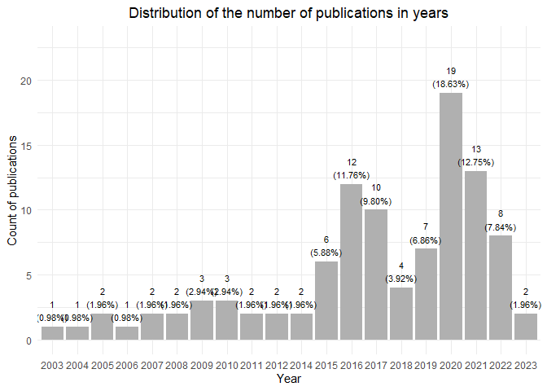
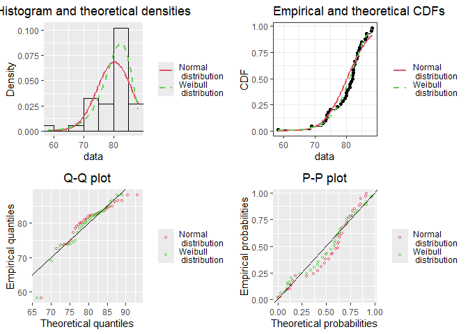
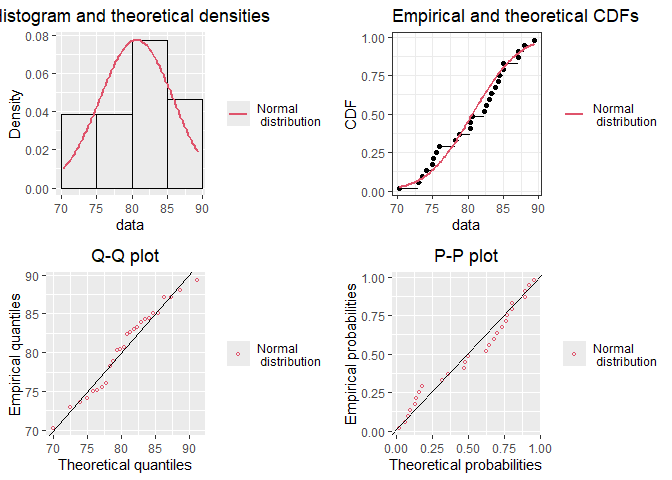

The outcomes and publication standards of research descriptions in
document classification: a systematic review of publications reporting
the use of 20 Newsgroups bydate dataset
================
Marcin Mirończuk (<marcin.mironczuk@opi.org.pl>) and Adam Müller
(<adam.muller@opi.org.pl>)
2024-12-11

- [1 Introduction](#1-introduction)
- [2 Processing data](#2-processing-data)
  - [2.1 Loading main setting](#21-loading-main-setting)
  - [2.2 Checking a bibliography and generating basic
    statistics](#22-checking-a-bibliography-and-generating-basic-statistics)
  - [2.3 Checking a schema of
    questionnaires](#23-checking-a-schema-of-questionnaires)
  - [2.4 Preparing data for Qualitative and Quantitative analyses of
    text classification
    studies](#24-preparing-data-for-qualitative-and-quantitative-analyses-of-text-classification-studies)
    - [2.4.1 Generating raw data to questionnaires
      analysis](#241-generating-raw-data-to-questionnaires-analysis)
      - [2.4.1.1 Questionnaires analysis - works’
        taxonomy](#2411-questionnaires-analysis---works-taxonomy)
      - [2.4.1.2 Questionnaires analysis - general
        overview/impression](#2412-questionnaires-analysis---general-overviewimpression)
      - [2.4.1.3 Questionnaires analysis - method
        reproducibility](#2413-questionnaires-analysis---method-reproducibility)
      - [2.4.1.4 Questionnaires analysis - datasets
        reproducibility](#2414-questionnaires-analysis---datasets-reproducibility)
      - [2.4.1.5 Questionnaires analysis - evaluation procedure
        reproducibility](#2415-questionnaires-analysis---evaluation-procedure-reproducibility)
    - [2.4.2 Extracted data analysis](#242-extracted-data-analysis)
      - [2.4.2.1 Extracted data analysis -
        Accuracy](#2421-extracted-data-analysis---accuracy)
        - [2.4.2.1.1 Analysis of Normal
          distribution.](#24211-analysis-of-normal-distribution)
        - [2.4.2.1.2 Analysis of Weibull
          distribution.](#24212-analysis-of-weibull-distribution)
        - [2.4.2.1.3 Comparing Normal and Weibull
          distribution.](#24213-comparing-normal-and-weibull-distribution)
        - [2.4.2.1.4 Ranking of the
          models](#24214-ranking-of-the-models)
        - [2.4.2.1.5 Analysis of trends](#24215-analysis-of-trends)
        - [2.4.2.1.6 Analysis of models
          groups](#24216-analysis-of-models-groups)
      - [2.4.2.2 Extracted data analysis - Macro F1
        score](#2422-extracted-data-analysis---macro-f1-score)
        - [2.4.2.2.1 Analysis of Normal
          distribution.](#24221-analysis-of-normal-distribution)
        - [2.4.2.2.2 Analysis of Weibull
          distribution.](#24222-analysis-of-weibull-distribution)
        - [2.4.2.2.3 Comparing Normal and Weibull
          distribution.](#24223-comparing-normal-and-weibull-distribution)
        - [2.4.2.2.4 Ranking of the
          models](#24224-ranking-of-the-models)
        - [2.4.2.2.5 Analysis of trends](#24225-analysis-of-trends)
        - [2.4.2.2.6 Analysis of models
          groups](#24226-analysis-of-models-groups)
      - [2.4.2.3 Extracted data analysis - Micro F1
        score](#2423-extracted-data-analysis---micro-f1-score)
        - [2.4.2.3.1 Analysis of Normal
          distribution.](#24231-analysis-of-normal-distribution)
        - [2.4.2.3.2 Ranking of the
          models](#24232-ranking-of-the-models)
        - [2.4.2.3.3 Analysis of trends](#24233-analysis-of-trends)
        - [2.4.2.3.4 Analysis of models
          groups](#24234-analysis-of-models-groups)
  - [2.5 Summary and notice](#25-summary-and-notice)
- [3 Conclusions](#3-conclusions)
- [4 References](#4-references)

# 1 Introduction

It is a technical report that (1) contains all data required to
reproduce all results presented in the article and (2) shows all
assumptions of the analyses. The presented analysis based on the data,
the code allows answering the following two main questions:

- What are the typical indicator values of F-score and accuracy for the
  multi-class document classification methods tested on the *20
  Newsgroups bydate* test set?
- What is the publication standard of research descriptions in the
  document classification?

Researchers can use all the materials presented and shared during the
analysis to create any other investigation.

In our systematic review, we used seven abstract and citation databases,
such as :

- Association for Computing Machinery (ACM) (<https://dl.acm.org/>)
- IEEE Xplore Digital Library
  (<https://ieeexplore.ieee.org/search/advanced>)
- ScienceDirect (<https://www.sciencedirect.com/>)
- Scopus (<https://www.scopus.com>)
- SpringerLink (<https://link.springer.com/advanced-search>)
- Local database.
- Papers With Code (<https://paperswithcode.com/>)

The first five positions present well-known and well-established
computer science databases that usually contain reviewed materials. The
sixth database, i.e. Local database, is a collection of articles from
other authors’ research. This database includes nearly 4,000 documents
from scientist-reviewed journals and conferences related to text mining
issues mostly. We indexed all works from this database using DockFetcher
software (<http://docfetcher.sourceforge.net/en/index.html>) to its
searchings. We used these databases to receive articles for the review
process. Furthermore, we explored the Papers With Code database, which
contains the newest article that reports results from interested
document classification fields. In the end, we also use other review
articles available until 2023.

We technically conducted two general search processes in time. The first
process collected papers from the remote databases, i.e. all five above
databases plus the *Papers With Code database*. The second process
acquired the articles from the Local database. Consequently, we
conducted a separate Screening of articles process (see the article) for
both groups of the collected materials. First, we screened the collected
articles from remote databases. Second, we analysed papers from the
Local database. Also, we create appropriate inclusion criteria in the
policy of Screening articles (see the article) to omit duplicated works
between these two groups. Using Local resources arose after the first
analysis of the second set of papers. Hence, such flow of the analysis
process.

Also, we used two search time ranges and a different set of queries for
both. First, we use a broth time range and narrow queries,
i.e. publication time until 2020 and queries limited to the *bydate*
version of the 20 newsgroup dataset. We used queries like the *20 news
bydate*, *20 newsgroups bydate*, *20news-bydate*, etc. Thanks to that,
we cover many methods used to document classification. Second, we use a
limited time range and broad queries, i.e. publication time from 2020
and queries not only limited to the *bydate* version of the 20 newsgroup
dataset. We uses queries like the above with and without the *bydate*
suffix. Thanks to that, we cover many newest methods used to document
classification that can be omitted during searching. We found that many
papers do not explicitly contain information about the *bydate* dataset.
So, the newest and most valuable articles could be omitted without using
broader queries. Of course, such queries return many articles that
finally do not use the *bydate*” version. However, we removed the
collected papers focused on something other than the appropriate dataset
version during a thorough screening.

When we found that an article does not mention an explicit *bydate*
version, we checked a description of the used 20 Newsgroups dataset.
Finally, we removed an article from further consideration if its
description did not indicate using an appropriate version of the
dataset. For example, the authors did not provide information about the
number of samples in the test and training dataset, or the number
differed from the standard split of this dataset. Also, we removed works
that used any other validation procedure, such as k-fold
cross-validation, without reporting results on the standard test set.

The summary of the collected articles until the 2020 year is shown in
Figure <a href="#fig:sumUntil2020">1.1</a>.

<div class="figure" style="text-align: center">


<p class="caption">
<span id="fig:sumUntil2020"></span>Figure 1.1: The count of articles
collected until 2020.
</p>

</div>

Table <a href="#fig:sumUntil2020">1.1</a> presents the count of articles
collected until 2022. Shortly, we gained 78 works from the remote
databases and 203 from the Local database. Then, we obtained 28 and 36
papers from the remote databases and Local databases, respectively,
after executing the primary policy of the Screening of the article
stage. Finally, we got 59 unique articles that use the *bydate* version
of the 20Newsgroups dataset that reported values of required indicators,
such as F-score and accuracy. First, we evaluated this set of papers
regarding the qualitative question (see the article). Second, we
assessed the collection of the documents in terms of a quantitative way
(see the article). We want to mention two things. First, we create two
exceptions. The first one relates to the question - Does the article
report values of F-score or accuracy/Error (1 - accuracy) indicators
obtained on the test set mentioned above? We registered two publications
that do not answer the question positively because they are exciting and
extend our review in qualitative analysis. The second thing concerns
using an article from outside our article reference databases and
including them in the analysis. While reading selected articles, we
found an interesting manuscript not covered by our searching process (In
Figure <a href="#fig:sumUntil2020">1.1</a> 1\* means the one article was
included in qualitative and quantitative analysis exceptionally) but was
mentioned in other publications.

The summary of the collected articles from the 2020 year is shown in
Figure <a href="#fig:sumFrom2020">1.2</a>.

<div class="figure" style="text-align: center">


<p class="caption">
<span id="fig:sumFrom2020"></span>Figure 1.2: The count of articles
collected from 2020.
</p>

</div>

Furthermore, thanks to the created bibliography, we have the opportunity
to obtain the answers for the following example of research questions:

- What does the distribution of articles over the years look like?
- What is the distribution of articles across different sources, such as
  journals, conference proceedings, technical reports, and other
  collections?
- What is the distribution of articles in specific sources?

The schema of the questionnaire with the questions (see the article) for
each article and the filled questionnaires for all revised papers are
available online
(<https://github.com/mmarcinmichal/systematic-review-doc-classification>).
Each questionnaire is in the form *xmls* file and contains two tabs
called *Quality-1* and *Quantity-1*, respectively. The first tab
contains the questions with the assessment and commentary. The second
one has information about extracted values of indicators and information
about preprocessing, and an optional comment.

# 2 Processing data

Data processing acquire three main steps:

1.  Loading main settings
2.  Checking a bibliography and making statistics based on the
    bibliography
3.  Checking a schema of questionnaires, preparing data for qualitative
    and quantitative analysis of text classification studies and making
    statistics based on the questionnaires.

Each step is described in the following reports below.

## 2.1 Loading main setting

The code below prepares an analysis environment and set-up all required
libraries and functions for further analysis.

``` r
options(warn = -1) 

options(encoding = "UTF-8")

# Clear workspace
rm(list = ls())

# Set language to En
Sys.setlocale(category = "LC_ALL", locale = "english")
```

    ## [1] "LC_COLLATE=English_United States.1252;LC_CTYPE=English_United States.1252;LC_MONETARY=English_United States.1252;LC_NUMERIC=C;LC_TIME=English_United States.1252"

``` r
# Installing and loading libraries
libraries <- c("readxl", "stringr", "openxlsx", "boot", "nortest", "json64", "fitdistrplus", "MASS", "ggplot2", "tm", "gridExtra", "dplyr", "bib2df", "psych", "pastecs", "forcats", "bookdown", "effectsize")

if (length(setdiff(libraries, rownames(installed.packages()))) > 0) {
  install.packages(setdiff(libraries, rownames(installed.packages())), dependencies = T)  
}

sapply(libraries, function(libName) { 
  library(libName, character.only = TRUE)
})
```

    ## $readxl
    ## [1] "readxl"    "stats"     "graphics"  "grDevices" "utils"     "datasets" 
    ## [7] "methods"   "base"     
    ## 
    ## $stringr
    ## [1] "stringr"   "readxl"    "stats"     "graphics"  "grDevices" "utils"    
    ## [7] "datasets"  "methods"   "base"     
    ## 
    ## $openxlsx
    ##  [1] "openxlsx"  "stringr"   "readxl"    "stats"     "graphics"  "grDevices"
    ##  [7] "utils"     "datasets"  "methods"   "base"     
    ## 
    ## $boot
    ##  [1] "boot"      "openxlsx"  "stringr"   "readxl"    "stats"     "graphics" 
    ##  [7] "grDevices" "utils"     "datasets"  "methods"   "base"     
    ## 
    ## $nortest
    ##  [1] "nortest"   "boot"      "openxlsx"  "stringr"   "readxl"    "stats"    
    ##  [7] "graphics"  "grDevices" "utils"     "datasets"  "methods"   "base"     
    ## 
    ## $json64
    ##  [1] "json64"    "nortest"   "boot"      "openxlsx"  "stringr"   "readxl"   
    ##  [7] "stats"     "graphics"  "grDevices" "utils"     "datasets"  "methods"  
    ## [13] "base"     
    ## 
    ## $fitdistrplus
    ##  [1] "fitdistrplus" "survival"     "MASS"         "json64"       "nortest"     
    ##  [6] "boot"         "openxlsx"     "stringr"      "readxl"       "stats"       
    ## [11] "graphics"     "grDevices"    "utils"        "datasets"     "methods"     
    ## [16] "base"        
    ## 
    ## $MASS
    ##  [1] "fitdistrplus" "survival"     "MASS"         "json64"       "nortest"     
    ##  [6] "boot"         "openxlsx"     "stringr"      "readxl"       "stats"       
    ## [11] "graphics"     "grDevices"    "utils"        "datasets"     "methods"     
    ## [16] "base"        
    ## 
    ## $ggplot2
    ##  [1] "ggplot2"      "fitdistrplus" "survival"     "MASS"         "json64"      
    ##  [6] "nortest"      "boot"         "openxlsx"     "stringr"      "readxl"      
    ## [11] "stats"        "graphics"     "grDevices"    "utils"        "datasets"    
    ## [16] "methods"      "base"        
    ## 
    ## $tm
    ##  [1] "tm"           "NLP"          "ggplot2"      "fitdistrplus" "survival"    
    ##  [6] "MASS"         "json64"       "nortest"      "boot"         "openxlsx"    
    ## [11] "stringr"      "readxl"       "stats"        "graphics"     "grDevices"   
    ## [16] "utils"        "datasets"     "methods"      "base"        
    ## 
    ## $gridExtra
    ##  [1] "gridExtra"    "tm"           "NLP"          "ggplot2"      "fitdistrplus"
    ##  [6] "survival"     "MASS"         "json64"       "nortest"      "boot"        
    ## [11] "openxlsx"     "stringr"      "readxl"       "stats"        "graphics"    
    ## [16] "grDevices"    "utils"        "datasets"     "methods"      "base"        
    ## 
    ## $dplyr
    ##  [1] "dplyr"        "gridExtra"    "tm"           "NLP"          "ggplot2"     
    ##  [6] "fitdistrplus" "survival"     "MASS"         "json64"       "nortest"     
    ## [11] "boot"         "openxlsx"     "stringr"      "readxl"       "stats"       
    ## [16] "graphics"     "grDevices"    "utils"        "datasets"     "methods"     
    ## [21] "base"        
    ## 
    ## $bib2df
    ##  [1] "bib2df"       "dplyr"        "gridExtra"    "tm"           "NLP"         
    ##  [6] "ggplot2"      "fitdistrplus" "survival"     "MASS"         "json64"      
    ## [11] "nortest"      "boot"         "openxlsx"     "stringr"      "readxl"      
    ## [16] "stats"        "graphics"     "grDevices"    "utils"        "datasets"    
    ## [21] "methods"      "base"        
    ## 
    ## $psych
    ##  [1] "psych"        "bib2df"       "dplyr"        "gridExtra"    "tm"          
    ##  [6] "NLP"          "ggplot2"      "fitdistrplus" "survival"     "MASS"        
    ## [11] "json64"       "nortest"      "boot"         "openxlsx"     "stringr"     
    ## [16] "readxl"       "stats"        "graphics"     "grDevices"    "utils"       
    ## [21] "datasets"     "methods"      "base"        
    ## 
    ## $pastecs
    ##  [1] "pastecs"      "psych"        "bib2df"       "dplyr"        "gridExtra"   
    ##  [6] "tm"           "NLP"          "ggplot2"      "fitdistrplus" "survival"    
    ## [11] "MASS"         "json64"       "nortest"      "boot"         "openxlsx"    
    ## [16] "stringr"      "readxl"       "stats"        "graphics"     "grDevices"   
    ## [21] "utils"        "datasets"     "methods"      "base"        
    ## 
    ## $forcats
    ##  [1] "forcats"      "pastecs"      "psych"        "bib2df"       "dplyr"       
    ##  [6] "gridExtra"    "tm"           "NLP"          "ggplot2"      "fitdistrplus"
    ## [11] "survival"     "MASS"         "json64"       "nortest"      "boot"        
    ## [16] "openxlsx"     "stringr"      "readxl"       "stats"        "graphics"    
    ## [21] "grDevices"    "utils"        "datasets"     "methods"      "base"        
    ## 
    ## $bookdown
    ##  [1] "bookdown"     "forcats"      "pastecs"      "psych"        "bib2df"      
    ##  [6] "dplyr"        "gridExtra"    "tm"           "NLP"          "ggplot2"     
    ## [11] "fitdistrplus" "survival"     "MASS"         "json64"       "nortest"     
    ## [16] "boot"         "openxlsx"     "stringr"      "readxl"       "stats"       
    ## [21] "graphics"     "grDevices"    "utils"        "datasets"     "methods"     
    ## [26] "base"        
    ## 
    ## $effectsize
    ##  [1] "effectsize"   "bookdown"     "forcats"      "pastecs"      "psych"       
    ##  [6] "bib2df"       "dplyr"        "gridExtra"    "tm"           "NLP"         
    ## [11] "ggplot2"      "fitdistrplus" "survival"     "MASS"         "json64"      
    ## [16] "nortest"      "boot"         "openxlsx"     "stringr"      "readxl"      
    ## [21] "stats"        "graphics"     "grDevices"    "utils"        "datasets"    
    ## [26] "methods"      "base"

``` r
# Functions
renameFile <- function(fileName) {
  tNewFileNameList <- stringr::str_split(fileName, "\\.")
  fileId <- stringr::str_trim(stringr::str_split(tNewFileNameList[[1]][1], "-")[[1]][1])
  tNewFileName <- paste0(fileId, "-", stringr::str_sub(json64::j_encode(tNewFileNameList[[1]][1], F), 1, 20), ".", tNewFileNameList[[1]][2])
  return(tNewFileName)
}
environment(renameFile) <- new.env(parent = baseenv())

copyFile <- function(xmlsPath, fileName, pasteTo) {
  if (base::Sys.info()['sysname'] == "Windows") {
    xmlsPath <-  base::gsub("/", "\\", xmlsPath, fixed = TRUE)
    pasteTo <-  base::gsub("/", "\\", pasteTo, fixed = TRUE)
    
    base::shell(base::paste0("copy ", base::paste0('"', xmlsPath, fileName, '" ', pasteTo)))
  } else {
    base::file.copy(paste0(xmlsPath, fileName), pasteTo)
  }
}
environment(copyFile) <- new.env(parent = baseenv())

createAggDf <- function(dataFrame) {
  aggDf <- data.frame("question" = "", "answer" = "", "count" = 0)
  
  for (i in 1:base::ncol(dataFrame)) {
    res <- base::table(dataFrame[,i])
    for (j in 1:base::length(res)) {
      aggDf <- base::rbind(aggDf, data.frame("question" = base::colnames(dataFrame)[i], 
                                             "answer" = base::names(res[j]), "count" = res[j]))
    }
  }
  
  aggDf <- aggDf[-c(1), ]
  row.names(aggDf) <- c(1:base::nrow(aggDf))
  
  return(aggDf)
}
environment(createAggDf) <- new.env(parent = baseenv())

ggplotQc <- function(dataDf, title, xlab, ylab, userPalette = RColorBrewer::brewer.pal(9,"Set1")) {
  ggplot2::ggplot(data = dataDf, ggplot2::aes_string(x = "question", y = "count", fill = "answer")) + 
    ggplot2::geom_bar(stat = "identity", position = ggplot2::position_dodge(), colour = "grey69") +
    ggplot2::geom_text(ggplot2::aes_string(label = "count"), vjust = -0.3, color = "black", 
                       position = ggplot2::position_dodge(0.9), size = 5.5) +
    ggplot2::scale_fill_manual(values = userPalette) +
    ggplot2::theme_minimal() +
    ggplot2::labs(title = title, x = xlab, y = ylab) +
    ggplot2::theme(plot.title = ggplot2::element_text(hjust = 0.5))
}
environment(ggplotQc) <- new.env(parent = baseenv())

ggplotQcFlip <- function(dataDf, title, xlab, ylab, userPalette = RColorBrewer::brewer.pal(9,"Set1")) {
  ggplot2::ggplot(data = dataDf, ggplot2::aes_string(x = "question", y = "count", fill = "answer")) + 
    ggplot2::geom_bar(stat = "identity", position = ggplot2::position_dodge(), colour = "grey69") +
    ggplot2::geom_text(ggplot2::aes_string(label = "count"), hjust = -0.3, color = "black", 
                       position = ggplot2::position_dodge(0.9), size = 3.5) +
    ggplot2::scale_fill_manual(values = userPalette) +
    ggplot2::theme_minimal() +
    ggplot2::labs(title = title, x = xlab, y = ylab) +
    ggplot2::theme(plot.title = ggplot2::element_text(hjust = 0.5)) +
    ggplot2::coord_flip() +
    ggplot2::guides(fill = ggplot2::guide_legend(reverse = TRUE)) 
}
environment(ggplotQcFlip) <- new.env(parent = baseenv())

ggplotCf <- function(dataDf, title, xlab, ylab, label = "frequ") {
  ggplot2::ggplot(data = dataDf, ggplot2::aes_string(x = "count", y = "frequ")) + 
    ggplot2::geom_bar(stat = "identity", position = ggplot2::position_dodge(), fill = "grey69") +
    ggplot2::geom_text(ggplot2::aes_string(label = label), vjust = -0.3, color = "black", position = ggplot2::position_dodge(0.9), size = 3) +
    ggplot2::scale_fill_brewer(palette = "Set1") +
    ggplot2::theme_minimal() +
    ggplot2::labs(title = title, x = xlab, y = ylab) +
    ggplot2::theme(plot.title = ggplot2::element_text(hjust = 0.5)) +
    ggplot2::scale_y_continuous(limits = c(0,round(max(dataDf[,2])*1.2,0)))
    
}
environment(ggplotCf) <- new.env(parent = baseenv())

ggplotCfFlip <- function(dataDf, title, xlab, ylab) {
  ggplot2::ggplot(data = dataDf, ggplot2::aes_string(x = "count", y = "frequ")) + 
    ggplot2::geom_bar(stat = "identity", position = ggplot2::position_dodge(), fill = "grey69") +
    ggplot2::geom_text(ggplot2::aes_string(label = "frequ"), hjust = -0.5, color = "black", size = 5.5) +
    ggplot2::scale_fill_brewer(palette = "Set1") +
    ggplot2::theme_minimal() +
    ggplot2::labs(title = title, x = xlab, y = ylab) +
    ggplot2::theme(plot.title = ggplot2::element_text(hjust = 0.5)) +
    ggplot2::scale_y_continuous(limits = c(0,round(max(dataDf[,2])*1.3,0))) +
    ggplot2::coord_flip()
}
environment(ggplotCfFlip) <- new.env(parent = baseenv())

ggplotHist <- function(dataDf, title, xlab, ylab, indicator) {
  ggplot2::ggplot(data = dataDf, ggplot2::aes_string(x = indicator)) + 
  ggplot2::geom_histogram(bins = 8, position = ggplot2::position_dodge(), fill = "grey69", col = "white") +
  ggplot2::stat_bin(bins = 8, geom = 'text', color = 'black', ggplot2::aes(label = ..count..),
          vjust = -1, size = 5.5, position = ggplot2::position_dodge()) +
  ggplot2::scale_fill_brewer(palette = "Set1") +
  ggplot2::theme_minimal() +
  ggplot2::labs(title = title, x = xlab, y = ylab) +
  ggplot2::theme(plot.title = ggplot2::element_text(hjust = 0.5)) 
}
environment(ggplotHist) <- new.env(parent = baseenv())

ggplotBox <- function(dataDf, title, xlab, ylab, indicator) {
  ggplot2::ggplot(data = dataDf, ggplot2::aes_string(y = indicator)) + 
    ggplot2::geom_boxplot() +
    ggplot2::geom_point(ggplot2::aes_string(x = 0), alpha = 0.3) +
    ggplot2::scale_fill_brewer(palette = "Set1") +
    ggplot2::theme_minimal() +
    ggplot2::labs(title = title, x = ylab, y = xlab) +
    ggplot2::theme(plot.title = ggplot2::element_text(hjust = 0.5),
                   axis.text.x = ggplot2::element_blank())
}
environment(ggplotBox) <- new.env(parent = baseenv())

ggplotBoot <- function(bootTDf, boott0) {
  p1 <- ggplot2::ggplot(bootTDf, ggplot2::aes(x = .data$V1)) +
  ggplot2::geom_histogram(ggplot2::aes(y = ..density..), bins = 60, alpha = 0.5) +
  ggplot2::scale_fill_manual(values = RColorBrewer::brewer.pal(9,"Set1")) +
  ggplot2::theme_minimal() +
  ggplot2::labs(title = "Histogram of t", x = "t*", y = "Density") +
  ggplot2::theme(plot.title = ggplot2::element_text(hjust = 0.5)) +
  ggplot2::geom_density(alpha = .2) + 
  ggplot2::geom_vline(xintercept = boott0, linetype = "dashed")

p2 <- ggplot2::ggplot(bootTDf, ggplot2::aes(sample = .data$V1)) + 
  ggplot2::stat_qq() + 
  ggplot2::stat_qq_line() +
  ggplot2::theme_minimal() +
  ggplot2::theme(plot.title = ggplot2::element_text(hjust = 0.5))

gridExtra::grid.arrange(p1, p2, nrow = 2)
} 
environment(ggplotBoot) <- new.env(parent = baseenv())

createIndicatorValDf <- function(modelResultsDf, indicatorName, workIds) {
  indiDf <- modelResultsDf[modelResultsDf$workId %in% workIds, c("workId", "modelName", indicatorName)]
  naIndx <- base::which(base::is.na(indiDf[,indicatorName]))
  if (length(naIndx) != 0) {
      indiDf <- indiDf[-naIndx,]
  }
  tsplit <- base::split(indiDf, indiDf$workId)
  res <- base::lapply(X = tsplit,
                      FUN = function(record) record[which.max(record[,indicatorName]),])
  
  maxValDf <- base::as.data.frame(res[[1]][c("workId", "modelName", indicatorName)])
  for (i in 2:base::length(res)) {
    maxValDf <- base::rbind(maxValDf, base::as.data.frame(res[[i]][c("workId", "modelName", indicatorName)])) 
  }
  
  return(maxValDf)
}
environment(createIndicatorValDf) <- new.env(parent = baseenv())

simpleStats <- function(modelResultsDf, indicatorName, workIds) {
  aggDf <- base::get("createIndicatorValDf", envir = .GlobalEnv)(modelResultsDf, indicatorName, workIds)

  base::print(base::summary(aggDf[,indicatorName]))
  base::print(psych::describe(aggDf[,indicatorName]))
  base::print(stats::shapiro.test(aggDf[,indicatorName]))
  base::print(base::dim(aggDf))
}
environment(simpleStats) <- new.env(parent = baseenv())

rsq <- function(data, indices) {
  d <- data[indices]
  return(base::mean(d, na.rm = T))
}
environment(rsq) <- new.env(parent = baseenv())

rsqWeibull <- function(data, indices) {
  d <- data[indices]
  fittedWeibull <- fitdistrplus::fitdist(d, "weibull")
  summaryWeibull <- base::summary(fittedWeibull)
  
  shape <- summaryWeibull$estimate['shape']
  scale <- summaryWeibull$estimate['scale']
  
  medianWeibull <- scale*base::log(2)^(1/shape)
  meanWeibull <- scale*base::gamma(1 + 1/shape)
  return(meanWeibull)
}
environment(rsqWeibull) <- new.env(parent = baseenv())

# Information about session
sessionInfo()
```

    ## R version 4.3.2 (2023-10-31 ucrt)
    ## Platform: x86_64-w64-mingw32/x64 (64-bit)
    ## Running under: Windows 11 x64 (build 26100)
    ## 
    ## Matrix products: default
    ## 
    ## 
    ## locale:
    ## [1] LC_COLLATE=English_United States.1252 
    ## [2] LC_CTYPE=English_United States.1252   
    ## [3] LC_MONETARY=English_United States.1252
    ## [4] LC_NUMERIC=C                          
    ## [5] LC_TIME=English_United States.1252    
    ## system code page: 65001
    ## 
    ## time zone: Europe/Warsaw
    ## tzcode source: internal
    ## 
    ## attached base packages:
    ## [1] stats     graphics  grDevices utils     datasets  methods   base     
    ## 
    ## other attached packages:
    ##  [1] effectsize_1.0.0   bookdown_0.41      forcats_1.0.0      pastecs_1.4.2     
    ##  [5] psych_2.4.6.26     bib2df_1.1.2.0     dplyr_1.1.4        gridExtra_2.3     
    ##  [9] tm_0.7-15          NLP_0.3-2          ggplot2_3.5.1      fitdistrplus_1.2-1
    ## [13] survival_3.5-7     MASS_7.3-60        json64_0.1.3       nortest_1.0-4     
    ## [17] boot_1.3-28.1      openxlsx_4.2.7.1   stringr_1.5.1      readxl_1.4.3      
    ## 
    ## loaded via a namespace (and not attached):
    ##  [1] gtable_0.3.6       xfun_0.49          bayestestR_0.15.0  insight_1.0.0     
    ##  [5] lattice_0.21-9     vctrs_0.6.5        tools_4.3.2        generics_0.1.3    
    ##  [9] sandwich_3.1-1     parallel_4.3.2     datawizard_0.13.0  tibble_3.2.1      
    ## [13] fansi_1.0.6        pkgconfig_2.0.3    Matrix_1.6-1.1     lifecycle_1.0.4   
    ## [17] compiler_4.3.2     munsell_0.5.1      mnormt_2.1.1       codetools_0.2-19  
    ## [21] humaniformat_0.6.0 htmltools_0.5.8.1  yaml_2.3.10        pillar_1.9.0      
    ## [25] multcomp_1.4-26    nlme_3.1-163       tidyselect_1.2.1   zip_2.3.1         
    ## [29] digest_0.6.37      mvtnorm_1.3-2      stringi_1.8.4      slam_0.1-55       
    ## [33] splines_4.3.2      fastmap_1.2.0      grid_4.3.2         colorspace_2.1-1  
    ## [37] cli_3.6.3          magrittr_2.0.3     utf8_1.2.4         TH.data_1.1-2     
    ## [41] withr_3.0.2        scales_1.3.0       estimability_1.5.1 rmarkdown_2.29    
    ## [45] httr_1.4.7         emmeans_1.10.5     cellranger_1.1.0   zoo_1.8-12        
    ## [49] coda_0.19-4.1      evaluate_1.0.1     knitr_1.49         parameters_0.24.0 
    ## [53] rlang_1.1.4        Rcpp_1.0.13-1      xtable_1.8-4       glue_1.8.0        
    ## [57] xml2_1.3.6         rstudioapi_0.17.1  R6_2.5.1

## 2.2 Checking a bibliography and generating basic statistics

We have two files containing bibliography information. A first base file
named *biblio-reviewed-compiled-all-year-range.bib* contains raw
bibliography acquired thanks to JabRef. A second file named
*biblio-reviewed-compiled-all-year-range-prop-form.bib* is a
pre-processed *biblio-reviewed-compiled-all-year-range.bib* file used by
Mendeley Desktop software. The software updated and corrected
information of the base file (the value of the year field is kept from
the *biblio-reviewed-compiled-all-year-range.bib*). In the code’s chunk
below, we check the structure and completeness of files, i.e. if they
contain the same information. Moreover, we build basic statistics about
publication resources.

Loading bibliographies.

``` r
bib1 <- "../../biblio/biblio-reviewed-compiled-all-year-range.bib"
bib2 <- "../../biblio/biblio-reviewed-compiled-all-year-range-prop-form.bib"

linesBib1 <- readLines(bib1, encoding = "UTF-8")
linesBib2 <- readLines(bib2, encoding = "UTF-8")
```

Comparing the bibliographies keys.

``` r
regId <- "^@[:alpha:]{1,}\\{[:alpha:]{1,}[:digit:]{1,4}[:alpha:]{0,1},$"

idsBib1 <- linesBib1[stringr::str_detect(linesBib1, regId)]
idsBib2 <- linesBib2[stringr::str_detect(linesBib2, regId)]

table(stringr::str_to_lower(stringr::str_sort(idsBib1)) == stringr::str_to_lower(stringr::str_sort(idsBib2)))
```

    ## 
    ## TRUE 
    ##  102

Comparing the bibliographies titles.

``` r
regTitle = "^ {0,}title {0,}="

titlesBib1 <- linesBib1[stringr::str_detect(linesBib1, regTitle)]
titlesBib2 <- linesBib2[stringr::str_detect(linesBib2, regTitle)]

titlesBib1 <- stringr::str_sub(stringr::str_sort(stringr::str_to_lower(stringr::str_trim(stringr::str_replace_all(titlesBib1, "title|=|\\{|\\}| {2,}", "")))), 1, 50)
titlesBib2 <- stringr::str_sub(stringr::str_sort(stringr::str_to_lower(stringr::str_trim(stringr::str_replace_all(titlesBib2, "title|=|\\{|\\}| {2,}", "")))), 1, 50)

table(titlesBib1 == titlesBib2)
```

    ## 
    ## TRUE 
    ##  102

Comparing the bibliographies years.

``` r
regYear <- "^ {0,}year {0,}="
yearBib1 <- linesBib1[stringr::str_detect(linesBib1, regYear)]
yearBib2 <- linesBib2[stringr::str_detect(linesBib2, regYear)]

regYearDigit <- "[:digit:]{4,4}"
yearsBib1 <- as.numeric(stringr::str_extract(yearBib1, regYearDigit))
yearsBib2 <- as.numeric(stringr::str_extract(yearBib2, regYearDigit))

table(table(yearsBib1) == table(yearsBib2))
```

    ## 
    ## TRUE 
    ##   20

Computing, plotting and saving information about the distribution of
publications between years.

``` r
dataSetsCountDf <- as.data.frame(table(yearsBib1))
colnames(dataSetsCountDf) <- c("count", "frequ")

title <- "Distribution of the number of publications in years"
xlab <- "Year"
ylab <- "Count of publications"

ggplotCf(dataSetsCountDf %>% dplyr::mutate(label = paste0(.data$frequ, "\n(", scales::percent(.data$frequ/sum(.data$frequ) ),")")), title, xlab, ylab, label = "label") 
```

<div class="figure" style="text-align: center">


<p class="caption">
<span id="fig:bibliochecking5"></span>Figure 2.1: Distribution of the
number of publications in years.
</p>

</div>

``` r
ggplot2::ggsave("../../img/fig-art-distby-years.pdf")
```

    ## Saving 7 x 5 in image

Comparing the types of publications in bibliographies.

``` r
typesPubBib1 <- stringr::str_sort(stringr::str_to_lower(stringr::str_extract(idsBib1, "[:alpha:]{1,}")))
typesPubBib2 <- stringr::str_sort(stringr::str_to_lower(stringr::str_extract(idsBib2, "[:alpha:]{1,}")))

table(table(typesPubBib1) == table(typesPubBib2))
```

    ## 
    ## TRUE 
    ##    4

Computing, plotting and saving information about the distribution of the
number of publications grouped by publication type.

``` r
dataSetsCountDf <- as.data.frame(table(typesPubBib1))

colnames(dataSetsCountDf) <- c("count", "frequ")

dataSetsCountDf$count <- dataSetsCountDf$count %>% stringr::str_to_title(.)

title <- "Distribution of the number of publications grouped by publication type"
xlab <- "Publication type"
ylab <- "Count of publications"
ggplotCf(dataSetsCountDf %>% dplyr::mutate(label = paste0(.data$frequ,"\n(", scales::percent(.data$frequ/sum(.data$frequ) ),")"),
                                    count = forcats::fct_reorder(count, -.data$frequ)), 
         title, xlab, ylab, label = "label") 
```

<div class="figure" style="text-align: center">


<p class="caption">
<span id="fig:bibliochecking7"></span>Figure 2.2: Distribution of the
number of publications grouped by publication type.
</p>

</div>

``` r
ggplot2::ggsave("../../img/fig-art-distby-pubtype.pdf")
```

    ## Saving 7 x 5 in image

Computing, plotting and saving information about the distribution of the
number of publications by publication type.

``` r
regJournal = "^ {0,}journal|^ {0,}booktitle"
journalBib2 <- linesBib2[stringr::str_detect(linesBib2, regJournal)]
journalBib2 <- stringr::str_remove(stringr::str_remove(journalBib2, "^ {0,}journal {0,}= \\{|^ {0,}booktitle {0,}= \\{"), "\\}\\,")

dataSetsCountDf <- as.data.frame(table(journalBib2))
colnames(dataSetsCountDf) <- c("count", "frequ")
dataSetsCountDf <- dataSetsCountDf[order(dataSetsCountDf$frequ, decreasing = T), ]

title <- stringr::str_wrap("Distribution of the number of publications by publication type",40)
xlab <- "Publication type"
ylab <- "Count of publications"
ggplotCfFlip(dataSetsCountDf[1:8, ] %>% 
               dplyr::mutate(count = 
                               forcats::fct_reorder(stringr::str_wrap(count, 50), .data$frequ)), title, xlab, ylab) + 
  ggplot2::scale_y_continuous(breaks = c(0,2,4,6,8,10, 12), 
                              labels = c(0,2,4,6,8,10, 12),
                              limits = c(0,11))
```

    ## Scale for y is already present.
    ## Adding another scale for y, which will replace the existing scale.

<div class="figure" style="text-align: center">


<p class="caption">
<span id="fig:bibliochecking8"></span>Figure 2.3: Distribution of the
number of publications by publication type
</p>

</div>

``` r
ggplot2::ggsave("../../img/fig-art-grby-jour.pdf")
```

    ## Saving 7 x 5 in image

Showing the ranking of publications’ journals or resource names.

``` r
colnames(dataSetsCountDf) <- c("Journals/Resource names", "Frequency")
knitr::kable(dataSetsCountDf %>% 
               dplyr::mutate(Percent = scales::percent(.data$Frequency/sum(.data$Frequency))), 
             caption = "Ranking of publication resources.")
```

|  | Journals/Resource names | Frequency | Percent |
|----|:---|---:|:---|
| 19 | Expert Systems with Applications | 10 | 8.77% |
| 37 | Knowledge-Based Systems | 7 | 6.14% |
| 27 | IEEE Transactions on Knowledge and Data Engineering | 5 | 4.39% |
| 25 | IEEE Access | 3 | 2.63% |
| 31 | Information Sciences | 3 | 2.63% |
| 39 | Lecture Notes in Computer Science (including subseries Lecture Notes in Artificial Intelligence and Lecture Notes in Bioinformatics) | 3 | 2.63% |
| 44 | Neurocomputing | 3 | 2.63% |
| 48 | Pattern Recognition Letters | 3 | 2.63% |
| 2 | 2020 IEEE 11th International Conference on Software Engineering and Service Science (ICSESS) | 2 | 1.75% |
| 10 | Advances in Neural Information Processing Systems | 2 | 1.75% |
| 33 | International Conference on Learning Representations | 2 | 1.75% |
| 57 | Proceedings of the 14th ACM International Conference on Web Search and Data Mining | 2 | 1.75% |
| 60 | Proceedings of the 2020 Conference on Empirical Methods in Natural Language Processing (EMNLP) | 2 | 1.75% |
| 65 | Proceedings of the 43rd International ACM SIGIR Conference on Research and Development in Information Retrieval | 2 | 1.75% |
| 66 | Proceedings of the AAAI Conference on Artificial Intelligence | 2 | 1.75% |
| 71 | Proceedings of The Web Conference 2020 | 2 | 1.75% |
| 72 | Proceedings of the Web Conference 2021 | 2 | 1.75% |
| 1 | 2016 4th International Symposium on Computational and Business Intelligence, ISCBI 2016 | 1 | 0.88% |
| 3 | 2020 IEEE 17th India Council International Conference (INDICON) | 1 | 0.88% |
| 4 | 2021 IEEE 6th International Conference on Big Data Analytics (ICBDA) | 1 | 0.88% |
| 5 | 2022 14th International Conference on Machine Learning and Computing (ICMLC) | 1 | 0.88% |
| 6 | 32nd International Conference on Machine Learning, ICML 2015 | 1 | 0.88% |
| 7 | 6th International Conference on Fuzzy Systems and Knowledge Discovery, FSKD 2009 | 1 | 0.88% |
| 8 | ACM Transactions on Asian Language Information Processing | 1 | 0.88% |
| 9 | ACM Transactions on Intelligent Systems and Technology | 1 | 0.88% |
| 11 | Advances in Neural Information Processing Systems 22 - Proceedings of the 2009 Conference | 1 | 0.88% |
| 12 | Applied Intelligence | 1 | 0.88% |
| 13 | Applied Sciences | 1 | 0.88% |
| 14 | Concurrency Computation | 1 | 0.88% |
| 15 | Data Mining and Knowledge Discovery | 1 | 0.88% |
| 16 | Decision Support Systems | 1 | 0.88% |
| 17 | Entropy | 1 | 0.88% |
| 18 | European Conference on Artificial Intelligence | 1 | 0.88% |
| 20 | Findings | 1 | 0.88% |
| 21 | Findings of the Association for Computational Linguistics: ACL-IJCNLP 2021 | 1 | 0.88% |
| 22 | Frontiers in Computational Neuroscience | 1 | 0.88% |
| 23 | HLT/EMNLP 2005 - Human Language Technology Conference and Conference on Empirical Methods in Natural Language Processing, Proceedings of the Conference | 1 | 0.88% |
| 24 | ICASSP, IEEE International Conference on Acoustics, Speech and Signal Processing - Proceedings | 1 | 0.88% |
| 26 | IEEE Transactions on Cybernetics | 1 | 0.88% |
| 28 | IEEE/ACM Transactions on Audio, Speech, and Language Processing | 1 | 0.88% |
| 29 | IJCAI International Joint Conference on Artificial Intelligence | 1 | 0.88% |
| 30 | Information Processing and Management | 1 | 0.88% |
| 32 | International conference on artificial intelligence and statistics | 1 | 0.88% |
| 34 | International Conference on Parallel Problem Solving from Nature | 1 | 0.88% |
| 35 | International Journal of Data Science and Analytics | 1 | 0.88% |
| 36 | International Journal of Production Economics | 1 | 0.88% |
| 38 | Knowledge and Information Systems | 1 | 0.88% |
| 40 | Lecture Notes in Electrical Engineering | 1 | 0.88% |
| 41 | Mathematical Biosciences and Engineering | 1 | 0.88% |
| 42 | Mathematics | 1 | 0.88% |
| 43 | Neural Computing and Applications | 1 | 0.88% |
| 45 | North American Chapter of the Association for Computational Linguistics | 1 | 0.88% |
| 46 | Parallel Problem Solving from Nature PPSN XVI | 1 | 0.88% |
| 47 | Pattern Recognition | 1 | 0.88% |
| 49 | PLoS ONE | 1 | 0.88% |
| 50 | Proceedings - 16th IEEE International Conference on Machine Learning and Applications, ICMLA 2017 | 1 | 0.88% |
| 51 | Proceedings - 2014 Brazilian Conference on Intelligent Systems, BRACIS 2014 | 1 | 0.88% |
| 52 | Proceedings - IEEE International Conference on Data Mining, ICDM | 1 | 0.88% |
| 53 | Proceedings - International Conference on Machine Learning and Cybernetics | 1 | 0.88% |
| 54 | Proceedings of 2015 International Conference on Asian Language Processing, IALP 2015 | 1 | 0.88% |
| 55 | Proceedings of IEEE/ACS International Conference on Computer Systems and Applications, AICCSA | 1 | 0.88% |
| 56 | Proceedings of the 11th Annual Conference of the International Speech Communication Association, INTERSPEECH 2010 | 1 | 0.88% |
| 58 | Proceedings of the 2006 ACM Symposium on Document Engineering, DocEng 2006 | 1 | 0.88% |
| 59 | Proceedings of the 2016 International Conference on Asian Language Processing, IALP 2016 | 1 | 0.88% |
| 61 | Proceedings of the 2021 Conference of the North American Chapter of the Association for Computational Linguistics: Human Language Technologies | 1 | 0.88% |
| 62 | Proceedings of the 2022 14th International Conference on Machine Learning and Computing | 1 | 0.88% |
| 63 | Proceedings of the 25th International Conference on Machine Learning | 1 | 0.88% |
| 64 | Proceedings of the 33rd International Conference on International Conference on Machine Learning - Volume 48 | 1 | 0.88% |
| 67 | Proceedings of the ACM SIGKDD International Conference on Knowledge Discovery and Data Mining | 1 | 0.88% |
| 68 | Proceedings of the Annual Conference of the International Speech Communication Association, INTERSPEECH | 1 | 0.88% |
| 69 | Proceedings of the International Joint Conference on Neural Networks | 1 | 0.88% |
| 70 | Proceedings of the Twenty Third International Conference on Artificial Intelligence and Statistics | 1 | 0.88% |
| 73 | SIGIR 2005 - Proceedings of the 28th Annual International ACM SIGIR Conference on Research and Development in Information Retrieval | 1 | 0.88% |
| 74 | Technometrics | 1 | 0.88% |
| 75 | TENCON 2021 - 2021 IEEE Region 10 Conference (TENCON) | 1 | 0.88% |
| 76 | World Wide Web | 1 | 0.88% |

<span id="tab:bibliochecking9"></span>Table 2.1: Ranking of publication
resources.

Note: the code above can be improved and simplified by using *bib2df*
library.

``` r
options(encoding = "UTF-8")
tdf1 <- bib2df::bib2df(bib1)
options(encoding = "UTF-8")
tdf2 <- bib2df::bib2df(bib2)

tdf1$YEAR <- as.numeric(tdf1$YEAR)
tdf2$YEAR <- as.numeric(tdf2$YEAR)

tdf1 <- tdf1[order(tdf1$BIBTEXKEY), ]
tdf2 <- tdf2[order(tdf2$BIBTEXKEY), ]

table(tdf1$YEAR == tdf2$YEAR)
```

    ## 
    ## TRUE 
    ##  102

## 2.3 Checking a schema of questionnaires

In this step, a schema of questionnaires is checked. Furthermore, we
remove four unnecessary files from further analysis. Those files are
called:

- 3 - Learning algorithms for the classification restricted Boltzmann
  machine.xlsx
- 34 - HARAM A Hierarchical ARAM Neural Network for Large-Scale Text
  Classification.xlsx
- v0 - article-assesment-schema.xlsx
- v1 - article-assesment-schema.xlsx

The first two are extended or simplified versions of the other same
publications. The last two files contain a schema of the questionnaire.

We use *v1 - article-assesment-schema* as a baseline/reference
questionnaire schema and check that all files/questionnaires are
compatible with this schema.

``` r
xmlsPath <- "../../search-results/4-qq-assesments/"

schemaFileName <- "v1 - article-assesment-schema.xlsx"

schemaFileNames <- list.files(xmlsPath)

# Remove from analysis 
noAnalysedArticles <- c("v0 \\- article\\-assesment\\-schema\\.xlsx",
                        "v1 \\- article\\-assesment\\-schema\\.xlsx")
schemaFileNames <- schemaFileNames[-c(stringr::str_which(schemaFileNames, paste(noAnalysedArticles, collapse = "|")))]

defaultSchema <- readxl::read_excel(paste0(xmlsPath, schemaFileName))

defaultSchemaQuestions <- defaultSchema$Question

tmpFilePath <- "./tmp/" # temporary dir
do.call(file.remove, list(list.files(tmpFilePath, full.names = TRUE))) # Clear tmp dir
```

    ## logical(0)

``` r
for (i in 1:length(schemaFileNames)) {
  tFileName <- schemaFileNames[i]
  message(paste0("Checking schema of question for file: ", tFileName))
  
  # Sometimes a file name is too long so we must transform it to shorter form and after that open
  tNewFileName <- renameFile(tFileName)
  pasteTo <- paste0(tmpFilePath, tNewFileName)

  if (!dir.exists(tmpFilePath)) {
    dir.create(file.path(".", tmpFilePath), showWarnings = TRUE)
  }
  
  copyFile(xmlsPath, tFileName, pasteTo)
 
  currentSchema <- readxl::read_excel(pasteTo)
  currentSchema$Question_id = sub(" .*", "", currentSchema$Question)
  currentSchemaQuestions <- currentSchema$Question
 
  if (all((defaultSchemaQuestions == currentSchemaQuestions) == TRUE)) {
    message(paste0("Schema is fine"))
  } else {
    stop("Wrong schema")
  }
}

do.call(file.remove, list(list.files(tmpFilePath, full.names = TRUE))) # Clear tmp dir
```

    ##   [1] TRUE TRUE TRUE TRUE TRUE TRUE TRUE TRUE TRUE TRUE TRUE TRUE TRUE TRUE TRUE
    ##  [16] TRUE TRUE TRUE TRUE TRUE TRUE TRUE TRUE TRUE TRUE TRUE TRUE TRUE TRUE TRUE
    ##  [31] TRUE TRUE TRUE TRUE TRUE TRUE TRUE TRUE TRUE TRUE TRUE TRUE TRUE TRUE TRUE
    ##  [46] TRUE TRUE TRUE TRUE TRUE TRUE TRUE TRUE TRUE TRUE TRUE TRUE TRUE TRUE TRUE
    ##  [61] TRUE TRUE TRUE TRUE TRUE TRUE TRUE TRUE TRUE TRUE TRUE TRUE TRUE TRUE TRUE
    ##  [76] TRUE TRUE TRUE TRUE TRUE TRUE TRUE TRUE TRUE TRUE TRUE TRUE TRUE TRUE TRUE
    ##  [91] TRUE TRUE TRUE TRUE TRUE TRUE TRUE TRUE TRUE TRUE TRUE

## 2.4 Preparing data for Qualitative and Quantitative analyses of text classification studies

The analysis of the comments conducts a qualitative analysis of the
work - answers for the questions Q1 - Q4, i.e.:

- Q1 Does the work present a clear statement of the aim of the research?
  If yes, what is it?
- Q2 Does the work present a clear technical and algorithm aspect of the
  work? If yes, what is a technical and algorithm aspect of the work?
- Q3 Does the work contain a statement about
  finding(s)/recommendation(s) of the research? If yes, what are they?
- Q4 Does the work highlight new challenge(s) or open problem(s)? If
  yes, what are they?

We created a simple works’ taxonomy based on the answers for question
Q1. We discussed each publication in the paper in the context of the
questions mentioned above.

Quantitative analysis is composed of two parts. The first one considers
the outcomes of the questionnaires’ *Assesment* and *Comment* columns.
It allows us to establish and summarise the publication pattern
quantitatively. The second one focus on the analysis of the extracted
values of the indicators, such as accuracy, micro F1 score, and macro F1
score.

### 2.4.1 Generating raw data to questionnaires analysis

Creating the structures called:

- *modelResultsDf*, which contains information about outcomes from the
  *Assessment* column of each question for each article,
- *commentsDf*, which contains information about outcomes from the
  *Comment* column of each question for each article.

``` r
colNames <- sapply(stringr::str_split(defaultSchemaQuestions, " "), function(x) x[1])
propColNames <- make.names(c("workId", colNames))

tMat <- matrix(ncol = length(propColNames), nrow = 1)
modelResultsDf <- as.data.frame(tMat, stringsAsFactors = F)
commentsDf <- as.data.frame(tMat, stringsAsFactors = F) 

tmpFilePath <- "./tmp/" # temporary dir
do.call(file.remove, list(list.files(tmpFilePath, full.names = TRUE))) # Clear tmp dir
```

    ## logical(0)

``` r
for (i in 1:length(schemaFileNames)) {
  tFileName <- schemaFileNames[i]
  message(paste0("Checking schema of question for file: ", tFileName))
  
  # Sometimes a file name is too long so we must transform it to shorter form and after that open
  tNewFileName <- renameFile(tFileName)
  pasteTo <- paste0(tmpFilePath, tNewFileName)

  if (!dir.exists(tmpFilePath)) {
    dir.create(file.path(".", tmpFilePath), showWarnings = TRUE)
  }
  
  copyFile(xmlsPath, tFileName, pasteTo)
  
  resScheet <- readxl::read_excel(pasteTo, sheet = "Quality-1")

  modelResultsDf <- rbind(modelResultsDf, c(tFileName, resScheet$Assesment))
  commentsDf <- rbind(commentsDf, c(tFileName, resScheet$Comment))
}

modelResultsDf <- modelResultsDf[-c(1), ]
colnames(modelResultsDf) <- propColNames

commentsDf <- commentsDf[-c(1), ]
colnames(commentsDf) <- propColNames

# Remove unnecessary columns
indxs <- stringr::str_which(modelResultsDf[1,], "^-$")
modelResultsDf <- modelResultsDf[,-c(indxs)]

do.call(file.remove, list(list.files(tmpFilePath, full.names = TRUE))) # Clear tmp dir
```

    ##   [1] TRUE TRUE TRUE TRUE TRUE TRUE TRUE TRUE TRUE TRUE TRUE TRUE TRUE TRUE TRUE
    ##  [16] TRUE TRUE TRUE TRUE TRUE TRUE TRUE TRUE TRUE TRUE TRUE TRUE TRUE TRUE TRUE
    ##  [31] TRUE TRUE TRUE TRUE TRUE TRUE TRUE TRUE TRUE TRUE TRUE TRUE TRUE TRUE TRUE
    ##  [46] TRUE TRUE TRUE TRUE TRUE TRUE TRUE TRUE TRUE TRUE TRUE TRUE TRUE TRUE TRUE
    ##  [61] TRUE TRUE TRUE TRUE TRUE TRUE TRUE TRUE TRUE TRUE TRUE TRUE TRUE TRUE TRUE
    ##  [76] TRUE TRUE TRUE TRUE TRUE TRUE TRUE TRUE TRUE TRUE TRUE TRUE TRUE TRUE TRUE
    ##  [91] TRUE TRUE TRUE TRUE TRUE TRUE TRUE TRUE TRUE TRUE TRUE

Showing the structures of prepared data sets.

``` r
modelResultsDf %>%  dplyr::glimpse(.)
```

    ## Rows: 102
    ## Columns: 28
    ## $ workId <chr> "1 - Classification using discriminative restricted Boltzmann m~
    ## $ Q1     <chr> "Yes", "Yes", "Yes", "Yes", "Yes", "Yes", "Yes", "Yes", "Yes", ~
    ## $ Q2     <chr> "Yes", "Yes", "Yes", "Yes", "Yes", "Yes", "Yes", "Yes", "Yes", ~
    ## $ Q3     <chr> "Yes", "Yes", "Yes", "Yes", "Yes", "Yes", "Yes", "Yes", "Yes", ~
    ## $ Q4     <chr> "Yes", "Yes", "No", "Yes", "Yes", "Yes", "Yes", "Yes", "No", "N~
    ## $ Q5     <chr> "Yes", "Yes", "Yes", "Yes", "Yes", "Yes", "Yes", "Yes", "Yes", ~
    ## $ Q6.1   <chr> "No", "No", "No", "No", "No", "No", "Yes", "Yes", "No", "No", "~
    ## $ Q6.2   <chr> "Yes", "No", "Yes", "No", "Yes", "Yes", "Yes", "No", "Yes", "Ye~
    ## $ Q6.3   <chr> "Partly", "Yes", "No", "No", "No", "Yes", "Yes", "No", "No", "Y~
    ## $ Q6.4   <chr> "Yes", "Yes", "Yes", "Yes", "Partly", "Partly", "No", "Yes", "Y~
    ## $ Q6.5   <chr> "No", "No", "No", "Partly", "No", "Yes", "Yes", "Yes", "No", "N~
    ## $ Q6.6   <chr> "Yes", "Yes", "Yes", "Yes", "Yes", "Yes", "Yes", "Yes", "Yes", ~
    ## $ Q6.7   <chr> "Yes", "Yes", "Yes", "Yes", "Yes", "Yes", "Yes", "Yes", "Yes", ~
    ## $ Q7.1.1 <chr> "Yes", "Yes", "No", "Yes", "Yes", "Yes", "Yes", "Yes", "Yes", "~
    ## $ Q7.1.2 <chr> "Yes", "No", "Yes", "Yes", "Yes", "Yes", "Yes", "Partly", "No",~
    ## $ Q7.1.3 <chr> "No", "Partly", "Yes", "No", "Partly", "No", "Partly", "No", "N~
    ## $ Q7.1.4 <chr> "Partly", "Partly", "No", "No", "No", "Partly", "Partly", "Part~
    ## $ Q7.1.5 <chr> "Yes", "Yes", "No", "No", "Yes", "No", "Yes", "Yes", "No", "Yes~
    ## $ Q7.1.6 <chr> "Partly", "Yes", "Yes", "Partly", "Partly", "Partly", "Partly",~
    ## $ Q7.1.7 <chr> "No", "No", "No", "No", "No", "No", "Partly", "No", "No", "No",~
    ## $ Q7.1.8 <chr> "Yes", "Yes", "Yes", "Yes", "Yes", "Yes", "Yes", "Yes", "Yes", ~
    ## $ Q7.2.1 <chr> "Partly", "Partly", "Yes", "Partly", "Partly", "Partly", "Partl~
    ## $ Q7.2.2 <chr> "No", "No", "No", "Partly", "Yes", "Yes", "No", "No", "No", "No~
    ## $ Q7.2.3 <chr> "Yes", "Yes", "Yes", "Yes", "Yes", "Yes", "Yes", "Yes", "Yes", ~
    ## $ Q7.2.4 <chr> "Partly", "Yes", "Partly", "Yes", "Yes", "Yes", "Partly", "Yes"~
    ## $ Q7.2.5 <chr> "No", "No", "No", "No", "No", "No", "Partly", "No", "No", "No",~
    ## $ Q7.2.6 <chr> "No", "No", "No", "No", "No", "No", "No", "No", "No", "No", "No~
    ## $ Q7.2.7 <chr> "Yes", "Yes", "Yes", "Yes", "Yes", "Partly", "Yes", "Yes", "Par~

``` r
commentsDf %>%  dplyr::glimpse(.)
```

    ## Rows: 102
    ## Columns: 32
    ## $ workId <chr> "1 - Classification using discriminative restricted Boltzmann m~
    ## $ Q1     <chr> "- The goal of the work is to show that Restricted Boltzmann Ma~
    ## $ Q2     <chr> "- Classification method,  Classification based on Restricted B~
    ## $ Q3     <chr> "- The authors argued that RBMs can and should be used as stand~
    ## $ Q4     <chr> "- The authors want to investigate the use of discriminative ve~
    ## $ Q5     <chr> "- Restricted Boltzmann Machine (RBM)\r\n- Restricted Boltzmann~
    ## $ Q6     <chr> "-", "-", "-", "-", "-", "-", "-", "-", "-", "-", "-", "-", "-"~
    ## $ Q6.1   <chr> NA, NA, NA, NA, NA, NA, NA, NA, NA, NA, NA, NA, NA, NA, NA, NA,~
    ## $ Q6.2   <chr> NA, NA, NA, NA, "- The description of the algorithm and the alg~
    ## $ Q6.3   <chr> NA, NA, NA, NA, NA, NA, NA, NA, NA, NA, NA, NA, NA, NA, NA, NA,~
    ## $ Q6.4   <chr> "- Description in high-level abstraction, i.e. mathematical not~
    ## $ Q6.5   <chr> "- The mathematical description is well described, and it is ea~
    ## $ Q6.6   <chr> NA, NA, NA, NA, NA, NA, NA, NA, NA, NA, NA, NA, NA, NA, NA, NA,~
    ## $ Q6.7   <chr> NA, "- In the formal point of view, the description of the work~
    ## $ Q7     <chr> "-", "-", "-", "-", "-", "-", "-", "-", "-", "-", "-", "-", "-"~
    ## $ Q7.1   <chr> "-", "-", "-", "-", "-", "-", "-", "-", "-", "-", "-", "-", "-"~
    ## $ Q7.1.1 <chr> "- Link", "- Cite work\r\n- Links", NA, "- Link\r\n", "- Link",~
    ## $ Q7.1.2 <chr> NA, NA, NA, NA, NA, NA, NA, NA, NA, NA, NA, "- The authors info~
    ## $ Q7.1.3 <chr> NA, NA, NA, NA, "- The authors inform how many examples have a ~
    ## $ Q7.1.4 <chr> "- The authors noted how many features they take into computati~
    ## $ Q7.1.5 <chr> NA, NA, "- We guess bydate version based on the description of ~
    ## $ Q7.1.6 <chr> "- The description of pre-processing maybe not comprehensive. O~
    ## $ Q7.1.7 <chr> NA, NA, NA, NA, NA, NA, NA, NA, NA, NA, NA, NA, NA, NA, NA, NA,~
    ## $ Q7.1.8 <chr> "- MNIST (no text/document data set)", "- Reuters-21578 \r\n- I~
    ## $ Q7.2   <chr> "-", "-", "-", "-", "-", "-", "-", "-", "-", "-", "-", "-", "-"~
    ## $ Q7.2.1 <chr> "- Error\r\n- There is no citations or explanation of indicator~
    ## $ Q7.2.2 <chr> "- Indicators were estimated only on the test set.", "- Indicat~
    ## $ Q7.2.3 <chr> "- Validation set was used.\r\n- We assume the same procedure s~
    ## $ Q7.2.4 <chr> NA, NA, "- There is a lack of information on how k for the k-nn~
    ## $ Q7.2.5 <chr> NA, NA, NA, NA, NA, NA, NA, NA, NA, NA, NA, "- Indicators were ~
    ## $ Q7.2.6 <chr> NA, "-", NA, NA, NA, NA, NA, "-", "-", NA, NA, "-", "-", "-", N~
    ## $ Q7.2.7 <chr> "- We can easily extract the required values of indicators from~

Showing the first few lines of data of prepared data sets.

``` r
head(modelResultsDf[1,])
```

    ##                                                                       workId
    ## 2 1 - Classification using discriminative restricted Boltzmann machines.xlsx
    ##    Q1  Q2  Q3  Q4  Q5 Q6.1 Q6.2   Q6.3 Q6.4 Q6.5 Q6.6 Q6.7 Q7.1.1 Q7.1.2 Q7.1.3
    ## 2 Yes Yes Yes Yes Yes   No  Yes Partly  Yes   No  Yes  Yes    Yes    Yes     No
    ##   Q7.1.4 Q7.1.5 Q7.1.6 Q7.1.7 Q7.1.8 Q7.2.1 Q7.2.2 Q7.2.3 Q7.2.4 Q7.2.5 Q7.2.6
    ## 2 Partly    Yes Partly     No    Yes Partly     No    Yes Partly     No     No
    ##   Q7.2.7
    ## 2    Yes

``` r
head(commentsDf[1,])
```

    ##                                                                       workId
    ## 2 1 - Classification using discriminative restricted Boltzmann machines.xlsx
    ##                                                                                                                                                                                                                                                                                   Q1
    ## 2 - The goal of the work is to show that Restricted Boltzmann Machines (RBMs) can be used successfully as stand-alone (end-to-end) non-linear classifiers alongside other standard classifiers like neural networks and Support Vector Machines, and not only as feature extractors.
    ##                                                                                                                                                                                                                                                                                                                                                                                                                                                                                                                                                                                                                                                                                                                                                                                                                                                                                                                                                                                                                                                                           Q2
    ## 2 - Classification method,  Classification based on Restricted Boltzmann Machines, Text representation, Feature learning/Representation learning, Feature extraction/Feature projection, Restricted Boltzmann Machines\r\n - The authors investigate training objectives for RBMs that are more appropriate for training classifiers than the common generative objective. The authors incorporate labels into the training process of the RBMS. The authors propose two models: (1) Discriminative Restricted Boltzmann Machines (DRBMs), i.e. RBMs that are trained more specifically to be good classification models, and (2) Hybrid Discriminative Restricted Boltzmann Machines (HDRBMs) which explore the space between discriminative and generative learning and can combine their advantages. These discriminative versions of RBMs integrate the process of discovering features of inputs with their use in classification, without relying on a separate classifier. This ensures that the learned features are discriminative and facilitates model selection.
    ##                                                                                                                                                                                                                                                                                                                                                                                                                                                                       Q3
    ## 2 - The authors argued that RBMs can and should be used as stand-alone non-linear classifiers alongside other standard and more popular classifiers, instead of merely being considered as simple feature extractors.   \r\n- The analysis of the target weights for the 20-newsgroup dataset seems to indicate that RBMs would be good at capturing the conditional statistical relationship between multiple tasks or in the components in a complex target space.\r\n
    ##                                                                                                                                                                                                                                                                                                                                                                                                                                                                                                                                                                                                     Q4
    ## 2 - The authors want to investigate the use of discriminative versions of RBMs in more challenging settings such as in multi-task or structured output problems.  \r\n- The authors note that exact computation of the conditional distribution for the target is not tractable anymore, but there exist promising techniques such as mean-field approximations that could estimate that distribution. \r\n- The authors wan to intend to explore ways to introduce generative learning in RBMs and HDRBMs, which would be less computationally expensive when the input vectors are large but sparse.
    ##                                                                                                                                                                                            Q5
    ## 2 - Restricted Boltzmann Machine (RBM)\r\n- Restricted Boltzmann Machine (RBM) + Neural Network (NNet)\r\n- Support Vector Machines (Gaussian kernel, SVM)\r\n- Neural Network (NNet)\r\n\r\n
    ##   Q6 Q6.1 Q6.2 Q6.3
    ## 2  - <NA> <NA> <NA>
    ##                                                                                                                Q6.4
    ## 2 - Description in high-level abstraction, i.e. mathematical notations and equations with a plain text description.
    ##                                                                                                                                   Q6.5
    ## 2 - The mathematical description is well described, and it is easy to follow with the explanation that relates to document processing.
    ##   Q6.6 Q6.7 Q7 Q7.1 Q7.1.1 Q7.1.2 Q7.1.3
    ## 2 <NA> <NA>  -    - - Link   <NA>   <NA>
    ##                                                              Q7.1.4 Q7.1.5
    ## 2 - The authors noted how many features they take into computation.   <NA>
    ##                                                                                                                                                                                                                                                                                                           Q7.1.6
    ## 2 - The description of pre-processing maybe not comprehensive. One of the following questions may be not answerable: Do the authors use standard tokenization/split by space? Do the stemming or lemmatization is used? Do the lowercase conversion of term/phrase and replace of terms by other terms are used?
    ##   Q7.1.7                              Q7.1.8 Q7.2
    ## 2   <NA> - MNIST (no text/document data set)    -
    ##                                                             Q7.2.1
    ## 2 - Error\r\n- There is no citations or explanation of indicators.
    ##                                              Q7.2.2
    ## 2 - Indicators were estimated only on the test set.
    ##                                                                                                   Q7.2.3
    ## 2 - Validation set was used.\r\n- We assume the same procedure such as for "Character Recognition" case.
    ##   Q7.2.4 Q7.2.5 Q7.2.6
    ## 2   <NA>   <NA>   <NA>
    ##                                                                      Q7.2.7
    ## 2 - We can easily extract the required values of indicators from the paper.

#### 2.4.1.1 Questionnaires analysis - works’ taxonomy

We grouped the articles manually. Initially, we checked and analysed
each comment on question *Q1* of each article. Based on this, each
article was classified into a created taxonomy.

Creating and checking the created taxonomy of works.

``` r
worksIndxs <- list()

worksIndxs$grLearninMethWorkIds <- c("129 - Multi-co-training for document classification using various document representations TF-IDF LDA and Doc2Vec.xlsx", 
                                     "29 - Manifold Adaptive Experimental Design for Text Categorization.xlsx",
                                     "53 - Text classification method based on self-training and LDA topic models.xlsx",
                                     "2020-Online semi-supervised learning with learning vector quantization.xlsx")

all((schemaFileNames[schemaFileNames %in% worksIndxs$grLearninMethWorkIds] ==
modelResultsDf[which(modelResultsDf$workId %in% worksIndxs$grLearninMethWorkIds),]$workId) == TRUE)
```

    ## [1] TRUE

``` r
worksIndxs$grPreproc <- c("2021-Linked Data Triples Enhance Document.xlsx")

all((schemaFileNames[schemaFileNames %in% worksIndxs$grPreproc] ==
modelResultsDf[which(modelResultsDf$workId %in% worksIndxs$grPreproc),]$workId) == TRUE)
```

    ## [1] TRUE

``` r
worksIndxs$grWeightingWorkIds <- c("109 - A semantic term weighting scheme for text categorization.xlsx", 
                                   "236 - An improved term weighting scheme for text classification.xlsx",
                                   "63 - Turning from TF-IDF to TF-IGM for term weighting in text.xlsx", 
                                   "2021-On entropy-based term weighting schemes for text.xlsx",
                                   "2022-An improved supervised term weighting scheme for text representation and classification.xlsx",
                                   "2022-A new document representation based on global policy for supervis.xlsx",
                                   "2022-Binned Term Count An Alternative to Term Frequency for.xlsx",
                                   "2023-Supervised term-category feature weighting.xlsx"
                                   )
  
all((schemaFileNames[schemaFileNames %in% worksIndxs$grWeightingWorkIds] ==
modelResultsDf[which(modelResultsDf$workId %in% worksIndxs$grWeightingWorkIds),]$workId) == TRUE)
```

    ## [1] TRUE

``` r
worksIndxs$grFsWorkIds <- c("6 - Weighted Document Frequency for feature selection in text classification.xlsx",
                            "10 - Self-Tuned Descriptive Document Clustering Using a Predictive Network.xlsx",
                            "14 - A Bayesian Classification Approach Using Class-Specific Features for Text Categorization.xlsx", 
                            "18 - Toward Optimal Feature Selection in Naive bayes for text categorization.xlsx", 
                            "19 - Text Categorization Using Weighted Hyper Rectangular Keyword Extraction.xlsx", 
                            "218 - Relative discrimination criterion - A novel feature ranking method.xlsx", 
                            "238 - Extending the Single Words-Based Document Model.xlsx", 
                            "28 - TOFA Trace Oriented Feature Analysis in Text Categorization.xlsx", 
                            "33 - Importance weighted feature selection strategy for text classification.xlsx", 
                            "48 - A discriminative and semantic feature selection method.xlsx", 
                            "61 - Feature subset selection using naive Bayes for text classification.xlsx", 
                            "63 - RFBoost An improve d multi-lab el boosting algorithm and its application to text categorisation.xlsx", 
                            "66 - Improved Document Feature Selection with Categorical Parameter for Text Classification.xlsx", 
                            "88 - Feature ranking for enhancing boosting-based multi-label text categorization.xlsx", 
                            "93 - Feature selection based on a normalized difference measure for text classification.xlsx")

all((schemaFileNames[schemaFileNames %in% worksIndxs$grFsWorkIds] ==
modelResultsDf[which(modelResultsDf$workId %in% worksIndxs$grFsWorkIds),]$workId) == TRUE)
```

    ## [1] TRUE

``` r
worksIndxs$grFetProjWorkIds <- c("202 - KATE K-Competitive Autoencoder for Text.xlsx", 
                                 "204 - Learning document representations using subspace multinomial model.xlsx", 
                                 "219 - Replicated Softmax an Undirected Topic Model.xlsx", 
                                 "22 - Learning distributed word representation with multi-contextual mixed embedding.xlsx", 
                                 "23 - Extending Embedding Representation by Incorporating Latent Relations.xlsx", 
                                 "28 - TOFA Trace Oriented Feature Analysis in Text Categorization.xlsx", 
                                 "29 - Manifold Adaptive Experimental Design for Text Categorization.xlsx", 
                                 "44 - Probabilistic Clustering and Classification for Textual Data An Online and Incremental Approach.xlsx", 
                                 "49 - Fast text categorization using concise semantic analysis.xlsx", 
                                 "5 - A Bidirectional Hierarchical Skip-Gram model for text topic embedding.xlsx", 
                                 "62 - Bag-of-Concepts representation for document classification based on automatic knowledge acquisition from probabilistic knowledge base.xlsx", 
                                 "73 - A new regularized restricted Boltzmann machine based on class preserving.xlsx",
                                 "2019-Document Vector Extension for Documents.xlsx",
                                 "2019-Improving Document Classification wit.xlsx",
                                 "2020-Learning Document Embeddings Along With Their Uncertaintie.xlsx",
                                 "2018-Generative and Discriminative Fuzzy Restricted.xlsx",
                                 "2020-Biologically Plausible Learning of Text.xlsx",
                                 "2020-Graph Attention Topic Modeling Network.xlsx",
                                 "2019-A document representation framework with interpretable features.xlsx",
                                 "2020-Understanding a bag of words by conceptual labeling.xlsx"
                                 )                                                             

all((schemaFileNames[schemaFileNames %in% worksIndxs$grFetProjWorkIds] ==
modelResultsDf[which(modelResultsDf$workId %in% worksIndxs$grFetProjWorkIds),]$workId) == TRUE)
```

    ## [1] TRUE

``` r
worksIndxs$grClassMet <- c("1 - Classification using discriminative restricted Boltzmann machines.xlsx", 
                           "100 - Enhanced sparse representation classifier for text classification.xlsx", 
                           "121 - Improving Multiclass Text Classification with Error-Correcting Output Coding and Sub-class Partitions.xlsx", 
                           "13 - Using the Tsetlin Machine to Learn Human-Interpretables.xlsx", 
                           "138 - From Word Embeddings To Document Distances.xlsx", 
                           "140 - Overfitting Reduction of Text Classification Based on AdaBELM.xlsx", 
                           "17 - Probabilistic reasoning on background net An application to text categorization.xlsx", 
                           "199 - Investigating Unsupervised Learning.xlsx", 
                           "200 - Joint Verification-Identification in end-to-end Multi-Scale CNN Framework for Topic Identification.xlsx", 
                           "2005 - Text Classification with Kernels on the Multinom.xlsx", 
                           "212 - On The Value of Leave-One-Out.xlsx", 
                           "224 - Sparse Representations for Text Categorization.xlsx", 
                           "228 - Text Classification Using Combined Sparse Representation Classifiers and Support.xlsx", 
                           "229 - Text Classification using Hierarchical Sparse.xlsx", 
                           "235 - An Adaptive k-Nearest Neighbor Text Categorization Strategy.xlsx", 
                           "239 - Large-Scale Bayesian Logistic Regression for Text Categorization.xlsx", 
                           "32 - A Text Categorization Method Based on Local Document Frequency.xlsx", 
                           "54 - On the strength of hyperclique patterns for text categorization.xlsx", 
                           "55 - Improving scalability of ART neural networks.xlsx", 
                           "56 - Minimizer of the Reconstruction Error for multi-class document.xlsx", 
                           "58 - Regularized margin-based conditional log-likelihood loss for prototype learning.xlsx", 
                           "59 - Towards a Quantum-Inspired Binary Classifier.xlsx", 
                           "61 - Feature subset selection using naive Bayes for text classification.xlsx", 
                           "63 - RFBoost An improve d multi-lab el boosting algorithm and its application to text categorisation.xlsx", 
                           "64 - Bag-of-Embeddings for Text Classification.xlsx", 
                           "80 - CenKNN a scalable and effective text classifier.xlsx", 
                           "88 - Feature ranking for enhancing boosting-based multi-label text categorization.xlsx",
                           "2020-Be More with Less Hypergraph Attentio.xlsx",
                           "2020-Learning Dynamic Hierarchical Topic G.xlsx",
                           "2020-Attending to Inter-sentential Features in Neural Text.xlsx",
                           "2019-Graph Convolutional Networks for Text Classification.xlsx",
                           "2019-Generating word and document matrix representations for document.xlsx",
                           "2016-Supervised and Semi-Supervised Text Ca.xlsx",
                           "2020-A Discriminative Convolutional Neural Network with.xlsx",
                           "2021-Inductive Topic Variational Graph Aut.xlsx",
                           "2020-Recurrent Graph Neural Networks for Text.xlsx",
                           "2021-Graph Topic Neural Network for Document Representation.xlsx",
                           "2020-Revisiting hierarchy Deep learning with.xlsx",
                           "2020-Tensor Graph Convolutional Networks f.xlsx",
                           "2020-Study of Hellinger Distance as a splitting metric.xlsx",
                           "2021-Graph Fusion Network for Text Classification.xlsx",
                           "2021-HeteGCN Heterogeneous Graph Convolutional Networks for.xlsx",
                           "2021-Extracting salient features from convolutional.xlsx",
                           "2021-Improving Text Classification Using Knowledge in.xlsx",
                           "2021-Robust and label efficient bi-filtering graph convolutional networks for.xlsx",
                           "2022-A Framework for Text Classification.xlsx",
                           "2021-Quantum probability-inspired graph neural.xlsx",
                           "2023-Text FCG Fusing Contextual Information via.xlsx",
                           "2022-BertGCN Transductive Text Classification.xlsx",
                           "2021-SIMPLE SPECTRAL GRAPH CONVOLUTION.xlsx",
                           "2022-Graph representation learning via simple jumping knowledge networ.xlsx",
                           "2022-Hierarchical Neural Network Approaches for.xlsx",
                           "2022-Text Classification with Born's Rule.xlsx"
                           )

all((schemaFileNames[schemaFileNames %in% worksIndxs$grClassMet] ==
modelResultsDf[which(modelResultsDf$workId %in% worksIndxs$grClassMet),]$workId) == TRUE)
```

    ## [1] TRUE

``` r
worksIndxs$grEvalWorkIds <- c("152 - What is relevant in a text document.xlsx")

all((schemaFileNames[schemaFileNames %in% worksIndxs$grEvalWorkIds] ==
modelResultsDf[which(modelResultsDf$workId %in% worksIndxs$grEvalWorkIds),]$workId) == TRUE)
```

    ## [1] TRUE

``` r
worksIndxs$grBenchmarkWorkIds <- c("50 - On strategies for imbalanced text classification using SVM A comparative study.xlsx",  
                                   "65 - Empirical Study to Evaluate the Performance of Classification Algorithms on Public Datasets.xlsx", 
                                   "77 - A Comparative Study on Term Weighting Schemes for Text Classification.xlsx",
                                   "2020-Performance Analysis of Machine Learning and.xlsx",
                                   "2021-Comparative Study of Long Document.xlsx"
                                   )

all((schemaFileNames[schemaFileNames %in% worksIndxs$grBenchmarkWorkIds] ==
modelResultsDf[which(modelResultsDf$workId %in% worksIndxs$grBenchmarkWorkIds),]$workId) == TRUE)
```

    ## [1] TRUE

``` r
worksIndxsVec <- unique(unlist(worksIndxs))
if (length(worksIndxsVec) != 102) {
  stop("Wrong length")  
} else {
  message("A length is proper.")
}
```

    ## A length is proper.

Creating table which groups the articles into the categories and saving
data to file.

``` r
idsBib1 <- linesBib1[stringr::str_detect(linesBib1, regId)]
bibKeys <- stringr::str_remove_all(stringr::str_extract(idsBib1, "\\{.*,"), "\\{|,")

regCId <- "^ {0,}id {0,}="
cidBib1 <- stringr::str_replace_all(stringr::str_replace(linesBib1[stringr::str_detect(linesBib1, regCId)], regCId, ""), "^ \\{|\\},$", "")
cidBib1 <- paste(cidBib1, ".xlsx", sep = "")

refDf <- data.frame("bibKey" = bibKeys, "workId" = cidBib1, "year" = yearsBib1, stringsAsFactors = T)
refDf <- refDf[order(refDf$year, decreasing = T), ]

# Grouped works index
tId <- sort(unlist(worksIndxs))
tUniId <- unique(tId)

tnoAnalysedArticles <- stringr::str_remove_all(noAnalysedArticles, "\\\\")
cidBib1 <- sort(setdiff(cidBib1, tnoAnalysedArticles))

# We removed two articles from analysis
if (length(cidBib1) != length(tUniId)) {
  stop("Different length")
}

if (length(table(cidBib1 %in% tUniId)) != 1) {
  stop("Different length")
} else {
  message("Data is ok.")
}
```

    ## Data is ok.

``` r
refDf <- refDf[refDf$workId %in% cidBib1, ]

if (nrow(refDf) != length(tUniId)) {
  stop("Different length")
}

artCats <- c("Learning methods in the manipulation of input training data", 
             "Pre-processing methods", "Feature weighting methods", 
             "Feature selection methods", "Feature projection methods", 
             "Classification methods", "Evaluation methods", "Benchmark works")
fullRefDf <- data.frame("CategoryOfArticles" = artCats, "Reference" = rep("", length(worksIndxs)), "NoOfArticles" = rep("", length(worksIndxs)), stringsAsFactors = F)

for (i in 1:length(worksIndxs)) {
  trec <- subset(refDf, workId %in% worksIndxs[[i]])
  tbibkeys <- trec$bibKey
  tref <- stringr::str_replace_all(paste0(tbibkeys, collapse = " "), " ", ", ")
  tref <- paste("~\\citep{", tref, "}", sep = "", collapse = "")
  tcount <- length(tbibkeys)
  
  fullRefDf[i, 2] <- tref
  fullRefDf[i, 3] <- tcount
}

con <- base::file("../../tables/table-articles-groups.csv", encoding = "UTF-8")
write.csv(fullRefDf, con, row.names = F, quote = F)

for (i in 1:length(worksIndxs)) {
  trec <- subset(refDf, workId %in% worksIndxs[[i]])
  tbibkeys <- trec$bibKey
  tref <- stringr::str_replace_all(paste0(tbibkeys, collapse = " "), " ", ", @")
  tref <- paste("@", tref, "", sep = "", collapse = "")
  tcount <- length(tbibkeys)
  
  fullRefDf[i, 2] <- tref
  fullRefDf[i, 3] <- tcount
}

knitr::kable(fullRefDf %>% dplyr::rename(`Category of articles` = 1,    
                                         `No of articles` = 3 ))
```

| Category of articles | Reference | No of articles |
|:---|:---|:---|
| Learning methods in the manipulation of input training data | Shen et al. (2020), Kim et al. (2019), Pavlinek and Podgorelec (2017), Cai and He (2012) | 4 |
| Pre-processing methods | Nagumothu et al. (2021) | 1 |
| Feature weighting methods | Attieh and Tekli (2023), Jia and Zhang (2022), Z. Tang, Li, and Li (2022), Shehzad et al. (2022), T. Wang et al. (2021), Z. Tang, Li, and Li (2020), K. Chen et al. (2016), Luo, Chen, and Xiong (2011) | 8 |
| Feature selection methods | Al-Salemi, Ayob, and Noah (2018), Brockmeier et al. (2018), Hassaine et al. (2017), Javed and Babri (2017), B. Tang et al. (2016), B. Li (2016), Al-Salemi, Mohd Noah, and Ab Aziz (2016), F. Wang et al. (2016), B. Tang, Kay, and He (2016), B. Li et al. (2015), Zong et al. (2015), G. Feng et al. (2015), Rehman et al. (2015), J. Yan et al. (2008), Tesar et al. (2006) | 15 |
| Feature projection methods | Guo and Yao (2021), P. Li et al. (2020), C. L. P. Chen and Feng (2020), Unnam and Reddy (2020), Białas, Mirończuk, and Mańdziuk (2020), L. Yang et al. (2020), Kesiraju et al. (2020), Jiang et al. (2020), Gupta et al. (2019), G. Yang et al. (2018), Y. Chen and Zaki (2017), Hu et al. (2017), Kesiraju et al. (2016), Zheng et al. (2016), J. Li et al. (2016), Rodrigues and Engel (2014), Cai and He (2012), Z. Li et al. (2011), Salakhutdinov and Hinton (2009), J. Yan et al. (2008) | 20 |
| Classification methods | Y. Wang et al. (2023), Dai et al. (2022), Prabhakar et al. (2022), F. Yang et al. (2022), Guidotti and Ferrara (2022), Khandve et al. (2022), Zhou et al. (2021), Xie et al. (2021b), Ragesh et al. (2021), C. Zhang and Yamana (2021), P. Yan et al. (2021), S. Wang et al. (2021), Lin et al. (2021), Zhu and Koniusz (2021), Xie et al. (2021a), Guo and Yao (2020), Zhou et al. (2020), Chiu et al. (2020), Wei et al. (2020), G. Chen and Srihari (2020), Aler, Valls, and Boström (2020), Liu et al. (2020), Z. Wang et al. (2020), Ding et al. (2020), Unnikrishnan, Govindan, and Madhu Kumar (2019), Berge et al. (2019), Tiwari and Melucci (2019), Yao, Mao, and Luo (2019), Pappagari, Villalba, and Dehak (2018), Al-Salemi, Ayob, and Noah (2018), Sharma, Dileep, and Thenkanidiyoor (2017), Benites and Sapozhnikova (2017), X. Feng et al. (2017), Sharma et al. (2016), P. Jin et al. (2016), Al-Salemi, Mohd Noah, and Ab Aziz (2016), Johnson and Zhang (2016), G. Feng et al. (2015), Kusner et al. (2015), Pang, Jin, and Jiang (2015), Gomez and Moens (2014), Lo and Ding (2012), Sainath et al. (2010), X. B. Jin, Liu, and Hou (2010), B. Li and Vogel (2010), Xia, Jicun, and Zhihui (2009), Larochelle and Bengio (2008), Qian et al. (2007), Genkin, Lewis, and Madigan (2007), Gliozzo, Strapparava, and Dagan (2005), D. Zhang, Chen, and Lee (2005), Baoli, Qin, and Shiwen (2004), Rennie (2003) | 53 |
| Evaluation methods | Arras et al. (2017) | 1 |
| Benchmark works | Wagh et al. (2021), Suneera and Prakash (2020), Bramesh and Anil Kumar (2019), Mazyad, Teytaud, and Fonlupt (2017), Sun, Lim, and Liu (2009) | 5 |

``` r
# Remove temporary year column.
refDf <- refDf[, -c(3)]
```

#### 2.4.1.2 Questionnaires analysis - general overview/impression

Computing, plotting and saving information about the distribution of
answers to questions on the overall impression of articles.

``` r
generalDf <- modelResultsDf[,c("Q1", "Q2", "Q3", "Q4", "Q5")]
generalAggDf <- createAggDf(generalDf)
generalAggDf <- generalAggDf %>% 
  tidyr::complete(.data$question, .data$answer) %>%
  dplyr::filter(.data$question != "") %>%
  dplyr::filter(.data$answer != "") %>%
  dplyr::mutate(count = dplyr::case_when(is.na(count) ~ 0, TRUE ~ count)) %>%
  dplyr::mutate(answer = factor(.data$answer, levels = c("Yes","Partly", "No", "Na")))

generalAggDf <- generalAggDf %>% 
  dplyr::rename(Question_id = 1) %>% 
  dplyr::left_join(currentSchema %>% 
                     dplyr::select(.data$Question, .data$Question_id), by = "Question_id") %>% 
  dplyr::select(.data$Question, .data$answer, .data$count) %>%
  dplyr::rename(question = 1) %>%
  dplyr::mutate(question = forcats::fct_rev(stringr::str_wrap(.data$question, 50)),
         answer = forcats::fct_rev(.data$answer))

title <- stringr::str_wrap("Distribution of answers to questions about general impresion of articles",40)
xlab <- "Question number"
ylab <- "Count of articles"
ggplotQcFlip(generalAggDf, title, xlab, ylab, userPalette = c("#E41A1C", "#4DAF4A") ) +  
  ggplot2::scale_y_continuous(limits = c(0,110)) 
```

<div class="figure" style="text-align: center">


<p class="caption">
<span id="fig:qaGenOve"></span>Figure 2.4: Distribution of answers to
questions about general impresion of articles.
</p>

</div>

``` r
ggplot2::ggsave("../../img/fig-answer-distby-genimpre.pdf")
```

    ## Saving 7 x 5 in image

``` r
knitr::kable(generalAggDf %>% tidyr::spread(., .data$answer, .data$count) %>%
               dplyr::select(Question = .data$question, .data$Yes, .data$No) %>%
               dplyr::mutate(Question = gsub("\n"," ", .data$Question ) ) %>% 
               dplyr::mutate(`Percent of Yes` = scales::percent(.data$Yes/(.data$Yes + .data$No))) %>%
               dplyr::arrange(.data$Question)   
)
```

| Question | Yes | No | Percent of Yes |
|:---|---:|---:|:---|
| Q1 Does the article present a clear statement of the aim of the research? If yes, what is it? | 102 | 0 | 100.0% |
| Q2 Does the article present a clear technical and algorithmic aspect of the article? If yes, what is it? | 102 | 0 | 100.0% |
| Q3 Does the article contain a statement about the findings or recommendations of the research? If yes, what are they? | 102 | 0 | 100.0% |
| Q4 Does the article highlight new challenges? If yes, what are they? | 93 | 9 | 91.2% |
| Q5 Does the article account for results from other studies/research/algorithms, and has it been compared with them? If yes, what baseline algorithms were selected for comparison? | 99 | 3 | 97.1% |

Computing, plotting and saving information about the baseline methods
used for comparisons.

``` r
methodsList <- sapply(commentsDf$Q5, function(rec) {
  tsplit <- stringr::str_split(rec, "\r\n|\r|\n")
  
  if (length(tsplit) > 1) {
    stop("Wrong list length")
  }
  
  stringr::str_trim(stringr::str_replace_all(tsplit[[1]], "^-\\s{1,1}", ""))
})

tmethods <- sort(unlist(unlist(methodsList) %>% stringr::str_split(.,"\\\r\\\n")))
tmethods <- tmethods[-which(tmethods == "")]
tmethods <- stringr::str_to_lower(tmethods)

modelNames <- data.frame("from" = "", "to" = "", stringsAsFactors = F)

modelNames <- rbind(modelNames, c(".*gnn.*", "neural network"))
modelNames <- rbind(modelNames, c(".*cnn.*", "neural network"))
modelNames <- rbind(modelNames, c(".*dnn.*", "neural network"))
modelNames <- rbind(modelNames, c(".*lstm.*", "neural network"))
modelNames <- rbind(modelNames, c(".*nnet.*", "neural network"))
modelNames <- rbind(modelNames, c(".*rbm.*", "neural network"))
modelNames <- rbind(modelNames, c(".*gcn.*", "neural network"))
modelNames <- rbind(modelNames, c(".*sgc.*", "neural network"))
modelNames <- rbind(modelNames, c("s2gc", "neural network"))
modelNames <- rbind(modelNames, c("cga2tc", "neural network"))
modelNames <- rbind(modelNames, c("gaton", "neural network"))
modelNames <- rbind(modelNames, c("^swem$", "neural network"))
modelNames <- rbind(modelNames, c("^textssl$", "neural network"))
modelNames <- rbind(modelNames, c("^fasttext$", "neural network"))
modelNames <- rbind(modelNames, c("^leam$", "neural network"))
modelNames <- rbind(modelNames, c(".*bert.*", "neural network"))
modelNames <- rbind(modelNames, c("bigbird", "neural network"))
modelNames <- rbind(modelNames, c(".*elmo.*", "neural network"))
modelNames <- rbind(modelNames, c(".*doc2vec.*", "neural network"))
modelNames <- rbind(modelNames, c("^capsule$", "neural network"))
modelNames <- rbind(modelNames, c(".*glove.*", "neural network"))
modelNames <- rbind(modelNames, c(".*word2vec.*", "neural network"))
modelNames <- rbind(modelNames, c(".*transformer.*", "neural network"))
modelNames <- rbind(modelNames, c("longformer", "neural network"))
modelNames <- rbind(modelNames, c(".*fasttext.*", "neural network"))
modelNames <- rbind(modelNames, c("fasttest", "neural network"))
modelNames <- rbind(modelNames, c("text\\-level gnn$,   ", "neural network"))
modelNames <- rbind(modelNames, c("^graph\\-star$", "neural network"))
modelNames <- rbind(modelNames, c(".*kate.*", "neural network"))
modelNames <- rbind(modelNames, c("^pv-dm$", "neural network"))
modelNames <- rbind(modelNames, c("^pte$", "neural network"))
modelNames <- rbind(modelNames, c("^dhtg$", "neural network"))
modelNames <- rbind(modelNames, c("^dhtg$", "neural network"))
modelNames <- rbind(modelNames, c("^han$", "neural network"))
modelNames <- rbind(modelNames, c("^han$", "neural network"))
modelNames <- rbind(modelNames, c("^use$", "neural network"))
modelNames <- rbind(modelNames, c("^qpdn$", "neural network"))
modelNames <- rbind(modelNames, c("^hypergat$", "neural network"))
modelNames <- rbind(modelNames, c("^t\\-vgae$", "neural network"))
modelNames <- rbind(modelNames, c("^ulmfit$", "neural network"))
modelNames <- rbind(modelNames, c("skip\\-thought", "neural network"))
modelNames <- rbind(modelNames, c("sif\\-embeddings", "neural network"))
modelNames <- rbind(modelNames, c("self\\-attentive", "neural network"))
modelNames <- rbind(modelNames, c("variational autoencoder", "neural network"))
modelNames <- rbind(modelNames, c("extreme learning machine", "neural network"))
modelNames <- rbind(modelNames, c(".*neural network.*", "neural network"))
modelNames <- rbind(modelNames, c("neural network\\+average", "neural network"))
modelNames <- rbind(modelNames, c(".*long short\\-term memory.*", "neural network"))
modelNames <- rbind(modelNames, c(".*multi\\-layer perceptron.*", "neural network"))
modelNames <- rbind(modelNames, c(".*multilayer perceptron.*", "neural network"))
modelNames <- rbind(modelNames, c(".*neural\\-network\\-based.*", "neural network"))
modelNames <- rbind(modelNames, c("^neural network\\)$", "neural network"))

# modelNames <- rbind(modelNames, c("ltsg", "lda"))
# modelNames <- rbind(modelNames, c("texting.*", "lda"))

modelNames <- rbind(modelNames, c(".*vector averaging.*", "vector averaging"))
modelNames <- rbind(modelNames, c(".*min–max concatenation.*", "min–max concatenation"))
modelNames <- rbind(modelNames, c(".*sif-embeddings.*", "sif-embeddings"))
# modelNames <- rbind(modelNames, c(".*lda.*", "lda"))
modelNames <- rbind(modelNames, c(".*bag of concepts*", "bag of concepts"))
modelNames <- rbind(modelNames, c(".*bow.*", "bag of words"))

modelNames <- rbind(modelNames, c(".*support vector machines.*", "support vector machines"))
modelNames <- rbind(modelNames, c("svm \\(libsvm library\\)", "support vector machines"))
modelNames <- rbind(modelNames, c(".*support vector machine.*", "support vector machines"))
modelNames <- rbind(modelNames, c(".*adaboost.*", "adaboost"))
modelNames <- rbind(modelNames, c("svm", "support vector machines"))
modelNames <- rbind(modelNames, c("cosinesupport vector machines", "support vector machines"))

modelNames <- rbind(modelNames, c(".*knn.*", "k\\-nearest neighbours"))
modelNames <- rbind(modelNames, c("k-nearest neighbors.*", "k\\-nearest neighbours"))
modelNames <- rbind(modelNames, c(".*k\\-nn.*", "k\\-nearest neighbours"))
modelNames <- rbind(modelNames, c(".*k\\-nearest neighbours.*", "k\\-nearest neighbours"))
modelNames <- rbind(modelNames, c(".*k nearest neighbour.*", "k\\-nearest neighbours"))
modelNames <- rbind(modelNames, c("k\\-nearest neighbor", "k\\-nearest neighbours"))

modelNames <- rbind(modelNames, c(".*naive bayes.*", "naive bayes"))
modelNames <- rbind(modelNames, c(".*naïve bayes", "naive bayes"))
modelNames <- rbind(modelNames, c("naïve bayes", "naive bayes"))
modelNames <- rbind(modelNames, c(".*bayesian classifier.*", "naive bayes"))
modelNames <- rbind(modelNames, c(".*bayes classifie.*", "naive bayes"))

modelNames <- rbind(modelNames, c(".*logistics regression.*", "logistic regression"))
modelNames <- rbind(modelNames, c("logistic regression \\(lr\\)", "logistic regression"))
modelNames <- rbind(modelNames, c(".*ridge logistic regression.*", "logistic regression"))
modelNames <- rbind(modelNames, c(".*logistic regression.*", "logistic regression"))

modelNames <- rbind(modelNames, c(".*softmax.*", "softmax"))

modelNames <- rbind(modelNames, c(".*centoroid.*", "centroid"))
modelNames <- rbind(modelNames, c(".*centroid.*", "centroid"))
modelNames <- rbind(modelNames, c(".*rocchio.*", "centroid"))

modelNames <- rbind(modelNames, c(".*linear classifier.*", "linear classifier"))
modelNames <- rbind(modelNames, c("results were reported only for the linear \\(liblinear library\\) as a the best solution\\.", "linear classifier"))
modelNames <- rbind(modelNames, c("linear \\(liblinear library\\)", "linear classifier"))

modelNames <- rbind(modelNames, c(".*dedecision tree.*", "decision tree"))
modelNames <- rbind(modelNames, c(".*c4\\.5.*", "decision tree"))
modelNames <- rbind(modelNames, c(".*rfoost.*", "decision tree"))
modelNames <- rbind(modelNames, c("rfoost.*", "decision tree"))
modelNames <- rbind(modelNames, c("rfboost.*", "decision tree"))
modelNames <- rbind(modelNames, c("decision tree.*", "decision tree"))
modelNames <- rbind(modelNames, c(".*random forest.*", "decision tree"))
modelNames <- rbind(modelNames, c(".*adaboost.*", "decision tree"))
modelNames <- rbind(modelNames, c("bonzaiboost", "decision tree"))

modelNames <- rbind(modelNames, c(".*elastic net.*", "elastic net"))

modelNames <- rbind(modelNames, c(".*extreme learning machine.*", "extreme learning machine"))

modelNames <- rbind(modelNames, c(".*fisher classifier.*", "fisher classifier"))

modelNames <- rbind(modelNames, c(".*minimum classification error.*", "minimum classification error"))

modelNames <- rbind(modelNames, c("classifiers such as:", NA))
modelNames <- rbind(modelNames, c("mentioned above.*", NA))
modelNames <- rbind(modelNames, c("term frequency \\(tf\\)", NA))
modelNames <- rbind(modelNames, c("classifiers such as:", NA))
modelNames <- rbind(modelNames, c("chi\\-square feature selection method", NA))
modelNames <- rbind(modelNames, c("classifiers are combined.*", NA))
modelNames <- rbind(modelNames, c("tf and chi\\-square (tf\\-χ2)", NA))
modelNames <- rbind(modelNames, c("tf and gain ratio (tf\\-gr)", NA))
modelNames <- rbind(modelNames, c("tf and information gain (tf\\-ig)", NA))
modelNames <- rbind(modelNames, c("tf and inverse category frequency (tf\\-icf)", NA))
modelNames <- rbind(modelNames, c("tf and odds ratio (tf\\-or)", NA))
modelNames <- rbind(modelNames, c("tf and relevance frequency (tf\\-rf)", NA))
modelNames <- rbind(modelNames, c("the authors noted state.*", NA))
modelNames <- rbind(modelNames, c("the stanford classifier, which is a maximum entropy classifier", NA))
modelNames <- rbind(modelNames, c("this work is about model interpretability rather that pure classification method.*", NA))
modelNames <- rbind(modelNames, c("to assess the importance of a feature in a.*", NA))
modelNames <- rbind(modelNames, c("topic distribution based on latent.*", NA))
modelNames <- rbind(modelNames, c("topical word.*", NA))
modelNames <- rbind(modelNames, c("variant of maximum class probability.*", NA))
modelNames <- rbind(modelNames, c("weighted schemas such as:", NA))
modelNames <- rbind(modelNames, c("wllr+", NA))
modelNames <- rbind(modelNames, c(".*other results reported from other.*", NA))
modelNames <- rbind(modelNames, c("tf\\-.*", NA))
modelNames <- rbind(modelNames, c("document frequency.*", NA))
modelNames <- rbind(modelNames, c("em-nb with components.*", NA))
modelNames <- rbind(modelNames, c("expected cross entropy for text.*", NA))
modelNames <- rbind(modelNames, c("feature selection such as.*", NA))
modelNames <- rbind(modelNames, c("generalized learning vector quantization.*", NA))
modelNames <- rbind(modelNames, c("gini tree", NA))
modelNames <- rbind(modelNames, c("gss coefficient", NA))
modelNames <- rbind(modelNames, c("information gain.*", NA))
modelNames <- rbind(modelNames, c("inntc", NA))
modelNames <- rbind(modelNames, c("jmi.*", NA))
modelNames <- rbind(modelNames, c("l\\-l\\{_1\\} r\\-l\\{_2\\}", NA))
modelNames <- rbind(modelNames, c("l\\-logit r\\-l\\{_2\\}", NA))
modelNames <- rbind(modelNames, c("lasso.*", NA))
modelNames <- rbind(modelNames, c("latent dirichlet allocation", NA))
modelNames <- rbind(modelNames, c("latent semantic indexing.*", NA))
modelNames <- rbind(modelNames, c("mi.*", NA))
modelNames <- rbind(modelNames, c("model based on restricted boltzmann machines.*", NA))
modelNames <- rbind(modelNames, c("more details description of the.*", NA))
modelNames <- rbind(modelNames, c("mpboost", NA))
modelNames <- rbind(modelNames, c("mrmr.*", NA))
modelNames <- rbind(modelNames, c("ntsg\\-1.*", NA))
modelNames <- rbind(modelNames, c("odds ratio.*", NA))
modelNames <- rbind(modelNames, c("other results axtracted from other seven works", NA))
modelNames <- rbind(modelNames, c("other sparse based approa.*", NA))
modelNames <- rbind(modelNames, c("passive-aggressive.*", NA))
modelNames <- rbind(modelNames, c("restricted boltzmann machin.*", NA))
modelNames <- rbind(modelNames, c("robust soft learning vector quantization.*", NA))
modelNames <- rbind(modelNames, c("rslvq1.*", NA))
modelNames <- rbind(modelNames, c("scdv.*", NA))
modelNames <- rbind(modelNames, c("self-training", NA))
modelNames <- rbind(modelNames, c("soft nearest prototype classifier.*", NA))
modelNames <- rbind(modelNames, c("src with pca", NA))
modelNames <- rbind(modelNames, c("stochastic gradient descent.*", NA))
modelNames <- rbind(modelNames, c(".supervised learning", NA))
modelNames <- rbind(modelNames, c("term frequency\\–inverse document frequency \\(tf\\–idf\\)",NA))
modelNames <- rbind(modelNames, c("and classifiers.*",NA))
modelNames <- rbind(modelNames, c("benchmark work.*",NA))
modelNames <- rbind(modelNames, c("^chi.*",NA))
modelNames <- rbind(modelNames, c("co\\-training",NA))
modelNames <- rbind(modelNames, c("combined with.*",NA))
modelNames <- rbind(modelNames, c("distinguishing feature selector.*",NA)) 
modelNames <- rbind(modelNames, c("document feature selection method",NA))
modelNames <- rbind(modelNames, c("supervised learning",NA))
modelNames <- rbind(modelNames, c("tf",NA))

modelNames <- rbind(modelNames, c("and many others",NA))
modelNames <- rbind(modelNames, c("bag of words",NA))
modelNames <- rbind(modelNames, c("bag of concepts",NA))
modelNames <- rbind(modelNames, c("^nmf$",NA))
modelNames <- rbind(modelNames, c("^lda$",NA))
modelNames <- rbind(modelNames, c("^lf\\-lda$",NA))
modelNames <- rbind(modelNames, c("^plsi$",NA))
modelNames <- rbind(modelNames, c("^clm$",NA))
modelNames <- rbind(modelNames, c("^twe$",NA))
modelNames <- rbind(modelNames, c("^pv\\-dbow$",NA))
modelNames <- rbind(modelNames, c("^wtm$",NA))
modelNames <- rbind(modelNames, c("^weight\\-boc$",NA))
modelNames <- rbind(modelNames, c("^weight\\-avgvec$",NA))
modelNames <- rbind(modelNames, c("^w2v-lda$",NA))
modelNames <- rbind(modelNames, c("^vector averaging$",NA))
modelNames <- rbind(modelNames, c("^twe\\-1$",NA))
modelNames <- rbind(modelNames, c("^tv\\+mean$",NA))
modelNames <- rbind(modelNames, c("^tv\\+meanwv$",NA))
modelNames <- rbind(modelNames, c("^topicvec$",NA))
modelNames <- rbind(modelNames, c("^texting-m$",NA))
modelNames <- rbind(modelNames, c("^textent$",NA))
modelNames <- rbind(modelNames, c("^text \\(ses\\)$",NA))
modelNames <- rbind(modelNames, c("^texting$",NA))
modelNames <- rbind(modelNames, c("^term weigting method$",NA))
modelNames <- rbind(modelNames, c("^randbin$",NA))
modelNames <- rbind(modelNames, c("^randbin$",NA))
modelNames <- rbind(modelNames, c("^ntsg\\-2$",NA))
modelNames <- rbind(modelNames, c("^naboe$",NA))
modelNames <- rbind(modelNames, c("^naive model averaging \\(nma\\)$",NA))
modelNames <- rbind(modelNames, c("^lda2vec$",NA))
modelNames <- rbind(modelNames, c("^lahan$",NA))
modelNames <- rbind(modelNames, c("^boe$",NA))
modelNames <- rbind(modelNames, c("^conn$",NA))
modelNames <- rbind(modelNames, c("^btc\\-igm$",NA))
modelNames <- rbind(modelNames, c("^corrmnl$",NA))
modelNames <- rbind(modelNames, c("^dens$",NA))
modelNames <- rbind(modelNames, c("^gauss\\-lda$",NA))
modelNames <- rbind(modelNames, c("^ltsg$",NA))
modelNames <- rbind(modelNames, c("^pmeans$",NA))
modelNames <- rbind(modelNames, c("^mvtm$",NA))
modelNames <- rbind(modelNames, c("^meanwv$",NA))
modelNames <- rbind(modelNames, c("^n-\\gram with avg$",NA))

modelNames <- modelNames[-c(1), ]
```

Computing, plotting and saving information about other classification
methods taken into account in publications in evaluation process.

``` r
for (i in 1:length(methodsList)) {
  for (j in 1:nrow(modelNames)) {
    methodsList[[i]] <- stringr::str_to_lower(methodsList[[i]])
    methodsList[[i]] <- stringr::str_replace_all(methodsList[[i]], modelNames[j, "from"], modelNames[j, "to"])
    methodsList[[i]]  <- unique(methodsList[[i]])
    methodsList[[i]] <- methodsList[[i]][!is.na(methodsList[[i]])]
  }  
}

methodCountVec <- sapply(methodsList, function(rec) {
  count <- 0
  
  if (length(rec) != 0) {
    if (is.na(rec[[1]])) {
      count <- 0
    } else {
      count <- length(rec)
    }
  }
  
  count
})

methodsCountDf <- as.data.frame(table(methodCountVec))
colnames(methodsCountDf) <- c("count", "frequ")

title <- stringr::str_wrap("Distribution of other classification methods taken into account in publications during evaluation", 60)
xlab <- "Number of classification methods"
ylab <- "Count of publications"
ggplotCf(methodsCountDf %>% 
           dplyr::mutate(label = paste0(.data$frequ,"\n(", scales::percent(.data$frequ/sum(.data$frequ) ),")")), 
         title, xlab, ylab, label = "label") 
```

<div class="figure" style="text-align: center">


<p class="caption">
<span id="fig:qaGenOve3"></span>Figure 2.5: Distribution of other
classification methods taken into account in publications during
evaluation.
</p>

</div>

``` r
ggplot2::ggsave("../../img/fig-method-distribut.pdf")
```

    ## Saving 7 x 5 in image

``` r
methodsCountVec <- unlist(methodsList)
methodsCountVec <- stringr::str_replace(methodsCountVec, ".*bayes$", "naive bayes")
names(methodsCountVec) <- NULL
methodsCountVec <- methodsCountVec[!is.na(methodsCountVec)]
methodsCountVec <- methodsCountVec[!methodsCountVec == ""]
methodsRankDf <- as.data.frame(sort(table(methodsCountVec), decreasing = T))

con <- base::file("../../tables/table-methods-ranking.csv", encoding = "UTF-8")
write.csv(methodsRankDf, con, row.names = F, quote = F)
```

Creating ranking of classification methods taken into account during
evaluation process.

``` r
colnames(methodsRankDf) <- c("Classification method name", "Frequency")

methodsRankDf <- methodsRankDf %>% 
  dplyr::mutate(Percent = 
                  scales::percent(.data$Frequency/(methodsList %>% length())))

methodsRankDf$`Classification method name` <- methodsRankDf$`Classification method name` %>% stringr::str_to_title(.)

knitr::kable(methodsRankDf, caption = "Ranking of classification methods.")
```

| Classification method name | Frequency | Percent |
|:---------------------------|----------:|:--------|
| Neural Network             |        51 | 50.00%  |
| Support Vector Machines    |        45 | 44.12%  |
| Naive Bayes                |        26 | 25.49%  |
| K-Nearest Neighbours       |        16 | 15.69%  |
| Decision Tree              |        13 | 12.75%  |
| Logistic Regression        |        12 | 11.76%  |
| Linear Classifier          |         4 | 3.92%   |
| Centroid                   |         3 | 2.94%   |
| Elastic Net                |         1 | 0.98%   |
| Softmax                    |         1 | 0.98%   |

<span id="tab:qaGenOve4"></span>Table 2.2: Ranking of classification
methods.

#### 2.4.1.3 Questionnaires analysis - method reproducibility

Computing, plotting and saving information about the distribution of
answers to questions about reproducibility of methods/algorithms.

``` r
methRepDf <- modelResultsDf[,c("Q6.1", "Q6.2", "Q6.3", "Q6.4", "Q6.5", "Q6.6", "Q6.7")]
methRepAggDf <- createAggDf(methRepDf)
methRepAggDf <- methRepAggDf %>% 
  tidyr::complete(., .data$question, .data$answer) %>%
  dplyr::filter(.data$question != "") %>%
  dplyr::filter(.data$answer != "") %>%
  dplyr::mutate(count = dplyr::case_when(is.na(count) ~ 0, TRUE ~ count)) %>%
  dplyr::mutate(answer = factor(.data$answer, levels = c("Yes","Partly", "No", "Na")))

methRepAggDf <- methRepAggDf %>% 
  dplyr::rename(., Question_id = 1) %>% 
  dplyr::left_join(currentSchema %>% 
                     dplyr::select(.data$Question, .data$Question_id), by = "Question_id") %>% 
  dplyr::select(.data$Question, .data$answer, .data$count) %>%
  dplyr::rename(question = 1) %>%
  dplyr::mutate(question = forcats::fct_rev(stringr::str_wrap(.data$question,50)),
         answer = forcats::fct_rev(.data$answer))

title <- stringr::str_wrap("Distribution of answers to questions about reproducibility of methods/algorithms", 40)
xlab <- "Question number"
ylab <- "Count of articles"
ggplotQcFlip(methRepAggDf, title, xlab, ylab) + 
  ggplot2::scale_y_continuous(limits = c(0,110))
```

<div class="figure" style="text-align: center">


<p class="caption">
<span id="fig:qaMethRep"></span>Figure 2.6: Distribution of answers to
questions about reproducibility of methods/algorithms.
</p>

</div>

``` r
ggplot2::ggsave("../../img/fig-answer-distby-methrep.pdf")
```

    ## Saving 7 x 5 in image

``` r
knitr::kable(methRepAggDf %>% tidyr::spread(., .data$answer, .data$count) %>% 
               dplyr::select(Question = .data$question, .data$Yes, .data$No) %>%
               dplyr::mutate(Question = gsub("\n"," ", .data$Question ) ) %>% 
               dplyr::mutate(`Percent of Yes` = scales::percent(.data$Yes/(.data$Yes + .data$No)) ) %>%
               dplyr::arrange(.data$Question)   
)
```

| Question | Yes | No | Percent of Yes |
|:---|---:|---:|:---|
| Q6.1 Has the source code been published? | 14 | 87 | 13.861% |
| Q6.2 Is the pseudo-code accessible? | 34 | 67 | 33.663% |
| Q6.3 Is the method visualized by a figure and described? | 49 | 45 | 52.128% |
| Q6.4 Is the method description mathematical? | 87 | 7 | 92.553% |
| Q6.5 Does the article contain a clear and well-described use case, and present step-by-step how the proposed method performs? | 50 | 41 | 54.945% |
| Q6.6 Are the parameters and hyper-parameters justified and explained? | 97 | 1 | 98.980% |
| Q6.7 Does the article show a clear statement, or we can deduce one from what is optimized, what we have and know, and what we are attempting to discover and optimize? | 95 | 1 | 98.958% |

#### 2.4.1.4 Questionnaires analysis - datasets reproducibility

Computing, plotting and saving information about the distribution of
answers to questions about the reproducibility of data sets.

``` r
datasetRepDf <- modelResultsDf[,c("Q7.1.1", "Q7.1.2", "Q7.1.3", "Q7.1.4", "Q7.1.5", "Q7.1.6", "Q7.1.7", "Q7.1.8")]
datasetRepAggDf <- createAggDf(datasetRepDf)
datasetRepAggDf <- datasetRepAggDf %>% 
  tidyr::complete(.data$question, .data$answer) %>%
  dplyr::filter(.data$question != "") %>%
  dplyr::filter(.data$answer != "") %>%
  dplyr::mutate(count = dplyr::case_when(is.na(count) ~ 0, TRUE ~ count)) %>%
  dplyr::mutate(answer = factor(.data$answer, levels = c("Yes","Partly", "No", "Na")))

datasetRepAggDf <- datasetRepAggDf %>% 
  dplyr::rename(Question_id = 1) %>% 
  dplyr::left_join(currentSchema %>% 
              dplyr::select(.data$Question, .data$Question_id), by = "Question_id") 

datasetRepAggDf$Question <- 
gsub(" – for instance, by citing other articles, providing a link to the source data, or publishing the dataset in a publicly accessible repository?","",datasetRepAggDf$Question, fixed = T)
 
datasetRepAggDf$Question <- 
gsub(" \\textit{bydate}","",datasetRepAggDf$Question, fixed = T)

##datasetRepAggDf$Question <- 
##gsub("pre-processing","preprocessing",datasetRepAggDf$Question, fixed = T)

datasetRepAggDf$Question <- 
gsub("Q7.1.7 Is the code for data pre-processing, or a pre-processed copy of the dataset in the form of, for example, raw pre-processed text, a document-term matrix, or another reproducible and required data format for the proposed method, published in a publicly accessible repository?","Q7.1.7 Is the code for data pre-processing, or a pre-processed copy of the dataset is published in a publicly accessible repository?",datasetRepAggDf$Question, fixed = T)
    
datasetRepAggDf$Question <- 
gsub(", such as Mendeley Data~\\footnote{\\url{https://data.mendeley.com/}}, Zenodo~\\footnote{\\url{https://zenodo.org}}, github~\\footnote{\\url{https://github.com/}}","",datasetRepAggDf$Question, fixed = T)


datasetRepAggDf <- datasetRepAggDf %>% 
  dplyr::select(.data$Question, .data$answer, .data$count) %>%
  dplyr::rename(question = 1) %>%
  dplyr::mutate(question = forcats::fct_rev(stringr::str_wrap(.data$question,50)),
         answer = forcats::fct_rev(.data$answer))


title <- stringr::str_wrap("Distribution of answers to questions about reproducibility of datasets", 40)
xlab <- "Question number"
ylab <- "Count of articles"
ggplotQcFlip(datasetRepAggDf, title, xlab, ylab) + 
  ggplot2::scale_y_continuous(limits = c(0,110))
```

<div class="figure" style="text-align: center">


<p class="caption">
<span id="fig:qaDataRep"></span>Figure 2.7: Distribution of answers to
questions about reproducibility of datasets.
</p>

</div>

``` r
ggplot2::ggsave("../../img/fig-answer-distby-dsrep.pdf")
```

    ## Saving 7 x 5 in image

``` r
knitr::kable(datasetRepAggDf %>% 
               tidyr::spread(., .data$answer, .data$count) %>%
               dplyr::select(Question = .data$question, .data$Yes, .data$Partly, .data$No) %>%
               dplyr::mutate(Question = gsub("\n"," ", .data$Question ) ) %>% 
               dplyr::mutate(`Percent of Yes` = scales::percent(.data$Yes/(.data$Yes + .data$Partly + .data$No)) ) %>%
               dplyr::arrange(.data$Question))
```

| Question | Yes | Partly | No | Percent of Yes |
|:---|---:|---:|---:|:---|
| Q7.1.1 Does the article mention where the dataset is available | 87 | 0 | 15 | 85.29% |
| Q7.1.2 Does the article contain information about the number of examples in the training, testing, or development sets? | 85 | 5 | 12 | 83.33% |
| Q7.1.3 Does the article contain information about the number of examples in training, testing, or development sets per category? | 6 | 23 | 73 | 5.88% |
| Q7.1.4 Does the article contain information about the dimension of examples in training, testing, or development sets? | 27 | 32 | 43 | 26.47% |
| Q7.1.5 Does the article mention the version of the dataset explicitly, or can we guess it based on the description of the dataset? | 49 | 0 | 53 | 48.04% |
| Q7.1.6 Does the article use and explain its pre-processing methods? | 37 | 46 | 19 | 36.27% |
| Q7.1.7 Is the code for data pre-processing, or a pre-processed copy of the dataset is published in a publicly accessible repository? | 11 | 2 | 89 | 10.78% |
| Q7.1.8 Does the article use datasets other than 20Newsgroups? If yes, what types of dataset were used? | 88 | 0 | 14 | 86.27% |

Preparing data for two purposes:

- Computing, plotting and saving information about the distribution of
  the number of datasets in publications.
- Computing, plotting and saving information about the other datasets
  than *20 Newsgroups bydate* taken into account during comparison
  (Ranking of datasets).

``` r
dataSetsList <- sapply(commentsDf$Q7.1.8, function(rec) {
  tsplit <- stringr::str_split(rec, "\r\n|\r|\n")
  
  if (length(tsplit) > 1) {
    stop("Wrong list length")
  }
  
  stringr::str_trim(stringr::str_replace_all(tsplit[[1]], "^-\\s{1,1}", ""))
})

unifiedDsNames <- data.frame("from" = "", "to" = "", stringsAsFactors = F)

unifiedDsNames <- rbind(unifiedDsNames, c("^20 Newsgroup$", NA))

unifiedDsNames <- rbind(unifiedDsNames, c("^Other 29 different datasets.$", NA))

unifiedDsNames <- rbind(unifiedDsNames, c("^MNIST \\(no text/document data set\\)$", NA))
unifiedDsNames <- rbind(unifiedDsNames, c("^MNIST$", NA))

unifiedDsNames <- rbind(unifiedDsNames, c("^Reuters\\-21578$", "Reuters-21578"))
unifiedDsNames <- rbind(unifiedDsNames, c("^Reuters\\-21578 \\- the authors used the seven most frequent classes in the ModApte split version of Reuters\\-21578 which provide a train and test split of data\\)$", "Reuters-21578"))
unifiedDsNames <- rbind(unifiedDsNames, c("^Reuters\\-21578$", "Reuters-21578"))
unifiedDsNames <- rbind(unifiedDsNames, c("^Reuters\\-21578$", "Reuters-21578"))
unifiedDsNames <- rbind(unifiedDsNames, c("^Reuters\\-21578$", "Reuters-21578"))
unifiedDsNames <- rbind(unifiedDsNames, c("^Reuters\\-50\\-50$", "Reuters-21578"))
unifiedDsNames <- rbind(unifiedDsNames, c("^reuters$", "Reuters-21578"))
unifiedDsNames <- rbind(unifiedDsNames, c("^Reuters$", "Reuters-21578"))
unifiedDsNames <- rbind(unifiedDsNames, c("^Reuters\\-21578$", "Reuters-21578"))
unifiedDsNames <- rbind(unifiedDsNames, c("^Reuters\\-21578$", "Reuters-21578"))
unifiedDsNames <- rbind(unifiedDsNames, c("^Reuters$", "Reuters-21578"))
unifiedDsNames <- rbind(unifiedDsNames, c("^Reuters R8$", "Reuters-21578"))
unifiedDsNames <- rbind(unifiedDsNames, c("^Reuters\\-21578$", "Reuters-21578"))
unifiedDsNames <- rbind(unifiedDsNames, c("^Reuters$", "Reuters-21578"))
unifiedDsNames <- rbind(unifiedDsNames, c("^Reuters\\-21578$", "Reuters-21578"))
unifiedDsNames <- rbind(unifiedDsNames, c("^ModApte subset of the Reuters\\-21578$", "Reuters-21578"))
unifiedDsNames <- rbind(unifiedDsNames, c("^Reuters\\-21578$", "Reuters-21578"))
unifiedDsNames <- rbind(unifiedDsNames, c("^Reuters\\-21578$", "Reuters-21578"))
unifiedDsNames <- rbind(unifiedDsNames, c("^Reuters\\-21578$", "Reuters-21578"))
unifiedDsNames <- rbind(unifiedDsNames, c("^Reuters\\-21578$", "Reuters-21578"))
unifiedDsNames <- rbind(unifiedDsNames, c("^Reuters\\-21578$", "Reuters-21578"))
unifiedDsNames <- rbind(unifiedDsNames, c("^Reuters\\-21578$", "Reuters-21578"))
unifiedDsNames <- rbind(unifiedDsNames, c("^Reuters\\-21578$", "Reuters-21578"))
unifiedDsNames <- rbind(unifiedDsNames, c("^Reuters\\-Small$", "Reuters-21578"))
unifiedDsNames <- rbind(unifiedDsNames, c("^Reuters\\-Large$", "Reuters-21578"))
unifiedDsNames <- rbind(unifiedDsNames, c("^Reuters R8$", "Reuters-21578"))
unifiedDsNames <- rbind(unifiedDsNames, c("^Reuters R52$", "Reuters-21578"))
unifiedDsNames <- rbind(unifiedDsNames, c("^Reuters\\-21578$", "Reuters-21578"))
unifiedDsNames <- rbind(unifiedDsNames, c("^Reuters\\-21578$", "Reuters-21578"))
unifiedDsNames <- rbind(unifiedDsNames, c("^Reuters\\-21578$", "Reuters-21578"))
unifiedDsNames <- rbind(unifiedDsNames, c("^Reuters\\-21578$", "Reuters-21578"))
unifiedDsNames <- rbind(unifiedDsNames, c("^Reuters\\-21578$", "Reuters-21578"))
unifiedDsNames <- rbind(unifiedDsNames, c("^Reuters\\-21578$", "Reuters-21578"))
unifiedDsNames <- rbind(unifiedDsNames, c("^Reuters 21578 Apte 90 Cat$", "Reuters-21578"))
unifiedDsNames <- rbind(unifiedDsNames, c("^Reuters\\-21578$", "Reuters-21578"))
unifiedDsNames <- rbind(unifiedDsNames, c("^Reuters\\-21578$", "Reuters-21578"))
unifiedDsNames <- rbind(unifiedDsNames, c("^Reuter\\-21,578$", "Reuters-21578"))

unifiedDsNames <- rbind(unifiedDsNames, c("^Reuters Corpus Volume I \\(RCV1\\-v2\\)$", "Reuters-21578"))
unifiedDsNames <- rbind(unifiedDsNames, c("^Reuters \\(Reuters RCV1\\-v2\\)$", "Reuters-21578"))
unifiedDsNames <- rbind(unifiedDsNames, c("^RCV1\\-v2, a test categorization test collection of 804,414 newswire stories based on data released by Reuters$", "Reuters-21578"))
unifiedDsNames <- rbind(unifiedDsNames, c("^Reuters Corpus Volume 1 \\(RCV1\\)$", "Reuters-21578"))
unifiedDsNames <- rbind(unifiedDsNames, c("^RCV1-v2$", "Reuters"))
unifiedDsNames <- rbind(unifiedDsNames, c("^RCV1-v2$", "Reuters"))

unifiedDsNames <- rbind(unifiedDsNames, c("^Ingredient lists from Yummly’s recipe dataset$", "Recipe"))
unifiedDsNames <- rbind(unifiedDsNames, c("^recipe$", "Recipe"))

unifiedDsNames <- rbind(unifiedDsNames, c("^Sector$", "Sector"))
unifiedDsNames <- rbind(unifiedDsNames, c("^Sector$", "Sector"))
unifiedDsNames <- rbind(unifiedDsNames, c("^7 Sectors$", "Sector"))

unifiedDsNames <- rbind(unifiedDsNames, c("^WIPO-alpha$", "WIPO"))
unifiedDsNames <- rbind(unifiedDsNames, c("^WIPO-de$", "WIPO"))

unifiedDsNames <- rbind(unifiedDsNames, c("^Tancorp$", "Tancorp"))
unifiedDsNames <- rbind(unifiedDsNames, c("^TanCorp$", "Tancorp"))
unifiedDsNames <- rbind(unifiedDsNames, c("^TanCorp$", "Tancorp"))

unifiedDsNames <- rbind(unifiedDsNames, c("^webKB$", "WebKB"))
unifiedDsNames <- rbind(unifiedDsNames, c("^WebKB$", "WebKB"))
unifiedDsNames <- rbind(unifiedDsNames, c("^WebKB Universities$", "WebKB"))
unifiedDsNames <- rbind(unifiedDsNames, c("^Webkb$", "WebKB"))

unifiedDsNames <- rbind(unifiedDsNames, c("^Ohsumed$", "Ohsumed"))
unifiedDsNames <- rbind(unifiedDsNames, c("^ohsumed$", "Ohsumed"))
unifiedDsNames <- rbind(unifiedDsNames, c("^Ohsumed \\(two types oh10 and oh23\\)$", "Ohsumed"))
unifiedDsNames <- rbind(unifiedDsNames, c("^OHSUMED$", "Ohsumed"))
unifiedDsNames <- rbind(unifiedDsNames, c("^Ohsumed first 20000 docs$", "Ohsumed"))
unifiedDsNames <- rbind(unifiedDsNames, c("^OHSUMED$", "Ohsumed"))
unifiedDsNames <- rbind(unifiedDsNames, c("^OHSUMED$", "Ohsumed"))
unifiedDsNames <- rbind(unifiedDsNames, c("^Oshumed$", "Ohsumed"))
unifiedDsNames <- rbind(unifiedDsNames, c("^Ohsume$", "Ohsumed"))

unifiedDsNames <- rbind(unifiedDsNames, c("^bbcsport$", "BBC"))
unifiedDsNames <- rbind(unifiedDsNames, c("^BBC$", "BBC"))
unifiedDsNames <- rbind(unifiedDsNames, c("^BBCSport$", "BBC"))
unifiedDsNames <- rbind(unifiedDsNames, c("^BBC Sport$", "BBC"))
unifiedDsNames <- rbind(unifiedDsNames, c("^BBC News$", "BBC"))
unifiedDsNames <- rbind(unifiedDsNames, c("^BBC news$", "BBC"))
    
unifiedDsNames <- rbind(unifiedDsNames, c("^classic$", "Classic"))
unifiedDsNames <- rbind(unifiedDsNames, c("^Classic$", "Classic"))

unifiedDsNames <- rbind(unifiedDsNames, c("^NSF research award abstracts 1990\\-2003 data set$", "NSF research award abstracts 1990-2003 data set"))
unifiedDsNames <- rbind(unifiedDsNames, c("^News articles provided by Antonio Gulli$", "News articles provided by Antonio Gulli"))
unifiedDsNames <- rbind(unifiedDsNames, c("^SemEval$", "SemEval"))
unifiedDsNames <- rbind(unifiedDsNames, c("^IMDb$", "IMDb"))
unifiedDsNames <- rbind(unifiedDsNames, c("^IMDB$", "IMDb"))
unifiedDsNames <- rbind(unifiedDsNames, c("^twitter$", "Twitter"))
unifiedDsNames <- rbind(unifiedDsNames, c("^amazon$", "Amazon"))
unifiedDsNames <- rbind(unifiedDsNames, c("^Biomed$", "Biomed"))
unifiedDsNames <- rbind(unifiedDsNames, c("^Topic detection$", "Topic detection"))
unifiedDsNames <- rbind(unifiedDsNames, c("^Tracking \\(TDT2\\)$", "Tracking (TDT2)"))
unifiedDsNames <- rbind(unifiedDsNames, c("^Fisher$", "Fisher"))
unifiedDsNames <- rbind(unifiedDsNames, c("^Wiki10\\+$", "Wiki10+"))
unifiedDsNames <- rbind(unifiedDsNames, c("^Movie review data \\(MRD\\) for regression task$", "Movie review data (MRD) for regression task"))
unifiedDsNames <- rbind(unifiedDsNames, c("^Movie Review dataset$", "Movie review data (MRD) for regression task"))
unifiedDsNames <- rbind(unifiedDsNames, c("^Movie Review$", "Movie review data (MRD) for regression task"))
unifiedDsNames <- rbind(unifiedDsNames, c("^NIPS proceedings papers$", "NIPS proceedings papers"))
unifiedDsNames <- rbind(unifiedDsNames, c("^A clinical dataset with authentic EHRs from a hospital$", "A clinical dataset with authentic EHRs from a hospital"))
unifiedDsNames <- rbind(unifiedDsNames, c("^The Sogou Lab Data$", "The Sogou Lab Data"))
unifiedDsNames <- rbind(unifiedDsNames, c("^PKU WEB Page Dataset$", "PKU WEB Page Dataset"))
unifiedDsNames <- rbind(unifiedDsNames, c("^Open Directory Project$", "Open Directory Project"))
unifiedDsNames <- rbind(unifiedDsNames, c("^Nlpcc2014$", "Nlpcc2014"))
unifiedDsNames <- rbind(unifiedDsNames, c("^Cade$", "Cade"))
unifiedDsNames <- rbind(unifiedDsNames, c("^Cade12 filtered \\(cade\\)$", "Cade"))
unifiedDsNames <- rbind(unifiedDsNames, c("^Google snippets$", "Google snippets"))
unifiedDsNames <- rbind(unifiedDsNames, c("^Ohscal$", "Ohscal"))
unifiedDsNames <- rbind(unifiedDsNames, c("^EUR\\-Lex\\-EUROVOC \\(Eur-Lex\\)$", "EUR-Lex-EUROVOC (Eur-Lex)"))
unifiedDsNames <- rbind(unifiedDsNames, c("^Nova$", "Nova"))
unifiedDsNames <- rbind(unifiedDsNames, c("^Cnae\\-9$", "Cnae-9"))
unifiedDsNames <- rbind(unifiedDsNames, c("^Farm Ads$", "Farm Ads"))
unifiedDsNames <- rbind(unifiedDsNames, c("^Dexter$", "Dexter"))
unifiedDsNames <- rbind(unifiedDsNames, c("^Mayor’s public hotline \\(MPH\\)$", "Mayor’s public hotline (MPH)"))
unifiedDsNames <- rbind(unifiedDsNames, c("^Yahoo! Answers Topic \\(Yahoo\\)$", "Yahoo! Answers Topic (Yahoo)"))
unifiedDsNames <- rbind(unifiedDsNames, c("^The Fudan University text classification corpus$", "The Fudan University text classification corpus"))
unifiedDsNames <- rbind(unifiedDsNames, c("^The DMOZ dataset based on the ODP \\(Open Directory Project\\) web directory data$", "The DMOZ dataset based on the ODP (Open Directory Project) web directory data"))
unifiedDsNames <- rbind(unifiedDsNames, c("^Medical$", "Medical"))
unifiedDsNames <- rbind(unifiedDsNames, c("^TMC2007$", "TMC2007"))
unifiedDsNames <- rbind(unifiedDsNames, c("^WAP \\(downloaded from Karypis Lab, University of Minnesota, http://glaros.dtc.umn.edu/gkhome/cluto/cluto/download\\)$", "WAP"))
unifiedDsNames <- rbind(unifiedDsNames, c("^K1a \\(downloaded from Karypis Lab, University of Minnesota, http://glaros.dtc.umn.edu/gkhome/cluto/cluto/download\\)$", "K1a"))
unifiedDsNames <- rbind(unifiedDsNames, c("^K1b \\(downloaded from Karypis Lab, University of Minnesota, http://glaros.dtc.umn.edu/gkhome/cluto/cluto/download\\)$", "K1b"))
unifiedDsNames <- rbind(unifiedDsNames, c("^re0 \\(downloaded from Karypis Lab, University of Minnesota, http://glaros.dtc.umn.edu/gkhome/cluto/cluto/download\\)$", "re0"))
unifiedDsNames <- rbind(unifiedDsNames, c("^re1 \\(downloaded from Karypis Lab, University of Minnesota, http://glaros.dtc.umn.edu/gkhome/cluto/cluto/download\\)$", "re1"))

unifiedDsNames <- unifiedDsNames[-c(1), ]
```

Computing, plotting and saving information about the distribution of the
number of datasets in publications.

``` r
for (i in 1:length(dataSetsList)) {
  for (j in 1:nrow(unifiedDsNames)) {
    dataSetsList[[i]] <- stringr::str_replace_all(dataSetsList[[i]], unifiedDsNames[j, "from"], unifiedDsNames[j, "to"])
    dataSetsList[[i]]  <- unique(dataSetsList[[i]])
  }  
}

dataSetsCountVec <- sapply(dataSetsList, function(rec) {
  count <- 0
  
  if (is.na(rec[[1]])) {
    count <- 1
  } else {
    count <- length(rec) + 1
  }
  
  count
})

dataSetsCountDf <- as.data.frame(table(dataSetsCountVec))
colnames(dataSetsCountDf) <- c("count", "frequ")

title <- "Distribution of the number of datasets in publications"
xlab <- "Number of datasets"
ylab <- "Count of publications"
ggplotCf(dataSetsCountDf %>% 
           dplyr::mutate(label = paste0(.data$frequ,"\n(", scales::percent(.data$frequ/sum(.data$frequ) ),")")), 
         title, xlab, ylab, label = "label") 
```

<div class="figure" style="text-align: center">


<p class="caption">
<span id="fig:qaDataDis2"></span>Figure 2.8: Distribution of the number
of datasets in publications.
</p>

</div>

``` r
ggplot2::ggsave("../../img/fig-nodatasets-distribut.pdf")
```

    ## Saving 7 x 5 in image

``` r
dataSetsVec <- unlist(dataSetsList)
names(dataSetsVec) <- NULL
dataSetsVec <- dataSetsVec[!is.na(dataSetsVec)]
dataSetsVec <- dataSetsVec[!dataSetsVec == ""]
datSetRankDf <- as.data.frame(sort(table(dataSetsVec), decreasing = T))

con <- base::file("../../tables/table-datasets-ranking.csv", encoding = "UTF-8")
write.csv(datSetRankDf, con, row.names = F, quote = F)
```

Creating the ranking of other datasets than *20 Newsgroups bydate* taken
into account during comparison.

``` r
colnames(datSetRankDf) <- c("Dataset name", "Frequency")
datSetRankDf <- datSetRankDf %>% 
  dplyr::mutate(Percent = scales::percent(.data$Frequency/sum(.data$Frequency)))

knitr::kable(datSetRankDf, caption = "Ranking of datasets.")
```

| Dataset name | Frequency | Percent |
|:---|---:|:---|
| Reuters-21578 | 65 | 31.10% |
| Ohsumed | 25 | 11.96% |
| Movie review data (MRD) for regression task | 16 | 7.66% |
| AGNews | 12 | 5.74% |
| WebKB | 11 | 5.26% |
| IMDb | 8 | 3.83% |
| BBC | 6 | 2.87% |
| Cade | 3 | 1.44% |
| Tancorp | 3 | 1.44% |
| BBC Sports | 2 | 0.96% |
| CIFAR | 2 | 0.96% |
| Classic | 2 | 0.96% |
| Elec | 2 | 0.96% |
| Fisher | 2 | 0.96% |
| Recipe | 2 | 0.96% |
| Reuters | 2 | 0.96% |
| Sector | 2 | 0.96% |
| TMC2007 | 2 | 0.96% |
| TREC | 2 | 0.96% |
| A clinical dataset with authentic EHRs from a hospital | 1 | 0.48% |
| Amazon | 1 | 0.48% |
| Biomed | 1 | 0.48% |
| Cnae-9 | 1 | 0.48% |
| Dexter | 1 | 0.48% |
| Energy Hub | 1 | 0.48% |
| EUR-Lex-EUROVOC (Eur-Lex) | 1 | 0.48% |
| Farm Ads | 1 | 0.48% |
| Google snippets | 1 | 0.48% |
| K1a | 1 | 0.48% |
| K1b | 1 | 0.48% |
| Mayor’s public hotline (MPH) | 1 | 0.48% |
| Medical | 1 | 0.48% |
| Modified 20 newsgroups | 1 | 0.48% |
| News articles provided by Antonio Gulli | 1 | 0.48% |
| NIPS proceedings papers | 1 | 0.48% |
| Nlpcc2014 | 1 | 0.48% |
| Nova | 1 | 0.48% |
| NSF research award abstracts 1990-2003 data set | 1 | 0.48% |
| Ohscal | 1 | 0.48% |
| Open Directory Project | 1 | 0.48% |
| PKU WEB Page Dataset | 1 | 0.48% |
| RCV1 | 1 | 0.48% |
| re0 | 1 | 0.48% |
| re1 | 1 | 0.48% |
| SemEval | 1 | 0.48% |
| Snippets | 1 | 0.48% |
| Spambase | 1 | 0.48% |
| SUBJ | 1 | 0.48% |
| The DMOZ dataset based on the ODP (Open Directory Project) web directory data | 1 | 0.48% |
| The Fudan University text classification corpus | 1 | 0.48% |
| The Sogou Lab Data | 1 | 0.48% |
| Topic detection | 1 | 0.48% |
| Tracking (TDT2) | 1 | 0.48% |
| Twitter | 1 | 0.48% |
| WAP | 1 | 0.48% |
| Wiki10+ | 1 | 0.48% |
| WIPO | 1 | 0.48% |
| Yahoo! Answers Topic (Yahoo) | 1 | 0.48% |
| Yelp reviews | 1 | 0.48% |

<span id="tab:qaDataDis3"></span>Table 2.3: Ranking of datasets.

#### 2.4.1.5 Questionnaires analysis - evaluation procedure reproducibility

Computing, plotting and saving information about the distribution of
answers to questions about reproducibility of evaluation procedure/study
design and results.

``` r
datasetRepDf <- modelResultsDf[,c("Q7.2.1", "Q7.2.2", "Q7.2.3", "Q7.2.4", "Q7.2.5", "Q7.2.6", "Q7.2.7")]
evalRepAggDf <- createAggDf(datasetRepDf)
evalRepAggDf <- evalRepAggDf %>% 
  tidyr::complete(.data$question, .data$answer) %>%
  dplyr::filter(.data$question != "") %>%
  dplyr::filter(.data$answer != "") %>%
  dplyr::mutate(count = dplyr::case_when(is.na(count) ~ 0, TRUE ~ count) ) %>%
  dplyr::mutate(answer = factor(.data$answer, levels = c("Yes","Partly", "No", "Na")))

evalRepAggDf <- evalRepAggDf %>% 
  dplyr::rename(Question_id = 1) %>% 
  dplyr::left_join(currentSchema %>% 
              dplyr::select(.data$Question, .data$Question_id), by = "Question_id") %>%
  dplyr::select(.data$Question, .data$answer, .data$count) %>%
  dplyr::rename(question = 1) %>%
  dplyr::mutate(question = forcats::fct_rev(stringr::str_wrap(.data$question, 50)), 
                answer = forcats::fct_rev(.data$answer))

title <- stringr::str_wrap("Distribution of answers to questions about reproducibility of evaluation procedure/study design and results",40)
xlab <- "Question number"
ylab <- "Count of articles"
ggplotQcFlip(evalRepAggDf, title, xlab, ylab) + 
  ggplot2::scale_y_continuous(limits = c(0,110))
```

<div class="figure" style="text-align: center">


<p class="caption">
<span id="fig:aqEvalProdRep"></span>Figure 2.9: Distribution of answers
to questions about reproducibility of evaluation procedure/study design
and results.
</p>

</div>

``` r
ggplot2::ggsave("../../img/fig-answer-distby-evalrep.pdf")
```

    ## Saving 7 x 5 in image

``` r
knitr::kable(evalRepAggDf %>% 
               tidyr::spread(., .data$answer, .data$count) %>% 
               dplyr::select(Question = .data$question, .data$Yes, .data$Partly, .data$No) %>%
               dplyr::mutate(Question = gsub("\n"," ", .data$Question)) %>% 
               dplyr::mutate(`Percent of Yes` = scales::percent(.data$Yes/(.data$Yes + .data$Partly + .data$No))) %>%
               dplyr::arrange(.data$Question)  
)
```

| Question | Yes | Partly | No | Percent of Yes |
|:---|---:|---:|---:|:---|
| Q7.2.1 Does the article show and explain the performance metrics used? If yes, what are they? | 25 | 74 | 3 | 24.5% |
| Q7.2.2 How are the indicators estimated? Does the article implicate other dataset split and evaluation methods than the test set – for example, k-fold cross-validation or bootstrapping? | 7 | 9 | 86 | 6.9% |
| Q7.2.3 Does the article explain how the parameters or hyperparameters of the method or algorithm were set and tuned? | 86 | 15 | 1 | 84.3% |
| Q7.2.4 Does the article explain how the parameters or hyper-parameters of the baseline(s) were set and tuned? | 46 | 42 | 14 | 45.1% |
| Q7.2.5 Does the article save the input split data of the classification algorithm and output results to reproduce the values of the indicators in a publicly available repository? | 3 | 2 | 97 | 2.9% |
| Q7.2.6 Have the authors published the code necessary to reproduce the values of the indicators? | 10 | 0 | 92 | 9.8% |
| Q7.2.7 Does the article highlight achieved results – in other words, are the results presented in the form of figures, tables, directly in the text, or a combination of the above? | 92 | 10 | 0 | 90.2% |

Preparing data for two purposes:

- Computing, plotting and saving information about the distribution of
  different indicators in publications.
- Creating the ranking of indicators’ types taken into account during
  evaluation (Indicators ranking).

``` r
indicatorsList <- sapply(commentsDf$Q7.2.1, function(rec) {
  tsplit <- stringr::str_split(rec, "\r\n|\r|\n")
  
  if (length(tsplit) > 1) {
    stop("Wrong list length")
  }
  
  stringr::str_trim(stringr::str_replace_all(tsplit[[1]], "^-\\s{1,1}", ""))
})

unifiedIndiNames <- data.frame("from" = "", "to" = "", stringsAsFactors = F)

unifiedIndiNames <- rbind(unifiedIndiNames, c("^There is no citations or explanation of indicators\\.$", NA))
unifiedIndiNames <- rbind(unifiedIndiNames, c("^There is no full of explanation of indicators\\.$", NA))
unifiedIndiNames <- rbind(unifiedIndiNames, c("^Accuracy for comparison with other works\\~\\\\citep\\{Sainath2010,Sharma2016\\}$", "Accuracy"))
unifiedIndiNames <- rbind(unifiedIndiNames, c("^There is no equations, but we have citation\\.$", NA))
unifiedIndiNames <- rbind(unifiedIndiNames, c("^There is no citations or explanation of Accuracy\\.$", NA))
unifiedIndiNames <- rbind(unifiedIndiNames, c("^Accuracy for comparison with other works$", NA))
unifiedIndiNames <- rbind(unifiedIndiNames, c("^There is no citations or explanation of Error\\.$", NA))
unifiedIndiNames <- rbind(unifiedIndiNames, c("^Results reported for each one-vs-all strategy for each category\\.$", NA))
unifiedIndiNames <- rbind(unifiedIndiNames, c("^There is no full of explanation of the indicator\\.$", NA))
unifiedIndiNames <- rbind(unifiedIndiNames, c("^There is no citations\\.$", NA))
unifiedIndiNames <- rbind(unifiedIndiNames, c("^There is no citations or fully explanation of indicators\\.$", NA))

unifiedIndiNames <- rbind(unifiedIndiNames, c("^Micro-F1 score$", "Micro F1 score"))
unifiedIndiNames <- rbind(unifiedIndiNames, c("^Macro-F1 score$", "Macro F1 score"))

unifiedIndiNames <- rbind(unifiedIndiNames, c("^Classification time$", "Time"))
unifiedIndiNames <- rbind(unifiedIndiNames, c("^Computation time$", "Time"))
unifiedIndiNames <- rbind(unifiedIndiNames, c("^Computational cost$", "Time"))
unifiedIndiNames <- rbind(unifiedIndiNames, c("^CPU runtime$", "Time"))
unifiedIndiNames <- rbind(unifiedIndiNames, c("^Documents conversion time$", "Time"))
unifiedIndiNames <- rbind(unifiedIndiNames, c("^Execution time \\(trin and test time\\)$", "Time"))
unifiedIndiNames <- rbind(unifiedIndiNames, c("^Feature selection time$", "Time"))
unifiedIndiNames <- rbind(unifiedIndiNames, c("^Test time\\(s\\)$", "Time"))
unifiedIndiNames <- rbind(unifiedIndiNames, c("^The computational learning time$", "Time"))
unifiedIndiNames <- rbind(unifiedIndiNames, c("^Time per Sample \\(TTpS\\)$", "Time"))
unifiedIndiNames <- rbind(unifiedIndiNames, c("^Training time$", "Time"))
unifiedIndiNames <- rbind(unifiedIndiNames, c("^Training Time$", "Time"))
unifiedIndiNames <- rbind(unifiedIndiNames, c("^Training time \\(CPU seconds\\)$", "Time"))

unifiedIndiNames <- rbind(unifiedIndiNames, c("^F1 score", "Unknow F score type"))
unifiedIndiNames <- rbind(unifiedIndiNames, c("^F1 score \\(the authors do not justify if it macro or micro type\\)", "Unknow F score type"))
unifiedIndiNames <- rbind(unifiedIndiNames, c("^The authors do not note which F1 score was used, i\\.e\\. Macro F1 score or Micro F1 score\\.$", "Unknow F score type"))
unifiedIndiNames <- rbind(unifiedIndiNames, c("^F\\-score but we do not know what type, i\\.e\\. micro\\-averaging or macro\\-averaging\\.$", "Unknow F score type"))
unifiedIndiNames <- rbind(unifiedIndiNames, c("^F\\-score$", "Unknow F score type"))
unifiedIndiNames <- rbind(unifiedIndiNames, c("^Unknow F score type \\(the authors do not justify if it macro or micro type\\)$", "Unknow F score type"))
unifiedIndiNames <- rbind(unifiedIndiNames, c("^Binary classifiers are built for each individual class and a global F1 measure is obtained by averaging the F1 measure of each class weighted by the class prior\\.$", "Unknow F score type"))  

unifiedIndiNames <- rbind(unifiedIndiNames, c("^Precision$", "Unknow Precision type"))
unifiedIndiNames <- rbind(unifiedIndiNames, c("^Recall$", "Unknow Recall type"))

unifiedIndiNames <- rbind(unifiedIndiNames, c("^Break even point \\(BEP\\)$", "Break even point (BEP)"))
unifiedIndiNames <- rbind(unifiedIndiNames, c("^Break\\-even point of recall and precision$", "Break even point (BEP)"))

unifiedIndiNames <- rbind(unifiedIndiNames, c("^Area under the Receiver Operating Characteristic \\(ROC\\) curve \\(AUC\\)$", "Receiver Operating Characteristic (ROC)"))
unifiedIndiNames <- rbind(unifiedIndiNames, c("^Receiver Operating Characteristic \\(ROC\\)\\-curve$", "Receiver Operating Characteristic (ROC)"))

unifiedIndiNames <- unifiedIndiNames[-c(1), ]

for (i in 1:length(indicatorsList)) {
  for (j in 1:nrow(unifiedIndiNames)) {
    indicatorsList[[i]] <- stringr::str_replace(indicatorsList[[i]], 
                                                unifiedIndiNames[j, "from"], 
                                                unifiedIndiNames[j, "to"])
    indicatorsList[[i]]  <- unique(indicatorsList[[i]])
    indicatorsList[[i]] <- indicatorsList[[i]][!is.na(indicatorsList[[i]])]
  }  
}

indicatorsCountVec <- sapply(indicatorsList, function(rec) {
  count <- 0
  
  if (is.na(rec[[1]])) {
    count <- 0
  } else {
    count <- length(rec)
  }
  
  count
})

indicatorsCountDf <- as.data.frame(table(indicatorsCountVec))

levels(indicatorsCountDf$indicatorsCountVec) <- c(levels(indicatorsCountDf$indicatorsCountVec), 7)
indicatorsCountDf <- indicatorsCountDf %>% rbind(c("7",0))

colnames(indicatorsCountDf) <- c("count", "frequ")
indicatorsCountDf$frequ <- as.numeric(as.character(indicatorsCountDf$frequ))
  
indicatorsCountDf$count <- forcats::fct_relevel(indicatorsCountDf$count, sort)

title <- "Distribution of the number of different indicators in publications"
xlab <- "Number of indicators"
ylab <- "Count of publications"
ggplotCf(indicatorsCountDf %>% 
           dplyr::mutate(label = paste0(.data$frequ,"\n(", scales::percent(.data$frequ/sum(.data$frequ) ),")")), 
         title, xlab, ylab, label = "label") 
```

<div class="figure" style="text-align: center">


<p class="caption">
<span id="fig:aqEvalInd"></span>Figure 2.10: Distribution of the number
of different indicators in publications.
</p>

</div>

``` r
ggplot2::ggsave("../../img/fig-indicators-distribut.pdf")
```

    ## Saving 7 x 5 in image

``` r
indicatorsCountVec <- unlist(indicatorsList)
names(indicatorsCountVec) <- NULL
indicatorsCountVec <- indicatorsCountVec[!is.na(indicatorsCountVec)]
indicatorsCountVec <- indicatorsCountVec[!indicatorsCountVec == ""]
indicatorsRankDf <- as.data.frame(sort(table(indicatorsCountVec), decreasing = T))

con <- base::file("../../tables/table-indicators-ranking.csv", encoding = "UTF-8")
write.csv(indicatorsRankDf, con, row.names = F, quote = F)
```

Creating the ranking of indicators taken into account during evaluation
process.

``` r
colnames(indicatorsRankDf) <- c("Indicator name", "Frequency")

indicatorsRankDf <- indicatorsRankDf %>% 
  dplyr::mutate(Percent = scales::percent(.data$Frequency/(indicatorsList %>% length())))

knitr::kable(indicatorsRankDf, caption = "Ranking of indicators.")
```

| Indicator name                          | Frequency | Percent |
|:----------------------------------------|----------:|:--------|
| Accuracy                                |        53 | 51.96%  |
| Macro F1 score                          |        40 | 39.22%  |
| Micro F1 score                          |        29 | 28.43%  |
| Time                                    |        22 | 21.57%  |
| Error                                   |        11 | 10.78%  |
| Macro-averaged Precision                |         8 | 7.84%   |
| Macro-averaged Recall                   |         8 | 7.84%   |
| Unknow F score type                     |         8 | 7.84%   |
| Micro-averaged Precision                |         4 | 3.92%   |
| Micro-averaged Recall                   |         4 | 3.92%   |
| Unknow Precision type                   |         4 | 3.92%   |
| Unknow Recall type                      |         3 | 2.94%   |
| Break even point (BEP)                  |         2 | 1.96%   |
| Receiver Operating Characteristic (ROC) |         2 | 1.96%   |
| Explanatory Power Index                 |         1 | 0.98%   |
| Generation time                         |         1 | 0.98%   |
| Geometric mean                          |         1 | 0.98%   |
| Kappa statistics                        |         1 | 0.98%   |
| Learning time                           |         1 | 0.98%   |
| Macro-averaged precision                |         1 | 0.98%   |
| Macro-averaged recall                   |         1 | 0.98%   |
| Mathews Correlation Coefficient         |         1 | 0.98%   |
| Memmory                                 |         1 | 0.98%   |
| Memory                                  |         1 | 0.98%   |
| No of neurons/clusters                  |         1 | 0.98%   |
| Number of parameters                    |         1 | 0.98%   |
| Precision-Recall curve (or PR-Curve)    |         1 | 0.98%   |

<span id="tab:aqEvalInd2"></span>Table 2.4: Ranking of indicators.

### 2.4.2 Extracted data analysis

We create the structure called:

- *modelResultsDf* - contains information about outcomes of accuracy,
  micro and macro F-scores from each article.
- *df_grupy* - contains information about how articles are distributed
  in the categories.

Besides, we assume a $\alpha = 0.05$ level of significance for all
analyses mentioned below.

``` r
colNames <- c("workId", "modelName", "Macro-averaged Precision", 
              "Macro-averaged Recall", "Macro F1 score", "Micro-averaged Precision", 
              "Micro-averaged Recall", "Micro F1 score", "Accuracy", "Error")
propColNames <- make.names(colNames)

modelResultsDf <- data.frame("V1" = "", "V2" = NA, "V3" = NA, "V4" = NA,
                             "V5" = "", "V6" = NA, "V7" = NA, "V8" = NA, "V9" = NA, "V10" = NA)
modelResultsDf <- colnames(propColNames)

tmpFilePath <- "./tmp/" # temporary dir
do.call(file.remove, list(list.files(tmpFilePath, full.names = TRUE))) # Clear tmp dir
```

    ## logical(0)

``` r
for (i in 1:length(schemaFileNames)) {
  tFileName <- schemaFileNames[i]
  message(paste0("Checking schema of question for file: ", tFileName))
  
  # Sometimes a file name is too long so we must transform it to shorter form and after that open
  tNewFileName <- renameFile(tFileName)
  pasteTo <- paste0(tmpFilePath, tNewFileName)
  copyFile(xmlsPath, tFileName, pasteTo)
  
  resScheet <- readxl::read_excel(pasteTo, sheet = "Quantity-1")
  
  ttDf <- t(resScheet[1:9,])
  ttDf <- cbind(data.frame("workId" = NA), ttDf)
  ttNames <- ttDf[1,]
  ttNames[1] <- "workId"
  ttNames[2] <- "modelName"
  ttNames <- as.character.numeric_version(ttNames[1,])
  
  if (all((ttNames == colNames) == TRUE)) {
    message(paste0("Schema is fine"))
    
    ttDf <- as.data.frame(ttDf[, ])
    ttDf <- ttDf[-c(1), ]
    
    ttDf[,1] <- tFileName
    ttDf[,2] <- as.character(ttDf[,2])
    ttDf[,3:10] <- apply(ttDf[,3:10], 2, function(x) as.numeric(x))
    ttDf <- cbind(ttDf, "Subgroup" = stringr::str_split(commentsDf$Q2[i], "\r\n")[[1]][1])
    colnames(ttDf) <- propColNames

    modelResultsDf <- rbind(modelResultsDf, ttDf)
    
  } else {
    stop("Wrong schema")
  }
}

do.call(file.remove, list(list.files(tmpFilePath, full.names = TRUE))) # Clear tmp dir
```

    ##   [1] TRUE TRUE TRUE TRUE TRUE TRUE TRUE TRUE TRUE TRUE TRUE TRUE TRUE TRUE TRUE
    ##  [16] TRUE TRUE TRUE TRUE TRUE TRUE TRUE TRUE TRUE TRUE TRUE TRUE TRUE TRUE TRUE
    ##  [31] TRUE TRUE TRUE TRUE TRUE TRUE TRUE TRUE TRUE TRUE TRUE TRUE TRUE TRUE TRUE
    ##  [46] TRUE TRUE TRUE TRUE TRUE TRUE TRUE TRUE TRUE TRUE TRUE TRUE TRUE TRUE TRUE
    ##  [61] TRUE TRUE TRUE TRUE TRUE TRUE TRUE TRUE TRUE TRUE TRUE TRUE TRUE TRUE TRUE
    ##  [76] TRUE TRUE TRUE TRUE TRUE TRUE TRUE TRUE TRUE TRUE TRUE TRUE TRUE TRUE TRUE
    ##  [91] TRUE TRUE TRUE TRUE TRUE TRUE TRUE TRUE TRUE TRUE TRUE

``` r
rownames(modelResultsDf) <- 1:nrow(modelResultsDf)
modelResultsDf <- modelResultsDf[-c(1), ]
```

``` r
df_grupy <- 
  rbind(
    rbind(cbind(worksIndxs$grFsWorkIds, "grFsWorkIds", "Feature selection methods"),
          cbind(worksIndxs$grFetProjWorkIds, "grFetProjWorkIds", "Feature projection methods")),
          cbind(worksIndxs$grClassMet, "grClassMet", "Classification methods")) %>% 
  as.data.frame()
names(df_grupy) <- c("workId", "group", "Group name")
```

Showing the structures of the prepared datasets.

``` r
modelResultsDf %>% dplyr::glimpse(.)
```

    ## Rows: 753
    ## Columns: 11
    ## $ workId                   <chr> "1 - Classification using discriminative rest~
    ## $ modelName                <chr> "Discriminative Restricted Boltzmann Machines~
    ## $ Macro.averaged.Precision <dbl> NA, NA, NA, NA, NA, NA, NA, NA, NA, NA, NA, N~
    ## $ Macro.averaged.Recall    <dbl> NA, NA, NA, NA, NA, NA, NA, NA, NA, NA, NA, N~
    ## $ Macro.F1.score           <dbl> NA, NA, NA, NA, NA, 72.50, 72.30, 72.70, 72.5~
    ## $ Micro.averaged.Precision <dbl> NA, NA, NA, NA, NA, NA, NA, NA, NA, NA, NA, N~
    ## $ Micro.averaged.Recall    <dbl> NA, NA, NA, NA, NA, NA, NA, NA, NA, NA, NA, N~
    ## $ Micro.F1.score           <dbl> NA, NA, NA, NA, NA, NA, NA, NA, NA, NA, NA, N~
    ## $ Accuracy                 <dbl> 72.4, 73.2, 76.2, 67.2, 71.8, NA, NA, NA, NA,~
    ## $ Error                    <dbl> 27.6, 26.8, 23.8, 32.8, 28.2, NA, NA, NA, NA,~
    ## $ NA                       <chr> "- Classification method,  Classification bas~

``` r
df_grupy %>% dplyr::glimpse(.)
```

    ## Rows: 88
    ## Columns: 3
    ## $ workId       <chr> "6 - Weighted Document Frequency for feature selection in~
    ## $ group        <chr> "grFsWorkIds", "grFsWorkIds", "grFsWorkIds", "grFsWorkIds~
    ## $ `Group name` <chr> "Feature selection methods", "Feature selection methods",~

Showing the first few lines of the prepared datasets.

``` r
head(modelResultsDf[1,])
```

    ##                                                                       workId
    ## 2 1 - Classification using discriminative restricted Boltzmann machines.xlsx
    ##                                              modelName Macro.averaged.Precision
    ## 2 Discriminative Restricted Boltzmann Machines (DRBMs)                       NA
    ##   Macro.averaged.Recall Macro.F1.score Micro.averaged.Precision
    ## 2                    NA             NA                       NA
    ##   Micro.averaged.Recall Micro.F1.score Accuracy Error
    ## 2                    NA             NA     72.4  27.6
    ##                                                                                                                                                                                                                     NA
    ## 2 - Classification method,  Classification based on Restricted Boltzmann Machines, Text representation, Feature learning/Representation learning, Feature extraction/Feature projection, Restricted Boltzmann Machines

``` r
head(df_grupy[1,])
```

    ##                                                                              workId
    ## 1 6 - Weighted Document Frequency for feature selection in text classification.xlsx
    ##         group                Group name
    ## 1 grFsWorkIds Feature selection methods

Validating the data and creating a bibliography register called *bibReg*
to other computing.

``` r
options(encoding = "UTF-8")
bibReg <- bib2df::bib2df(bib1)[,26:30] %>%  
  dplyr::select(.data$ID, .data$YEAR) %>%
  na.omit()
```

    ## Column `YEAR` contains character strings.
    ##               No coercion to numeric applied.

``` r
bibReg %>% dplyr::glimpse(.)
```

    ## Rows: 102
    ## Columns: 2
    ## $ ID   <chr> "224 - Sparse Representations for Text Categorization", "228 - Te~
    ## $ YEAR <chr> "2010", "2016", "2019", "2017", "2012", "2018", "2009", "2015", "~

``` r
res <- table(dplyr::mutate(refDf, workId = gsub(".xlsx", "", .data$workId))$workId %in% bibReg$ID)
if (length(res) != 1) {
  stop("Wrong length")
}

res <- table(refDf$workId %in% unique(modelResultsDf$workId))
if (length(res) != 1) {
  stop("Wrong length")
}

res <- table(unique(modelResultsDf$workId) %in% dplyr::mutate(bibReg, workId = paste0(.data$ID, ".xlsx"))$workId)
if (length(res) != 1) {
  stop("Wrong length")
}
```

Counting the works with no results.

``` r
tindx <- c()

for (i in 1:nrow(modelResultsDf)) {
  
  if (all(is.na(modelResultsDf[i,3:10]))) {
    tindx <- append(tindx, i)
  }
}

length(unique(modelResultsDf[tindx,]$workId))
```

    ## [1] 14

#### 2.4.2.1 Extracted data analysis - Accuracy

We analyse the distribution of accuracy values. We consider all
available accuracy values. However, from each article, we take the
best-reported result only.

``` r
tIndiMaxDf <- createIndicatorValDf(modelResultsDf, "Accuracy", unique(modelResultsDf$workId))

title = "Histogram of Accuracy values"
xlab = "Accuracy value"
ylab = "Count of publications"

indicator = "Accuracy"
p1 <- ggplotHist(tIndiMaxDf,"", xlab, ylab, indicator) +
  ggplot2::scale_y_continuous(limits = c(0,28),
                     breaks = seq(0,28,2),
                     labels = seq(0,28,2))

xlab = "Accuracy value"
ylab = ""
p2 <- ggplotBox(tIndiMaxDf,"", xlab, ylab, indicator)

gridExtra::grid.arrange(p1, p2, nrow = 1, top = grid::textGrob(title))
```

<div class="figure" style="text-align: center">


<p class="caption">
<span id="fig:extrAnaAcc1"></span>Figure 2.11: Histogram of Accuracy
values.
</p>

</div>

``` r
g <- gridExtra::arrangeGrob(p1, p2, nrow = 1, top = grid::textGrob(title))
ggplot2::ggsave("../../img/fig-acc-1.pdf", g)
```

    ## Saving 7 x 5 in image

``` r
simpleStats(modelResultsDf, "Accuracy", unique(modelResultsDf$workId))
```

    ##    Min. 1st Qu.  Median    Mean 3rd Qu.    Max. 
    ##   58.98   80.35   83.80   82.46   86.73   90.38 
    ##    vars  n  mean   sd median trimmed  mad   min   max range  skew kurtosis   se
    ## X1    1 60 82.46 5.98   83.8   83.31 4.67 58.98 90.38  31.4 -1.56     2.97 0.77
    ## 
    ##  Shapiro-Wilk normality test
    ## 
    ## data:  aggDf[, indicatorName]
    ## W = 0.86253, p-value = 7.281e-06
    ## 
    ## [1] 60  3

The Shapiro-Wilk normality test indicates that the above distribution is
not normal. So, we fit different distributions to empirical data and
compare them with the normal distribution.

``` r
fitdistrplus::descdist(tIndiMaxDf$Accuracy)
```

<div class="figure" style="text-align: center">


<p class="caption">
<span id="fig:fitDistAcc"></span>Figure 2.12: Fitted distributions.
</p>

</div>

    ## summary statistics
    ## ------
    ## min:  58.98   max:  90.38 
    ## median:  83.8 
    ## mean:  82.4623 
    ## estimated sd:  5.978845 
    ## estimated skewness:  -1.642669 
    ## estimated kurtosis:  6.566174

##### 2.4.2.1.1 Analysis of Normal distribution.

``` r
fittedNormal <- fitdistrplus::fitdist(tIndiMaxDf$Accuracy, "norm")
summary(fittedNormal)
```

    ## Fitting of the distribution ' norm ' by maximum likelihood 
    ## Parameters : 
    ##       estimate Std. Error
    ## mean 82.462300  0.7654064
    ## sd    5.928812  0.5412240
    ## Loglikelihood:  -191.9257   AIC:  387.8515   BIC:  392.0402 
    ## Correlation matrix:
    ##      mean sd
    ## mean    1  0
    ## sd      0  1

We use random sampling with a replacement of the data sample (a
bootstrap) to assign accuracy measures in the population. It means we
infer about the population from the data sample.

``` r
set.seed(626)
bootResults <- boot::boot(data = tIndiMaxDf$Accuracy, statistic = rsq, 
                          R = 900000, parallel = "multicore", 
                          ncpus = parallel::detectCores() - 1)

bootResults
```

    ## 
    ## ORDINARY NONPARAMETRIC BOOTSTRAP
    ## 
    ## 
    ## Call:
    ## boot::boot(data = tIndiMaxDf$Accuracy, statistic = rsq, R = 9e+05, 
    ##     parallel = "multicore", ncpus = parallel::detectCores() - 
    ##         1)
    ## 
    ## 
    ## Bootstrap Statistics :
    ##     original       bias    std. error
    ## t1*  82.4623 0.0008548776    0.765398

``` r
plot(bootResults)
```

<div class="figure" style="text-align: center">


<p class="caption">
<span id="fig:extrAnaAscc6"></span>Figure 2.13: Bootstrap plot.
</p>

</div>

Due to the low readability of the figure above, we perform another
visualisation.

``` r
bootInicResults <- as.data.frame(bootResults$t)

ggplotBoot(bootInicResults, bootResults$t0)
```

<div class="figure" style="text-align: center">


<p class="caption">
<span id="fig:extrAnaAcc7"></span>Figure 2.14: Bootstrap plot.
</p>

</div>

We estimate a confidence interval for the statistic.

``` r
# get 95% confidence interval
bootCi <- boot::boot.ci(bootResults, type = "bca")
bootCi
```

    ## BOOTSTRAP CONFIDENCE INTERVAL CALCULATIONS
    ## Based on 900000 bootstrap replicates
    ## 
    ## CALL : 
    ## boot::boot.ci(boot.out = bootResults, type = "bca")
    ## 
    ## Intervals : 
    ## Level       BCa          
    ## 95%   (80.70, 83.76 )  
    ## Calculations and Intervals on Original Scale

Based on the calculated standard non-parametric bootstrap and bootstrap
confidence interval above, we can conclude that the accuracy of the
population means it equals to 82.4623 $\pm$ 0.7654. Furthermore, we
believe the 95% of the true value of the accuracy mean will fall between
80.7017 and 83.7611 based on the constructed confidence interval. So,
2.5% of the results are below 80.7017 and 2.5% of the results are above
83.7611, and they are very unusual and unlikely values of the accuracy
population mean. In other words, a 95% confidence interval means - if we
perform the same experiment over and over with different samples of the
population of interest, the true Accuracy value will lie within the
confidence interval in 95% of those trials (assuming all assumptions
needed to compute the confidence interval hold correctly).

##### 2.4.2.1.2 Analysis of Weibull distribution.

``` r
fittedWeibull <- fitdistrplus::fitdist(tIndiMaxDf$Accuracy, "weibull")
summaryWeibull <- summary(fittedWeibull)
summaryWeibull
```

    ## Fitting of the distribution ' weibull ' by maximum likelihood 
    ## Parameters : 
    ##       estimate Std. Error
    ## shape 20.50732  2.2096197
    ## scale 84.84814  0.5573737
    ## Loglikelihood:  -181.9066   AIC:  367.8132   BIC:  372.0018 
    ## Correlation matrix:
    ##           shape     scale
    ## shape 1.0000000 0.2857243
    ## scale 0.2857243 1.0000000

``` r
shape <- summaryWeibull$estimate['shape']
scale <- summaryWeibull$estimate['scale']

medianWeibull <- scale*log(2)^(1/shape)
meanWeibull <- scale*gamma(1 + 1/shape)

print(paste0("Weibull median: ", medianWeibull))
```

    ## [1] "Weibull median: 83.345180421413"

``` r
print(paste0("Weibull mean: ", meanWeibull))
```

    ## [1] "Weibull mean: 82.6510046255384"

``` r
# get 95% confidence interval from scratch
n <- length(tIndiMaxDf$Accuracy)
alpha <- .95
SE = scale * sqrt( (gamma(1 + 2/shape) - (gamma(1 + 1/shape))^2) )
CI_lower = meanWeibull - qt(alpha/2, n-1,F) * SE/sqrt(n)
CI_upper = meanWeibull + qt(alpha/2, n-1,T) * SE/sqrt(n)
print(paste0("CI_lower: ", CI_lower, " CI_upper:", CI_upper))
```

    ## [1] "CI_lower: 82.691651189199 CI_upper:83.2584031820551"

We use random sampling with a replacement of the data sample (a
bootstrap) to assign accuracy measures in the population. It means we
infer about the population from the data sample.

``` r
set.seed(626)
bootResults <- suppressWarnings(boot::boot(data = tIndiMaxDf$Accuracy, statistic = rsqWeibull, 
                          R = 200000, parallel = "multicore", 
                          ncpus = parallel::detectCores() - 1))

bootResults
```

    ## 
    ## ORDINARY NONPARAMETRIC BOOTSTRAP
    ## 
    ## 
    ## Call:
    ## boot::boot(data = tIndiMaxDf$Accuracy, statistic = rsqWeibull, 
    ##     R = 2e+05, parallel = "multicore", ncpus = parallel::detectCores() - 
    ##         1)
    ## 
    ## 
    ## Bootstrap Statistics :
    ##     original       bias    std. error
    ## t1*   82.651 -0.004686918    0.742385

``` r
plot(bootResults)
```

<div class="figure" style="text-align: center">


<p class="caption">
<span id="fig:bootWeibullFa"></span>Figure 2.15: CI of fitted
distributions.
</p>

</div>

Due to the low readability of the figure above, we perform another
visualisation.

``` r
bootInicResults <- as.data.frame(bootResults$t)

ggplotBoot(bootInicResults, bootResults$t0)
```

<div class="figure" style="text-align: center">


<p class="caption">
<span id="fig:bootWeibullPlota"></span>Figure 2.16: Bootstrap plot.
</p>

</div>

We estimate a confidence interval for the statistic.

``` r
# get 95% confidence interval
bootCi <- boot::boot.ci(bootResults, type = "bca")
bootCi
```

    ## BOOTSTRAP CONFIDENCE INTERVAL CALCULATIONS
    ## Based on 200000 bootstrap replicates
    ## 
    ## CALL : 
    ## boot::boot.ci(boot.out = bootResults, type = "bca")
    ## 
    ## Intervals : 
    ## Level       BCa          
    ## 95%   (80.98, 83.92 )  
    ## Calculations and Intervals on Original Scale

Based on the calculated standard non-parametric bootstrap and bootstrap
confidence interval above, we can conclude that the accuracy of the
population means it equals to 82.651 $\pm$ 0.7424. Furthermore, we
believe the 95% of the true value of the accuracy mean will fall between
80.9791 and 83.925 based on the constructed confidence interval. So,
2.5% of the results are below 80.9791 and 2.5% of the results are above
83.925, and they are very unusual and unlikely values of the accuracy
population mean. In other words, a 95% confidence interval means - if we
perform the same experiment over and over with different samples of the
population of interest, the true Accuracy value will lie within the
confidence interval in 95% of those trials (assuming all assumptions
needed to compute the confidence interval hold correctly).

It is worth mentioning and highlighting the following things about the
analysis above:

- We are sampling from a distribution that is different from a normal
  distribution, i.e. Weibull distribution. So, the resulting
  distribution of our sample may or may not follow a normal
  distribution. The distribution of our sample will depend on the
  underlying distribution we are sampling and our sample size.
- In general, the central limit theorem (CLT) states that the
  distribution of the sample means of a sufficiently large sample size
  (n \> 30) will approach a normal distribution, regardless of the
  underlying distribution that the sample is drawn from. This means that
  we repeatedly take samples of the same size from a non-normal
  distribution - the distribution of the sample means will become more
  and more normal as the sample size increases.

##### 2.4.2.1.3 Comparing Normal and Weibull distribution.

Below, we present the comparison results of Normal and Weibull
distributions.

``` r
plot.legend <- c("Normal\n distribution", "Weibull\n distribution")
p1 <- fitdistrplus::denscomp(list(fittedNormal, fittedWeibull), legendtext = plot.legend, plotstyle = "ggplot")
p2 <- fitdistrplus::cdfcomp(list(fittedNormal, fittedWeibull), legendtext = plot.legend, plotstyle = "ggplot")
p3 <- fitdistrplus::qqcomp(list(fittedNormal, fittedWeibull), legendtext = plot.legend, plotstyle = "ggplot")
p4 <- fitdistrplus::ppcomp(list(fittedNormal, fittedWeibull), legendtext = plot.legend, plotstyle = "ggplot")

gridExtra::grid.arrange(p1, p2, p3, p4, nrow = 2)
```

<div class="figure" style="text-align: center">


<p class="caption">
<span id="fig:fitDistAll"></span>Figure 2.17: Fitted distributions.
</p>

</div>

``` r
fitdistrplus::gofstat(list(fittedNormal, fittedWeibull))
```

    ## Goodness-of-fit statistics
    ##                              1-mle-norm 2-mle-weibull
    ## Kolmogorov-Smirnov statistic  0.1340954     0.1304676
    ## Cramer-von Mises statistic    0.3541571     0.1458582
    ## Anderson-Darling statistic    2.1653786     0.9111272
    ## 
    ## Goodness-of-fit criteria
    ##                                1-mle-norm 2-mle-weibull
    ## Akaike's Information Criterion   387.8515      367.8132
    ## Bayesian Information Criterion   392.0402      372.0018

Since the gamma distribution has the minimum AIC, BIC, and minimum
goodness-of-fit statistics, we may consider it more suited for data than
the normal distribution. In particular, the inspection of the Figure
above also indicates a good fit for this distribution.

Generally, the Weibull probability distribution function describes the
distribution of a continuous random variable in a statistical model. The
Weibull distribution is a flexible distribution that we can use to model
various phenomena in many fields, including engineering, physics,
biology, and finance.

The Weibull distribution is characterized by shape (k) and scale
($\lambda$), which determine the distribution’s shape and location. The
shape parameter controls the rate (hazard rate) at which the
distribution decays. In contrast, the scale parameter specifies the size
of the distribution.

The hazard rate is the probability that an event will occur in the next
instant, given that it has not happened until now. In other words, the
hazard rate is the rate at which failures or events occur over time.
When the hazard rate increases, the probability of an event occurring
increases as time passes. For example, in reliability analysis, this may
indicate that the failure rate of a system or component increases over
time due to wear and tear or other factors. In survival analysis, this
may mean the risk of a disease recurrence rises over time. In our case,
this may mean the accuracy of classification methods grows over time.

In our case, the shape parameter is greater than one, so the
distribution has an increasing hazard rate over time. Generally, a
larger shape parameter indicates a more rapid increase in the hazard
rate. In comparison, a smaller shape parameter indicates slower growth.
The scale parameter determines the overall magnitude of the hazard rate.

We can assume that our data follow a Weibull distribution with shape and
scale parameters greater than 1. So, we can use the distribution to
predict the likelihood of events occurring over time, i.e. to indicate a
particular value of accuracy.

##### 2.4.2.1.4 Ranking of the models

Bellow, we try to find in our data the samples above the .95 quantile to
establish a very unlikely results that may imply promising solutions.
For this purpose, we use modelling basses on the distributions mentioned
above, i.e.:

- Normal distribution
- Weibull distribution.

We have the following results for the Normal distribution.

``` r
# Find .95 quantile
fitDist <- fittedNormal
q95 <- qnorm(.95, fitDist$estimate["mean"], fitDist$estimate["sd"])
q95
```

    ## [1] 92.21433

``` r
ggplot2::ggplot(data = data.frame(x = append(tIndiMaxDf$Accuracy, 100)), ggplot2::aes(.data$x)) + 
  ggplot2::stat_function(fun = dnorm, args = list(fitDist$estimate["mean"], 
                                                  fitDist$estimate["sd"])) + 
  ggplot2::geom_point(data = data.frame(x = tIndiMaxDf$Accuracy, 
                                        y = dnorm(tIndiMaxDf$Accuracy, 
                                                  fitDist$estimate["mean"], 
                                                  fitDist$estimate["sd"])), 
                      ggplot2::aes(.data$x, .data$y), 
                      color = "red") +
  ggplot2::ylab("Density") +
  ggplot2::xlab("Accuracy value") +
  ggplot2::geom_vline(xintercept = q95, linetype = "dashed") + 
  ggplot2::scale_fill_manual(values = RColorBrewer::brewer.pal(9,"Set1")) + 
  ggplot2::theme_minimal()
```

<div class="figure" style="text-align: center">


<p class="caption">
<span id="fig:extrAnaAcc4"></span>Figure 2.18: Normal distribution
density plot for accuracy values.
</p>

</div>

For the Weibull distribution we have the following results.

``` r
# Find .95 quantile
fitDist <- fittedWeibull
q95 <- qweibull(.95, fitDist$estimate["shape"], fitDist$estimate["scale"])
q95
```

    ## [1] 89.51134

``` r
ggplot2::ggplot(data = data.frame(x = append(tIndiMaxDf$Accuracy, 100)), ggplot2::aes(.data$x)) + 
  ggplot2::stat_function(fun = dweibull, args = list(fitDist$estimate["shape"], 
                                                  fitDist$estimate["scale"])) + 
  ggplot2::geom_point(data = data.frame(x = tIndiMaxDf$Accuracy, 
                                        y = dweibull(tIndiMaxDf$Accuracy, 
                                                  fitDist$estimate["shape"], 
                                                  fitDist$estimate["scale"])), 
                      ggplot2::aes(.data$x, .data$y), 
                      color = "red") +
  ggplot2::ylab("Density") +
  ggplot2::xlab("Accuracy value") +
  ggplot2::geom_vline(xintercept = q95, linetype = "dashed") + 
  ggplot2::scale_fill_manual(values = RColorBrewer::brewer.pal(9,"Set1")) + 
  ggplot2::theme_minimal()
```

<div class="figure" style="text-align: center">


<p class="caption">
<span id="fig:extrAnaAccD4"></span>Figure 2.19: Weibull distribution
density plot for accuracy values.
</p>

</div>

We build the ranking of the works sorted in descending order concerning
accuracy.

``` r
tworksReg <- dplyr::left_join(tIndiMaxDf, refDf, by = "workId") %>%  
  dplyr::mutate(workId = gsub(".xlsx", "", .data$workId)) %>%
  dplyr::left_join(bibReg, by = c("workId" = "ID"))

tworksReg <- tworksReg %>% 
  dplyr::select(bibKey = 4, id = 1, `Model name` = 2, 
                `Accuracy` = 3, Year = 5) %>%
  dplyr::group_by(.data$Year) %>%
  dplyr::arrange(dplyr::desc(.data$`Accuracy`))

tworksReg <- tworksReg %>% 
  dplyr::mutate(Reference = paste0("[@", as.character(.data$bibKey), "]"))

knitr::kable(tworksReg %>% dplyr::select(.data$id,  .data$`Model name`, .data$Reference, 
                                         .data$`Accuracy`,.data$`Year`), 
             caption = "Ranking of the classification solutions.", row.names = T)
```

|  | id | Model name | Reference | Accuracy | Year |
|----|:---|:---|:---|---:|:---|
| 1 | 2023-Text FCG Fusing Contextual Information via | Fusing Contextual information via Graph learning for inductive Text classification (Text-FCG) + Bidirectional Encoder Representations from Transformers (BERT) | (Y. Wang et al. 2023) | 90.380 | 2023 |
| 2 | 2022-BertGCN Transductive Text Classification | A Robustly Optimized BERT Pretraining Approach + Graph Convolution Networks (RoBERTaGCN) | (Lin et al. 2021) | 89.500 | 2021 |
| 3 | 2021-Robust and label efficient bi-filtering graph convolutional networks for | Simple Bi-filtering Graph Convolution framework (SBGC) | (S. Wang et al. 2021) | 88.800 | 2021 |
| 4 | 2022-A Framework for Text Classification | Evolutionary Contiguous Convolutional Neural Network (ECCNN) | (Prabhakar et al. 2022) | 88.760 | 2022 |
| 5 | 2021-SIMPLE SPECTRAL GRAPH CONVOLUTION | Simple Spectral Graph Convolution (S$^2$GC). | (Zhu and Koniusz 2021) | 88.600 | 2021 |
| 6 | 2020-Recurrent Graph Neural Networks for Text | Recurrent Graph Neural Network (RGNN) | (Wei et al. 2020) | 87.780 | 2020 |
| 7 | 2020-Tensor Graph Convolutional Networks f | Tensor graph convolutional networks (TensorGCN) | (Liu et al. 2020) | 87.740 | 2020 |
| 8 | 2022-Text Classification with Born’s Rule | Born Classifier (BC) + Born Layer (BL) - 10 epochs | (Guidotti and Ferrara 2022) | 87.400 | 2022 |
| 9 | 2021-Improving Text Classification Using Knowledge in | Bidirectional Encoder Representations from Transformers (BERT) with the proposed modification | (C. Zhang and Yamana 2021) | 87.240 | 2021 |
| 10 | 22 - Learning distributed word representation with multi-contextual mixed embedding | Mixed Word Embedding (MWE) + Support Vector Machine (SVM with the linear kernel) | (J. Li et al. 2016) | 87.190 | 2016 |
| 11 | 2020-Learning Dynamic Hierarchical Topic G | Dynamic hierarchical topic graph (DHTG) | (Z. Wang et al. 2020) | 87.130 | 2020 |
| 12 | 2021-Graph Fusion Network for Text Classification | Graph Fusion Network (GFN) | (Dai et al. 2022) | 87.010 | 2022 |
| 13 | 2020-A Discriminative Convolutional Neural Network with | Discriminative Contex-aware Attention Convolutional Neural Networks (DCA-CNN) | (Zhou et al. 2020) | 87.000 | 2020 |
| 14 | 2021-Extracting salient features from convolutional | DG Convolutional neural networks (DG-CNN) | (Zhou et al. 2021) | 87.000 | 2021 |
| 15 | 2023-Supervised term-category feature weighting | Graph-Star | (Attieh and Tekli 2023) | 86.900 | 2023 |
| 16 | 2016-Supervised and Semi-Supervised Text Ca | oh-2LSTMp | (Johnson and Zhang 2016) | 86.680 | 2016 |
| 17 | 2020-Be More with Less Hypergraph Attentio | Hypergraph attention networks (HyperGAT) | (Ding et al. 2020) | 86.620 | 2020 |
| 18 | 2022-Hierarchical Neural Network Approaches for | Longformer | (Khandve et al. 2022) | 86.450 | 2022 |
| 19 | 2019-Graph Convolutional Networks for Text Classification | Text Graph Convolutional Network (Text GCN) | (Yao, Mao, and Luo 2019) | 86.340 | 2019 |
| 20 | 2021-Quantum probability-inspired graph neural | Text Graph Convolutional Network (Text GCN) | (P. Yan et al. 2021) | 86.340 | 2021 |
| 21 | 2019-Improving Document Classification wit | Sparse Composite Document Vector - Multi-sense word embeddings (SCDV-MS) | (Gupta et al. 2019) | 86.190 | 2019 |
| 22 | 200 - Joint Verification-Identification in end-to-end Multi-Scale CNN Framework for Topic Identification | End-to-end multi-scale Convolutional Neural Network (CNN) | (Pappagari, Villalba, and Dehak 2018) | 86.120 | 2018 |
| 23 | 2020-Learning Document Embeddings Along With Their Uncertaintie | Convolutional neural network | (Kesiraju et al. 2020) | 86.120 | 2020 |
| 24 | 5 - A Bidirectional Hierarchical Skip-Gram model for text topic embedding | Bidirectional Hierarchical Skip-Gram model (BHSG) + Support Vector Machines (SVM) | (Zheng et al. 2016) | 85.860 | 2016 |
| 25 | 2021-Comparative Study of Long Document | Bidirectional Encoder Representations from Transformers (BERT) | (Wagh et al. 2021) | 85.780 | 2021 |
| 26 | 2020-Understanding a bag of words by conceptual labeling | Bidirectional Encoder Representations from Transformers with Conceptualization (BERT Conceptualization) | (Jiang et al. 2020) | 85.100 | 2020 |
| 27 | 2020-Attending to Inter-sentential Features in Neural Text | Bidirectional Encoder Representations from Transformers (BERT) + Edge-Conditioned Graph Convolutional Network (EC-GCN) + Attention | (Chiu et al. 2020) | 84.910 | 2020 |
| 28 | 212 - On The Value of Leave-One-Out | Regularized Least Squares Classification (RLSC) | (Rennie 2003) | 84.860 | 2003 |
| 29 | 2005 - Text Classification with Kernels on the Multinom | Support Vector Machines (SVM, Negative Geodesic Distance kernel) + Term Frequency Inverse Document Frequency (TF-IDF) + L1 normalisation | (D. Zhang, Chen, and Lee 2005) | 84.610 | 2005 |
| 30 | 2021-Linked Data Triples Enhance Document | Text (BERT)+Topics | (Nagumothu et al. 2021) | 84.300 | 2021 |
| 31 | 229 - Text Classification using Hierarchical Sparse | Hierarchical Sparse Representation Classifier based on Maximum $l_2$ support with the weighted decomposition principal component analysis | (Sharma, Dileep, and Thenkanidiyoor 2017) | 83.300 | 2017 |
| 32 | 64 - Bag-of-Embeddings for Text Classification | Bag-of-embeddings (BoE) | (P. Jin et al. 2016) | 83.100 | 2016 |
| 33 | 2020-Performance Analysis of Machine Learning and | Logistic Regression tf-idf complete | (Suneera and Prakash 2020) | 82.740 | 2020 |
| 34 | 56 - Minimizer of the Reconstruction Error for multi-class document | Minimizer of the Reconstruction Error (mRE) | (Gomez and Moens 2014) | 82.590 | 2014 |
| 35 | 61 - Feature subset selection using naive Bayes for text classification | Latent Selection Augmented Naive (LSAN) Bayes classifier | (G. Feng et al. 2015) | 82.530 | 2015 |
| 36 | 140 - Overfitting Reduction of Text Classification Based on AdaBELM | AdaBELM | (X. Feng et al. 2017) | 82.000 | 2017 |
| 37 | 2019-Generating word and document matrix representations for document | Doc2matrix v6 | (Guo and Yao 2020) | 81.940 | 2020 |
| 38 | 121 - Improving Multiclass Text Classification with Error-Correcting Output Coding and Sub-class Partitions | Proposed method - Mixed (optimal) | (B. Li and Vogel 2010) | 81.840 | 2010 |
| 39 | 228 - Text Classification Using Combined Sparse Representation Classifiers and Support | Voting scheme | (Sharma et al. 2016) | 81.830 | 2016 |
| 40 | 62 - Bag-of-Concepts representation for document classification based on automatic knowledge acquisition from probabilistic knowledge base | Bag-of-Concept-Clusters (BoCCl) + Vector representation a.k.a. bag-of-words (BoW) + Support Vector Machine (SVM, Linear) - attention strategy | (P. Li et al. 2020) | 81.780 | 2020 |
| 41 | 100 - Enhanced sparse representation classifier for text classification | Sparse Representation Classifier based on Minimum Reconstruction Error and class-wise Representation (SRC-4) | (Unnikrishnan, Govindan, and Madhu Kumar 2019) | 81.200 | 2019 |
| 42 | 204 - Learning document representations using subspace multinomial model | Naive Bayes (linear Gaussian classifier) + Max-margin Supervised STC (MedSTC) | (Kesiraju et al. 2016) | 81.000 | 2016 |
| 43 | 2019-Document Vector Extension for Documents | Document vector extension model (DVEM-Random) | (Guo and Yao 2021) | 80.908 | 2021 |
| 44 | 23 - Extending Embedding Representation by Incorporating Latent Relations | Latent relation enhanced word embedding mode (LRWE) with Associated patterns + Skip-Gram + Linear classifier (Liblinear) | (G. Yang et al. 2018) | 80.900 | 2018 |
| 45 | 55 - Improving scalability of ART neural networks | Support Vector Machine (SVN, Linera, liblinear) | (Benites and Sapozhnikova 2017) | 80.400 | 2017 |
| 46 | 152 - What is relevant in a text document | Convolutional neural network (CNN) | (Arras et al. 2017) | 80.190 | 2017 |
| 47 | 2020-Biologically Plausible Learning of Text | Spike Encoder for Text (SET) | (Białas, Mirończuk, and Mańdziuk 2020) | 80.190 | 2020 |
| 48 | 44 - Probabilistic Clustering and Classification for Textual Data An Online and Incremental Approach | Model based on Restricted Boltzmann Machines (RBM) with a multi-layer perceptron network called RBM-MLP | (Rodrigues and Engel 2014) | 79.500 | 2014 |
| 49 | 224 - Sparse Representations for Text Categorization | Sparse Representation Classifier based on Maximum $l_2$ support | (Sainath et al. 2010) | 78.800 | 2010 |
| 50 | 2020-Revisiting hierarchy Deep learning with | Deep neural network for classification with prior (DNN + prior, $\lambda$ = 0 . 1 ) | (G. Chen and Srihari 2020) | 76.800 | 2020 |
| 51 | 58 - Regularized margin-based conditional log-likelihood loss for prototype learning | Support Vector Machine (SVM, one-versus-all and Gaussian (RBF) kernel) | (X. B. Jin, Liu, and Hou 2010) | 76.550 | 2010 |
| 52 | 1 - Classification using discriminative restricted Boltzmann machines | Hybrid Discriminative Restricted Boltzmann Machines (HDRBMs) | (Larochelle and Bengio 2008) | 76.200 | 2008 |
| 53 | 202 - KATE K-Competitive Autoencoder for Text | K-competitive Autoencoder for TExt (KATE) + neural network (NN) and simple softmax classifier with cross-entropy loss | (Y. Chen and Zaki 2017) | 76.100 | 2017 |
| 54 | 73 - A new regularized restricted Boltzmann machine based on class preserving | Class Preserving Restricted Boltzmann Machine (CPr-RBM) + Neural Network classifier | (Hu et al. 2017) | 75.510 | 2017 |
| 55 | 2018-Generative and Discriminative Fuzzy Restricted | Discriminative Fuzzy restricted Boltzmann machine with Softmax (DFRBM-softmax) | (C. L. P. Chen and Feng 2020) | 74.620 | 2020 |
| 56 | 53 - Text classification method based on self-training and LDA topic models | Self-Training with Latent Dirichlet Allocation (ST LDA) + Naive Bayes Multinomial (NBMN) | (Pavlinek and Podgorelec 2017) | 73.390 | 2017 |
| 57 | 138 - From Word Embeddings To Document Distances | Word Mover’s Distance (WMD) | (Kusner et al. 2015) | 73.000 | 2015 |
| 58 | 2020-Online semi-supervised learning with learning vector quantization | Online semi-supervised learning - learning vector quantization - Gaussian mixture model (OSS-LVQ-GMM) | (Shen et al. 2020) | 69.530 | 2020 |
| 59 | 2019-A document representation framework with interpretable features | Document representation with interpretable features (DIFW-fd) | (Unnam and Reddy 2020) | 65.610 | 2020 |
| 60 | 65 - Empirical Study to Evaluate the Performance of Classification Algorithms on Public Datasets | Decision Tree (C5.0) + Term Frequency (TF) | (Bramesh and Anil Kumar 2019) | 58.980 | 2019 |

<span id="tab:extrAnaAcc5"></span>Table 2.5: Ranking of the
classification solutions.

##### 2.4.2.1.5 Analysis of trends

We analyse accuracy values trends over time (years).

``` r
Acc_vs_Year <- 
  dplyr::left_join(refDf, tIndiMaxDf, by = "workId") %>% 
  dplyr::mutate(workId = gsub(".xlsx", "", .data$workId)) %>% 
  dplyr::left_join(bibReg %>% 
                     dplyr::select(.data$ID, .data$YEAR), by = c("workId" = "ID")) %>% 
  dplyr::select(id = 2, indicator = 4, YEAR = 5)  

Acc_vs_Year_max <- Acc_vs_Year %>% 
  dplyr::mutate(indicator = as.numeric(as.character(indicator)),
                YEAR = as.numeric(.data$YEAR)) %>%
  na.omit() %>% 
  dplyr::group_by(id, .data$YEAR) %>%
  dplyr::summarise(indicator = max(indicator,na.rm = T)) %>%
  dplyr::group_by(.data$YEAR) %>%
  dplyr::top_n(., n = 1, indicator)
```

    ## `summarise()` has grouped output by 'id'. You can override using the `.groups`
    ## argument.

``` r
title = stringr::str_wrap("Distribution of the highest values of the Accuracy indicator in individual years", 50)
xlab = "Year"
ylab = "Accuracy"

ggplot2::ggplot(Acc_vs_Year_max) + 
  ggplot2::aes(x = .data$YEAR, y = indicator) +
  ggplot2::geom_point() +
  ggplot2::theme_minimal() + 
  ggplot2::geom_smooth(se = F, method = "lm") +
  ggplot2::labs(title = title, x = xlab, y = ylab) +
  ggplot2::theme(plot.title = ggplot2::element_text(hjust = 0.5)) +
  ggplot2::scale_y_continuous(limits = c(65, 100)) +
  ggplot2::scale_fill_brewer(palette = "Set1") 
```

    ## `geom_smooth()` using formula = 'y ~ x'

<div class="figure" style="text-align: center">


<p class="caption">
<span id="fig:extrAnaAcc9"></span>Figure 2.20: Distribution of the
highest values of the Accuracy indicator in individual years.
</p>

</div>

``` r
ggplot2::ggsave("../../img/fig-acc-dist-time-1.pdf")
```

    ## Saving 7 x 5 in image
    ## `geom_smooth()` using formula = 'y ~ x'

We test whether the series of accuracies have an increasing or
decreasing trend. We use a non-parametric Spearman’s rank correlation
coefficient test between the observations and time.

``` r
sortAcc_vs_Year_max <- Acc_vs_Year_max[order(Acc_vs_Year_max$YEAR), ]
testRes <- cor.test(as.numeric(sortAcc_vs_Year_max$YEAR), sortAcc_vs_Year_max$indicator, method = "spearman")
testRes
```

    ## 
    ##  Spearman's rank correlation rho
    ## 
    ## data:  as.numeric(sortAcc_vs_Year_max$YEAR) and sortAcc_vs_Year_max$indicator
    ## S = 92, p-value = 0.001028
    ## alternative hypothesis: true rho is not equal to 0
    ## sample estimates:
    ##       rho 
    ## 0.7978022

Spearman’s rank-order correlation was conducted to determine the
relationship between years and best outcomes in the year of
classification methods in terms of accuracy. There was a strong,
positive correlation between years and accuracy, which was significant
(rho = 0.7978, p = 0.001).

Performing a test if the series of accuracies has an increasing or
decreasing trend, using a non-parametric Kendall test between the
observations and time.

``` r
testRes <- cor.test(as.numeric(sortAcc_vs_Year_max$YEAR), sortAcc_vs_Year_max$indicator, method = "kendall")
testRes
```

    ## 
    ##  Kendall's rank correlation tau
    ## 
    ## data:  as.numeric(sortAcc_vs_Year_max$YEAR) and sortAcc_vs_Year_max$indicator
    ## T = 75, p-value = 0.0007575
    ## alternative hypothesis: true tau is not equal to 0
    ## sample estimates:
    ##       tau 
    ## 0.6483516

Kendall test has been carried out to determine the relationship between
years and best outcomes in the year of classification methods in terms
of accuracy. There was a strong, positive correlation between years and
accuracy, which was significant (tau = 0.6484, p = 8^{-4}).

We make a linear regression model to check if the year affects the
outcome (accuracy). Does the year affect accuracy? Can we explain
variance in data using year as a variable?

``` r
tlm <- lm(formula = indicator ~ YEAR, data = Acc_vs_Year_max)
summary(tlm)
```

    ## 
    ## Call:
    ## lm(formula = indicator ~ YEAR, data = Acc_vs_Year_max)
    ## 
    ## Residuals:
    ##     Min      1Q  Median      3Q     Max 
    ## -6.1975 -1.9362  0.2819  1.9633  4.4036 
    ## 
    ## Coefficients:
    ##              Estimate Std. Error t value Pr(>|t|)  
    ## (Intercept) -697.1706   257.1610  -2.711   0.0189 *
    ## YEAR           0.3882     0.1276   3.042   0.0102 *
    ## ---
    ## Signif. codes:  0 '***' 0.001 '**' 0.01 '*' 0.05 '.' 0.1 ' ' 1
    ## 
    ## Residual standard error: 2.918 on 12 degrees of freedom
    ## Multiple R-squared:  0.4354, Adjusted R-squared:  0.3884 
    ## F-statistic: 9.255 on 1 and 12 DF,  p-value: 0.01023

The year seems to be a weaker predictor of accuracy. It explains nearly
half 43.54% of the variance (Multiple R-squared = 0.4354). Beside, it is
significant (p = 0.0102).

We check the assumptions of the used linear regression model.

``` r
pred <- predict(tlm, newdata = Acc_vs_Year_max)

stats::shapiro.test(Acc_vs_Year_max$indicator - pred)
```

    ## 
    ##  Shapiro-Wilk normality test
    ## 
    ## data:  Acc_vs_Year_max$indicator - pred
    ## W = 0.96994, p-value = 0.8759

``` r
plot(Acc_vs_Year_max$indicator - pred)
```

<div class="figure" style="text-align: center">


<p class="caption">
<span id="fig:extrAnaAcc13-1"></span>Figure 2.21: Plots of error.
</p>

</div>

``` r
qqnorm(Acc_vs_Year_max$indicator - pred, pch = 1, frame = FALSE)
qqline(Acc_vs_Year_max$indicator - pred, col = "steelblue", lwd = 2)
```

<div class="figure" style="text-align: center">


<p class="caption">
<span id="fig:extrAnaAcc13-2"></span>Figure 2.22: Plots of error.
</p>

</div>

##### 2.4.2.1.6 Analysis of models groups

We analyse the groups of works to check if some works and solutions
impact the outcome.

``` r
Acc_vs_Year_max <- Acc_vs_Year_max %>% 
  dplyr::left_join(df_grupy %>% dplyr::select(.data$workId, .data$`Group name`) %>%
                   dplyr::mutate(workId = gsub(".xlsx","", .data$workId, fixed = T)), 
                   by = c("id" = "workId"))  %>% 
  dplyr::filter(!is.na(.data$`Group name`))

tlm <- lm(formula = indicator ~ YEAR + `Group name`, data = Acc_vs_Year_max)
summary(tlm)
```

    ## 
    ## Call:
    ## lm(formula = indicator ~ YEAR + `Group name`, data = Acc_vs_Year_max)
    ## 
    ## Residuals:
    ##    Min     1Q Median     3Q    Max 
    ## -6.090 -1.615  0.000  1.642  4.495 
    ## 
    ## Coefficients:
    ##                                         Estimate Std. Error t value Pr(>|t|)  
    ## (Intercept)                            -690.7896   264.7581  -2.609   0.0243 *
    ## YEAR                                      0.3850     0.1314   2.930   0.0137 *
    ## `Group name`Feature projection methods    1.8196     3.1181   0.584   0.5713  
    ## `Group name`Feature selection methods    -2.4554     3.1153  -0.788   0.4472  
    ## ---
    ## Signif. codes:  0 '***' 0.001 '**' 0.01 '*' 0.05 '.' 0.1 ' ' 1
    ## 
    ## Residual standard error: 3.002 on 11 degrees of freedom
    ## Multiple R-squared:  0.471,  Adjusted R-squared:  0.3267 
    ## F-statistic: 3.265 on 3 and 11 DF,  p-value: 0.06308

``` r
summary(tlm)$r.squared
```

    ## [1] 0.4709909

The groups in respect of year are not good predictors and explain only
47.1% of the variance (Multiple R-squared = 0.471) or 0.3267 in term of
Adjusted R-squared. Likewise, impact of group membership is
non-significant (p is equal 0.0137, 0.5713, 0.4472 for each variable
appropriately). However in such lm model the year appears significant (p
= 0.0137).

``` r
df <- df_grupy  %>% 
  dplyr::left_join(tIndiMaxDf, by = "workId") %>% 
  dplyr::filter(.data$group != "grFsWorkIds") %>% #Accuracy was presented in only one article in Feature selection methods subgroup
  na.omit()

knitr::kable(df %>% dplyr::group_by(.data$`Group name`) %>% 
       dplyr::summarise(N = dplyr::n(), 
                        `Mean of accuracy` = mean(.data$Accuracy, na.rm = T),
                        `Standard deviation of accuracy` = sd(.data$Accuracy, na.rm = T),
                        `Standard error` = sd(.data$Accuracy, na.rm = T)/sqrt(dplyr::n())), 
       caption = "Mean accuracy in article groups")
```

| Group name | N | Mean of accuracy | Standard deviation of accuracy | Standard error |
|:---|---:|---:|---:|---:|
| Classification methods | 37 | 84.30676 | 4.146770 | 0.6817248 |
| Feature projection methods | 15 | 80.43853 | 5.747093 | 1.4838930 |

<span id="tab:extrAnaAcc15"></span>Table 2.6: Mean accuracy in article
groups

``` r
groupStat <- by(df$Accuracy, df$group, pastecs::stat.desc, basic = FALSE, norm = TRUE)
groupStat
```

    ## df$group: grClassMet
    ##       median         mean      SE.mean CI.mean.0.95          var      std.dev 
    ## 86.120000000 84.306756757  0.681724766  1.382601909 17.195700300  4.146769863 
    ##     coef.var     skewness     skew.2SE     kurtosis     kurt.2SE   normtest.W 
    ##  0.049186685 -0.869569283 -1.121766001  0.006008084  0.003959361  0.917414581 
    ##   normtest.p 
    ##  0.009316274 
    ## ------------------------------------------------------------ 
    ## df$group: grFetProjWorkIds
    ##       median         mean      SE.mean CI.mean.0.95          var      std.dev 
    ##  80.90800000  80.43853333   1.48389303   3.18263402  33.02907798   5.74709300 
    ##     coef.var     skewness     skew.2SE     kurtosis     kurt.2SE   normtest.W 
    ##   0.07144701  -0.95351536  -0.82182689   0.42184016   0.18817078   0.89295691 
    ##   normtest.p 
    ##   0.07434625

``` r
pairwise.t.test(df$Accuracy, df$group, p.adjust.method = "bonferroni")
```

    ## 
    ##  Pairwise comparisons using t tests with pooled SD 
    ## 
    ## data:  df$Accuracy and df$group 
    ## 
    ##                  grClassMet
    ## grFetProjWorkIds 0.009     
    ## 
    ## P value adjustment method: bonferroni

``` r
# Calculate the effect size
ttest <- t.test(Accuracy ~ group, data = df)
tt <- ttest$statistic[[1]]
tdf <- ttest$parameter[[1]]
effectSize <- sqrt(tt^2/(tt^2 + tdf))
sprintf("Effect size of Classification method vs Feature projection methods %f", effectSize)
```

    ## [1] "Effect size of Classification method vs Feature projection methods 0.466400"

``` r
# Other approach to calculate effect size - effect size with 95% CI
t_to_d(t = ttest$statistic, ttest$parameter)
```

    ## d    |       95% CI
    ## -------------------
    ## 1.05 | [0.11, 1.97]

``` r
t_to_r(t = ttest$statistic, ttest$parameter)
```

    ## r    |       95% CI
    ## -------------------
    ## 0.47 | [0.06, 0.70]

On average, we have a greater value of accuracy from the group of
Classification methods (M = 84.3068, SE = 0.6817), than from Feature
projection methods (M = 80.4385, SE = 1.4839). This difference was
significant t(20.1838) = 2.3688, p \< $\alpha$. Also, it did represent a
medium or nearly large effect r = 0.4663999. So there is a difference
between the results of Classification methods and Feature projection
methods. The r of 0.4664 the coefficient of determination is 0.2175,
meaning that 21.7529% of the variance of either group is shared with the
other variable. In summary, we can reject the null hypothesis that the
accuracy means of the groups of solutions are the same. Also, the
difference between the groups is quite large.

#### 2.4.2.2 Extracted data analysis - Macro F1 score

We analyse the distribution of Macro F1 values. We consider all
available Macro F1 values. However, from each article, we take the
best-reported result only.

``` r
tIndiMaxDf <- createIndicatorValDf(modelResultsDf, "Macro.F1.score", unique(modelResultsDf$workId))

title = "Histogram of Macro F1 values"
xlab = "Macro F1 value"
ylab = "Count of publications"
indicator = "Macro.F1.score"
p1 <- ggplotHist(tIndiMaxDf,"", xlab, ylab, indicator) + 
  ggplot2::scale_y_continuous(limits = c(0,20),
                     breaks = seq(0,20,2),
                     labels = seq(0,20,2))

xlab = "Macro F1 value"
ylab = ""
p2 <- ggplotBox(tIndiMaxDf,"", xlab, ylab, indicator)

gridExtra::grid.arrange(p1, p2, nrow = 1, top = grid::textGrob(title))
```

<div class="figure" style="text-align: center">


<p class="caption">
<span id="fig:extrAnaMaF1"></span>Figure 2.23: Histogram of Macro F1
values.
</p>

</div>

``` r
g <- gridExtra::arrangeGrob(p1, p2, nrow = 1, top = grid::textGrob(title))
ggplot2::ggsave("../../img/fig-fmac-1.pdf", g)
```

    ## Saving 7 x 5 in image

``` r
simpleStats(modelResultsDf, "Macro.F1.score", unique(modelResultsDf$workId))
```

    ##    Min. 1st Qu.  Median    Mean 3rd Qu.    Max. 
    ##   58.24   78.37   82.10   80.27   83.60   88.28 
    ##    vars  n  mean   sd median trimmed  mad   min   max range  skew kurtosis   se
    ## X1    1 37 80.27 5.91   82.1   80.88 3.81 58.24 88.28 30.04 -1.52     3.13 0.97
    ## 
    ##  Shapiro-Wilk normality test
    ## 
    ## data:  aggDf[, indicatorName]
    ## W = 0.87196, p-value = 0.0005353
    ## 
    ## [1] 37  3

The Shapiro-Wilk normality test indicates that the above distribution is
not normal. So, we fit different distributions to empirical data and
compare them with the normal distribution.

``` r
descdist(tIndiMaxDf$Macro.F1.score)
```

<div class="figure" style="text-align: center">


<p class="caption">
<span id="fig:fitDistMacFscore"></span>Figure 2.24: Fitted
distributions.
</p>

</div>

    ## summary statistics
    ## ------
    ## min:  58.24   max:  88.28 
    ## median:  82.1 
    ## mean:  80.27135 
    ## estimated sd:  5.914252 
    ## estimated skewness:  -1.65428 
    ## estimated kurtosis:  7.172943

##### 2.4.2.2.1 Analysis of Normal distribution.

``` r
fittedNormal <- fitdistrplus::fitdist(tIndiMaxDf$Macro.F1.score, "norm")
summary(fittedNormal)
```

    ## Fitting of the distribution ' norm ' by maximum likelihood 
    ## Parameters : 
    ##       estimate Std. Error
    ## mean 80.271351  0.9590679
    ## sd    5.833782  0.6781633
    ## Loglikelihood:  -117.7564   AIC:  239.5127   BIC:  242.7345 
    ## Correlation matrix:
    ##      mean sd
    ## mean    1  0
    ## sd      0  1

We use random sampling with a replacement of the data sample (a
bootstrap) to assign Macro F1 measures in the population. It means we
infer about the population from the data sample.

``` r
set.seed(626)
bootResults <- boot::boot(data = tIndiMaxDf$Macro.F1.score, statistic = rsq, 
                          R = 900000, parallel = "multicore", 
                          ncpus = parallel::detectCores() - 1)

bootResults
```

    ## 
    ## ORDINARY NONPARAMETRIC BOOTSTRAP
    ## 
    ## 
    ## Call:
    ## boot::boot(data = tIndiMaxDf$Macro.F1.score, statistic = rsq, 
    ##     R = 9e+05, parallel = "multicore", ncpus = parallel::detectCores() - 
    ##         1)
    ## 
    ## 
    ## Bootstrap Statistics :
    ##     original        bias    std. error
    ## t1* 80.27135 -0.0006793655   0.9596428

``` r
plot(bootResults)
```

<div class="figure" style="text-align: center">


<p class="caption">
<span id="fig:extrAnaAcc6"></span>Figure 2.25: Bootstrap plot.
</p>

</div>

Due to the low readability of the figure above, we perform another
visualisation.

``` r
bootInicResults <- as.data.frame(bootResults$t)

ggplotBoot(bootInicResults, bootResults$t0)
```

<div class="figure" style="text-align: center">


<p class="caption">
<span id="fig:extrAnaMaF7"></span>Figure 2.26: Bootstrap plot.
</p>

</div>

We estimate a confidence interval for the statistic.

``` r
# get 95% confidence interval
bootCi <- boot::boot.ci(bootResults, type = "bca")
bootCi
```

    ## BOOTSTRAP CONFIDENCE INTERVAL CALCULATIONS
    ## Based on 900000 bootstrap replicates
    ## 
    ## CALL : 
    ## boot::boot.ci(boot.out = bootResults, type = "bca")
    ## 
    ## Intervals : 
    ## Level       BCa          
    ## 95%   (77.96, 81.84 )  
    ## Calculations and Intervals on Original Scale

Based on the calculated standard non-parametric bootstrap and bootstrap
confidence interval above, we can conclude that the Macro F1 of the
population means it equals to 80.2714 $\pm$ 0.9596. Furthermore, we
believe the 95% of the true value of the Macro F1 mean will fall between
77.9589 and 81.8389 based on the constructed confidence interval. So,
2.5% of the results are below 77.9589 and 2.5% of the results are above
81.8389, and they are very unusual and unlikely values of the Macro F1
population mean. In other words, a 95% confidence interval means - if we
perform the same experiment over and over with different samples of the
population of interest, the true Macro F1 value will lie within the
confidence interval in 95% of those trials (assuming all assumptions
needed to compute the confidence interval hold correctly).

For the normal distribution we have the following results.

``` r
# Find .95 quantile
fitDist <- fittedNormal
q95 <- qnorm(.95, fitDist$estimate["mean"], fitDist$estimate["sd"])
q95
```

    ## [1] 89.86707

``` r
ggplot2::ggplot(data = data.frame(x = append(tIndiMaxDf$Macro.F1.score, 100)), ggplot2::aes(.data$x)) + 
  ggplot2::stat_function(fun = dnorm, args = list(fitDist$estimate["mean"], 
                                                  fitDist$estimate["sd"])) + 
  ggplot2::geom_point(data = data.frame(x = tIndiMaxDf$Macro.F1.score, 
                                        y = dnorm(tIndiMaxDf$Macro.F1.score, 
                                                  fitDist$estimate["mean"], 
                                                  fitDist$estimate["sd"])), 
                      ggplot2::aes(.data$x, .data$y), 
                      color = "red") +
  ggplot2::ylab("Density") +
  ggplot2::xlab("Macro F1 value") +
  ggplot2::geom_vline(xintercept = q95, linetype = "dashed") + 
  ggplot2::scale_fill_manual(values = RColorBrewer::brewer.pal(9, "Set1")) + 
  ggplot2::theme_minimal()
```

<div class="figure" style="text-align: center">


<p class="caption">
<span id="fig:extrAnaMaF4"></span>Figure 2.27: Macro F1 values density
plot.
</p>

</div>

##### 2.4.2.2.2 Analysis of Weibull distribution.

``` r
fittedWeibull <- fitdistrplus::fitdist(tIndiMaxDf$Macro.F1.score, "weibull")
summaryWeibull <- summary(fittedWeibull)
summaryWeibull
```

    ## Fitting of the distribution ' weibull ' by maximum likelihood 
    ## Parameters : 
    ##       estimate Std. Error
    ## shape 19.52545  2.6044202
    ## scale 82.63453  0.7275981
    ## Loglikelihood:  -112.2548   AIC:  228.5096   BIC:  231.7314 
    ## Correlation matrix:
    ##           shape     scale
    ## shape 1.0000000 0.2925118
    ## scale 0.2925118 1.0000000

``` r
shape <- summaryWeibull$estimate['shape']
scale <- summaryWeibull$estimate['scale']

medianWeibull <- scale*log(2)^(1/shape)
meanWeibull <- scale*gamma(1 + 1/shape)

print(paste0("Weibull median: ", medianWeibull))
```

    ## [1] "Weibull median: 81.0978663182061"

``` r
print(paste0("Weibull mean: ", meanWeibull))
```

    ## [1] "Weibull mean: 80.3965094965468"

``` r
# get 95% confidence interval from scratch
n <- length(tIndiMaxDf$Macro.F1.score)
alpha <- .95
SE = scale * sqrt( (gamma(1 + 2/shape) - (gamma(1 + 1/shape))^2) )
CI_lower = meanWeibull - qt(alpha/2, n-1,F) * SE/sqrt(n)
CI_upper = meanWeibull + qt(alpha/2, n-1,T) * SE/sqrt(n)
print(paste0("CI_lower: ", CI_lower, " CI_upper:", CI_upper))
```

    ## [1] "CI_lower: 80.4494511219335 CI_upper:81.1875174155339"

We use random sampling with a replacement of the data sample (a
bootstrap) to assign Macro F1 measures in the population. It means we
infer about the population from the data sample.

``` r
set.seed(626)
bootResults <- suppressWarnings(boot::boot(data = tIndiMaxDf$Macro.F1.score, 
                                           statistic = rsqWeibull, 
                                           R = 200000, parallel = "multicore", 
                                           ncpus = parallel::detectCores() - 1))

bootResults
```

    ## 
    ## ORDINARY NONPARAMETRIC BOOTSTRAP
    ## 
    ## 
    ## Call:
    ## boot::boot(data = tIndiMaxDf$Macro.F1.score, statistic = rsqWeibull, 
    ##     R = 2e+05, parallel = "multicore", ncpus = parallel::detectCores() - 
    ##         1)
    ## 
    ## 
    ## Bootstrap Statistics :
    ##     original       bias    std. error
    ## t1* 80.39651 -0.009122551   0.9187193

``` r
plot(bootResults)
```

<div class="figure" style="text-align: center">


<p class="caption">
<span id="fig:bootWeibulla"></span>Figure 2.28: CI of fitted
distributions.
</p>

</div>

Due to the low readability of the figure above, we perform another
visualisation.

``` r
bootInicResults <- as.data.frame(bootResults$t)

ggplotBoot(bootInicResults, bootResults$t0)
```

<div class="figure" style="text-align: center">


<p class="caption">
<span id="fig:bootWeibullPlotFMadc"></span>Figure 2.29: Bootstrap plot.
</p>

</div>

We estimate a confidence interval for the statistic.

``` r
# get 95% confidence interval
bootCi <- boot::boot.ci(bootResults, type = "bca")
bootCi
```

    ## BOOTSTRAP CONFIDENCE INTERVAL CALCULATIONS
    ## Based on 200000 bootstrap replicates
    ## 
    ## CALL : 
    ## boot::boot.ci(boot.out = bootResults, type = "bca")
    ## 
    ## Intervals : 
    ## Level       BCa          
    ## 95%   (78.26, 81.93 )  
    ## Calculations and Intervals on Original Scale

Based on the calculated standard non-parametric bootstrap and bootstrap
confidence interval above, we can conclude that the Macro F1 of the
population means it equals to 80.3965 $\pm$ 0.9187. Furthermore, we
believe the 95% of the true value of the Macro F1 mean will fall between
78.255 and 81.9327 based on the constructed confidence interval. So,
2.5% of the results are below 78.255 and 2.5% of the results are above
81.9327, and they are very unusual and unlikely values of the Macro F1
population mean. In other words, a 95% confidence interval means - if we
perform the same experiment over and over with different samples of the
population of interest, the true Macro F1 value will lie within the
confidence interval in 95% of those trials (assuming all assumptions
needed to compute the confidence interval hold correctly).

It is worth mentioning and highlighting that the assumptions of the
analysis above are the same as during the accuracy analysis.

##### 2.4.2.2.3 Comparing Normal and Weibull distribution.

Below, we present the comparison results of Normal and Weibull
distributions.

``` r
plot.legend <- c("Normal\n distribution", "Weibull\n distribution")
p1 <- fitdistrplus::denscomp(list(fittedNormal, fittedWeibull), legendtext = plot.legend, plotstyle = "ggplot")
p2 <- fitdistrplus::cdfcomp(list(fittedNormal, fittedWeibull), legendtext = plot.legend, plotstyle = "ggplot")
p3 <- fitdistrplus::qqcomp(list(fittedNormal, fittedWeibull), legendtext = plot.legend, plotstyle = "ggplot")
p4 <- fitdistrplus::ppcomp(list(fittedNormal, fittedWeibull), legendtext = plot.legend, plotstyle = "ggplot")

gridExtra::grid.arrange(p1, p2, p3, p4, nrow = 2)
```

<div class="figure" style="text-align: center">


<p class="caption">
<span id="fig:fitDistormFw"></span>Figure 2.30: Fitted distributions.
</p>

</div>

``` r
fitdistrplus::gofstat(list(fittedNormal, fittedWeibull))
```

    ## Goodness-of-fit statistics
    ##                              1-mle-norm 2-mle-weibull
    ## Kolmogorov-Smirnov statistic  0.1571260    0.09913932
    ## Cramer-von Mises statistic    0.2222503    0.06932906
    ## Anderson-Darling statistic    1.2408956    0.41296602
    ## 
    ## Goodness-of-fit criteria
    ##                                1-mle-norm 2-mle-weibull
    ## Akaike's Information Criterion   239.5127      228.5096
    ## Bayesian Information Criterion   242.7345      231.7314

Since the gamma distribution has the minimum AIC, BIC, and minimum
goodness-of-fit statistics, we may consider it more suited for data than
the normal distribution. In particular, the inspection of the Figure
above also indicates a good fit for this distribution.

Generally, the Weibull probability distribution function describes the
distribution of a continuous random variable in a statistical model. The
Weibull distribution is a flexible distribution that we can use to model
various phenomena in many fields, including engineering, physics,
biology, and finance.

In our case, the shape parameter is greater than one, so the
distribution has an increasing hazard rate over time. Generally, a
larger shape parameter indicates a more rapid increase in the hazard
rate. In comparison, a smaller shape parameter indicates slower growth.
The scale parameter determines the overall magnitude of the hazard rate.

We can assume that our data follow a Weibull distribution with shape and
scale parameters greater than 1. So, we can use the distribution to
predict the likelihood of events occurring over time, i.e. to indicate a
particular value of Macro F1.

##### 2.4.2.2.4 Ranking of the models

Bellow, we try to find in our data the samples above the .95 quantile to
establish a very unlikely results that may imply promising solutions.
For this purpose, we use modelling basses on the distributions mentioned
above, i.e.:

- Normal distribution
- Weibull distribution.

We have the following results for the Normal distribution.

``` r
# Find .95 quantile
fitDist <- fittedNormal
q95 <- qnorm(.95, fitDist$estimate["mean"], fitDist$estimate["sd"])
q95
```

    ## [1] 89.86707

``` r
ggplot2::ggplot(data = data.frame(x = append(tIndiMaxDf$Macro.F1.score, 100)), ggplot2::aes(.data$x)) + 
  ggplot2::stat_function(fun = dnorm, args = list(fitDist$estimate["mean"], 
                                                  fitDist$estimate["sd"])) + 
  ggplot2::geom_point(data = data.frame(x = tIndiMaxDf$Macro.F1.score, 
                                        y = dnorm(tIndiMaxDf$Macro.F1.score, 
                                                  fitDist$estimate["mean"], 
                                                  fitDist$estimate["sd"])), 
                      ggplot2::aes(.data$x, .data$y), 
                      color = "red") +
  ggplot2::ylab("Density") +
  ggplot2::xlab("Macro F1 value") +
  ggplot2::geom_vline(xintercept = q95, linetype = "dashed") + 
  ggplot2::scale_fill_manual(values = RColorBrewer::brewer.pal(9,"Set1")) + 
  ggplot2::theme_minimal()
```

<div class="figure" style="text-align: center">


<p class="caption">
<span id="fig:extrAnaFMac4"></span>Figure 2.31: Normal distribution
density plot for Macro F1 values.
</p>

</div>

For the Weibull distribution we have the following results.

``` r
# Find .95 quantile
fitDist <- fittedWeibull
q95 <- qweibull(.95, fitDist$estimate["shape"], fitDist$estimate["scale"])
q95
```

    ## [1] 87.41094

``` r
ggplot2::ggplot(data = data.frame(x = append(tIndiMaxDf$Macro.F1.score, 100)), ggplot2::aes(.data$x)) + 
  ggplot2::stat_function(fun = dweibull, args = list(fitDist$estimate["shape"], 
                                                  fitDist$estimate["scale"])) + 
  ggplot2::geom_point(data = data.frame(x = tIndiMaxDf$Macro.F1.score, 
                                        y = dweibull(tIndiMaxDf$Macro.F1.score, 
                                                  fitDist$estimate["shape"], 
                                                  fitDist$estimate["scale"])), 
                      ggplot2::aes(.data$x, .data$y), 
                      color = "red") +
  ggplot2::ylab("Density") +
  ggplot2::xlab("Macro F1 value") +
  ggplot2::geom_vline(xintercept = q95, linetype = "dashed") + 
  ggplot2::scale_fill_manual(values = RColorBrewer::brewer.pal(9,"Set1")) + 
  ggplot2::theme_minimal()
```

<div class="figure" style="text-align: center">


<p class="caption">
<span id="fig:extrAnaMacFD4"></span>Figure 2.32: Weibull distribution
density plot for Macro F1 values.
</p>

</div>

We build the ranking of the works sorted in descending order concerning
Macro F1.

``` r
tworksReg <- dplyr::left_join(tIndiMaxDf, refDf, by = "workId") %>%  
  dplyr::mutate(workId = gsub(".xlsx", "", .data$workId)) %>%
  dplyr::left_join(bibReg, by = c("workId" = "ID"))

tworksReg <- tworksReg %>% 
  dplyr::select(bibKey = 4, id = 1, `Model name` = 2, 
                `Macro F1 score` = 3, Year = 5) %>%
  dplyr::group_by(.data$Year) %>%
  dplyr::arrange(dplyr::desc(.data$`Macro F1 score`))

tworksReg <- tworksReg %>% 
  dplyr::mutate(Reference = paste0("[@", as.character(.data$bibKey), "]"))

knitr::kable(tworksReg %>% dplyr::select(id,    .data$`Model name`, .data$Reference, 
                                  .data$`Macro F1 score`,   .data$`Year`), 
             caption = "Ranking of the classification solutions.", row.names = T)
```

|  | id | Model name | Reference | Macro F1 score | Year |
|----|:---|:---|:---|---:|:---|
| 1 | 88 - Feature ranking for enhancing boosting-based multi-label text categorization | RFBoost + Mutual Information (MI) | (Al-Salemi, Ayob, and Noah 2018) | 88.28 | 2018 |
| 2 | 2021-Graph Topic Neural Network for Document Representation | Graph Topic Neural Network (GTNN) | (Xie et al. 2021b) | 88.10 | 2021 |
| 3 | 2021-Graph Fusion Network for Text Classification | Heterogeneous Graph Convolutional Networks (HETEGCN (F-X)) | (Dai et al. 2022) | 86.59 | 2022 |
| 4 | 2021-HeteGCN Heterogeneous Graph Convolutional Networks for | Heterogeneous Graph Convolutional Networks (HETEGCN (F-X)) | (Ragesh et al. 2021) | 86.59 | 2021 |
| 5 | 2019-Improving Document Classification wit | Sparse Composite Document Vector - Multi-sense word embeddings (SCDV-MS) | (Gupta et al. 2019) | 86.16 | 2019 |
| 6 | 2020-Graph Attention Topic Modeling Network | Graph Attention Topic Network (GATON-S) | (L. Yang et al. 2020) | 85.00 | 2020 |
| 7 | 63 - Turning from TF-IDF to TF-IGM for term weighting in text | Support Vector Machine (SVM, Linear) + root of term frequency & inverse gravity moment (RTF-IGM) | (K. Chen et al. 2016) | 84.67 | 2016 |
| 8 | 2021-On entropy-based term weighting schemes for text | Support Vector Machines + IQFxQFxICF | (T. Wang et al. 2021) | 84.36 | 2021 |
| 9 | 17 - Probabilistic reasoning on background net An application to text categorization | Background net and macro view categorisation strategy | (Lo and Ding 2012) | 84.00 | 2012 |
| 10 | 2021-Linked Data Triples Enhance Document | Text (BERT)+Topics | (Nagumothu et al. 2021) | 83.60 | 2021 |
| 11 | 2022-Binned Term Count An Alternative to Term Frequency for | Knn + BTC-RF | (Shehzad et al. 2022) | 83.60 | 2022 |
| 12 | 49 - Fast text categorization using concise semantic analysis | Support Vector Machine (SVM, linear kernel functions) + Concise Semantic Analysis | (Z. Li et al. 2011) | 83.35 | 2011 |
| 13 | 10 - Self-Tuned Descriptive Document Clustering Using a Predictive Network | L-l{\_1} 1 R-l{\_2} | (Brockmeier et al. 2018) | 82.80 | 2018 |
| 14 | 64 - Bag-of-Embeddings for Text Classification | Bag-of-embeddings (BoE) | (P. Jin et al. 2016) | 82.70 | 2016 |
| 15 | 50 - On strategies for imbalanced text classification using SVM A comparative study | Support Vector Machines (SVM Linear kernel) SVM with Optimal Threshold | (Sun, Lim, and Liu 2009) | 82.40 | 2009 |
| 16 | 32 - A Text Categorization Method Based on Local Document Frequency | Text Categorization Method Based on Local Document Frequency | (Xia, Jicun, and Zhihui 2009) | 82.30 | 2009 |
| 17 | 13 - Using the Tsetlin Machine to Learn Human-Interpretables | Support Vector Machine (SVM) with the linear kernel | (Berge et al. 2019) | 82.20 | 2019 |
| 18 | 56 - Minimizer of the Reconstruction Error for multi-class document | Minimizer of the Reconstruction Error (mRE) | (Gomez and Moens 2014) | 82.12 | 2014 |
| 19 | 29 - Manifold Adaptive Experimental Design for Text Categorization | Support Vector Machine (SVM) with the linear kernel | (Cai and He 2012) | 82.10 | 2012 |
| 20 | 19 - Text Categorization Using Weighted Hyper Rectangular Keyword Extraction | Formal Concept Analysis (FCA) decomposition approach called the Hyper Rectangular decomposition | (Hassaine et al. 2017) | 81.72 | 2017 |
| 21 | 239 - Large-Scale Bayesian Logistic Regression for Text Categorization | Support Vector Machine (SVM) | (Genkin, Lewis, and Madigan 2007) | 81.19 | 2007 |
| 22 | 2019-Generating word and document matrix representations for document | Doc2matrix v6 | (Guo and Yao 2020) | 81.12 | 2020 |
| 23 | 100 - Enhanced sparse representation classifier for text classification | Sparse Representation Classifier based on Minimum Reconstruction Error and class-wise Representation (SRC-4) | (Unnikrishnan, Govindan, and Madhu Kumar 2019) | 80.63 | 2019 |
| 24 | 80 - CenKNN a scalable and effective text classifier | Support Vector Machine (SVM) with the linear kernel | (Pang, Jin, and Jiang 2015) | 80.10 | 2015 |
| 25 | 23 - Extending Embedding Representation by Incorporating Latent Relations | Latent relation enhanced word embedding mode (LRWE) with Associated patterns + Skip-Gram + Linear classifier (Liblinear) | (G. Yang et al. 2018) | 80.00 | 2018 |
| 26 | 235 - An Adaptive k-Nearest Neighbor Text Categorization Strategy | Adaptive k nearest neighbour (k-nn) version no. 2 $ADPT_1$ | (Baoli, Qin, and Shiwen 2004) | 79.53 | 2004 |
| 27 | 238 - Extending the Single Words-Based Document Model | Itemsets + Naive Bayes (multinomial) + $\chi^2$ Statistic (CHI) | (Tesar et al. 2006) | 79.02 | 2006 |
| 28 | 2022-A new document representation based on global policy for supervis | DRGP and Wmax and SVM | (Jia and Zhang 2022) | 78.37 | 2022 |
| 29 | 48 - A discriminative and semantic feature selection method | Support Vector Machines (Linear) + “DFS+Similarity” | (Zong et al. 2015) | 77.17 | 2015 |
| 30 | 54 - On the strength of hyperclique patterns for text categorization | Associative Text Categorization with hyperclique patterns (ATC-HPs) | (Qian et al. 2007) | 74.97 | 2007 |
| 31 | 218 - Relative discrimination criterion - A novel feature ranking method | Relative Discrimination Criterion (RDC) + Support Vector Machines (SVM with Liner kernel) | (Rehman et al. 2015) | 74.38 | 2015 |
| 32 | 63 - RFBoost An improve d multi-lab el boosting algorithm and its application to text categorisation | RFBoost + Labeled Latent Dirichlet Allocation (LLDA) | (Al-Salemi, Mohd Noah, and Ab Aziz 2016) | 73.86 | 2016 |
| 33 | 93 - Feature selection based on a normalized difference measure for text classification | Support Vector Machines (SVM, Linear) + Information Gain (IG) | (Javed and Babri 2017) | 73.80 | 2017 |
| 34 | 109 - A semantic term weighting scheme for text categorization | Support Vector Machine (SVM, Linear) + Term Frequency-Inverse Document Frequency (TF-IDF) | (Luo, Chen, and Xiong 2011) | 73.49 | 2011 |
| 35 | 2020-Study of Hellinger Distance as a splitting metric | Random Forests + Gini | (Aler, Valls, and Boström 2020) | 72.60 | 2020 |
| 36 | 77 - A Comparative Study on Term Weighting Schemes for Text Classification | Stochastic Gradient Descent (SGD) + Term Frequency (TF) and Information Gain (IG) | (Mazyad, Teytaud, and Fonlupt 2017) | 68.93 | 2017 |
| 37 | 65 - Empirical Study to Evaluate the Performance of Classification Algorithms on Public Datasets | Decision Tree (C5.0) + Term Frequency (TF) | (Bramesh and Anil Kumar 2019) | 58.24 | 2019 |

<span id="tab:extrAnaMaF5"></span>Table 2.7: Ranking of the
classification solutions.

##### 2.4.2.2.5 Analysis of trends

We analyse Macro F1 values trends over time (years).

``` r
Fmac_vs_Year <- 
  dplyr::left_join(refDf, tIndiMaxDf, by = "workId") %>% 
  dplyr::mutate(workId = gsub(".xlsx", "", .data$workId)) %>% 
  dplyr::left_join(bibReg %>% 
                     dplyr::select(.data$ID, .data$YEAR), by = c("workId" = "ID")) %>% 
  dplyr::select(id = 2, indicator = 4, YEAR = 5)  

Fmac_vs_Year_max <- Fmac_vs_Year %>% 
  dplyr::mutate(indicator = as.numeric(as.character(indicator)), 
                YEAR = as.numeric(.data$YEAR)) %>%
  na.omit() %>% 
  dplyr::group_by(id, .data$YEAR) %>%
  dplyr::summarise(indicator = max(indicator,na.rm = T)) %>%
  dplyr::group_by(.data$YEAR) %>%
  dplyr::top_n(., n = 1, indicator)
```

    ## `summarise()` has grouped output by 'id'. You can override using the `.groups`
    ## argument.

``` r
title = stringr::str_wrap("Distribution of the highest values of the Macro F1 indicator in individual years", 50)
xlab = "Year"
ylab = "Macro F1 score"

ggplot2::ggplot(Fmac_vs_Year_max) + 
  ggplot2::aes(x = .data$YEAR, y = indicator) +
  ggplot2::geom_point() +
  ggplot2::theme_minimal() + 
  ggplot2::geom_smooth(se = F, method = "lm") +
  ggplot2::labs(title = title,
       x = xlab,
       y = ylab) +
  ggplot2::theme(plot.title = ggplot2::element_text(hjust = 0.5)) +
  ggplot2::scale_y_continuous(limits = c(65,100)) +
  ggplot2::scale_fill_brewer(palette = "Set1") 
```

    ## `geom_smooth()` using formula = 'y ~ x'

<div class="figure" style="text-align: center">


<p class="caption">
<span id="fig:extrAnaMaF9"></span>Figure 2.33: Distribution of the
highest values of the Macro F1 indicator in individual years.
</p>

</div>

``` r
ggplot2::ggsave("../../img/fig-fmac-dist-time-1.pdf")
```

    ## Saving 7 x 5 in image
    ## `geom_smooth()` using formula = 'y ~ x'

We test whether the series of accuracies have an increasing or
decreasing trend. We use a non-parametric Spearman’s rank correlation
coefficient test between the observations and time.

``` r
sortFmac_vs_Year_max <- Fmac_vs_Year_max[order(Fmac_vs_Year_max$YEAR), ]
testRes <- cor.test(as.numeric(sortFmac_vs_Year_max$YEAR), sortFmac_vs_Year_max$indicator, method = "spearman")
testRes
```

    ## 
    ##  Spearman's rank correlation rho
    ## 
    ## data:  as.numeric(sortFmac_vs_Year_max$YEAR) and sortFmac_vs_Year_max$indicator
    ## S = 106, p-value = 0.0003856
    ## alternative hypothesis: true rho is not equal to 0
    ## sample estimates:
    ##       rho 
    ## 0.8107143

Spearman’s rank-order correlation was conducted to determine the
relationship between years and best outcomes in the year of
classification methods in terms of Macro F1. There was a strong,
positive correlation between years and Macro F1, which was significant
(rho = 0.8107, p = 4^{-4}).

Performing a test if the series of Macro F1 has an increasing or
decreasing trend, using a non-parametric Kendall test between the
observations and time.

``` r
testRes <- cor.test(as.numeric(sortFmac_vs_Year_max$YEAR), sortFmac_vs_Year_max$indicator, method = "kendall")
testRes
```

    ## 
    ##  Kendall's rank correlation tau
    ## 
    ## data:  as.numeric(sortFmac_vs_Year_max$YEAR) and sortFmac_vs_Year_max$indicator
    ## T = 85, p-value = 0.0008364
    ## alternative hypothesis: true tau is not equal to 0
    ## sample estimates:
    ##       tau 
    ## 0.6190476

Kendall test has been carried out to determine the relationship between
years and best outcomes in the year of classification methods in terms
of Macro F1. There was a strong, positive correlation between years and
Macro F1, which was significant (tau = 0.619, p = 8^{-4}).

We make a linear regression model to check if the year affects the
outcome (Macro F1). Does the year affect Macro F1? Can we explain
variance in data using year as a variable?

``` r
tlm <- lm(formula = indicator ~ YEAR, data = Fmac_vs_Year_max)
summary(tlm)
```

    ## 
    ## Call:
    ## lm(formula = indicator ~ YEAR, data = Fmac_vs_Year_max)
    ## 
    ## Residuals:
    ##     Min      1Q  Median      3Q     Max 
    ## -3.7690 -1.0298  0.3864  1.0791  3.1672 
    ## 
    ## Coefficients:
    ##               Estimate Std. Error t value Pr(>|t|)    
    ## (Intercept) -751.56173  176.32223  -4.262 0.000926 ***
    ## YEAR           0.41461    0.08755   4.736 0.000389 ***
    ## ---
    ## Signif. codes:  0 '***' 0.001 '**' 0.01 '*' 0.05 '.' 0.1 ' ' 1
    ## 
    ## Residual standard error: 1.867 on 13 degrees of freedom
    ## Multiple R-squared:  0.6331, Adjusted R-squared:  0.6048 
    ## F-statistic: 22.43 on 1 and 13 DF,  p-value: 0.0003892

The year seems to be a weaker predictor of Macro F1. It explains more
than half 63.31% of the variance (Multiple R-squared = 0.6331). Beside,
it is significant (p = 4^{-4}).

We check the assumptions of the used linear regression model.

``` r
pred <-  predict(tlm, newdata = Fmac_vs_Year_max)
stats::shapiro.test(Fmac_vs_Year_max$indicator - pred)
```

    ## 
    ##  Shapiro-Wilk normality test
    ## 
    ## data:  Fmac_vs_Year_max$indicator - pred
    ## W = 0.95772, p-value = 0.6529

``` r
plot(Fmac_vs_Year_max$indicator - pred)
```

<div class="figure" style="text-align: center">


<p class="caption">
<span id="fig:extrAnaMaF13-1"></span>Figure 2.34: Plots of error.
</p>

</div>

``` r
qqnorm(Fmac_vs_Year_max$indicator - pred, pch = 1, frame = FALSE)
qqline(Fmac_vs_Year_max$indicator - pred, col = "steelblue", lwd = 2)
```

<div class="figure" style="text-align: center">


<p class="caption">
<span id="fig:extrAnaMaF13-2"></span>Figure 2.35: Plots of error.
</p>

</div>

##### 2.4.2.2.6 Analysis of models groups

We analyse the groups of works to check if some works and solutions
impact the outcome.

``` r
Fmac_vs_Year_max <- Fmac_vs_Year_max %>%  
  dplyr::left_join(df_grupy %>% dplyr::select(.data$workId, .data$`Group name`) %>% 
                     dplyr::mutate(workId = gsub(".xlsx","", .data$workId, fixed = T)), 
                   by = c("id" = "workId"))  %>% 
  dplyr::filter(!is.na(.data$`Group name`))

tlm <- lm(formula = indicator ~ YEAR + `Group name`, data = Fmac_vs_Year_max)
summary(tlm)
```

    ## 
    ## Call:
    ## lm(formula = indicator ~ YEAR + `Group name`, data = Fmac_vs_Year_max)
    ## 
    ## Residuals:
    ##     Min      1Q  Median      3Q     Max 
    ## -4.0312 -1.1688  0.3045  1.1744  3.3299 
    ## 
    ## Coefficients:
    ##                                          Estimate Std. Error t value Pr(>|t|)
    ## (Intercept)                            -819.55387  225.64375  -3.632  0.00460
    ## YEAR                                      0.44848    0.11203   4.003  0.00251
    ## `Group name`Feature projection methods   -0.04197    1.58060  -0.027  0.97934
    ## `Group name`Feature selection methods    -0.52653    1.55559  -0.338  0.74200
    ##                                          
    ## (Intercept)                            **
    ## YEAR                                   **
    ## `Group name`Feature projection methods   
    ## `Group name`Feature selection methods    
    ## ---
    ## Signif. codes:  0 '***' 0.001 '**' 0.01 '*' 0.05 '.' 0.1 ' ' 1
    ## 
    ## Residual standard error: 2.296 on 10 degrees of freedom
    ## Multiple R-squared:  0.6296, Adjusted R-squared:  0.5185 
    ## F-statistic: 5.667 on 3 and 10 DF,  p-value: 0.01568

The groups in respect of year are not good predictors and explain only
62.96% of the variance (Multiple R-squared = 0.6296) or 0.5185 in term
of Adjusted R-squared. Likewise, impact of group membership is
non-significant (p is equal 0.0025, 0.9793, 0.742 for each variable
appropriately). However in such lm model the year appears significant (p
= 0.00251).

``` r
df <- df_grupy  %>% 
  dplyr::left_join(tIndiMaxDf, by = "workId") %>%
  na.omit()

knitr::kable(df %>% dplyr::group_by(.data$`Group name`) %>% 
               dplyr::summarise(N = dplyr::n(), 
                                `Mean macro F1 score` = mean(.data$Macro.F1.score, na.rm = T),
                                `Standard deviation of macro F1 score` = sd(.data$Macro.F1.score, na.rm = T),
                                `Standard error` = sd(.data$Macro.F1.score, na.rm = T)/sqrt(dplyr::n())),
             caption = "Mean macro F1 score in article groups")
```

| Group name | N | Mean macro F1 score | Standard deviation of macro F1 score | Standard error |
|:---|---:|----|---:|---:|
| Classification methods | 17 | 81.58118 | 4.592765 | 1.113909 |
| Feature projection methods | 5 | 83.32200 | 2.418661 | 1.081658 |
| Feature selection methods | 8 | 78.87875 | 5.154644 | 1.822442 |

<span id="tab:extrAnaMaF15"></span>Table 2.8: Mean macro F1 score in
article groups

``` r
groupStat <- by(df$Macro.F1.score, df$group, pastecs::stat.desc, basic = FALSE, norm = TRUE)
groupStat
```

    ## df$group: grClassMet
    ##       median         mean      SE.mean CI.mean.0.95          var      std.dev 
    ##  82.12000000  81.58117647   1.11390902   2.36138163  21.09348603   4.59276453 
    ##     coef.var     skewness     skew.2SE     kurtosis     kurt.2SE   normtest.W 
    ##   0.05629687  -0.38941697  -0.35417808  -0.73809097  -0.34710896   0.93341500 
    ##   normtest.p 
    ##   0.24811328 
    ## ------------------------------------------------------------ 
    ## df$group: grFetProjWorkIds
    ##       median         mean      SE.mean CI.mean.0.95          var      std.dev 
    ##  83.35000000  83.32200000   1.08165799   3.00316402   5.84992000   2.41866079 
    ##     coef.var     skewness     skew.2SE     kurtosis     kurt.2SE   normtest.W 
    ##   0.02902788  -0.15411227  -0.08441077  -1.84975952  -0.46243988   0.98221875 
    ##   normtest.p 
    ##   0.94613122 
    ## ------------------------------------------------------------ 
    ## df$group: grFsWorkIds
    ##       median         mean      SE.mean CI.mean.0.95          var      std.dev 
    ##  78.09500000  78.87875000   1.82244188   4.30939028  26.57035536   5.15464406 
    ##     coef.var     skewness     skew.2SE     kurtosis     kurt.2SE   normtest.W 
    ##   0.06534896   0.51173345   0.34020242  -1.25932348  -0.42519416   0.90568183 
    ##   normtest.p 
    ##   0.32465504

``` r
pairwise.t.test(df$Macro.F1.score, df$group, p.adjust.method = "bonferroni")
```

    ## 
    ##  Pairwise comparisons using t tests with pooled SD 
    ## 
    ## data:  df$Macro.F1.score and df$group 
    ## 
    ##                  grClassMet grFetProjWorkIds
    ## grFetProjWorkIds 1.00       -               
    ## grFsWorkIds      0.52       0.28            
    ## 
    ## P value adjustment method: bonferroni

``` r
# Calculate the effect size
ttest <- with(df, t.test(Macro.F1.score[group == "grClassMet"], Macro.F1.score[group == "grFetProjWorkIds"])) 
ttCmVsFp <- ttest$statistic[[1]]
tdfCmVsFp <- ttest$parameter[[1]]
effectSizeCmVsFp <- sqrt(ttCmVsFp^2/(ttCmVsFp^2 + tdfCmVsFp))
sprintf("Effect size of Classification methods vs Feature projection methods %f", effectSizeCmVsFp)
```

    ## [1] "Effect size of Classification methods vs Feature projection methods 0.294307"

``` r
# Other approach to calculate effect size - effect size with 95% CI
t_to_d(t = ttest$statistic, ttest$parameter)
```

    ## d     |        95% CI
    ## ---------------------
    ## -0.62 | [-1.71, 0.50]

``` r
t_to_r(t = ttest$statistic, ttest$parameter)
```

    ## r     |        95% CI
    ## ---------------------
    ## -0.29 | [-0.65, 0.24]

``` r
ttest <- with(df, t.test(Macro.F1.score[group == "grClassMet"], Macro.F1.score[group == "grFsWorkIds"])) 
ttCmVsFs <- ttest$statistic[[1]]
tdfCmVsFs <- ttest$parameter[[1]]
effectSizeCmVsFs <- sqrt(ttCmVsFs^2/(ttCmVsFs^2 + tdfCmVsFs))
sprintf("Effect size of Classification methods vs Feature selection methods %f", effectSizeCmVsFs)
```

    ## [1] "Effect size of Classification methods vs Feature selection methods 0.337571"

``` r
# Other approach to calculate effect size - effect size with 95% CI
t_to_d(t = ttest$statistic, ttest$parameter)
```

    ## d    |        95% CI
    ## --------------------
    ## 0.72 | [-0.44, 1.85]

``` r
t_to_r(t = ttest$statistic, ttest$parameter)
```

    ## r    |        95% CI
    ## --------------------
    ## 0.34 | [-0.22, 0.68]

``` r
ttest <- with(df, t.test(Macro.F1.score[group == "grFetProjWorkIds"], Macro.F1.score[group == "grFsWorkIds"])) 
ttFpVsFs <- ttest$statistic[[1]]
tdfFpVsFs <- ttest$parameter[[1]]
effectSizeFpVsFs <- sqrt(ttFpVsFs^2/(ttFpVsFs^2 + tdfFpVsFs))
sprintf("Effect size of Feature projection methods vs Feature selection methods %f", effectSizeFpVsFs)
```

    ## [1] "Effect size of Feature projection methods vs Feature selection methods 0.542929"

``` r
# Other approach to calculate effect size - effect size with 95% CI
t_to_d(t = ttest$statistic, ttest$parameter)
```

    ## d    |        95% CI
    ## --------------------
    ## 1.29 | [-0.06, 2.59]

``` r
t_to_r(t = ttest$statistic, ttest$parameter)
```

    ## r    |        95% CI
    ## --------------------
    ## 0.54 | [-0.03, 0.79]

On average, we have a greater value of Macro F1 score from the group of
Feature projection methods (M = 83.322, SE = 1.0817), than from
Classification methods (M = 81.5812, SE = 1.1139). This difference was
not significant t(13.2558) = -1.1212, p \> $\alpha$. Also, it represents
a small effect r = 0.2943. The r of 0.2943 the coefficient of
determination is 0.0866, meaning that 8.6616% of the variance of either
group is shared with the other variable. To summarize, we cannot reject
the null hypothesis that the Macro F1 means of the groups of solutions
are the same. Also, the difference between groups is small.

Furthermore, we have a greater value of Macro F1 from the group of
Feature projection methods on average than from Feature selection
methods (M = 78.8788, SE = 1.8224). This difference was not significant
t(10.5166) = 2.0966, p \> $\alpha$. Also, it represents a medium effect
r = 0.5429. The r of 0.5429 the coefficient of determination is 0.2948,
meaning that 29.4772% of the variance of either group is shared with the
other variable. In summary, we do not have enough evidence to reject the
null hypothesis that the Macro F1 means of the groups of solutions are
the same. Also, we have a medium difference between groups.

The last comparison shows that we have a greater value of Macro F1 from
the group of Classification methods on average than from Feature
selection methods. This difference was not significant t(12.4472) =
1.2652, p \> $\alpha$. Also, it represents a small effect r = 0.3376.
The r of 0.3376 the coefficient of determination is 0.114, meaning that
11.3954% of the variance of either group is shared with the other
variable. In summary, we cannot reject the null hypothesis that the
Macro F1 means of the groups of solutions are the same. Also, the
difference between the group is small.

#### 2.4.2.3 Extracted data analysis - Micro F1 score

We analyse the distribution of Micro F1 values. We consider all
available Micro F1 values. However, from each article, we take the
best-reported result only.

``` r
tIndiMaxDf <- createIndicatorValDf(modelResultsDf, "Micro.F1.score", unique(modelResultsDf$workId))

title = "Histogram of Micro F1 values"
xlab = "Micro F1 value"
ylab = "Count of publications"
indicator = "Micro.F1.score"
p1 <- ggplotHist(tIndiMaxDf,"", xlab, ylab, indicator) + 
  ggplot2::scale_y_continuous(limits = c(0,8),
                              breaks = seq(0,8,2),
                              labels = seq(0,8,2))

xlab = "Micro F1 value"
ylab = ""
p2 <-  ggplotBox(tIndiMaxDf,"", xlab, ylab, indicator)

gridExtra::grid.arrange(p1, p2, nrow = 1, top = grid::textGrob(title))
```

<div class="figure" style="text-align: center">


<p class="caption">
<span id="fig:extrAnaMiF1"></span>Figure 2.36: Histogram of Micro F1
values.
</p>

</div>

``` r
g <- gridExtra::arrangeGrob(p1, p2, nrow = 1, top = grid::textGrob(title))
ggplot2::ggsave("../../img/fig-fmic-1.pdf", g)
```

    ## Saving 7 x 5 in image

``` r
simpleStats(modelResultsDf, "Micro.F1.score", unique(modelResultsDf$workId))
```

    ##    Min. 1st Qu.  Median    Mean 3rd Qu.    Max. 
    ##   70.26   75.66   81.46   80.63   84.38   89.38 
    ##    vars  n  mean   sd median trimmed  mad   min   max range  skew kurtosis   se
    ## X1    1 26 80.63 5.26  81.46   80.72 5.29 70.26 89.38 19.12 -0.22    -1.17 1.03
    ## 
    ##  Shapiro-Wilk normality test
    ## 
    ## data:  aggDf[, indicatorName]
    ## W = 0.96006, p-value = 0.3927
    ## 
    ## [1] 26  3

Based on the outcome above, the Micro F1 score values distribution
follows the Normal distribution. So, we fit a normal distribution to the
data sample.

##### 2.4.2.3.1 Analysis of Normal distribution.

``` r
fitDist  <- fitdistrplus::fitdist(tIndiMaxDf$Micro.F1.score, "norm")
summary(fitDist)
```

    ## Fitting of the distribution ' norm ' by maximum likelihood 
    ## Parameters : 
    ##       estimate Std. Error
    ## mean 80.633077  1.0108763
    ## sd    5.154478  0.7147974
    ## Loglikelihood:  -79.52891   AIC:  163.0578   BIC:  165.574 
    ## Correlation matrix:
    ##      mean sd
    ## mean    1  0
    ## sd      0  1

``` r
plot.legend <- c("Normal\n distribution")
p1 <- fitdistrplus::denscomp(list(fitDist), legendtext = plot.legend, plotstyle = "ggplot")
p2 <- fitdistrplus::cdfcomp(list(fitDist), legendtext = plot.legend, plotstyle = "ggplot")
p3 <- fitdistrplus::qqcomp(list(fitDist), legendtext = plot.legend, plotstyle = "ggplot")
p4 <- fitdistrplus::ppcomp(list(fitDist), legendtext = plot.legend, plotstyle = "ggplot")

gridExtra::grid.arrange(p1, p2, p3, p4, nrow = 2)
```

<div class="figure" style="text-align: center">


<p class="caption">
<span id="fig:extrAnaMiF2"></span>Figure 2.37: Micro F1 values different
plots.
</p>

</div>

We use random sampling with a replacement of the data sample (a
bootstrap) to assign Micro F1 measures in the population. It means we
infer about the population from the data sample.

``` r
set.seed(626)
bootResults <- boot::boot(data = tIndiMaxDf$Micro.F1.score, statistic = rsq, 
                          R = 900000, parallel = "multicore", 
                          ncpus = parallel::detectCores() - 1)

bootResults
```

    ## 
    ## ORDINARY NONPARAMETRIC BOOTSTRAP
    ## 
    ## 
    ## Call:
    ## boot::boot(data = tIndiMaxDf$Micro.F1.score, statistic = rsq, 
    ##     R = 9e+05, parallel = "multicore", ncpus = parallel::detectCores() - 
    ##         1)
    ## 
    ## 
    ## Bootstrap Statistics :
    ##     original        bias    std. error
    ## t1* 80.63308 -0.0005683201     1.01086

``` r
plot(bootResults)
```

<div class="figure" style="text-align: center">


<p class="caption">
<span id="fig:extrAnaMiF5"></span>Figure 2.38: Bootstrap plot.
</p>

</div>

Due to the low readability of the figure above, we perform another
visualisation.

``` r
bootInicResults <- as.data.frame(bootResults$t)

ggplotBoot(bootInicResults, bootResults$t0)
```

<div class="figure" style="text-align: center">


<p class="caption">
<span id="fig:extrAnaMiF6"></span>Figure 2.39: Bootstrap plot.
</p>

</div>

We estimate a confidence interval for the statistic.

``` r
# get 95% confidence interval
bootCi <- boot::boot.ci(bootResults, type = "bca")
bootCi
```

    ## BOOTSTRAP CONFIDENCE INTERVAL CALCULATIONS
    ## Based on 900000 bootstrap replicates
    ## 
    ## CALL : 
    ## boot::boot.ci(boot.out = bootResults, type = "bca")
    ## 
    ## Intervals : 
    ## Level       BCa          
    ## 95%   (78.58, 82.55 )  
    ## Calculations and Intervals on Original Scale

Based on the calculated standard non-parametric bootstrap and bootstrap
confidence interval above, we can conclude that the Micro F1 of the
population means it equals to 80.6331 $\pm$ 1.0109. Furthermore, we
believe the 95% of the true value of the Micro F1 mean will fall between
78.5838 and 82.55 based on the constructed confidence interval. So, 2.5%
of the results are below 78.5838 and 2.5% of the results are above
82.55, and they are very unusual and unlikely values of the Micro F1
population mean. In other words, a 95% confidence interval means - if we
perform the same experiment over and over with different samples of the
population of interest, the true Micro F1 value will lie within the
confidence interval in 95% of those trials (assuming all assumptions
needed to compute the confidence interval hold correctly).

##### 2.4.2.3.2 Ranking of the models

Bellow, we try to find in our data the samples above the .95 quantile to
establish a very unlikely results that may imply promising solutions.
For this purpose, we use modelling basses on the distribution mentioned
above, i.e.:

- Normal distribution.

We have the following results for the Normal distribution.

``` r
# Find .95 quantile
q95 <- qnorm(.95, fitDist$estimate["mean"], fitDist$estimate["sd"])
q95
```

    ## [1] 89.11144

``` r
ggplot2::ggplot(data = data.frame(x = append(tIndiMaxDf$Micro.F1.score, 100)), ggplot2::aes(.data$x)) + 
  ggplot2::stat_function(fun = dnorm, args = list(fitDist$estimate["mean"], 
                                                  fitDist$estimate["sd"])) + 
  ggplot2::geom_point(data = data.frame(x = tIndiMaxDf$Micro.F1.score, 
                                        y = dnorm(tIndiMaxDf$Micro.F1.score,
                                                  fitDist$estimate["mean"], 
                                                  fitDist$estimate["sd"])), 
                      ggplot2::aes(.data$x, .data$y), 
                      color = "red") +
  ggplot2::ylab("Density") +
  ggplot2::xlab("Micro F1 value") +
  ggplot2::geom_vline(xintercept = q95, linetype = "dashed") + 
  ggplot2::scale_fill_manual(values = RColorBrewer::brewer.pal(9, "Set1")) + 
  ggplot2::theme_minimal()
```

<div class="figure" style="text-align: center">


<p class="caption">
<span id="fig:extrAnaMiF3"></span>Figure 2.40: Micro F1 values density
plot.
</p>

</div>

We build the ranking of the works sorted in descending order concerning
Micro F1.

``` r
tworksReg <- dplyr::left_join(tIndiMaxDf, refDf, by = "workId") %>%  
  dplyr::mutate(workId = gsub(".xlsx", "", .data$workId)) %>%
  dplyr::left_join(bibReg, by = c("workId" = "ID"))

tworksReg <- tworksReg %>% 
  dplyr::select(bibKey = 4, id = 1, `Model name` = 2, 
                `Micro F1 score` = 3, Year = 5) %>%
  dplyr::group_by(.data$Year) %>%
  dplyr::arrange(dplyr::desc(.data$`Micro F1 score`))


tworksReg <- tworksReg %>% 
  dplyr::mutate(Reference = paste0("[@", as.character(.data$bibKey), "]"))

knitr::kable(tworksReg %>% dplyr::select(id,    .data$`Model name`, .data$Reference, 
                                  .data$`Micro F1 score`,   .data$`Year`), 
             caption = "Ranking of the classification solutions.", row.names = T)
```

|  | id | Model name | Reference | Micro F1 score | Year |
|----|:---|:---|:---|---:|:---|
| 1 | 88 - Feature ranking for enhancing boosting-based multi-label text categorization | RFBoost + Mutual Information (MI) | (Al-Salemi, Ayob, and Noah 2018) | 89.38 | 2018 |
| 2 | 2021-Inductive Topic Variational Graph Aut | Topic Variational Graph Auto-Encoder (T-VGAE) | (Xie et al. 2021a) | 88.02 | 2021 |
| 3 | 2021-Graph Fusion Network for Text Classification | Heterogeneous Graph Convolutional Networks (HETEGCN (F-X)) | (Dai et al. 2022) | 87.15 | 2022 |
| 4 | 2021-HeteGCN Heterogeneous Graph Convolutional Networks for | Heterogeneous Graph Convolutional Networks (HETEGCN (F-X)) | (Ragesh et al. 2021) | 87.15 | 2021 |
| 5 | 63 - Turning from TF-IDF to TF-IGM for term weighting in text | Support Vector Machine (SVM, Linear) + root of term frequency & inverse gravity moment (RTF-IGM) | (K. Chen et al. 2016) | 85.05 | 2016 |
| 6 | 2021-On entropy-based term weighting schemes for text | Support Vector Machines + IQFxQFxICF | (T. Wang et al. 2021) | 85.01 | 2021 |
| 7 | 2021-Linked Data Triples Enhance Document | Text (BERT)+Topics | (Nagumothu et al. 2021) | 84.40 | 2021 |
| 8 | 17 - Probabilistic reasoning on background net An application to text categorization | Background net and macro view categorisation strategy | (Lo and Ding 2012) | 84.30 | 2012 |
| 9 | 49 - Fast text categorization using concise semantic analysis | Support Vector Machine (SVM, linear kernel functions) + Concise Semantic Analysis | (Z. Li et al. 2011) | 83.90 | 2011 |
| 10 | 2022-An improved supervised term weighting scheme for text representation and classification | Support Vector Machine + RTF-IDF-DCRE | (Z. Tang, Li, and Li 2022) | 83.30 | 2022 |
| 11 | 29 - Manifold Adaptive Experimental Design for Text Categorization | Simple Marging + Support Vector Machine (SVM) with the linear kernel | (Cai and He 2012) | 83.00 | 2012 |
| 12 | 32 - A Text Categorization Method Based on Local Document Frequency | Text Categorization Method Based on Local Document Frequency | (Xia, Jicun, and Zhihui 2009) | 82.60 | 2009 |
| 13 | 19 - Text Categorization Using Weighted Hyper Rectangular Keyword Extraction | Formal Concept Analysis (FCA) decomposition approach called the Hyper Rectangular decomposition | (Hassaine et al. 2017) | 82.29 | 2017 |
| 14 | 238 - Extending the Single Words-Based Document Model | Bigrams + Naive Bayes (multinomial) + Mutual Information (MI) | (Tesar et al. 2006) | 80.63 | 2006 |
| 15 | 80 - CenKNN a scalable and effective text classifier | Support Vector Machine (SVM) with the linear kernel | (Pang, Jin, and Jiang 2015) | 80.40 | 2015 |
| 16 | 235 - An Adaptive k-Nearest Neighbor Text Categorization Strategy | Adaptive k nearest neighbour (k-nn) version no. 2 $ADPT_1$ | (Baoli, Qin, and Shiwen 2004) | 80.32 | 2004 |
| 17 | 2022-A new document representation based on global policy for supervis | DRGP and Wmax and SVM | (Jia and Zhang 2022) | 78.84 | 2022 |
| 18 | 48 - A discriminative and semantic feature selection method | Support Vector Machines (Linear) + “DFS+Similarity” | (Zong et al. 2015) | 78.22 | 2015 |
| 19 | 54 - On the strength of hyperclique patterns for text categorization | Support Vector Machines with a complex feature selection method called OCFS~ | (Qian et al. 2007) | 76.00 | 2007 |
| 20 | 218 - Relative discrimination criterion - A novel feature ranking method | Relative Discrimination Criterion (RDC) + Support Vector Machines (SVM with Liner kernel) | (Rehman et al. 2015) | 75.54 | 2015 |
| 21 | 93 - Feature selection based on a normalized difference measure for text classification | Support Vector Machines (SVM, Linear) + Information Gain (IG) | (Javed and Babri 2017) | 75.10 | 2017 |
| 22 | 28 - TOFA Trace Oriented Feature Analysis in Text Categorization | Trace Oriented Feature Analysis best optimised combination of methods | (J. Yan et al. 2008) | 75.00 | 2008 |
| 23 | 63 - RFBoost An improve d multi-lab el boosting algorithm and its application to text categorisation | RFBoost + Labeled Latent Dirichlet Allocation (LLDA) | (Al-Salemi, Mohd Noah, and Ab Aziz 2016) | 74.09 | 2016 |
| 24 | 2020-Study of Hellinger Distance as a splitting metric | Random Forests + Gini | (Aler, Valls, and Boström 2020) | 73.60 | 2020 |
| 25 | 109 - A semantic term weighting scheme for text categorization | Support Vector Machine (SVM, Linear) + Term Frequency (TF) | (Luo, Chen, and Xiong 2011) | 72.91 | 2011 |
| 26 | 77 - A Comparative Study on Term Weighting Schemes for Text Classification | Stochastic Gradient Descent (SGD) + Term Frequency (TF) and Information Gain (IG) | (Mazyad, Teytaud, and Fonlupt 2017) | 70.26 | 2017 |

<span id="tab:extrAnaMiF4"></span>Table 2.9: Ranking of the
classification solutions.

##### 2.4.2.3.3 Analysis of trends

We analyse Micro F1 values trends over time (years).

``` r
tIndiSubMaxDf <- tIndiMaxDf

Fmic_vs_Year <- 
  dplyr::left_join(refDf, tIndiSubMaxDf, by = "workId") %>% 
  dplyr::mutate(workId = gsub(".xlsx", "", .data$workId)) %>% 
  dplyr::left_join(bibReg %>% 
                     dplyr::select(.data$ID, .data$YEAR), 
                   by = c("workId" = "ID")) %>% 
  dplyr::select(id = 2, indicator = 4, YEAR = 5)  

Fmic_vs_Year_max <- Fmic_vs_Year %>% 
  dplyr::mutate(indicator = as.numeric(as.character(indicator)), 
                YEAR = as.numeric(.data$YEAR)
                ) %>%
  na.omit() %>% 
  dplyr::group_by(id, .data$YEAR) %>%
  dplyr::summarise(indicator = max(indicator,na.rm = T)) %>%
  dplyr::group_by(.data$YEAR) %>%
  dplyr::top_n(., n = 1, indicator)
```

    ## `summarise()` has grouped output by 'id'. You can override using the `.groups`
    ## argument.

``` r
title = stringr::str_wrap("Distribution of the highest values of the Micro F1 indicator in individual years", 55)
xlab = "Year"
ylab = "Micro F1 score"

ggplot2::ggplot(Fmic_vs_Year_max) +
  ggplot2::aes(x = .data$YEAR, y = .data$indicator) +
  ggplot2::geom_point() +
  ggplot2::theme_minimal() + 
  ggplot2::geom_smooth(se = F, method = "lm") +
  ggplot2::labs(title = title, 
                x = xlab, 
                y = ylab) +
  ggplot2::theme(plot.title = ggplot2::element_text(hjust = 0.5)) +
  ggplot2::scale_y_continuous(limits = c(65,100)) +
  ggplot2::scale_fill_brewer(palette = "Set1") 
```

    ## `geom_smooth()` using formula = 'y ~ x'

<div class="figure" style="text-align: center">


<p class="caption">
<span id="fig:extrAnaMiF8"></span>Figure 2.41: Distribution of the
highest values of the Micro F1 indicator in individual years.
</p>

</div>

``` r
ggplot2::ggsave("../../img/fig-fmic-dist-time-1.pdf")
```

    ## Saving 7 x 5 in image
    ## `geom_smooth()` using formula = 'y ~ x'

We test whether the series of accuracies have an increasing or
decreasing trend. We use a non-parametric Spearman’s rank correlation
coefficient test between the observations and time.

``` r
sortFmic_vs_Year_max <- Fmic_vs_Year_max[order(Fmic_vs_Year_max$YEAR), ]
testRes <- cor.test(as.numeric(sortFmic_vs_Year_max$YEAR), sortFmic_vs_Year_max$indicator, method = "spearman")
testRes
```

    ## 
    ##  Spearman's rank correlation rho
    ## 
    ## data:  as.numeric(sortFmic_vs_Year_max$YEAR) and sortFmic_vs_Year_max$indicator
    ## S = 212, p-value = 0.05216
    ## alternative hypothesis: true rho is not equal to 0
    ## sample estimates:
    ##       rho 
    ## 0.5340659

Spearman’s rank-order correlation was conducted to determine the
relationship between years and best outcomes in the year of
classification methods in terms of Micro F1. There was a positive
correlation between years and Micro F1, which was significant (rho =
0.5341, p = 0.0522).

Performing a test if the series of Micro F1 has an increasing or
decreasing trend, using a non-parametric Kendall test between the
observations and time.

``` r
testRes <- cor.test(as.numeric(sortFmic_vs_Year_max$YEAR), sortFmic_vs_Year_max$indicator, method = "kendall")
testRes
```

    ## 
    ##  Kendall's rank correlation tau
    ## 
    ## data:  as.numeric(sortFmic_vs_Year_max$YEAR) and sortFmic_vs_Year_max$indicator
    ## T = 64, p-value = 0.04718
    ## alternative hypothesis: true tau is not equal to 0
    ## sample estimates:
    ##       tau 
    ## 0.4065934

Kendall test has been carried out to determine the relationship between
years and best outcomes in the year of classification methods in terms
of Micro F1 score. There was a weak positive correlation between years
and Micro F1 score, which was non-significant (tau = 0.4066, p =
0.0472).

We make a linear regression model to check if the year affects the
outcome (Micro F1). Does the year affect Micro F1? Can we explain
variance in data using year as a variable?

``` r
tlm <- lm(formula = indicator ~ YEAR, data = Fmic_vs_Year_max)
summary(tlm)
```

    ## 
    ## Call:
    ## lm(formula = indicator ~ YEAR, data = Fmic_vs_Year_max)
    ## 
    ## Residuals:
    ##     Min      1Q  Median      3Q     Max 
    ## -10.886  -1.978   1.793   2.542   5.621 
    ## 
    ## Coefficients:
    ##              Estimate Std. Error t value Pr(>|t|)
    ## (Intercept) -649.5755   418.6286  -1.552    0.147
    ## YEAR           0.3634     0.2079   1.748    0.106
    ## 
    ## Residual standard error: 4.454 on 12 degrees of freedom
    ## Multiple R-squared:  0.2029, Adjusted R-squared:  0.1365 
    ## F-statistic: 3.054 on 1 and 12 DF,  p-value: 0.106

The year is not a good predictor and explains 20.29% of variance. Also,
it is not significant (p = 0.106).

We check the assumptions of the used linear regression model.

``` r
pred <-  predict(tlm, newdata = Fmic_vs_Year_max)
shapiro.test(Fmic_vs_Year_max$indicator - pred)
```

    ## 
    ##  Shapiro-Wilk normality test
    ## 
    ## data:  Fmic_vs_Year_max$indicator - pred
    ## W = 0.86733, p-value = 0.0385

``` r
plot(Fmic_vs_Year_max$indicator - pred)
```

<div class="figure" style="text-align: center">


<p class="caption">
<span id="fig:extrAnaMiF13-1"></span>Figure 2.42: Plots of error.
</p>

</div>

``` r
qqnorm(Fmic_vs_Year_max$indicator - pred, pch = 1, frame = FALSE)
qqline(Fmic_vs_Year_max$indicator - pred, col = "steelblue", lwd = 2)
```

<div class="figure" style="text-align: center">


<p class="caption">
<span id="fig:extrAnaMiF13-2"></span>Figure 2.43: Plots of error.
</p>

</div>

##### 2.4.2.3.4 Analysis of models groups

We analyse the groups of works to check if some works and solutions
impact the outcome.

``` r
Fmic_vs_Year_max <- Fmic_vs_Year_max %>% 
  dplyr::left_join(df_grupy %>% dplyr::select(.data$workId, .data$`Group name`) %>% 
                     dplyr::mutate(workId = gsub(".xlsx","", .data$workId, fixed = T)), 
                   by = c("id" = "workId")) %>% 
  dplyr::filter(!is.na(.data$`Group name`))

tlm <- lm(formula = indicator ~ YEAR + `Group name` , data = Fmic_vs_Year_max)
summary(tlm)
```

    ## 
    ## Call:
    ## lm(formula = indicator ~ YEAR + `Group name`, data = Fmic_vs_Year_max)
    ## 
    ## Residuals:
    ##     Min      1Q  Median      3Q     Max 
    ## -11.411  -2.773   1.609   2.719   5.267 
    ## 
    ## Coefficients:
    ##                                         Estimate Std. Error t value Pr(>|t|)  
    ## (Intercept)                            -821.0731   477.9771  -1.718   0.1138  
    ## YEAR                                      0.4486     0.2373   1.890   0.0853 .
    ## `Group name`Feature projection methods   -0.8507     4.1368  -0.206   0.8408  
    ## `Group name`Feature selection methods     0.2908     3.0967   0.094   0.9269  
    ## ---
    ## Signif. codes:  0 '***' 0.001 '**' 0.01 '*' 0.05 '.' 0.1 ' ' 1
    ## 
    ## Residual standard error: 5.094 on 11 degrees of freedom
    ## Multiple R-squared:  0.2729, Adjusted R-squared:  0.07464 
    ## F-statistic: 1.376 on 3 and 11 DF,  p-value: 0.3012

The year and groups of articles are not passable predictors, and they
are together explained 27.29% of the variance (Multiple R-squared =
0.2729) or 7.46% in term of Adjusted R-squared (Adjusted R-squared =
0.0746). Also, the year is not significant in a model (p = 0.0853).

``` r
df <- df_grupy %>% 
  dplyr::left_join(tIndiMaxDf, by = "workId") %>%
  na.omit()

knitr::kable(df %>% 
               dplyr::group_by(.data$`Group name`) %>%
               dplyr::summarise(N = dplyr::n(), 
                                `Mean micro F1 score` = mean(.data$Micro.F1.score, na.rm = T),
                                `Standard deviation of micro F1 score` = sd(.data$Micro.F1.score, na.rm = T),
                                `Standard error` = sd(.data$Micro.F1.score, na.rm = T)/sqrt(dplyr::n())), 
             caption = "Mean micro F1 score in article groups")
```

| Group name | N | Mean micro F1 score | Standard deviation of micro F1 score | Standard error |
|:---|---:|----|---:|---:|
| Classification methods | 11 | 82.09182 | 5.690497 | 1.715749 |
| Feature projection methods | 3 | 80.63333 | 4.899320 | 2.828623 |
| Feature selection methods | 8 | 78.78125 | 5.192587 | 1.835857 |

<span id="tab:extrAnaMiF15"></span>Table 2.10: Mean micro F1 score in
article groups

``` r
groupStat <- by(df$Micro.F1.score, df$group, pastecs::stat.desc, basic = FALSE, norm = TRUE)
groupStat
```

    ## df$group: grClassMet
    ##       median         mean      SE.mean CI.mean.0.95          var      std.dev 
    ##  82.60000000  82.09181818   1.71574941   3.82292792  32.38175636   5.69049702 
    ##     coef.var     skewness     skew.2SE     kurtosis     kurt.2SE   normtest.W 
    ##   0.06931869  -0.24469342  -0.18518091  -1.60551275  -0.62743979   0.91633893 
    ##   normtest.p 
    ##   0.28931673 
    ## ------------------------------------------------------------ 
    ## df$group: grFetProjWorkIds
    ##       median         mean      SE.mean CI.mean.0.95          var      std.dev 
    ##  83.00000000  80.63333333   2.82862354  12.17058478  24.00333333   4.89931968 
    ##     coef.var     skewness     skew.2SE     kurtosis     kurt.2SE   normtest.W 
    ##   0.06076048  -0.37033950  -0.15119047  -2.33333333   0.00000000   0.82498958 
    ##   normtest.p 
    ##   0.17566719 
    ## ------------------------------------------------------------ 
    ## df$group: grFsWorkIds
    ##       median         mean      SE.mean CI.mean.0.95          var      std.dev 
    ##  76.88000000  78.78125000   1.83585659   4.34111102  26.96295536   5.19258658 
    ##     coef.var     skewness     skew.2SE     kurtosis     kurt.2SE   normtest.W 
    ##   0.06591145   0.89163778   0.59276431  -0.63326412  -0.21381338   0.85146129 
    ##   normtest.p 
    ##   0.09856862

``` r
pairwise.t.test(df$Micro.F1.score, df$group, p.adjust.method = "bonferroni")
```

    ## 
    ##  Pairwise comparisons using t tests with pooled SD 
    ## 
    ## data:  df$Micro.F1.score and df$group 
    ## 
    ##                  grClassMet grFetProjWorkIds
    ## grFetProjWorkIds 1.00       -               
    ## grFsWorkIds      0.62       1.00            
    ## 
    ## P value adjustment method: bonferroni

``` r
# Calculate the effect size
ttest <- with(df, t.test(Micro.F1.score[group == "grClassMet"], Micro.F1.score[group == "grFetProjWorkIds"])) 
ttCmVsFp <- ttest$statistic[[1]]
tdfCmVsFp <- ttest$parameter[[1]]
effectSizeCmVsFp <- sqrt(ttCmVsFp^2/(ttCmVsFp^2 + tdfCmVsFp))
sprintf("Effect size of Classification methods vs Feature projection methods %f", effectSizeCmVsFp)
```

    ## [1] "Effect size of Classification methods vs Feature projection methods 0.225028"

``` r
# Other approach to calculate effect size - effect size with 95% CI
t_to_d(t = ttest$statistic, ttest$parameter)
```

    ## d    |        95% CI
    ## --------------------
    ## 0.46 | [-1.65, 2.51]

``` r
t_to_r(t = ttest$statistic, ttest$parameter)
```

    ## r    |        95% CI
    ## --------------------
    ## 0.23 | [-0.64, 0.78]

``` r
ttest <- with(df, t.test(Micro.F1.score[group == "grClassMet"], Micro.F1.score[group == "grFsWorkIds"])) 
ttCmVsFs <- ttest$statistic[[1]]
tdfCmVsFs <- ttest$parameter[[1]]
effectSizeCmVsFs <- sqrt(ttCmVsFs^2/(ttCmVsFs^2 + tdfCmVsFs))
sprintf("Effect size of Classification methods vs Feature selection methods %f", effectSizeCmVsFs)
```

    ## [1] "Effect size of Classification methods vs Feature selection methods 0.312701"

``` r
# Other approach to calculate effect size - effect size with 95% CI
t_to_d(t = ttest$statistic, ttest$parameter)
```

    ## d    |        95% CI
    ## --------------------
    ## 0.66 | [-0.36, 1.65]

``` r
t_to_r(t = ttest$statistic, ttest$parameter)
```

    ## r    |        95% CI
    ## --------------------
    ## 0.31 | [-0.18, 0.64]

``` r
ttest <- with(df, t.test(Micro.F1.score[group == "grFetProjWorkIds"], Micro.F1.score[group == "grFsWorkIds"])) 
ttFpVsFs <- ttest$statistic[[1]]
tdfFpVsFs <- ttest$parameter[[1]]
effectSizeFpVsFs <- sqrt(ttFpVsFs^2/(ttFpVsFs^2 + tdfFpVsFs))
sprintf("Effect size of Feature projection methods vs Feature selection methods %f", effectSizeFpVsFs)
```

    ## [1] "Effect size of Feature projection methods vs Feature selection methods 0.269717"

``` r
# Other approach to calculate effect size - effect size with 95% CI
t_to_d(t = ttest$statistic, ttest$parameter)
```

    ## d    |        95% CI
    ## --------------------
    ## 0.56 | [-1.51, 2.56]

``` r
t_to_r(t = ttest$statistic, ttest$parameter)
```

    ## r    |        95% CI
    ## --------------------
    ## 0.27 | [-0.60, 0.79]

We have a greater value of Micro F1 from the group of Classification
methods on average (M = 82.0918, SE = 1.7157), than from Feature
projection methods (M = 80.6333, SE = 2.8286). This difference was not
significant t(3.6438) = 0.4409, p \> $\alpha$. Also, it represents a
small effect r = 0.225. The r of 0.225 the coefficient of determination
is 0.0506, meaning that 5.0637% of the variance of either group is
shared with the other variable. In summary, we cannot reject the null
hypothesis that the Micro F1 means of the groups of solutions are the
same. Also, the difference between the groups is relatively small.

Furthermore, we have a greater value of Micro F1 from the group of
Classification methods on average, than from Feature selection methods
(M = 78.7812, SE = 1.8359). This difference was not significant
t(16.0156) = 1.3175, p \> $\alpha$. Also, it represents a small effect r
= 0.3127. The r of 0.3127 the coefficient of determination is 0.0978,
meaning that 9.7782% of the variance of either group is shared with the
other variable. In summary, we do not have enough evidence to reject the
null hypothesis that the Micro F1 means of the groups of solutions are
the same. Also, we have a small difference between groups.

The last comparison shows that we have a greater value of Micro F1 from
the group of Feature projection methods, on average than from Feature
selection methods. This difference was not significant t(3.8449) =
0.5492, p \> $\alpha$. Also, it did represent a small effect r = 0.2697.
The r of 0.2697 the coefficient of determination is 0.0727, meaning that
7.2747% of the variance of either group is shared with the other
variable. In summary, we cannot reject the null hypothesis that the
Micro F1 means of the groups of solutions are the same. Also, the
difference between the group is small.

## 2.5 Summary and notice

In summary, the report above allows us to summarise the publication
results and research pattern quantitatively and create a qualitative
description of the works from the document classification area. We put
below comments about conducted research and our observation during the
review:

- All 104 articles from our dataset are grouped into seventeen
  categories. Each category represents a publication year. Figure
  <a href="#fig:bibliochecking5">2.1</a> presents a bar chart of the
  distribution of articles by publication time. In Figure
  <a href="#fig:bibliochecking5">2.1</a>, the articles are published
  from 2003 to 2023. Accordingly, text classification is a well-known
  issue with a long research tradition.

- We systematise the articles into four categories (Figure
  <a href="#fig:bibliochecking7">2.2</a>). Each category represents
  different sources, such as journals, conference proceedings, technical
  reports and other collections in which the articles are published. We
  obtained these categories based on the BibTeX entry types
  (<http://bib-it.sourceforge.net/help/fieldsAndEntryTypes.php>). We
  found that there are two crucial sources of publications. The first
  category grouped articles from different journals. The second category
  covers sources, such as parts of books having their title, articles in
  conference proceedings, and reports published by a school or other
  institution usually numbered within the series.

- We systematise the articles into forty-three categories (Figure
  <a href="#fig:bibliochecking8">2.3</a>, Table
  <a href="#tab:bibliochecking9">2.1</a>). Each category represents a
  different source, i.e. the exact name of journals, book titles or
  reports in which the articles are published. We found that the seven
  most distinctive journals in text classification cover approximately
  1/2rd of the publications from our dataset, i.e.:

  - Expert Systems with Applications
  - IEEE Transactions on Knowledge and Data Engineering
  - Knowledge-Based Systems
  - IEEE Access
  - Lecture Notes in Computer Science (including subseries Lecture Notes
    in Artificial Intelligence and Lecture Notes in Bioinformatics)
  - Information Sciences
  - Pattern Recognition Letters.

- It is worth highlighting that, for example, the *No* value may not be
  discriminative in some works. For example, when the publication
  describes different benchmarks and comparisons, in such case is hard
  to solve the questions, such as *Does the study put into account
  results from other studies/research/algorithms and have been compared
  with? What kind of baseline is set?* or *Does the work explain
  technical details, i.e. how parameters/hyper-parameters of the
  method/algorithm were set/tuned?* However, this three-level scale
  simplifies the analysis without losing important detail.

- We created the articles groups, namely, (1) Learning methods in terms
  of manipulation of input training data, (2) Pre-processing, (3)
  Feature weighting, (4) Feature selection, (5) Feature projection, (6)
  Classification methods, (7) Evaluation, and (6) Benchmark work. It is
  a shallow/flat taxonomy of the articles and a shorter version of the
  more detailed taxonomy presented in the previous article. The taxonomy
  is not the work purpose in itself. It serves only as a background for
  the discussed works. It indicates where the works can be placed in the
  whole picture of document classification approaches. However, the
  taxonomy covers the analysed publication, which comes from analysing
  these publications (question Q1). Furthermore, the presented taxonomy
  is quite general and broad, and our considerations of works
  categorised about it retain all necessary details.

- Follow the dictionary
  (<https://www.igi-global.com/dictionary/learning-algorithm/16821>) -
  we may define *a learning algorithm* as a process to extract patterns
  from text data appropriate for application in a new situation/new
  unseen documents. In other words, we aim to comprehend patterns in
  textual data by utilising algorithms to extract and analyse them. This
  allows us to apply the patterns we discover to new documents. In
  particular, the goal is to adopt a system for a specific input-output
  transformation task. The system realises a concept called *supervised
  learning* when the transformation processing utilises information
  about labels, i.e. information about a document category is known and
  used in a pipeline. Typically, the pipeline for input-output
  transformations includes *a classification model* as the final step.
  This model enables us to make inferences about the category of the
  document, i.e. it predicts which class the document should be
  classified into. The classification method creates *a classification
  function* during *a training process*. The classification function is
  a parametrised instance of the classification method that realises
  such inference finally. Instead, the training process of the
  classification model is a process in which such values of parameters
  are determined.

- The term *supervised learning* is used in different contexts in
  document classification literature. In most cases, it relates to
  creating *a classification function* in a supervised manner. Document
  labels are used in a model’s training phase to distinguish and
  discriminate documents classless. However, we may use the class label
  almost in each step of *the learning algorithm pipeline*. So, we have
  supervised, semi-supervised or unsupervised learnings to do, for
  example, feature selection or feature learning/extraction. Also, we
  can simultaneously use a mixed approach. For example, create a feature
  space, transform it unsupervised, and then use class labels to create
  a final classifier. We can make both operations mentioned above at the
  same time (end-to-end solutions). Also, the word *learning* itself has
  many meanings. We may influence the learning algorithm differently,
  and each specified input-output transformation task also can be
  *learned* and *trained*. Until now, we considered the word *learning*
  because of the number of labelled data. However, we have other cases.
  For example, input data or prediction output of classifier functions
  may be combined and represented differently. This approach is called
  *multi-view learning*. The case where we use a pre-trained model to
  create a new one is called *transfer learning*.

- Furthermore, we can consider how we use and interact which labelled
  data during the training process, i.e. *active learning* and
  *reinforcement learning*. On the other hand, we can define *learning*
  as creating a model in an established format, such as through
  dictionary learning or statistical learning with sparsity, which
  results in a sparse representation. It means that the model will have
  only a few non-zero coefficients. Our review keeps all those aspects
  simple without losing any important details.

- In the simple case, a document is treated as a set of words (features
  created and extracted in the pre-processing step). Thanks to that, we
  can make fundamental set operations and, for example, make inferences
  about if two documents are similar and build a primary *k*-nearest
  neighbour classifier in such a way. On the other hand, we can
  represent each document as an *N* dimensional vector, where *N* is the
  number of words (features created and extracted in pre-processing
  step). Each word/feature is the next coordinate of the vector. In the
  simple case, the value of the given coordinate may be set to one when
  the given words occur in the document or zero otherwise. The next
  point below shows a more sophisticated method to compute a
  coordinates’ values. We can organise all vectors into matrix form (a
  document term matrix). Thanks to that, we can make mathematical
  operations and transformations described below. However, we can
  represent not only documents as a vector but also single words,
  phrases or whole sentences. Such representations are possible thanks
  to methods that map single words, phrases or entire sentences to a
  vector space. Also, we may transform/encode directly raw document(s)
  into lower space (a vector with a smaller dimension than vocabulary
  size *N*) based on these methods. We may use words or sentence vectors
  representations of words and sentences appearing in the document and
  aggregate them by summing up or averaging these representations. The
  opportunity of using feature projection/feature extraction is worth
  mentioning, which allows for reducing dimensions of the primary
  document term matrix representation mentioned above (these techniques
  are described below). On the other hand, we can represent the document
  as a graph of words and make probabilistic reasoning. For example,
  using a Hidden Markov Model (HMM) to find the most frequent
  sequences/patterns in the documents and, in this way, make inferences
  about a word or document similarity or belonging to the given class.

- Most classification methods have parameters determined by an
  estimation process based on the available training dataset. To
  optimise the performance of the classification method, we find the
  optimal values for these parameters using an optimisation process.
  Specifically, we aim to find the parameter values that maximise or
  minimise a chosen performance metric, such as accuracy or F-score, on
  the training dataset. In other words, we are searching for a recipe
  that will allow us to find the best parameter values for the
  classification equation.

- The classification approach can be summarised as follows: to create a
  classification solution, we need to construct a learning algorithm and
  find the optimal values of its parameters. We can view the learning
  algorithm as a compact, end-to-end solution or consider individual
  parts, such as the learning method. The parameter values are
  determined during training using various approaches, such as
  heuristics, strict solutions, estimations, or approximations. The goal
  is to find optimal parameter values that result in an optimal solution
  (a classification function) in terms of the selected evaluation
  indicator (an objective function), such as the smallest possible error
  or the highest accuracy. We can also impose additional constraints on
  the parameter values to avoid overfitting. In supervised training, we
  use information about the example labels to select the parameter
  values, allowing discrimination of examples based on this information.

- In most cases, the authors noted that we should improve the proposed
  method’s computational complexity or scalability. Also, they highlight
  that we should find a connection between algorithm complexity and
  document time efficiency.

- The authors mentioned many things related to the evaluation and
  improvement of the methods, i.e.:

  - We should perform a more in-depth experiment, evaluation, and
    statistical analysis.
  - We should consider more comparative benchmarks and other methods.
  - Comparison with other learning methods should be performed.
  - We should exploit other neural document models to achieve better
    accuracies.
  - We should perform an in-depth error classification analysis.
  - We should consider other text classification tasks/problems for
    evaluation.
  - Other datasets should be considered during the evaluation stage.
  - We should take other kernel methods into account.
  - The interpretability of the method should be explored.
  - We should consider multi-label classification problems.
  - We should explore class imbalance.
  - Calibration of the optimal setting and parameters findings should be
    performed.
  - Levering unlabelled data for semi-supervised learning should be
    considered.
  - The authors want to investigate other existing methods for improving
    their method.
  - Different feature weight operations should be considered.
  - We should incorporate feature selection techniques.
  - A combination of different data views should be applied.
  - We should take datasets with more complicated structures into
    account.
  - We should incorporate document-specific metadata to model learning.
  - We should address multi-label classification problems.
  - We should combine the model’s output prediction with other
    classifiers to refine the final prediction.
  - Better strategies for combining the classifiers need to be explored.
  - We should develop a human-readable form.
  - The characteristics of feature distribution in each category of
    documents should be considered.

- We found general authors’ conclusions noted in the papers, such as:

  - We should discover the corresponding laws for feature selection.
  - No one algorithm can win on every dataset and situation.
  - The method performs well without requiring a great effort in
    pre-processing.
  - Classifier with the 1-against-all strategy is the right solution.
  - A method can achieve human-readable form and great interpretability.
  - There is no best feature ranking method in general. The feature
    ranking methods’ performances depend on the datasets’ nature.
  - The improved method performance is at the cost of high
    computational.
  - The author(s) developed a better model with the same baseline
    complexity.
  - The method helps dimension-sensitive learning algorithms such as
    k-nearest neighbour (kNN) to eliminate the *Curse of
    Dimensionality*.
  - The kNN in the new concept space performs comparably to Support
    Vector Machines (SVMs).
  - Deliver algorithm has very low computing cost.
  - The model learning is easy and stable. In contrast to directed topic
    models, we may scale up learning to billions of documents, where
    most of the existing inference algorithms are designed to be run in
    a batch mode. The proposed model can better generalise than Latent
    Dirichlet Allocation (LDA).
  - A voting classification procedure increases accuracy.
  - Some methods are highly parallelised.
  - The proposed models outperform state-of-the-art methods for both
    balanced and imbalanced data.
  - Support Vector Machines (SVMs) are better for large balanced
    corpora.
  - The method performs better than the other classifiers when a dataset
    has select properties.
  - Methods have less time complexity and help reduce the computational
    cost.
  - Classification results depend on the feature selection and
    configuration of the classification method. The authors found a
    strong correlation between the number of positive training examples
    and the number of features chosen.
  - The proposed strategy is adequate for cases where estimating the
    parameter k via cross-validation is not possible and the class
    distribution of a training set is skewed.
  - We should address how to evaluate a dataset for text categorisation.
    A guideline on how to build a valuable training collection for text
    categorisation should be developed.

- We extended our inference and considered a population of
  classification solutions rather than a sample of extracted results
  from the acquired publications. So, our inference refers to the
  population/universe of the whole document classification solutions
  based on the 20 Newsgroups *bydate* version, to which the results from
  our sample survey are meant to generalise.

# 3 Conclusions

Most conclusions have been placed in the article. We put comments and
conclusions below that are not drawn from data directly and are our
observations during the review.

- The authors should better create an abstract. We have a problem
  finding in abstracts during the paper review essential information
  about, for example, (1) what kind of datasets with their versions were
  used precisely, (2) how they were split, (3) what classification
  results have been achieved to this time and thanks to the proposed
  method, (4) how we estimated the results, or (5) what type of
  indicators were used precisely. We should place such important
  information in the abstract in line. Thanks to that, a reader can find
  important information about solution performance without studying the
  article intensely. Also, the article may be better indexed and
  positioned. On the internet, we have many excellent materials
  describing the publishing process from the point of view of authors,
  reviewers and editors. For example,
  <https://researcheracademy.elsevier.com/> or different guides for
  authors of given publishers may be a good starting point.

- In most cases, the authors mention the dataset, i.e. add a link to the
  source or citation. It is not mean that this information is enough to
  reproduce the dataset. The links or citations may direct to pages or
  works where we have many versions of the same dataset. Without more
  precise information, we cannot determine which dataset to choose. It
  would be helpful if the authors provided the exact source of the
  dataset used in the article and explained their justification for
  selecting it. They could also share the code they used to create their
  solution and evaluate its performance so that others can quickly
  reproduce and verify their results. However, it is still relatively
  uncommon for datasets and the corresponding solution code with
  evaluation to be published alongside research articles. Replicating
  other approaches from scratch may be time-consuming and costly without
  an exact publication pattern, including the dataset source, solution
  code, and evaluation. Such drawbacks can lead to difficulty comparing
  one’s solution to other approaches due to hidden assumptions that must
  be reverse-engineered and identified. With the availability of
  standard and accessible solutions, it is possible to share research
  data (datasets, codes) without restrictions. Therefore, it is
  unnecessary and unjustifiable to create complications and difficulties
  in text classification research by withholding the source of used
  datasets and codes. Also, such a situation may imply slow progress in
  this field. It would be highly beneficial to establish a status where
  we can easily access and reproduce different solutions, confirm their
  results, and compare them with our solution without any complications
  or difficulties. The authors should publish research data in a
  publicly available repository, such as Mendeley Data
  (<https://data.mendeley.com/>), Zenodo (<https://zenodo.org>), GitHub
  (<https://github.com/>) or other relevant data sources.

- Some answers for questions, for example, the answer for question *Q6.7
  Does the work show a clear statement, or can we deduce what is
  optimised, what we have and know and what and how we try to find and
  optimise?* may be biased, i.e. we are not experts in every area of
  proposed solutions. We may need more expert knowledge to asset
  correctly each technical aspect of the works and reproduce/code them
  from scratch. For those not experts in the domain but interested in
  experimenting with a given solution, it would be beneficial if the
  authors could provide a code to reproduce the solution. This would
  give insight into how the proposed solution works precisely.

- A meta-analysis is a useful approach for comparing results across
  various studies. To conduct a meta-analysis, we must carefully select
  relevant articles using the same pre-processed dataset and coherent
  study design. We can effectively compare and synthesise such articles’
  results by grouping them. It ensures that most parts of the document
  processing pipeline and experiment are identical (we have the same
  experiment/evaluation conditions). Thanks to that, we can be sure that
  we measure the same effect, i.e. How a given solution outperforms
  other classification approaches. Furthermore, we can compare the
  studies/methods together directly. It might be hard to make because,
  in many cases, such aspects are not well explained. However, such
  analysis may give us a more in-depth insight into what is happening in
  the document classification field. The problem of effectively
  organising and analysing works to ensure that (1) the proposed
  solutions lead to improved classification results and (2) potential
  confounding variables/assumptions/processes that may impact the
  classification results are identified remains open. Ours extracted and
  collected data with descriptions and qualitative analysis of articles
  available to make such analysis and a good starting point to explore
  this topic in-depth.

# 4 References

<div id="refs" class="references csl-bib-body hanging-indent"
entry-spacing="0">

<div id="ref-Aler2020" class="csl-entry">

Aler, Ricardo, José M. Valls, and Henrik Boström. 2020. “Study of
Hellinger Distance as a Splitting Metric for Random Forests in Balanced
and Imbalanced Classification Datasets.” *Expert Systems with
Applications* 149 (July): 113264.
<https://doi.org/10.1016/j.eswa.2020.113264>.

</div>

<div id="ref-AlSalemi2018" class="csl-entry">

Al-Salemi, Bassam, Masri Ayob, and Shahrul Azman Mohd Noah. 2018.
“<span class="nocase">Feature ranking for enhancing boosting-based
multi-label text categorization</span>.” *Expert Systems with
Applications* 113: 531–43. <https://doi.org/10.1016/j.eswa.2018.07.024>.

</div>

<div id="ref-AlSalemi2016" class="csl-entry">

Al-Salemi, Bassam, Shahrul Azman Mohd Noah, and Mohd Juzaiddin Ab Aziz.
2016. “<span class="nocase">RFBoost: An improved multi-label boosting
algorithm and its application to text categorisation</span>.”
*Knowledge-Based Systems* 103: 104–17.
<https://doi.org/10.1016/j.knosys.2016.03.029>.

</div>

<div id="ref-Arras2017" class="csl-entry">

Arras, Leila, Franziska Horn, Grégoire Montavon, Klaus Robert Müller,
and Wojciech Samek. 2017. “<span class="nocase">"What is relevant in a
text document?": An interpretable machine learning approach</span>.”
*PLoS ONE* 12 (8): 1–23. <https://doi.org/10.1371/journal.pone.0181142>.

</div>

<div id="ref-Attieh2023" class="csl-entry">

Attieh, Joseph, and Joe Tekli. 2023. “Supervised Term-Category Feature
Weighting for Improved Text Classification.” *Knowledge-Based Systems*
261 (February): 110215. <https://doi.org/10.1016/j.knosys.2022.110215>.

</div>

<div id="ref-Li2004" class="csl-entry">

Baoli, Li, Lu Qin, and Yu Shiwen. 2004. “<span class="nocase">An
adaptive k-nearest neighbor text categorization strategy</span>.” *ACM
Transactions on Asian Language Information Processing* 3 (4): 215–26.
<https://doi.org/10.1145/1039621.1039623>.

</div>

<div id="ref-Benites2017" class="csl-entry">

Benites, Fernando, and Elena Sapozhnikova. 2017.
“<span class="nocase">Improving scalability of ART neural
networks</span>.” *Neurocomputing* 230: 219–29.
<https://doi.org/10.1016/j.neucom.2016.12.022>.

</div>

<div id="ref-Berge2019" class="csl-entry">

Berge, Geir Thore, Ole-Christoffer Granmo, Tor Oddbjorn Tveit, Morten
Goodwin, Lei Jiao, and Bernt Viggo Matheussen. 2019.
“<span class="nocase">Using the Tsetlin Machine to Learn
Human-Interpretable Rules for High-Accuracy Text Categorization With
Medical Applications</span>.” *IEEE Access* 7: 115134–46.
<https://doi.org/10.1109/access.2019.2935416>.

</div>

<div id="ref-Bialas2020" class="csl-entry">

Białas, Marcin, Marcin Michał Mirończuk, and Jacek Mańdziuk. 2020.
“Biologically Plausible Learning of Text Representation with Spiking
Neural Networks.” In *International Conference on Parallel Problem
Solving from Nature*, 433–47. Springer International Publishing.
<https://doi.org/10.1007/978-3-030-58112-1_30>.

</div>

<div id="ref-Bramesh2019" class="csl-entry">

Bramesh, S. M., and K. M. Anil Kumar. 2019.
“<span class="nocase">Empirical Study to Evaluate the Performance of
Classification Algorithms on Public Datasets</span>.” In *Lecture Notes
in Electrical Engineering*, 545:447–55. Springer.
<https://doi.org/10.1007/978-981-13-5802-9_41>.

</div>

<div id="ref-Brockmeier2018" class="csl-entry">

Brockmeier, Austin J., Tingting Mu, Sophia Ananiadou, and John Y.
Goulermas. 2018. “<span class="nocase">Self-Tuned Descriptive Document
Clustering Using a Predictive Network</span>.” *IEEE Transactions on
Knowledge and Data Engineering* 30 (10): 1929–42.
<https://doi.org/10.1109/TKDE.2017.2781721>.

</div>

<div id="ref-Cai2012" class="csl-entry">

Cai, Deng, and Xiaofei He. 2012. “<span class="nocase">Manifold adaptive
experimental design for text categorization</span>.” *IEEE Transactions
on Knowledge and Data Engineering* 24 (4): 707–19.
<https://doi.org/10.1109/TKDE.2011.104>.

</div>

<div id="ref-Chen2020" class="csl-entry">

Chen, C. L. Philip, and Shuang Feng. 2020. “Generative and
Discriminative Fuzzy Restricted Boltzmann Machine Learning for Text and
Image Classification.” *IEEE Transactions on Cybernetics* 50 (May):
2237–48. <https://doi.org/10.1109/TCYB.2018.2869902>.

</div>

<div id="ref-Chen2020c" class="csl-entry">

Chen, Gang, and Sargur N. Srihari. 2020. “Revisiting Hierarchy: Deep
Learning with Orthogonally Constrained Prior for Classification.”
*Pattern Recognition Letters* 140 (December): 214–21.
<https://doi.org/10.1016/j.patrec.2020.10.006>.

</div>

<div id="ref-Chen2016" class="csl-entry">

Chen, Kewen, Zuping Zhang, Jun Long, and Hao Zhang. 2016.
“<span class="nocase">Turning from TF-IDF to TF-IGM for term weighting
in text classification</span>.” *Expert Systems with Applications* 66:
1339–51. <https://doi.org/10.1016/j.eswa.2016.09.009>.

</div>

<div id="ref-Chen2017" class="csl-entry">

Chen, Yu, and Mohammed J. Zaki. 2017. “<span class="nocase">KATE:
K-competitive autoencoder for text</span>.” In *Proceedings of the ACM
SIGKDD International Conference on Knowledge Discovery and Data Mining*,
Part F1296:85–94. ACM. <https://doi.org/10.1145/3097983.3098017>.

</div>

<div id="ref-Chiu2020" class="csl-entry">

Chiu, Billy, Sunil Kumar Sahu, Neha Sengupta, Derek Thomas, and
Mohammady Mahdy. 2020. “Attending to Inter-Sentential Features in Neural
Text Classification.” In *Proceedings of the 43rd International ACM
SIGIR Conference on Research and Development in Information Retrieval*,
1685–88. ACM. <https://doi.org/10.1145/3397271.3401203>.

</div>

<div id="ref-Dai2022" class="csl-entry">

Dai, Yong, Linjun Shou, Ming Gong, Xiaolin Xia, Zhao Kang, Zenglin Xu,
and Daxin Jiang. 2022. “Graph Fusion Network for Text Classification.”
*Knowledge-Based Systems* 236 (January): 107659.
<https://doi.org/10.1016/j.knosys.2021.107659>.

</div>

<div id="ref-Ding2020" class="csl-entry">

Ding, Kaize, Jianling Wang, Jundong Li, Dingcheng Li, and Huan Liu.
2020. “Be More with Less: Hypergraph Attention Networks for Inductive
Text Classification.” In *Proceedings of the 2020 Conference on
Empirical Methods in Natural Language Processing (EMNLP)*, 4927–36.
Association for Computational Linguistics.
<https://doi.org/10.18653/v1/2020.emnlp-main.399>.

</div>

<div id="ref-Feng2015" class="csl-entry">

Feng, Guozhong, Jianhua Guo, Bing Yi Jing, and Tieli Sun. 2015.
“<span class="nocase">Feature subset selection using naive Bayes for
text classification</span>.” *Pattern Recognition Letters* 65: 109–15.
<https://doi.org/10.1016/j.patrec.2015.07.028>.

</div>

<div id="ref-Feng2017" class="csl-entry">

Feng, Xiaoyue, Yanchun Liang, Xiaohu Shi, Dong Xu, Xu Wang, and Renchu
Guan. 2017. “<span class="nocase">Overfitting reduction of text
classification based on AdaBELM</span>.” *Entropy* 19 (7): 330.
<https://doi.org/10.3390/e19070330>.

</div>

<div id="ref-Genkin2007" class="csl-entry">

Genkin, Alexander, David D. Lewis, and David Madigan. 2007.
“<span class="nocase">Large-scale bayesian logistic regression for text
categorization</span>.” *Technometrics* 49 (3): 291–304.
<https://doi.org/10.1198/004017007000000245>.

</div>

<div id="ref-Gliozzo2005" class="csl-entry">

Gliozzo, Alfio, Carlo Strapparava, and Ido Dagan. 2005.
“<span class="nocase">Investigating unsupervised learning for text
categorization bootstrapping</span>.” In *HLT/EMNLP 2005 - Human
Language Technology Conference and Conference on Empirical Methods in
Natural Language Processing, Proceedings of the Conference*, 129–36. The
Association for Computational Linguistics.
<https://doi.org/10.3115/1220575.1220592>.

</div>

<div id="ref-Gomez2014" class="csl-entry">

Gomez, Juan Carlos, and Marie Francine Moens. 2014.
“<span class="nocase">Minimizer of the Reconstruction Error for
multi-class document categorization</span>.” *Expert Systems with
Applications* 41 (3): 861–68.
<https://doi.org/10.1016/j.eswa.2013.08.016>.

</div>

<div id="ref-Guidotti2022" class="csl-entry">

Guidotti, Emanuele, and Alfio Ferrara. 2022. “Text Classification with
Born’s Rule.” In *Advances in Neural Information Processing Systems*,
edited by Alice H Oh, Alekh Agarwal, Danielle Belgrave, and Kyunghyun
Cho. <https://openreview.net/forum?id=sNcn-E3uPHA>.

</div>

<div id="ref-Guo2020" class="csl-entry">

Guo, Shun, and Nianmin Yao. 2020. “Generating Word and Document Matrix
Representations for Document Classification.” *Neural Computing and
Applications* 32 (July): 10087–108.
<https://doi.org/10.1007/s00521-019-04541-x>.

</div>

<div id="ref-Guo2021" class="csl-entry">

———. 2021. “Document Vector Extension for Documents Classification.”
*IEEE Transactions on Knowledge and Data Engineering* 33 (August):
3062–74. <https://doi.org/10.1109/TKDE.2019.2961343>.

</div>

<div id="ref-Gupta2019" class="csl-entry">

Gupta, Vivek, Ankit Kumar Saw, Pegah Nokhiz, Harshit Gupta, and Partha
Pratim Talukdar. 2019. “Improving Document Classification with
Multi-Sense Embeddings.” In *European Conference on Artificial
Intelligence*.

</div>

<div id="ref-Hassaine2017" class="csl-entry">

Hassaine, Abdelaali, Zeineb Safi, Jameela Otaibi, and Ali Jaoua. 2017.
“<span class="nocase">Text categorization using weighted hyper
rectangular keyword extraction</span>.” In *Proceedings of IEEE/ACS
International Conference on Computer Systems and Applications, AICCSA*,
2017-Octob:959–65. {IEEE} Computer Society.
<https://doi.org/10.1109/AICCSA.2017.102>.

</div>

<div id="ref-Hu2017" class="csl-entry">

Hu, Junying, Jiangshe Zhang, Nannan Ji, and Chunxia Zhang. 2017.
“<span class="nocase">A new regularized restricted Boltzmann machine
based on class preserving</span>.” *Knowledge-Based Systems* 123: 1–12.
<https://doi.org/10.1016/j.knosys.2017.02.012>.

</div>

<div id="ref-Rehman2017" class="csl-entry">

Javed, Kashif, and Haroon A. Babri. 2017. “<span class="nocase">Feature
selection based on a normalized difference measure for text
classification</span>.” *Information Processing and Management* 53 (2):
473–89. <https://doi.org/10.1016/j.ipm.2016.12.004>.

</div>

<div id="ref-Jia2022" class="csl-entry">

Jia, Longjia, and Bangzuo Zhang. 2022. “A New Document Representation
Based on Global Policy for Supervised Term Weighting Schemes in Text
Categorization.” *Mathematical Biosciences and Engineering* 19: 5223–40.
<https://doi.org/10.3934/mbe.2022245>.

</div>

<div id="ref-Jiang2020" class="csl-entry">

Jiang, Haiyun, Deqing Yang, Yanghua Xiao, and Wei Wang. 2020.
“Understanding a Bag of Words by Conceptual Labeling with Prior
Weights.” *World Wide Web* 23 (July): 2429–47.
<https://doi.org/10.1007/s11280-020-00806-x>.

</div>

<div id="ref-Jin2016" class="csl-entry">

Jin, Peng, Zhang Yue, Xingyuan Chen, and Yunqing Xia. 2016.
“<span class="nocase">Bag-of-embeddings for text classification</span>.”
In *IJCAI International Joint Conference on Artificial Intelligence*,
edited by Subbarao Kambhampati, 2016-Janua:2824–30. {IJCAI/AAAI} Press.
<http://www.ijcai.org/Abstract/16/401>.

</div>

<div id="ref-Jin2010" class="csl-entry">

Jin, Xiao Bo, Cheng Lin Liu, and Xinwen Hou. 2010.
“<span class="nocase">Regularized margin-based conditional
log-likelihood loss for prototype learning</span>.” *Pattern
Recognition* 43 (7): 2428–38.
<https://doi.org/10.1016/j.patcog.2010.01.013>.

</div>

<div id="ref-Johnson2016" class="csl-entry">

Johnson, Rie, and Tong Zhang. 2016. “Supervised and Semi-Supervised Text
Categorization Using LSTM for Region Embeddings.” In *Proceedings of the
33rd International Conference on International Conference on Machine
Learning - Volume 48*, 526–34. JMLR.org.

</div>

<div id="ref-Kesiraju2016" class="csl-entry">

Kesiraju, Santosh, Lukáš Burget, Igor Szoke, and Jan Černocký. 2016.
“<span class="nocase">Learning document representations using subspace
multinomial model</span>.” In *Proceedings of the Annual Conference of
the International Speech Communication Association, INTERSPEECH*, edited
by Nelson Morgan, 08-12-Sept:700–704. ISCA.
<https://doi.org/10.21437/Interspeech.2016-1634>.

</div>

<div id="ref-Kesiraju2020" class="csl-entry">

Kesiraju, Santosh, Oldrich Plchot, Lukas Burget, and Suryakanth V.
Gangashetty. 2020. “Learning Document Embeddings Along with Their
Uncertainties.” *IEEE/ACM Transactions on Audio, Speech, and Language
Processing* 28: 2319–32. <https://doi.org/10.1109/TASLP.2020.3012062>.

</div>

<div id="ref-Khandve2022" class="csl-entry">

Khandve, Snehal Ishwar, Vedangi Kishor Wagh, Apurva Dinesh Wani, Isha
Mandar Joshi, and Raviraj Bhuminand Joshi. 2022. “Hierarchical Neural
Network Approaches for Long Document Classification.” In *Proceedings of
the 2022 14th International Conference on Machine Learning and
Computing*, 115–19. ACM. <https://doi.org/10.1145/3529836.3529935>.

</div>

<div id="ref-Kim2019" class="csl-entry">

Kim, Donghwa, Deokseong Seo, Suhyoun Cho, and Pilsung Kang. 2019.
“<span class="nocase">Multi-co-training for document classification
using various document representations: TF–IDF, LDA, and
Doc2Vec</span>.” *Information Sciences* 477: 15–29.
<https://doi.org/10.1016/j.ins.2018.10.006>.

</div>

<div id="ref-Kusner2015" class="csl-entry">

Kusner, Matt J., Yu Sun, Nicholas I. Kolkin, and Kilian Q. Weinberger.
2015. “<span class="nocase">From word embeddings to document
distances</span>.” In *32nd International Conference on Machine
Learning, ICML 2015*, edited by Francis R Bach and David M Blei,
2:957–66. {JMLR} Workshop and Conference Proceedings. JMLR.org.
<http://proceedings.mlr.press/v37/kusnerb15.html>.

</div>

<div id="ref-Larochelle2008" class="csl-entry">

Larochelle, Hugo, and Yoshua Bengio. 2008.
“<span class="nocase">Classification using discriminative restricted
boltzmann machines</span>.” In *Proceedings of the 25th International
Conference on Machine Learning*, edited by William W Cohen, Andrew
McCallum, and Sam T Roweis, 307:536–43. {ACM} International Conference
Proceeding Series. ACM. <https://doi.org/10.1145/1390156.1390224>.

</div>

<div id="ref-Li2016" class="csl-entry">

Li, Baoli. 2016. “<span class="nocase">Importance weighted feature
selection strategy for text classification</span>.” In *Proceedings of
the 2016 International Conference on Asian Language Processing, IALP
2016*, edited by Minghui Dong, Yuen-Hsien Tseng, Yanfeng Lu, Liang-Chih
Yu, Lung-Hao Lee, Chung-Hsien Wu, and Haizhou Li, 344–47. IEEE.
<https://doi.org/10.1109/IALP.2016.7876002>.

</div>

<div id="ref-Li2010" class="csl-entry">

Li, Baoli, and Carl Vogel. 2010. “<span class="nocase">Improving
multiclass text classification with error-correcting output coding and
sub-class partitions</span>.” In *Lecture Notes in Computer Science
(Including Subseries Lecture Notes in Artificial Intelligence and
Lecture Notes in Bioinformatics)*, edited by Atefeh Farzindar and Vlado
Keselj, 6085 LNAI:4–15. Lecture Notes in Computer Science. Springer.
<https://doi.org/10.1007/978-3-642-13059-5_4>.

</div>

<div id="ref-Li2015" class="csl-entry">

Li, Baoli, Qiuling Yan, Zhenqiang Xu, and Guicai Wang. 2015.
“<span class="nocase">Weighted Document Frequency for feature selection
in text classification</span>.” In *Proceedings of 2015 International
Conference on Asian Language Processing, IALP 2015*, 132–35. IEEE.
<https://doi.org/10.1109/IALP.2015.7451549>.

</div>

<div id="ref-Li2016a" class="csl-entry">

Li, Jianqiang, Jing Li, Xianghua Fu, M. A. Masud, and Joshua Zhexue
Huang. 2016. “<span class="nocase">Learning distributed word
representation with multi-contextual mixed embedding</span>.”
*Knowledge-Based Systems* 106: 220–30.
<https://doi.org/10.1016/j.knosys.2016.05.045>.

</div>

<div id="ref-Li2020" class="csl-entry">

Li, Pengfei, Kezhi Mao, Yuecong Xu, Qi Li, and Jiaheng Zhang. 2020.
“<span class="nocase">Bag-of-Concepts representation for document
classification based on automatic knowledge acquisition from
probabilistic knowledge base</span>.” *Knowledge-Based Systems* 193:
105436. <https://doi.org/10.1016/j.knosys.2019.105436>.

</div>

<div id="ref-Li2011" class="csl-entry">

Li, Zhixing, Zhongyang Xiong, Yufang Zhang, Chunyong Liu, and Kuan Li.
2011. “<span class="nocase">Fast text categorization using concise
semantic analysis</span>.” *Pattern Recognition Letters* 32 (3): 441–48.
<https://doi.org/10.1016/j.patrec.2010.11.001>.

</div>

<div id="ref-Lin2021" class="csl-entry">

Lin, Yuxiao, Yuxian Meng, Xiaofei Sun, Qinghong Han, Kun Kuang, Jiwei
Li, and Fei Wu. 2021. “BertGCN: Transductive Text Classification by
Combining GNN and BERT.” In *Findings*, 1456–62. Association for
Computational Linguistics.
<https://doi.org/10.18653/v1/2021.findings-acl.126>.

</div>

<div id="ref-Liu2020" class="csl-entry">

Liu, Xien, Xinxin You, Xiao Zhang, Ji Wu, and Ping Lv. 2020. “Tensor
Graph Convolutional Networks for Text Classification.” *Proceedings of
the AAAI Conference on Artificial Intelligence* 34 (April): 8409–16.
<https://doi.org/10.1609/aaai.v34i05.6359>.

</div>

<div id="ref-Lo2012" class="csl-entry">

Lo, Sio Long, and Liya Ding. 2012. “<span class="nocase">Probabilistic
reasoning on background net: An application to text
categorization</span>.” In *Proceedings - International Conference on
Machine Learning and Cybernetics*, 2:688–94. IEEE.
<https://doi.org/10.1109/ICMLC.2012.6359008>.

</div>

<div id="ref-Luo2011" class="csl-entry">

Luo, Qiming, Enhong Chen, and Hui Xiong. 2011. “<span class="nocase">A
semantic term weighting scheme for text categorization</span>.” *Expert
Systems with Applications* 38 (10): 12708–16.
<https://doi.org/10.1016/j.eswa.2011.04.058>.

</div>

<div id="ref-Mazyad2017" class="csl-entry">

Mazyad, Ahmad, Fabien Teytaud, and Cyril Fonlupt. 2017.
“<span class="nocase">A comparative study on term weighting schemes for
text classification</span>.” In *Lecture Notes in Computer Science
(Including Subseries Lecture Notes in Artificial Intelligence and
Lecture Notes in Bioinformatics)*, edited by Giuseppe Nicosia, Panos M
Pardalos, Giovanni Giuffrida, and Renato Umeton, 10710 LNCS:100–108.
Lecture Notes in Computer Science. Springer.
<https://doi.org/10.1007/978-3-319-72926-8_9>.

</div>

<div id="ref-Nagumothu2021" class="csl-entry">

Nagumothu, Dinesh, Peter W. Eklund, Bahadorreza Ofoghi, and Mohamed Reda
Bouadjenek. 2021. “Linked Data Triples Enhance Document Relevance
Classification.” *Applied Sciences* 11 (July): 6636.
<https://doi.org/10.3390/app11146636>.

</div>

<div id="ref-Pang2015" class="csl-entry">

Pang, Guansong, Huidong Jin, and Shengyi Jiang. 2015.
“<span class="nocase">CenKNN: a scalable and effective text
classifier</span>.” *Data Mining and Knowledge Discovery* 29 (3):
593–625. <https://doi.org/10.1007/s10618-014-0358-x>.

</div>

<div id="ref-Pappagari2018" class="csl-entry">

Pappagari, Raghavendra, Jesus Villalba, and Najim Dehak. 2018.
“<span class="nocase">Joint Verification-Identification in end-to-end
Multi-Scale CNN Framework for Topic Identification</span>.” In *ICASSP,
IEEE International Conference on Acoustics, Speech and Signal
Processing - Proceedings*, 2018-April:6199–6203. IEEE.
<https://doi.org/10.1109/ICASSP.2018.8461673>.

</div>

<div id="ref-Pavlinek2017" class="csl-entry">

Pavlinek, Miha, and Vili Podgorelec. 2017. “<span class="nocase">Text
classification method based on self-training and LDA topic
models</span>.” *Expert Systems with Applications* 80: 83–93.
<https://doi.org/10.1016/j.eswa.2017.03.020>.

</div>

<div id="ref-Prabhakar2022" class="csl-entry">

Prabhakar, Sunil Kumar, Harikumar Rajaguru, Kwangsub So, and Dong-Ok
Won. 2022. “A Framework for Text Classification Using Evolutionary
Contiguous Convolutional Neural Network and Swarm Based Deep Neural
Network.” *Frontiers in Computational Neuroscience* 16 (June).
<https://doi.org/10.3389/fncom.2022.900885>.

</div>

<div id="ref-Qian2007" class="csl-entry">

Qian, Tieyun, Hui Xiong, Yuanzhen Wang, and Enhong Chen. 2007.
“<span class="nocase">On the strength of hyperclique patterns for text
categorization</span>.” *Information Sciences* 177 (19): 4040–58.
<https://doi.org/10.1016/j.ins.2007.04.005>.

</div>

<div id="ref-Ragesh2021" class="csl-entry">

Ragesh, Rahul, Sundararajan Sellamanickam, Arun Iyer, Ramakrishna Bairi,
and Vijay Lingam. 2021. “HeteGCN: Heterogeneous Graph Convolutional
Networks for Text Classification.” In *Proceedings of the 14th ACM
International Conference on Web Search and Data Mining*, 860–68. ACM.
<https://doi.org/10.1145/3437963.3441746>.

</div>

<div id="ref-Rehman2015" class="csl-entry">

Rehman, Abdur, Kashif Javed, Haroon A. Babri, and Mehreen Saeed. 2015.
“<span class="nocase">Relative discrimination criterion - A novel
feature ranking method for text data</span>.” *Expert Systems with
Applications* 42 (7): 3670–81.
<https://doi.org/10.1016/j.eswa.2014.12.013>.

</div>

<div id="ref-Rennie2003" class="csl-entry">

Rennie, Jason D M. 2003. “<span class="nocase">On the value of
leave-one-out cross-validation bounds</span>.” MIT.
<https://pdfs.semanticscholar.org/4f8e/c2f5b9d6dc1bbccf6d8c03730c3cec4e35f7.pdf>.

</div>

<div id="ref-Rodrigues2014" class="csl-entry">

Rodrigues, Thiago Fredes, and Paulo Martins Engel. 2014.
“<span class="nocase">Probabilistic clustering and classification for
textual data: An online and incremental approach</span>.” In
*Proceedings - 2014 Brazilian Conference on Intelligent Systems, BRACIS
2014*, 288–93. {IEEE} Computer Society.
<https://doi.org/10.1109/BRACIS.2014.59>.

</div>

<div id="ref-Sainath2010" class="csl-entry">

Sainath, Tara N., Sameer Maskey, Dimitri Kanevsky, Bhuvana Ramabhadran,
David Nahamoo, and Julia Hirschberg. 2010. “<span class="nocase">Sparse
representations for text categorization</span>.” In *Proceedings of the
11th Annual Conference of the International Speech Communication
Association, INTERSPEECH 2010*, edited by Takao Kobayashi, Keikichi
Hirose, and Satoshi Nakamura, 2266–69. ISCA. <https://doi.org/i10>.

</div>

<div id="ref-Salakhutdinov2009" class="csl-entry">

Salakhutdinov, Ruslan, and Geoffrey Hinton. 2009.
“<span class="nocase">Replicated softmax: An undirected topic
model</span>.” In *Advances in Neural Information Processing Systems
22 - Proceedings of the 2009 Conference*, edited by Yoshua Bengio, Dale
Schuurmans, John D Lafferty, Christopher K I Williams, and Aron Culotta,
1607–14. Curran Associates, Inc.
<http://papers.nips.cc/paper/3856-replicated-softmax-an-undirected-topic-model>.

</div>

<div id="ref-Sharma2017a" class="csl-entry">

Sharma, Neeraj, A. D. Dileep, and Veena Thenkanidiyoor. 2017.
“<span class="nocase">Text classification using hierarchical sparse
representation classifiers</span>.” In *Proceedings - 16th IEEE
International Conference on Machine Learning and Applications, ICMLA
2017*, 2017-Decem:1015–19. IEEE.
<https://doi.org/10.1109/ICMLA.2017.00-18>.

</div>

<div id="ref-Sharma2016" class="csl-entry">

Sharma, Neeraj, Anshu Sharma, Veena Thenkanidiyoor, and A. D. Dileep.
2016. “<span class="nocase">Text classification using combined sparse
representation classifiers and support vector machines</span>.” In *2016
4th International Symposium on Computational and Business Intelligence,
ISCBI 2016*, 181–85. IEEE. <https://doi.org/10.1109/ISCBI.2016.7743280>.

</div>

<div id="ref-Shehzad2022" class="csl-entry">

Shehzad, Farhan, Abdur Rehman, Kashif Javed, Khalid A. Alnowibet, Haroon
A. Babri, and Hafiz Tayyab Rauf. 2022. “Binned Term Count: An
Alternative to Term Frequency for Text Categorization.” *Mathematics* 10
(November): 4124. <https://doi.org/10.3390/math10214124>.

</div>

<div id="ref-Shen2020" class="csl-entry">

Shen, Yuan-Yuan, Yan-Ming Zhang, Xu-Yao Zhang, and Cheng-Lin Liu. 2020.
“Online Semi-Supervised Learning with Learning Vector Quantization.”
*Neurocomputing* 399 (July): 467–78.
<https://doi.org/10.1016/j.neucom.2020.03.025>.

</div>

<div id="ref-Sun2009" class="csl-entry">

Sun, Aixin, Ee Peng Lim, and Ying Liu. 2009. “<span class="nocase">On
strategies for imbalanced text classification using SVM: A comparative
study</span>.” *Decision Support Systems* 48 (1): 191–201.
<https://doi.org/10.1016/j.dss.2009.07.011>.

</div>

<div id="ref-Suneera2020" class="csl-entry">

Suneera, C M, and Jay Prakash. 2020. “Performance Analysis of Machine
Learning and Deep Learning Models for Text Classification.” In *2020
IEEE 17th India Council International Conference (INDICON)*, 1–6. IEEE.
<https://doi.org/10.1109/INDICON49873.2020.9342208>.

</div>

<div id="ref-Tang2016" class="csl-entry">

Tang, Bo, Haibo He, Paul M. Baggenstoss, and Steven Kay. 2016.
“<span class="nocase">A Bayesian Classification Approach Using
Class-Specific Features for Text Categorization</span>.” *IEEE
Transactions on Knowledge and Data Engineering* 28 (6): 1602–6.
<https://doi.org/10.1109/TKDE.2016.2522427>.

</div>

<div id="ref-Tang2016a" class="csl-entry">

Tang, Bo, Steven Kay, and Haibo He. 2016. “<span class="nocase">Toward
Optimal Feature Selection in Naive Bayes for Text
Categorization</span>.” *IEEE Transactions on Knowledge and Data
Engineering* 28 (9): 2508–21.
<https://doi.org/10.1109/TKDE.2016.2563436>.

</div>

<div id="ref-Tang2020" class="csl-entry">

Tang, Zhong, Wenqiang Li, and Yan Li. 2020. “<span class="nocase">An
improved term weighting scheme for text classification</span>.”
*Concurrency Computation* 32 (9). <https://doi.org/10.1002/cpe.5604>.

</div>

<div id="ref-Tang2022" class="csl-entry">

———. 2022. “An Improved Supervised Term Weighting Scheme for Text
Representation and Classification.” *Expert Systems with Applications*
189 (March): 115985. <https://doi.org/10.1016/j.eswa.2021.115985>.

</div>

<div id="ref-Tesar2006" class="csl-entry">

Tesar, Roman, Massimo Poesio, Vaclav Strnad, and Karel Jezek. 2006.
“<span class="nocase">Extending the single words-based document model: A
comparison of bigrams and 2-itemsets</span>.” In *Proceedings of the
2006 ACM Symposium on Document Engineering, DocEng 2006*, edited by Dick
C A Bulterman and David F Brailsford, 2006:138–46. ACM.
<https://doi.org/10.1145/1166160.1166197>.

</div>

<div id="ref-Tiwari2019" class="csl-entry">

Tiwari, Prayag, and Massimo Melucci. 2019. “<span class="nocase">Towards
a Quantum-Inspired Binary Classifier</span>.” *IEEE Access* 7: 42354–72.
<https://doi.org/10.1109/ACCESS.2019.2904624>.

</div>

<div id="ref-Unnam2020" class="csl-entry">

Unnam, Narendra Babu, and P. Krishna Reddy. 2020. “A Document
Representation Framework with Interpretable Features Using Pre-Trained
Word Embeddings.” *International Journal of Data Science and Analytics*
10 (June): 49–64. <https://doi.org/10.1007/s41060-019-00200-5>.

</div>

<div id="ref-Unnikrishnan2019" class="csl-entry">

Unnikrishnan, P., V. K. Govindan, and S. D. Madhu Kumar. 2019.
“<span class="nocase">Enhanced sparse representation classifier for text
classification</span>.” *Expert Systems with Applications* 129: 260–72.
<https://doi.org/10.1016/j.eswa.2019.04.003>.

</div>

<div id="ref-Wagh2021" class="csl-entry">

Wagh, Vedangi, Snehal Khandve, Isha Joshi, Apurva Wani, Geetanjali Kale,
and Raviraj Joshi. 2021. “Comparative Study of Long Document
Classification.” In *TENCON 2021 - 2021 IEEE Region 10 Conference
(TENCON)*, 732–37. IEEE.
<https://doi.org/10.1109/TENCON54134.2021.9707465>.

</div>

<div id="ref-Wang2016" class="csl-entry">

Wang, Fen, Xiaoxuan Li, Xiaotao Huang, and Ling Kang. 2016.
“<span class="nocase">Improved document feature selection with
categorical parameter for text classification</span>.” In *Lecture Notes
in Computer Science (Including Subseries Lecture Notes in Artificial
Intelligence and Lecture Notes in Bioinformatics)*, edited by Selma
Boumerdassi, Éric Renault, and Samia Bouzefrane, 10026 LNCS:86–98.
Lecture Notes in Computer Science. Springer.
<https://doi.org/10.1007/978-3-319-50463-6_8>.

</div>

<div id="ref-Wang2021b" class="csl-entry">

Wang, Shuaihui, Yu Pan, Jin Zhang, Xingyu Zhou, Zhen Cui, Guyu Hu, and
Zhisong Pan. 2021. “Robust and Label Efficient Bi-Filtering Graph
Convolutional Networks for Node Classification.” *Knowledge-Based
Systems* 224 (July): 106891.
<https://doi.org/10.1016/j.knosys.2021.106891>.

</div>

<div id="ref-Wang2021a" class="csl-entry">

Wang, Tao, Yi Cai, Ho-fung Leung, Raymond Y. K. Lau, Haoran Xie, and
Qing Li. 2021. “On Entropy-Based Term Weighting Schemes for Text
Categorization.” *Knowledge and Information Systems* 63 (September):
2313–46. <https://doi.org/10.1007/s10115-021-01581-5>.

</div>

<div id="ref-Wang2023" class="csl-entry">

Wang, Yizhao, Chenxi Wang, Jieyu Zhan, Wenjun Ma, and Yuncheng Jiang.
2023. “Text FCG: Fusing Contextual Information via Graph Learning for
Text Classification.” *Expert Systems with Applications* 219 (June):
119658. <https://doi.org/10.1016/j.eswa.2023.119658>.

</div>

<div id="ref-Wang2020" class="csl-entry">

Wang, Zhengjue, Chaojie Wang, Hao Zhang, Zhibin Duan, Mingyuan Zhou, and
Bo Chen. 2020. “Learning Dynamic Hierarchical Topic Graph with Graph
Convolutional Network for Document Classification.” In *International
Conference on Artificial Intelligence and Statistics*, edited by Silvia
Chiappa and Roberto Calandra, 108:3959–69. PMLR.
<https://proceedings.mlr.press/v108/wang20l.html>.

</div>

<div id="ref-Wei2020" class="csl-entry">

Wei, Xinde, Hai Huang, Longxuan Ma, Ze Yang, and Liutong Xu. 2020.
“Recurrent Graph Neural Networks for Text Classification.” In *2020 IEEE
11th International Conference on Software Engineering and Service
Science (ICSESS)*, 91–97. IEEE.
<https://doi.org/10.1109/ICSESS49938.2020.9237709>.

</div>

<div id="ref-Xia2009" class="csl-entry">

Xia, Feng, Tian Jicun, and Liu Zhihui. 2009. “<span class="nocase">A
text categorization method based on local document frequency</span>.” In
*6th International Conference on Fuzzy Systems and Knowledge Discovery,
FSKD 2009*, 7:468–71. FSKD’09. IEEE Press.
<https://doi.org/10.1109/FSKD.2009.291>.

</div>

<div id="ref-Xie2021a" class="csl-entry">

Xie, Qianqian, Jimin Huang, Pan Du, Min Peng, and Jian-Yun Nie. 2021a.
“Inductive Topic Variational Graph Auto-Encoder for Text
Classification.” In *North American Chapter of the Association for
Computational Linguistics*, 4218–27. Association for Computational
Linguistics. <https://doi.org/10.18653/v1/2021.naacl-main.333>.

</div>

<div id="ref-Xie2021" class="csl-entry">

———. 2021b. “Graph Topic Neural Network for Document Representation.” In
*Proceedings of the Web Conference 2021*, 3055–65. ACM.
<https://doi.org/10.1145/3442381.3450045>.

</div>

<div id="ref-Yan2008" class="csl-entry">

Yan, Jun, Ning Liu, Qiang Yang, Weiguo Fan, and Zheng Chen. 2008.
“<span class="nocase">TOFA: Trace oriented feature analysis in text
categorization</span>.” In *Proceedings - IEEE International Conference
on Data Mining, ICDM*, 668–77. {IEEE} Computer Society.
<https://doi.org/10.1109/ICDM.2008.67>.

</div>

<div id="ref-Yan2021a" class="csl-entry">

Yan, Peng, Linjing Li, Miaotianzi Jin, and Daniel Zeng. 2021. “Quantum
Probability-Inspired Graph Neural Network for Document Representation
and Classification.” *Neurocomputing* 445 (July): 276–86.
<https://doi.org/10.1016/j.neucom.2021.02.060>.

</div>

<div id="ref-Yang2022" class="csl-entry">

Yang, Fei, Huyin Zhang, Shiming Tao, and Sheng Hao. 2022. “Graph
Representation Learning via Simple Jumping Knowledge Networks.” *Applied
Intelligence* 52 (August): 11324–42.
<https://doi.org/10.1007/s10489-021-02889-z>.

</div>

<div id="ref-Gao2018" class="csl-entry">

Yang, Gao, Wang Wenbo, Liu Qian, Huang Heyan, and Yuefeng Li. 2018.
“<span class="nocase">Extending Embedding Representation by
Incorporating Latent Relations</span>.” *IEEE Access* 6: 52682–90.
<https://doi.org/10.1109/ACCESS.2018.2866531>.

</div>

<div id="ref-Yang2020" class="csl-entry">

Yang, Liang, Fan Wu, Junhua Gu, Chuan Wang, Xiaochun Cao, Di Jin, and
Yuanfang Guo. 2020. “Graph Attention Topic Modeling Network.” In
*Proceedings of the Web Conference 2020*, 144–54. ACM.
<https://doi.org/10.1145/3366423.3380102>.

</div>

<div id="ref-Yao2019" class="csl-entry">

Yao, Liang, Chengsheng Mao, and Yuan Luo. 2019. “Graph Convolutional
Networks for Text Classification.” *Proceedings of the AAAI Conference
on Artificial Intelligence* 33 (July): 7370–77.
<https://doi.org/10.1609/aaai.v33i01.33017370>.

</div>

<div id="ref-Zhang2021" class="csl-entry">

Zhang, Cheng, and Hayato Yamana. 2021. “Improving Text Classification
Using Knowledge in Labels.” In *2021 IEEE 6th International Conference
on Big Data Analytics (ICBDA)*, 193–97. IEEE.
<https://doi.org/10.1109/ICBDA51983.2021.9403092>.

</div>

<div id="ref-Zhang2005" class="csl-entry">

Zhang, Dell, Xi Chen, and Wee Sun Lee. 2005. “<span class="nocase">Text
classification with kernels on the multinomial manifold</span>.” In
*SIGIR 2005 - Proceedings of the 28th Annual International ACM SIGIR
Conference on Research and Development in Information Retrieval*, edited
by Ricardo A Baeza-Yates, Nivio Ziviani, Gary Marchionini, Alistair
Moffat, and John Tait, 266–73. ACM.
<https://doi.org/10.1145/1076034.1076081>.

</div>

<div id="ref-Zheng2016" class="csl-entry">

Zheng, Suncong, Hongyun Bao, Jiaming Xu, Yuexing Hao, Zhenyu Qi, and
Hongwei Hao. 2016. “<span class="nocase">A Bidirectional Hierarchical
Skip-Gram model for text topic embedding</span>.” In *Proceedings of the
International Joint Conference on Neural Networks*, 2016-Octob:855–62.
IEEE. <https://doi.org/10.1109/IJCNN.2016.7727289>.

</div>

<div id="ref-Zhou2021" class="csl-entry">

Zhou, Yuxiang, Lejian Liao, Yang Gao, and Heyan Huang. 2021. “Extracting
Salient Features from Convolutional Discriminative Filters.”
*Information Sciences* 558 (May): 265–79.
<https://doi.org/10.1016/j.ins.2020.12.084>.

</div>

<div id="ref-Zhou2020" class="csl-entry">

Zhou, Yuxiang, Lejian Liao, Yang Gao, Heyan Huang, and Xiaochi Wei.
2020. “A Discriminative Convolutional Neural Network with Context-Aware
Attention.” *ACM Transactions on Intelligent Systems and Technology* 11
(October): 1–21. <https://doi.org/10.1145/3397464>.

</div>

<div id="ref-Zhu2021" class="csl-entry">

Zhu, Hao, and Piotr Koniusz. 2021. “Simple Spectral Graph Convolution.”
In *International Conference on Learning Representations*.
<https://openreview.net/forum?id=CYO5T-YjWZV>.

</div>

<div id="ref-Zong2015" class="csl-entry">

Zong, Wei, Feng Wu, Lap Keung Chu, and Domenic Sculli. 2015.
“<span class="nocase">A discriminative and semantic feature selection
method for text categorization</span>.” *International Journal of
Production Economics* 165: 215–22.
<https://doi.org/10.1016/j.ijpe.2014.12.035>.

</div>

</div>
